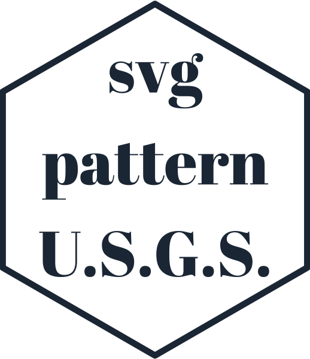
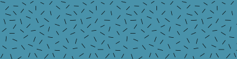

<!-- README.md is generated from README.Rmd. Please edit that file -->

```{r, include = FALSE}
knitr::opts_chunk$set(
  collapse = TRUE,
  comment = "#>",
  fig.path = "man/figures/README-",
  out.width = "100%"
)

suppressPackageStartupMessages({
  library(dplyr)
  library(purrr)
  
  library(svgpatternusgs)
})
```


```{r echo = FALSE, eval = FALSE}
# Quick logo generation. Borrowed heavily from Nick Tierney's Syn logo process
library(magick)
library(showtext)
font_add_google("Abril Fatface", "gf")


# pkgdown::build_site(override = list(destination = "../coolbutuseless.github.io/package/svgpatternusgs"))
```


```{r echo = FALSE, eval = FALSE}
img <- image_read("man/figures/white.png") 


hexSticker::sticker(subplot  = img,
                    s_x      = 0.92,
                    s_y      = 1.2,
                    s_width  = 1.5,
                    s_height = 0.95,
                    package  = "svg\npattern\nU.S.G.S.",
                    p_x      = 1,
                    p_y      = 1.1,
                    p_color  = "#223344",
                    p_family = "gf",
                    p_size   = 9,
                    h_size   = 1.2,
                    h_fill   = "#ffffff",
                    h_color  = "#223344",
                    filename = "man/figures/logo.png")

image_read("man/figures/logo.png")
```


# svgpatternusgs   

<!-- badges: start -->


<!-- badges: end -->

`svgpatternusgs` provides SVG patterns from the [United States Geological Survey (USGS)](usgs.gov).

The USGS provides a large array of reference styles for geologic linework and map symbology.

* [USGS website for Geological Map Symbols](https://ngmdb.usgs.gov/fgdc_gds/geolsymstd/download.php)
* The raw data for this package was sourced from [davenquinn's github version](https://github.com/davenquinn/geologic-patterns)

## An example of the patterns provided

This is a screenshot of the original documentation which comes with these patterns
from the USGS


This list of all codes which have a pattern in this package:

```{r}
svgpatternusgs::all_usgs_codes
```


## What's in the box?

* Functions for accessing the SVG for all the provided USGS codes
* SVG pattern are supplied as `minisvg::SVGPattern` objects.
* Functions for encoding/decoding a pattern specification from a hex colour.

## To Do

The original SVG sources for this were OK but not perfect.  I've patched some issues, but there
are still quite a few occasions where gaps and tears appear in patterns.

These errors don't appear to be systematic, so I think it will require some labour-intensive manual
corrections to individual patterns.  


## Installation

You can install from [github](https://github.com/coolbutuseless/svgpatternusgs) with:

``` r
# install.packages("devtools")
devtools::install_github("coolbutuseless/lofi")           # Colour encoding
devtools::install_github("coolbutuseless/minisvg")        # SVG support
devtools::install_github("coolbutuseless/svgpatternusgs") # This package
```


## Create and show a pattern


```{r}
pattern <- create_usgs_pattern(usgs_code = 605, spacing = 50)
```

```{r eval = FALSE}
pattern$show()
```


```{r echo = FALSE}
pattern$save_full_svg("man/figures/usgs-605.svg", width=400, height = 100)
```


### Multiple patterns

```{r eval=FALSE}
pattern_list <- svgpatternusgs::all_usgs_codes[41:72] %>%
  purrr::map(create_usgs_pattern, spacing = 200) 

patterns <- minisvg::SVGPatternList_to_svg(pattern_list, width=200, height=100, ncol = 4)

patterns$save("man/figures/usgs-sample.svg")
```


## Encoding/decoding patterns from colours

A key feature of this set of patterns is that they can be encoded in
an RGB colour.  Also, every RGB colour (excluding black, white and fully transparent)
can be decoded to a pattern in this library.

This encoding/decoding is carried out by the [`lofi`](https://github.com/coolbutuseless/lofi) package.
Because this has to squeeze multiple continuous variables in to 24-bits, along with 
the actual colour of the pattern, there
will be some quantization associated with a pattern-encoded-as-RGB e.g. angle may
only be encoded in 45degree increments.

```{r}
#~~~~~~~~~~~~~~~~~~~~~~~~~~~~~~~~~~~~~~~~~~~~~~~~~~~~~~~~~~~~~~~~~~~~~~~~~~~~~
# Encode a stripe pattern into a colour. Arguments to set correspond to 
# arguments from the individual pattern creation function 
# e.g. `create_stripe_pattern()`
#~~~~~~~~~~~~~~~~~~~~~~~~~~~~~~~~~~~~~~~~~~~~~~~~~~~~~~~~~~~~~~~~~~~~~~~~~~~~~
hex_colour <- encode_pattern_params_as_hex_colour(
  usgs_code = 701,
  spacing   = 200,
  fill      = '#558899'
)

hex_colour

#~~~~~~~~~~~~~~~~~~~~~~~~~~~~~~~~~~~~~~~~~~~~~~~~~~~~~~~~~~~~~~~~~~~~~~~~~~~~~
# Decode this hex colour back into a pattern object
#~~~~~~~~~~~~~~~~~~~~~~~~~~~~~~~~~~~~~~~~~~~~~~~~~~~~~~~~~~~~~~~~~~~~~~~~~~~~~
pattern <- decode_pattern_from_rgba_vec(lofi::hex_colour_to_rgba_vec(hex_colour))

#~~~~~~~~~~~~~~~~~~~~~~~~~~~~~~~~~~~~~~~~~~~~~~~~~~~~~~~~~~~~~~~~~~~~~~~~~~~~~
# Render the pattern object
#~~~~~~~~~~~~~~~~~~~~~~~~~~~~~~~~~~~~~~~~~~~~~~~~~~~~~~~~~~~~~~~~~~~~~~~~~~~~~
doc <- pattern$as_full_svg(width = 400, height = 100)
```


```{r echo=FALSE, results='asis'}
cat("<pre><details closed><summary> Show SVG text (click to open) </summary>",
htmltools::htmlEscape(as.character(doc)), 
"</details></pre>\n", sep='')
```

```{r echo = FALSE, eval=FALSE}
if (interactive()) {
  doc$show()
} 
doc$save("man/figures/README-encode-as-colour.svg")
```




