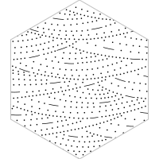
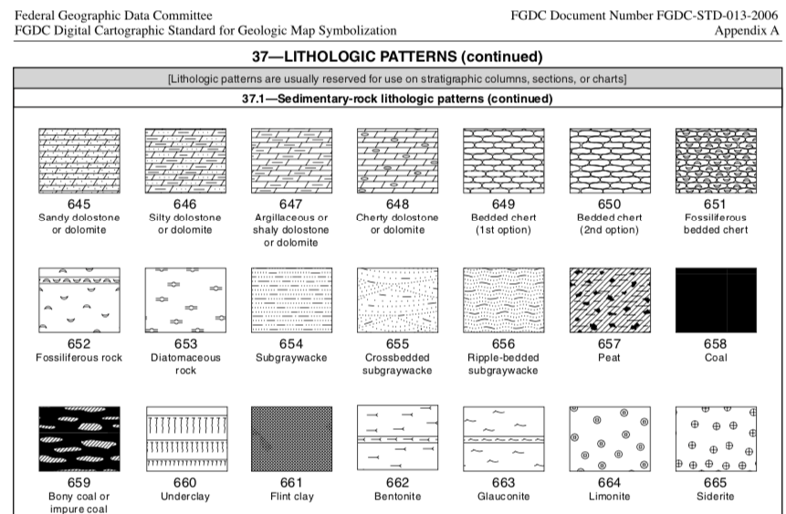
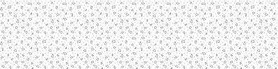
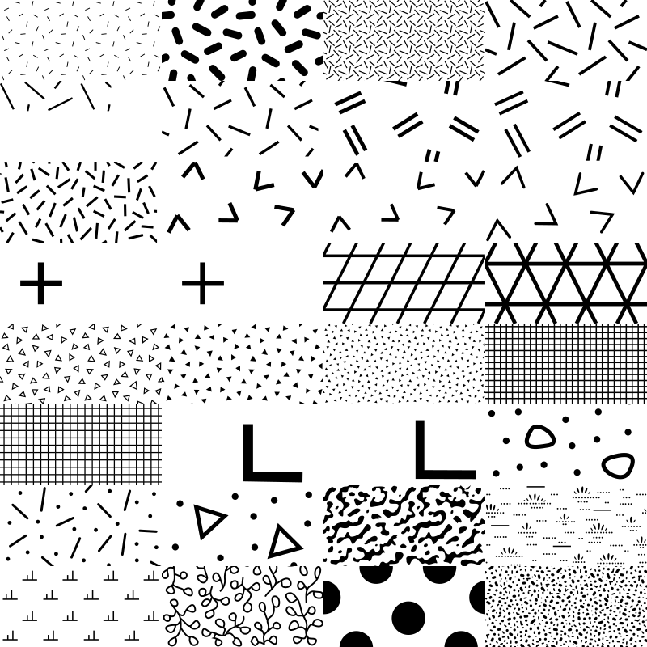

<!-- README.md is generated from README.Rmd. Please edit that file -->

```{r, include = FALSE}
knitr::opts_chunk$set(
  collapse = TRUE,
  comment = "#>",
  fig.path = "man/figures/README-",
  out.width = "100%"
)

suppressPackageStartupMessages({
  library(dplyr)
  library(purrr)
  
  library(svgpatternusgs)
})
```


```{r echo = FALSE, eval = FALSE}
# pkgdown::build_site(override = list(destination = "../coolbutuseless.github.io/package/svgpatternusgs"))
```


# svgpatternusgs   

<!-- badges: start -->


<!-- badges: end -->

`svgpatternusgs` provides SVG patterns from the [United States Geological Survey (USGS)](usgs.gov).

For online documentation, see the [svgpatternusgs pkgdown website](https://coolbutuseless.github.io/package/svgpatternusgs/index.html).

The USGS provides a large array of reference styles for geologic linework and map symbology.

* [USGS website for Geological Map Symbols](https://ngmdb.usgs.gov/fgdc_gds/geolsymstd/download.php)
* The raw data for this package was sourced from [davenquinn's github version](https://github.com/davenquinn/geologic-patterns)

## An example of the patterns provided

This is a screenshot of the original documentation which comes with these patterns
from the USGS




This list of all codes which have a pattern in this package:

```{r}
svgpatternusgs::all_usgs_codes
```


## What's in the box?

* Functions for accessing the SVG for all the provided USGS codes
* SVG pattern are supplied as `minisvg::SVGPattern` objects.
* Functions for encoding/decoding a pattern specification from a hex colour.

## To Do

The original SVG sources for this were OK but not perfect.  I've patched some issues, but there
are still quite a few occasions where gaps and tears appear in patterns.

These errors don't appear to be systematic, so I think it will require some labour-intensive manual
corrections to individual patterns.  


## Installation

You can install from [github](https://github.com/coolbutuseless/svgpatternusgs) with:

``` r
# install.packages("devtools")
devtools::install_github("coolbutuseless/lofi")           # Colour encoding
devtools::install_github("coolbutuseless/minisvg")        # SVG support
devtools::install_github("coolbutuseless/svgpatternusgs") # This package
```


## Create and show a pattern


```{r}
pattern <- create_usgs_pattern(usgs_code = 605, spacing = 50)

# pattern$show()
pattern$save_full_svg("man/figures/usgs-605.svg", width=400, height = 100)
```




### Multiple patterns

```{r eval=TRUE}
pattern_list <- svgpatternusgs::all_usgs_codes[41:72] %>%
  purrr::map(create_usgs_pattern, spacing = 200) 

patterns <- minisvg::SVGPatternList_to_svg(pattern_list, width=200, height=100, ncol = 4)

patterns$save("man/figures/usgs-sample.svg")
```




## Using the pattern in a `minisvg` SVG document


```{r}
#~~~~~~~~~~~~~~~~~~~~~~~~~~~~~~~~~~~~~~~~~~~~~~~~~~~~~~~~~~~~~~~~~~~~~~~~~~~~~
# Building an SVG logo with an animated stripe
#~~~~~~~~~~~~~~~~~~~~~~~~~~~~~~~~~~~~~~~~~~~~~~~~~~~~~~~~~~~~~~~~~~~~~~~~~~~~~
library(minisvg)
doc <- minisvg::svg_doc(width = 400, height = 200)

#~~~~~~~~~~~~~~~~~~~~~~~~~~~~~~~~~~~~~~~~~~~~~~~~~~~~~~~~~~~~~~~~~~~~~~~~~~~~~
# Create a simple pattern using the `svgpatternsimple` package
#~~~~~~~~~~~~~~~~~~~~~~~~~~~~~~~~~~~~~~~~~~~~~~~~~~~~~~~~~~~~~~~~~~~~~~~~~~~~~
geopattern1 <- svgpatternusgs::create_usgs_pattern(usgs_code = 601, spacing = 200)
geopattern2 <- svgpatternusgs::create_usgs_pattern(usgs_code = 655, spacing = 200)

#~~~~~~~~~~~~~~~~~~~~~~~~~~~~~~~~~~~~~~~~~~~~~~~~~~~~~~~~~~~~~~~~~~~~~~~~~~~~~
# Add the pattern to the documents list of definitions
#~~~~~~~~~~~~~~~~~~~~~~~~~~~~~~~~~~~~~~~~~~~~~~~~~~~~~~~~~~~~~~~~~~~~~~~~~~~~~
doc$defs(geopattern1, geopattern2)

#~~~~~~~~~~~~~~~~~~~~~~~~~~~~~~~~~~~~~~~~~~~~~~~~~~~~~~~~~~~~~~~~~~~~~~~~~~~~~
# Create shapes filled with the patterns and add to doc
#~~~~~~~~~~~~~~~~~~~~~~~~~~~~~~~~~~~~~~~~~~~~~~~~~~~~~~~~~~~~~~~~~~~~~~~~~~~~~
rect <- stag$rect(x='10%', y='10%', width='50%', height='50%', stroke = 'black', 
                  fill=geopattern1)

circle <- stag$circle(cx = "75%", cy="60%", r="45%", stroke = 'black', 
                      fill=geopattern2)

doc$append(rect, circle)

#~~~~~~~~~~~~~~~~~~~~~~~~~~~~~~~~~~~~~~~~~~~~~~~~~~~~~~~~~~~~~~~~~~~~~~~~~~~~~
# output
#~~~~~~~~~~~~~~~~~~~~~~~~~~~~~~~~~~~~~~~~~~~~~~~~~~~~~~~~~~~~~~~~~~~~~~~~~~~~~
# doc$show()
doc$save("man/figures/README-example-rect.svg")
```


```{r echo=FALSE, results='asis'}
cat(
  "<pre>",
  "<details><summary style='color: #4169E1;'> Show/hide SVG text </summary>",
  htmltools::htmlEscape(as.character(doc)),
  "</details>",
  "</pre>", sep='')
```


## Creating the logo for this package


```{r}
#~~~~~~~~~~~~~~~~~~~~~~~~~~~~~~~~~~~~~~~~~~~~~~~~~~~~~~~~~~~~~~~~~~~~~~~~~~~~~
# Building an SVG logo with an animated stripe
#~~~~~~~~~~~~~~~~~~~~~~~~~~~~~~~~~~~~~~~~~~~~~~~~~~~~~~~~~~~~~~~~~~~~~~~~~~~~~
library(minisvg)
logo <- minisvg::svg_doc(width = 200, height = 200)

#~~~~~~~~~~~~~~~~~~~~~~~~~~~~~~~~~~~~~~~~~~~~~~~~~~~~~~~~~~~~~~~~~~~~~~~~~~~~~
# Create a simple pattern using the `svgpatternsimple` package
#~~~~~~~~~~~~~~~~~~~~~~~~~~~~~~~~~~~~~~~~~~~~~~~~~~~~~~~~~~~~~~~~~~~~~~~~~~~~~
geopattern <- svgpatternusgs::create_usgs_pattern(usgs_code = 655, spacing = 200)

#~~~~~~~~~~~~~~~~~~~~~~~~~~~~~~~~~~~~~~~~~~~~~~~~~~~~~~~~~~~~~~~~~~~~~~~~~~~~~
# Add the pattern to the documents list of definitions
#~~~~~~~~~~~~~~~~~~~~~~~~~~~~~~~~~~~~~~~~~~~~~~~~~~~~~~~~~~~~~~~~~~~~~~~~~~~~~
logo$defs(geopattern)

#~~~~~~~~~~~~~~~~~~~~~~~~~~~~~~~~~~~~~~~~~~~~~~~~~~~~~~~~~~~~~~~~~~~~~~~~~~~~~
# Create a hexagon filled with this pattern, and add it to the document
#~~~~~~~~~~~~~~~~~~~~~~~~~~~~~~~~~~~~~~~~~~~~~~~~~~~~~~~~~~~~~~~~~~~~~~~~~~~~~
len     <- 100
angles  <- (seq(0, 360, 60) + 90) * pi/180
xs      <- round(len * cos(angles) + 100, 2)
ys      <- round(len * sin(angles) + 100, 2)
hex     <- stag$polygon(id = 'hex', xs = xs, ys = ys)
hex$update(stroke = '#c0c0c0', fill = geopattern)
logo$append(hex)

#~~~~~~~~~~~~~~~~~~~~~~~~~~~~~~~~~~~~~~~~~~~~~~~~~~~~~~~~~~~~~~~~~~~~~~~~~~~~~
# output
#~~~~~~~~~~~~~~~~~~~~~~~~~~~~~~~~~~~~~~~~~~~~~~~~~~~~~~~~~~~~~~~~~~~~~~~~~~~~~
# logo$show()
logo$save("man/figures/logo.svg")
```


```{r echo=FALSE, results='asis'}
cat(
  "<pre>",
  "<details><summary style='color: #4169E1;'> Show/hide SVG text </summary>",
  htmltools::htmlEscape(as.character(logo)),
  "</details>",
  "</pre>", sep='')
```


