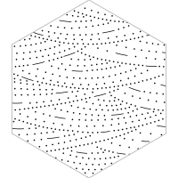
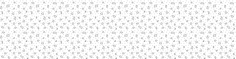
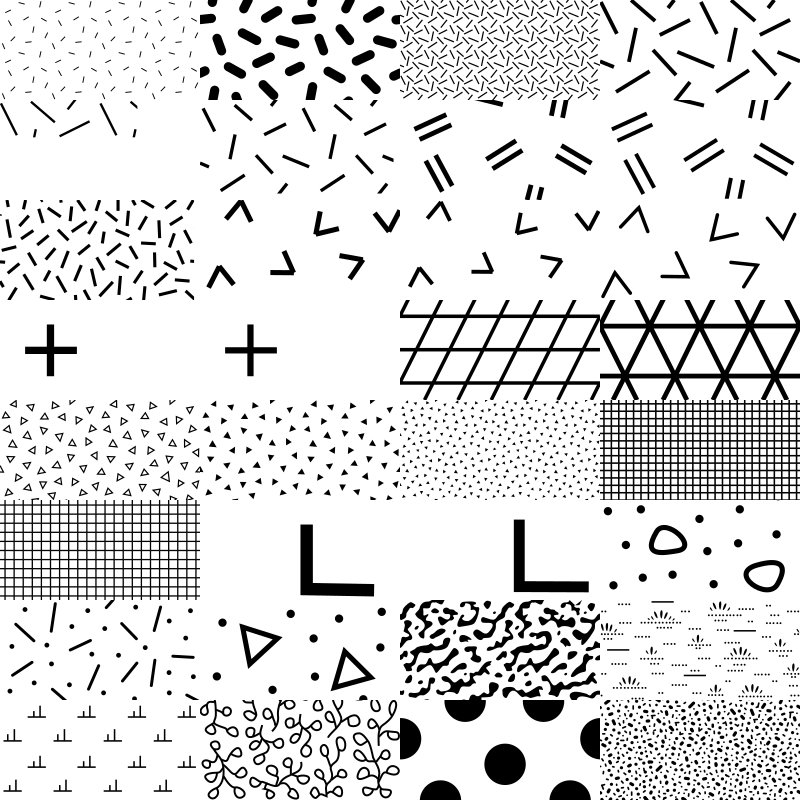

<!-- README.md is generated from README.Rmd. Please edit that file -->

# svgpatternusgs 

<!-- badges: start -->


<!-- badges: end -->

`svgpatternusgs` provides SVG patterns from the [United States
Geological Survey (USGS)](usgs.gov).

For online documentation, see the [svgpatternusgs pkgdown
website](https://coolbutuseless.github.io/package/svgpatternusgs/index.html).

The USGS provides a large array of reference styles for geologic
linework and map symbology.

  - [USGS website for Geological Map
    Symbols](https://ngmdb.usgs.gov/fgdc_gds/geolsymstd/download.php)
  - The raw data for this package was sourced from [davenquinn’s github
    version](https://github.com/davenquinn/geologic-patterns)

## An example of the patterns provided

This is a screenshot of the original documentation which comes with
these patterns from the USGS


This list of all codes which have a pattern in this package:

``` r
svgpatternusgs::all_usgs_codes
#>   [1] 101 102 103 104 105 106 114 116 117 118 119 120 121 122 123 124 132 134
#>  [19] 135 136 137 201 202 204 206 207 214 215 216 217 218 219 226 228 229 230
#>  [37] 231 232 233 301 302 303 304 305 306 313 314 315 316 317 318 319 327 328
#>  [55] 330 331 401 402 403 405 406 411 412 416 417 418 419 420 423 424 427 428
#>  [73] 429 430 431 432 433 434 435 436 521 522 523 524 591 592 593 594 595 601
#>  [91] 602 603 605 606 607 608 609 610 611 612 613 614 616 617 618 619 620 621
#> [109] 622 623 624 625 626 627 628 629 630 631 632 633 634 635 636 637 638 639
#> [127] 640 641 642 643 644 645 646 647 648 649 650 651 652 653 654 655 656 657
#> [145] 658 659 660 661 662 663 664 665 666 667 668 669 670 671 672 673 674 675
#> [163] 676 677 678 679 680 681 682 683 684 685 686 701 702 703 704 705 706 707
#> [181] 708 709 710 711 712 713 714 715 716 717 719 720 721 722 723 724 725 726
#> [199] 727 728 729 730 731 732 733
```

## What’s in the box?

  - Functions for accessing the SVG for all the provided USGS codes
  - SVG pattern are supplied as `minisvg::SVGPattern` objects.
  - Functions for encoding/decoding a pattern specification from a hex
    colour.

## To Do

The original SVG sources for this were OK but not perfect. I’ve patched
some issues, but there are still quite a few occasions where gaps and
tears appear in patterns.

These errors don’t appear to be systematic, so I think it will require
some labour-intensive manual corrections to individual patterns.

## Installation

You can install from
[github](https://github.com/coolbutuseless/svgpatternusgs) with:

``` r
# install.packages("devtools")
devtools::install_github("coolbutuseless/lofi")           # Colour encoding
devtools::install_github("coolbutuseless/minisvg")        # SVG support
devtools::install_github("coolbutuseless/svgpatternusgs") # This package
```

## Create and show a pattern

``` r
pattern <- create_usgs_pattern(usgs_code = 605, spacing = 50)

# pattern$show()
pattern$save_full_svg("man/figures/usgs-605.svg", width=400, height = 100)
```



### Multiple patterns

``` r
pattern_list <- svgpatternusgs::all_usgs_codes[41:72] %>%
  purrr::map(create_usgs_pattern, spacing = 200) 

patterns <- minisvg::SVGPatternList_to_svg(pattern_list, width=200, height=100, ncol = 4)

patterns$save("man/figures/usgs-sample.svg")
```



## Using the pattern in a `minisvg` SVG document

``` r
#~~~~~~~~~~~~~~~~~~~~~~~~~~~~~~~~~~~~~~~~~~~~~~~~~~~~~~~~~~~~~~~~~~~~~~~~~~~~~
# Building an SVG logo with an animated stripe
#~~~~~~~~~~~~~~~~~~~~~~~~~~~~~~~~~~~~~~~~~~~~~~~~~~~~~~~~~~~~~~~~~~~~~~~~~~~~~
library(minisvg)
doc <- minisvg::svg_doc(width = 400, height = 200)

#~~~~~~~~~~~~~~~~~~~~~~~~~~~~~~~~~~~~~~~~~~~~~~~~~~~~~~~~~~~~~~~~~~~~~~~~~~~~~
# Create a simple pattern using the `svgpatternsimple` package
#~~~~~~~~~~~~~~~~~~~~~~~~~~~~~~~~~~~~~~~~~~~~~~~~~~~~~~~~~~~~~~~~~~~~~~~~~~~~~
geopattern1 <- svgpatternusgs::create_usgs_pattern(usgs_code = 601, spacing = 200)
geopattern2 <- svgpatternusgs::create_usgs_pattern(usgs_code = 655, spacing = 200)

#~~~~~~~~~~~~~~~~~~~~~~~~~~~~~~~~~~~~~~~~~~~~~~~~~~~~~~~~~~~~~~~~~~~~~~~~~~~~~
# Add the pattern to the documents list of definitions
#~~~~~~~~~~~~~~~~~~~~~~~~~~~~~~~~~~~~~~~~~~~~~~~~~~~~~~~~~~~~~~~~~~~~~~~~~~~~~
doc$defs(geopattern1, geopattern2)

#~~~~~~~~~~~~~~~~~~~~~~~~~~~~~~~~~~~~~~~~~~~~~~~~~~~~~~~~~~~~~~~~~~~~~~~~~~~~~
# Create shapes filled with the patterns and add to doc
#~~~~~~~~~~~~~~~~~~~~~~~~~~~~~~~~~~~~~~~~~~~~~~~~~~~~~~~~~~~~~~~~~~~~~~~~~~~~~
rect <- stag$rect(x='10%', y='10%', width='50%', height='50%', stroke = 'black', 
                  fill=geopattern1)

circle <- stag$circle(cx = "75%", cy="60%", r="45%", stroke = 'black', 
                      fill=geopattern2)

doc$append(rect, circle)

#~~~~~~~~~~~~~~~~~~~~~~~~~~~~~~~~~~~~~~~~~~~~~~~~~~~~~~~~~~~~~~~~~~~~~~~~~~~~~
# output
#~~~~~~~~~~~~~~~~~~~~~~~~~~~~~~~~~~~~~~~~~~~~~~~~~~~~~~~~~~~~~~~~~~~~~~~~~~~~~
# doc$show()
doc$save("man/figures/README-example-rect.svg")
```

<pre><details><summary style='color: #4169E1;'> Show/hide SVG text </summary>&lt;?xml version="1.0" encoding="UTF-8"?&gt;
&lt;svg width="400" height="200" viewBox="0 0 400 200" xmlns="http://www.w3.org/2000/svg" xmlns:xlink="http://www.w3.org/1999/xlink"&gt;
  &lt;defs&gt;
    &lt;pattern id="usgs-601-ffffff-1-0" patternUnits="userSpaceOnUse" patternTransform="rotate(0 0 0)" x="0px" y="0px" width="200" height="200" viewBox="1.888 -55.518 54.125 54.125"&gt;
      &lt;g&gt;
        &lt;rect x="1.888" y="-55.518" style="fill:#ffffff; fill-opacity:1; stroke:none;" width="54.125" height="54.125" /&gt;
        &lt;line style="fill:none;stroke:#000000;stroke-width:0.7;stroke-linecap:round;" x1="27.105" y1="-29.17" x2="27.105" y2="-29.17" /&gt;
        &lt;line style="fill:none;stroke:#000000;stroke-width:0.7;stroke-linecap:round;" x1="2.72" y1="-43.255" x2="2.72" y2="-43.255" /&gt;
        &lt;line style="fill:none;stroke:#000000;stroke-width:0.7;stroke-linecap:round;" x1="5.25" y1="-41.825" x2="5.25" y2="-41.825" /&gt;
        &lt;line style="fill:none;stroke:#000000;stroke-width:0.7;stroke-linecap:round;" x1="7.945" y1="-43.585" x2="7.945" y2="-43.585" /&gt;
        &lt;line style="fill:none;stroke:#000000;stroke-width:0.7;stroke-linecap:round;" x1="7.945" y1="-40.505" x2="7.945" y2="-40.505" /&gt;
        &lt;line style="fill:none;stroke:#000000;stroke-width:0.7;stroke-linecap:round;" x1="11.3" y1="-42.595" x2="11.3" y2="-42.595" /&gt;
        &lt;line style="fill:none;stroke:#000000;stroke-width:0.7;stroke-linecap:round;" x1="14.27" y1="-43.64" x2="14.27" y2="-43.64" /&gt;
        &lt;line style="fill:none;stroke:#000000;stroke-width:0.7;stroke-linecap:round;" x1="11.355" y1="-39.075" x2="11.355" y2="-39.075" /&gt;
        &lt;line style="fill:none;stroke:#000000;stroke-width:0.7;stroke-linecap:round;" x1="14.733" y1="-37.067" x2="14.733" y2="-37.067" /&gt;
        &lt;line style="fill:none;stroke:#000000;stroke-width:0.7;stroke-linecap:round;" x1="14.567" y1="-40.233" x2="14.567" y2="-40.233" /&gt;
        &lt;line style="fill:none;stroke:#000000;stroke-width:0.7;stroke-linecap:round;" x1="17.13" y1="-42.375" x2="17.13" y2="-42.375" /&gt;
        &lt;line style="fill:none;stroke:#000000;stroke-width:0.7;stroke-linecap:round;" x1="20.212" y1="-44.4" x2="20.212" y2="-44.4" /&gt;
        &lt;line style="fill:none;stroke:#000000;stroke-width:0.7;stroke-linecap:round;" x1="6.075" y1="-38.415" x2="6.075" y2="-38.415" /&gt;
        &lt;line style="fill:none;stroke:#000000;stroke-width:0.7;stroke-linecap:round;" x1="3.05" y1="-38.91" x2="3.05" y2="-38.91" /&gt;
        &lt;line style="fill:none;stroke:#000000;stroke-width:0.7;stroke-linecap:round;" x1="4.535" y1="-35.94" x2="4.535" y2="-35.94" /&gt;
        &lt;line style="fill:none;stroke:#000000;stroke-width:0.7;stroke-linecap:round;" x1="7.67" y1="-35.28" x2="7.67" y2="-35.28" /&gt;
        &lt;line style="fill:none;stroke:#000000;stroke-width:0.7;stroke-linecap:round;" x1="10.915" y1="-35.39" x2="10.915" y2="-35.39" /&gt;
        &lt;line style="fill:none;stroke:#000000;stroke-width:0.7;stroke-linecap:round;" x1="18.12" y1="-37.535" x2="18.12" y2="-37.535" /&gt;
        &lt;line style="fill:none;stroke:#000000;stroke-width:0.7;stroke-linecap:round;" x1="16.733" y1="-34.567" x2="16.733" y2="-34.567" /&gt;
        &lt;line style="fill:none;stroke:#000000;stroke-width:0.7;stroke-linecap:round;" x1="13.995" y1="-33.245" x2="13.995" y2="-33.245" /&gt;
        &lt;line style="fill:none;stroke:#000000;stroke-width:0.7;stroke-linecap:round;" x1="19.66" y1="-34.455" x2="19.66" y2="-34.455" /&gt;
        &lt;line style="fill:none;stroke:#000000;stroke-width:0.7;stroke-linecap:round;" x1="21.53" y1="-37.315" x2="21.53" y2="-37.315" /&gt;
        &lt;line style="fill:none;stroke:#000000;stroke-width:0.7;stroke-linecap:round;" x1="20.485" y1="-41.66" x2="20.485" y2="-41.66" /&gt;
        &lt;line style="fill:none;stroke:#000000;stroke-width:0.7;stroke-linecap:round;" x1="11.275" y1="-46.088" x2="11.275" y2="-46.088" /&gt;
        &lt;line style="fill:none;stroke:#000000;stroke-width:0.7;stroke-linecap:round;" x1="24.83" y1="-43.2" x2="24.83" y2="-43.2" /&gt;
        &lt;line style="fill:none;stroke:#000000;stroke-width:0.7;stroke-linecap:round;" x1="23.455" y1="-40.45" x2="23.455" y2="-40.45" /&gt;
        &lt;line style="fill:none;stroke:#000000;stroke-width:0.7;stroke-linecap:round;" x1="24.5" y1="-37.315" x2="24.5" y2="-37.315" /&gt;
        &lt;line style="fill:none;stroke:#000000;stroke-width:0.7;stroke-linecap:round;" x1="22.96" y1="-34.345" x2="22.96" y2="-34.345" /&gt;
        &lt;line style="fill:none;stroke:#000000;stroke-width:0.7;stroke-linecap:round;" x1="26.865" y1="-40.065" x2="26.865" y2="-40.065" /&gt;
        &lt;line style="fill:none;stroke:#000000;stroke-width:0.7;stroke-linecap:round;" x1="28.845" y1="-42.65" x2="28.845" y2="-42.65" /&gt;
        &lt;line style="fill:none;stroke:#000000;stroke-width:0.7;stroke-linecap:round;" x1="28.02" y1="-37.37" x2="28.02" y2="-37.37" /&gt;
        &lt;line style="fill:none;stroke:#000000;stroke-width:0.7;stroke-linecap:round;" x1="26.205" y1="-34.18" x2="26.205" y2="-34.18" /&gt;
        &lt;line style="fill:none;stroke:#000000;stroke-width:0.7;stroke-linecap:round;" x1="30.55" y1="-39.13" x2="30.55" y2="-39.13" /&gt;
        &lt;line style="fill:none;stroke:#000000;stroke-width:0.7;stroke-linecap:round;" x1="2.94" y1="-33.135" x2="2.94" y2="-33.135" /&gt;
        &lt;line style="fill:none;stroke:#000000;stroke-width:0.7;stroke-linecap:round;" x1="6.13" y1="-32.64" x2="6.13" y2="-32.64" /&gt;
        &lt;line style="fill:none;stroke:#000000;stroke-width:0.7;stroke-linecap:round;" x1="9.375" y1="-32.42" x2="9.375" y2="-32.42" /&gt;
        &lt;line style="fill:none;stroke:#000000;stroke-width:0.7;stroke-linecap:round;" x1="32.42" y1="-42.045" x2="32.42" y2="-42.045" /&gt;
        &lt;line style="fill:none;stroke:#000000;stroke-width:0.7;stroke-linecap:round;" x1="32.15" y1="-36.9" x2="32.15" y2="-36.9" /&gt;
        &lt;line style="fill:none;stroke:#000000;stroke-width:0.7;stroke-linecap:round;" x1="34.9" y1="-38.4" x2="34.9" y2="-38.4" /&gt;
        &lt;line style="fill:none;stroke:#000000;stroke-width:0.7;stroke-linecap:round;" x1="33.41" y1="-33.685" x2="33.41" y2="-33.685" /&gt;
        &lt;line style="fill:none;stroke:#000000;stroke-width:0.7;stroke-linecap:round;" x1="36.765" y1="-34.62" x2="36.765" y2="-34.62" /&gt;
        &lt;line style="fill:none;stroke:#000000;stroke-width:0.7;stroke-linecap:round;" x1="38.195" y1="-37.975" x2="38.195" y2="-37.975" /&gt;
        &lt;line style="fill:none;stroke:#000000;stroke-width:0.7;stroke-linecap:round;" x1="38.085" y1="-42.485" x2="38.085" y2="-42.485" /&gt;
        &lt;line style="fill:none;stroke:#000000;stroke-width:0.7;stroke-linecap:round;" x1="41.165" y1="-39.625" x2="41.165" y2="-39.625" /&gt;
        &lt;line style="fill:none;stroke:#000000;stroke-width:0.7;stroke-linecap:round;" x1="43.145" y1="-42.65" x2="43.145" y2="-42.65" /&gt;
        &lt;line style="fill:none;stroke:#000000;stroke-width:0.7;stroke-linecap:round;" x1="45.235" y1="-39.515" x2="45.235" y2="-39.515" /&gt;
        &lt;line style="fill:none;stroke:#000000;stroke-width:0.7;stroke-linecap:round;" x1="42.43" y1="-36.215" x2="42.43" y2="-36.215" /&gt;
        &lt;line style="fill:none;stroke:#000000;stroke-width:0.7;stroke-linecap:round;" x1="40.065" y1="-33.465" x2="40.065" y2="-33.465" /&gt;
        &lt;line style="fill:none;stroke:#000000;stroke-width:0.7;stroke-linecap:round;" x1="46.72" y1="-42.375" x2="46.72" y2="-42.375" /&gt;
        &lt;line style="fill:none;stroke:#000000;stroke-width:0.7;stroke-linecap:round;" x1="50.65" y1="-46.4" x2="50.65" y2="-46.4" /&gt;
        &lt;line style="fill:none;stroke:#000000;stroke-width:0.7;stroke-linecap:round;" x1="53.9" y1="-49.15" x2="53.9" y2="-49.15" /&gt;
        &lt;line style="fill:none;stroke:#000000;stroke-width:0.7;stroke-linecap:round;" x1="54.4" y1="-45.15" x2="54.4" y2="-45.15" /&gt;
        &lt;line style="fill:none;stroke:#000000;stroke-width:0.7;stroke-linecap:round;" x1="51.525" y1="-50.65" x2="51.525" y2="-50.65" /&gt;
        &lt;line style="fill:none;stroke:#000000;stroke-width:0.7;stroke-linecap:round;" x1="48.4" y1="-48.15" x2="48.4" y2="-48.15" /&gt;
        &lt;line style="fill:none;stroke:#000000;stroke-width:0.7;stroke-linecap:round;" x1="44.9" y1="-49.775" x2="44.9" y2="-49.775" /&gt;
        &lt;line style="fill:none;stroke:#000000;stroke-width:0.7;stroke-linecap:round;" x1="47.588" y1="-51.025" x2="47.588" y2="-51.025" /&gt;
        &lt;line style="fill:none;stroke:#000000;stroke-width:0.7;stroke-linecap:round;" x1="54.338" y1="-53.588" x2="54.338" y2="-53.588" /&gt;
        &lt;line style="fill:none;stroke:#000000;stroke-width:0.7;stroke-linecap:round;" x1="49.025" y1="-54.275" x2="49.025" y2="-54.275" /&gt;
        &lt;line style="fill:none;stroke:#000000;stroke-width:0.7;stroke-linecap:round;" x1="45.213" y1="-53.838" x2="45.213" y2="-53.838" /&gt;
        &lt;line style="fill:none;stroke:#000000;stroke-width:0.7;stroke-linecap:round;" x1="45.088" y1="-45.588" x2="45.088" y2="-45.588" /&gt;
        &lt;line style="fill:none;stroke:#000000;stroke-width:0.7;stroke-linecap:round;" x1="42.213" y1="-51.9" x2="42.213" y2="-51.9" /&gt;
        &lt;line style="fill:none;stroke:#000000;stroke-width:0.7;stroke-linecap:round;" x1="39.15" y1="-53.4" x2="39.15" y2="-53.4" /&gt;
        &lt;line style="fill:none;stroke:#000000;stroke-width:0.7;stroke-linecap:round;" x1="36.233" y1="-54.67" x2="36.233" y2="-54.67" /&gt;
        &lt;line style="fill:none;stroke:#000000;stroke-width:0.7;stroke-linecap:round;" x1="38.838" y1="-50.463" x2="38.838" y2="-50.463" /&gt;
        &lt;line style="fill:none;stroke:#000000;stroke-width:0.7;stroke-linecap:round;" x1="37.15" y1="-47.713" x2="37.15" y2="-47.713" /&gt;
        &lt;line style="fill:none;stroke:#000000;stroke-width:0.7;stroke-linecap:round;" x1="34.963" y1="-44.338" x2="34.963" y2="-44.338" /&gt;
        &lt;line style="fill:none;stroke:#000000;stroke-width:0.7;stroke-linecap:round;" x1="33.775" y1="-48.15" x2="33.775" y2="-48.15" /&gt;
        &lt;line style="fill:none;stroke:#000000;stroke-width:0.7;stroke-linecap:round;" x1="33.463" y1="-51.775" x2="33.463" y2="-51.775" /&gt;
        &lt;line style="fill:none;stroke:#000000;stroke-width:0.7;stroke-linecap:round;" x1="29.65" y1="-49.275" x2="29.65" y2="-49.275" /&gt;
        &lt;line style="fill:none;stroke:#000000;stroke-width:0.7;stroke-linecap:round;" x1="31.275" y1="-45.4" x2="31.275" y2="-45.4" /&gt;
        &lt;line style="fill:none;stroke:#000000;stroke-width:0.7;stroke-linecap:round;" x1="31.4" y1="-54.4" x2="31.4" y2="-54.4" /&gt;
        &lt;line style="fill:none;stroke:#000000;stroke-width:0.7;stroke-linecap:round;" x1="30.15" y1="-51.4" x2="30.15" y2="-51.4" /&gt;
        &lt;line style="fill:none;stroke:#000000;stroke-width:0.7;stroke-linecap:round;" x1="27.9" y1="-54.15" x2="27.9" y2="-54.15" /&gt;
        &lt;line style="fill:none;stroke:#000000;stroke-width:0.7;stroke-linecap:round;" x1="24.587" y1="-54.713" x2="24.587" y2="-54.713" /&gt;
        &lt;line style="fill:none;stroke:#000000;stroke-width:0.7;stroke-linecap:round;" x1="26.212" y1="-48.65" x2="26.212" y2="-48.65" /&gt;
        &lt;line style="fill:none;stroke:#000000;stroke-width:0.7;stroke-linecap:round;" x1="24.337" y1="-46.213" x2="24.337" y2="-46.213" /&gt;
        &lt;line style="fill:none;stroke:#000000;stroke-width:0.7;stroke-linecap:round;" x1="22.837" y1="-48.525" x2="22.837" y2="-48.525" /&gt;
        &lt;line style="fill:none;stroke:#000000;stroke-width:0.7;stroke-linecap:round;" x1="24.712" y1="-51.713" x2="24.712" y2="-51.713" /&gt;
        &lt;line style="fill:none;stroke:#000000;stroke-width:0.7;stroke-linecap:round;" x1="20.837" y1="-51.713" x2="20.837" y2="-51.713" /&gt;
        &lt;line style="fill:none;stroke:#000000;stroke-width:0.7;stroke-linecap:round;" x1="7.9" y1="-46.463" x2="7.9" y2="-46.463" /&gt;
        &lt;line style="fill:none;stroke:#000000;stroke-width:0.7;stroke-linecap:round;" x1="4.9" y1="-45.463" x2="4.9" y2="-45.463" /&gt;
        &lt;line style="fill:none;stroke:#000000;stroke-width:0.7;stroke-linecap:round;" x1="2.4" y1="-47.525" x2="2.4" y2="-47.525" /&gt;
        &lt;line style="fill:none;stroke:#000000;stroke-width:0.7;stroke-linecap:round;" x1="10.212" y1="-48.9" x2="10.212" y2="-48.9" /&gt;
        &lt;line style="fill:none;stroke:#000000;stroke-width:0.7;stroke-linecap:round;" x1="12.712" y1="-51.025" x2="12.712" y2="-51.025" /&gt;
        &lt;line style="fill:none;stroke:#000000;stroke-width:0.7;stroke-linecap:round;" x1="11.15" y1="-54.713" x2="11.15" y2="-54.713" /&gt;
        &lt;line style="fill:none;stroke:#000000;stroke-width:0.7;stroke-linecap:round;" x1="9.65" y1="-52.15" x2="9.65" y2="-52.15" /&gt;
        &lt;line style="fill:none;stroke:#000000;stroke-width:0.7;stroke-linecap:round;" x1="7.567" y1="-55.067" x2="7.567" y2="-55.067" /&gt;
        &lt;line style="fill:none;stroke:#000000;stroke-width:0.7;stroke-linecap:round;" x1="5.713" y1="-50.025" x2="5.713" y2="-50.025" /&gt;
        &lt;line style="fill:none;stroke:#000000;stroke-width:0.7;stroke-linecap:round;" x1="6.4" y1="-52.4" x2="6.4" y2="-52.4" /&gt;
        &lt;line style="fill:none;stroke:#000000;stroke-width:0.7;stroke-linecap:round;" x1="3.4" y1="-54.9" x2="3.4" y2="-54.9" /&gt;
        &lt;line style="fill:none;stroke:#000000;stroke-width:0.7;stroke-linecap:round;" x1="2.4" y1="-51.275" x2="2.4" y2="-51.275" /&gt;
        &lt;line style="fill:none;stroke:#000000;stroke-width:0.7;stroke-linecap:round;" x1="19.962" y1="-49.525" x2="19.962" y2="-49.525" /&gt;
        &lt;line style="fill:none;stroke:#000000;stroke-width:0.7;stroke-linecap:round;" x1="19.837" y1="-47.213" x2="19.837" y2="-47.213" /&gt;
        &lt;line style="fill:none;stroke:#000000;stroke-width:0.7;stroke-linecap:round;" x1="15.837" y1="-45.838" x2="15.837" y2="-45.838" /&gt;
        &lt;line style="fill:none;stroke:#000000;stroke-width:0.7;stroke-linecap:round;" x1="16.525" y1="-49.9" x2="16.525" y2="-49.9" /&gt;
        &lt;line style="fill:none;stroke:#000000;stroke-width:0.7;stroke-linecap:round;" x1="18.212" y1="-53.9" x2="18.212" y2="-53.9" /&gt;
        &lt;line style="fill:none;stroke:#000000;stroke-width:0.7;stroke-linecap:round;" x1="15.9" y1="-52.4" x2="15.9" y2="-52.4" /&gt;
        &lt;line style="fill:none;stroke:#000000;stroke-width:0.7;stroke-linecap:round;" x1="14.4" y1="-54.9" x2="14.4" y2="-54.9" /&gt;
        &lt;line style="fill:none;stroke:#000000;stroke-width:0.7;stroke-linecap:round;" x1="41.525" y1="-48.525" x2="41.525" y2="-48.525" /&gt;
        &lt;line style="fill:none;stroke:#000000;stroke-width:0.7;stroke-linecap:round;" x1="39.9" y1="-45.15" x2="39.9" y2="-45.15" /&gt;
        &lt;line style="fill:none;stroke:#000000;stroke-width:0.7;stroke-linecap:round;" x1="49.58" y1="-40.34" x2="49.58" y2="-40.34" /&gt;
        &lt;line style="fill:none;stroke:#000000;stroke-width:0.7;stroke-linecap:round;" x1="50.15" y1="-43.9" x2="50.15" y2="-43.9" /&gt;
        &lt;line style="fill:none;stroke:#000000;stroke-width:0.7;stroke-linecap:round;" x1="53.9" y1="-26.65" x2="53.9" y2="-26.65" /&gt;
        &lt;line style="fill:none;stroke:#000000;stroke-width:0.7;stroke-linecap:round;" x1="54.9" y1="-23.9" x2="54.9" y2="-23.9" /&gt;
        &lt;line style="fill:none;stroke:#000000;stroke-width:0.7;stroke-linecap:round;" x1="54.65" y1="-30.15" x2="54.65" y2="-30.15" /&gt;
        &lt;line style="fill:none;stroke:#000000;stroke-width:0.7;stroke-linecap:round;" x1="48.81" y1="-36.985" x2="48.81" y2="-36.985" /&gt;
        &lt;line style="fill:none;stroke:#000000;stroke-width:0.7;stroke-linecap:round;" x1="52.65" y1="-38.65" x2="52.65" y2="-38.65" /&gt;
        &lt;line style="fill:none;stroke:#000000;stroke-width:0.7;stroke-linecap:round;" x1="52.4" y1="-32.9" x2="52.4" y2="-32.9" /&gt;
        &lt;line style="fill:none;stroke:#000000;stroke-width:0.7;stroke-linecap:round;" x1="51.9" y1="-5.15" x2="51.9" y2="-5.15" /&gt;
        &lt;line style="fill:none;stroke:#000000;stroke-width:0.7;stroke-linecap:round;" x1="49.745" y1="-33.74" x2="49.745" y2="-33.74" /&gt;
        &lt;line style="fill:none;stroke:#000000;stroke-width:0.7;stroke-linecap:round;" x1="54.4" y1="-35.15" x2="54.4" y2="-35.15" /&gt;
        &lt;line style="fill:none;stroke:#000000;stroke-width:0.7;stroke-linecap:round;" x1="49.25" y1="-27.69" x2="49.25" y2="-27.69" /&gt;
        &lt;line style="fill:none;stroke:#000000;stroke-width:0.7;stroke-linecap:round;" x1="47.847" y1="-31.32" x2="47.847" y2="-31.32" /&gt;
        &lt;line style="fill:none;stroke:#000000;stroke-width:0.7;stroke-linecap:round;" x1="44.052" y1="-32.145" x2="44.052" y2="-32.145" /&gt;
        &lt;line style="fill:none;stroke:#000000;stroke-width:0.7;stroke-linecap:round;" x1="41.825" y1="-29.175" x2="41.825" y2="-29.175" /&gt;
        &lt;line style="fill:none;stroke:#000000;stroke-width:0.7;stroke-linecap:round;" x1="45.29" y1="-28.597" x2="45.29" y2="-28.597" /&gt;
        &lt;line style="fill:none;stroke:#000000;stroke-width:0.7;stroke-linecap:round;" x1="35.06" y1="-30.495" x2="35.06" y2="-30.495" /&gt;
        &lt;line style="fill:none;stroke:#000000;stroke-width:0.7;stroke-linecap:round;" x1="32.007" y1="-30.743" x2="32.007" y2="-30.743" /&gt;
        &lt;line style="fill:none;stroke:#000000;stroke-width:0.7;stroke-linecap:round;" x1="28.542" y1="-31.073" x2="28.542" y2="-31.073" /&gt;
        &lt;line style="fill:none;stroke:#000000;stroke-width:0.7;stroke-linecap:round;" x1="24.747" y1="-31.237" x2="24.747" y2="-31.237" /&gt;
        &lt;line style="fill:none;stroke:#000000;stroke-width:0.7;stroke-linecap:round;" x1="21.86" y1="-31.815" x2="21.86" y2="-31.815" /&gt;
        &lt;line style="fill:none;stroke:#000000;stroke-width:0.7;stroke-linecap:round;" x1="17.817" y1="-31.733" x2="17.817" y2="-31.733" /&gt;
        &lt;line style="fill:none;stroke:#000000;stroke-width:0.7;stroke-linecap:round;" x1="13.527" y1="-30.577" x2="13.527" y2="-30.577" /&gt;
        &lt;line style="fill:none;stroke:#000000;stroke-width:0.7;stroke-linecap:round;" x1="4.452" y1="-30.33" x2="4.452" y2="-30.33" /&gt;
        &lt;line style="fill:none;stroke:#000000;stroke-width:0.7;stroke-linecap:round;" x1="7.422" y1="-29.093" x2="7.422" y2="-29.093" /&gt;
        &lt;line style="fill:none;stroke:#000000;stroke-width:0.7;stroke-linecap:round;" x1="6.35" y1="-26.452" x2="6.35" y2="-26.452" /&gt;
        &lt;line style="fill:none;stroke:#000000;stroke-width:0.7;stroke-linecap:round;" x1="3.462" y1="-27.608" x2="3.462" y2="-27.608" /&gt;
        &lt;line style="fill:none;stroke:#000000;stroke-width:0.7;stroke-linecap:round;" x1="4.37" y1="-24.638" x2="4.37" y2="-24.638" /&gt;
        &lt;line style="fill:none;stroke:#000000;stroke-width:0.7;stroke-linecap:round;" x1="8" y1="-23.317" x2="8" y2="-23.317" /&gt;
        &lt;line style="fill:none;stroke:#000000;stroke-width:0.7;stroke-linecap:round;" x1="9.732" y1="-26.288" x2="9.732" y2="-26.288" /&gt;
        &lt;line style="fill:none;stroke:#000000;stroke-width:0.7;stroke-linecap:round;" x1="11.3" y1="-23.647" x2="11.3" y2="-23.647" /&gt;
        &lt;line style="fill:none;stroke:#000000;stroke-width:0.7;stroke-linecap:round;" x1="12.867" y1="-27.112" x2="12.867" y2="-27.112" /&gt;
        &lt;line style="fill:none;stroke:#000000;stroke-width:0.7;stroke-linecap:round;" x1="14.187" y1="-24.308" x2="14.187" y2="-24.308" /&gt;
        &lt;line style="fill:none;stroke:#000000;stroke-width:0.7;stroke-linecap:round;" x1="16.415" y1="-25.298" x2="16.415" y2="-25.298" /&gt;
        &lt;line style="fill:none;stroke:#000000;stroke-width:0.7;stroke-linecap:round;" x1="15.507" y1="-28.02" x2="15.507" y2="-28.02" /&gt;
        &lt;line style="fill:none;stroke:#000000;stroke-width:0.7;stroke-linecap:round;" x1="18.56" y1="-27.525" x2="18.56" y2="-27.525" /&gt;
        &lt;line style="fill:none;stroke:#000000;stroke-width:0.7;stroke-linecap:round;" x1="21.53" y1="-26.37" x2="21.53" y2="-26.37" /&gt;
        &lt;line style="fill:none;stroke:#000000;stroke-width:0.7;stroke-linecap:round;" x1="23.097" y1="-28.597" x2="23.097" y2="-28.597" /&gt;
        &lt;line style="fill:none;stroke:#000000;stroke-width:0.7;stroke-linecap:round;" x1="19.962" y1="-24.142" x2="19.962" y2="-24.142" /&gt;
        &lt;line style="fill:none;stroke:#000000;stroke-width:0.7;stroke-linecap:round;" x1="17.487" y1="-22.823" x2="17.487" y2="-22.823" /&gt;
        &lt;line style="fill:none;stroke:#000000;stroke-width:0.7;stroke-linecap:round;" x1="14.765" y1="-21.585" x2="14.765" y2="-21.585" /&gt;
        &lt;line style="fill:none;stroke:#000000;stroke-width:0.7;stroke-linecap:round;" x1="12.207" y1="-21.42" x2="12.207" y2="-21.42" /&gt;
        &lt;line style="fill:none;stroke:#000000;stroke-width:0.7;stroke-linecap:round;" x1="9.072" y1="-20.925" x2="9.072" y2="-20.925" /&gt;
        &lt;line style="fill:none;stroke:#000000;stroke-width:0.7;stroke-linecap:round;" x1="6.432" y1="-20.347" x2="6.432" y2="-20.347" /&gt;
        &lt;line style="fill:none;stroke:#000000;stroke-width:0.7;stroke-linecap:round;" x1="3.545" y1="-18.945" x2="3.545" y2="-18.945" /&gt;
        &lt;line style="fill:none;stroke:#000000;stroke-width:0.7;stroke-linecap:round;" x1="2.802" y1="-15.645" x2="2.802" y2="-15.645" /&gt;
        &lt;line style="fill:none;stroke:#000000;stroke-width:0.7;stroke-linecap:round;" x1="5.525" y1="-17.048" x2="5.525" y2="-17.048" /&gt;
        &lt;line style="fill:none;stroke:#000000;stroke-width:0.7;stroke-linecap:round;" x1="8.577" y1="-17.955" x2="8.577" y2="-17.955" /&gt;
        &lt;line style="fill:none;stroke:#000000;stroke-width:0.7;stroke-linecap:round;" x1="8.33" y1="-15.315" x2="8.33" y2="-15.315" /&gt;
        &lt;line style="fill:none;stroke:#000000;stroke-width:0.7;stroke-linecap:round;" x1="5.855" y1="-13.665" x2="5.855" y2="-13.665" /&gt;
        &lt;line style="fill:none;stroke:#000000;stroke-width:0.7;stroke-linecap:round;" x1="3.05" y1="-11.932" x2="3.05" y2="-11.932" /&gt;
        &lt;line style="fill:none;stroke:#000000;stroke-width:0.7;stroke-linecap:round;" x1="5.855" y1="-10.86" x2="5.855" y2="-10.86" /&gt;
        &lt;line style="fill:none;stroke:#000000;stroke-width:0.7;stroke-linecap:round;" x1="9.155" y1="-12.427" x2="9.155" y2="-12.427" /&gt;
        &lt;line style="fill:none;stroke:#000000;stroke-width:0.7;stroke-linecap:round;" x1="11.3" y1="-14.242" x2="11.3" y2="-14.242" /&gt;
        &lt;line style="fill:none;stroke:#000000;stroke-width:0.7;stroke-linecap:round;" x1="12.537" y1="-11.355" x2="12.537" y2="-11.355" /&gt;
        &lt;line style="fill:none;stroke:#000000;stroke-width:0.7;stroke-linecap:round;" x1="15.095" y1="-12.922" x2="15.095" y2="-12.922" /&gt;
        &lt;line style="fill:none;stroke:#000000;stroke-width:0.7;stroke-linecap:round;" x1="17.075" y1="-11.107" x2="17.075" y2="-11.107" /&gt;
        &lt;line style="fill:none;stroke:#000000;stroke-width:0.7;stroke-linecap:round;" x1="19.302" y1="-13.335" x2="19.302" y2="-13.335" /&gt;
        &lt;line style="fill:none;stroke:#000000;stroke-width:0.7;stroke-linecap:round;" x1="16.415" y1="-15.397" x2="16.415" y2="-15.397" /&gt;
        &lt;line style="fill:none;stroke:#000000;stroke-width:0.7;stroke-linecap:round;" x1="13.692" y1="-15.975" x2="13.692" y2="-15.975" /&gt;
        &lt;line style="fill:none;stroke:#000000;stroke-width:0.7;stroke-linecap:round;" x1="13.527" y1="-18.945" x2="13.527" y2="-18.945" /&gt;
        &lt;line style="fill:none;stroke:#000000;stroke-width:0.7;stroke-linecap:round;" x1="16.497" y1="-18.532" x2="16.497" y2="-18.532" /&gt;
        &lt;line style="fill:none;stroke:#000000;stroke-width:0.7;stroke-linecap:round;" x1="18.972" y1="-19.935" x2="18.972" y2="-19.935" /&gt;
        &lt;line style="fill:none;stroke:#000000;stroke-width:0.7;stroke-linecap:round;" x1="19.467" y1="-16.388" x2="19.467" y2="-16.388" /&gt;
        &lt;line style="fill:none;stroke:#000000;stroke-width:0.7;stroke-linecap:round;" x1="22.685" y1="-16.718" x2="22.685" y2="-16.718" /&gt;
        &lt;line style="fill:none;stroke:#000000;stroke-width:0.7;stroke-linecap:round;" x1="22.107" y1="-14.077" x2="22.107" y2="-14.077" /&gt;
        &lt;line style="fill:none;stroke:#000000;stroke-width:0.7;stroke-linecap:round;" x1="23.015" y1="-11.437" x2="23.015" y2="-11.437" /&gt;
        &lt;line style="fill:none;stroke:#000000;stroke-width:0.7;stroke-linecap:round;" x1="25.242" y1="-12.592" x2="25.242" y2="-12.592" /&gt;
        &lt;line style="fill:none;stroke:#000000;stroke-width:0.7;stroke-linecap:round;" x1="28.295" y1="-13.17" x2="28.295" y2="-13.17" /&gt;
        &lt;line style="fill:none;stroke:#000000;stroke-width:0.7;stroke-linecap:round;" x1="27.47" y1="-10.2" x2="27.47" y2="-10.2" /&gt;
        &lt;line style="fill:none;stroke:#000000;stroke-width:0.7;stroke-linecap:round;" x1="25.572" y1="-15.397" x2="25.572" y2="-15.397" /&gt;
        &lt;line style="fill:none;stroke:#000000;stroke-width:0.7;stroke-linecap:round;" x1="26.232" y1="-18.038" x2="26.232" y2="-18.038" /&gt;
        &lt;line style="fill:none;stroke:#000000;stroke-width:0.7;stroke-linecap:round;" x1="28.625" y1="-21.09" x2="28.625" y2="-21.09" /&gt;
        &lt;line style="fill:none;stroke:#000000;stroke-width:0.7;stroke-linecap:round;" x1="24.665" y1="-20.43" x2="24.665" y2="-20.43" /&gt;
        &lt;line style="fill:none;stroke:#000000;stroke-width:0.7;stroke-linecap:round;" x1="22.602" y1="-22.08" x2="22.602" y2="-22.08" /&gt;
        &lt;line style="fill:none;stroke:#000000;stroke-width:0.7;stroke-linecap:round;" x1="23.427" y1="-24.555" x2="23.427" y2="-24.555" /&gt;
        &lt;line style="fill:none;stroke:#000000;stroke-width:0.7;stroke-linecap:round;" x1="26.397" y1="-22.987" x2="26.397" y2="-22.987" /&gt;
        &lt;line style="fill:none;stroke:#000000;stroke-width:0.7;stroke-linecap:round;" x1="28.46" y1="-24.968" x2="28.46" y2="-24.968" /&gt;
        &lt;line style="fill:none;stroke:#000000;stroke-width:0.7;stroke-linecap:round;" x1="25.902" y1="-26.618" x2="25.902" y2="-26.618" /&gt;
        &lt;line style="fill:none;stroke:#000000;stroke-width:0.7;stroke-linecap:round;" x1="30.605" y1="-27.772" x2="30.605" y2="-27.772" /&gt;
        &lt;line style="fill:none;stroke:#000000;stroke-width:0.7;stroke-linecap:round;" x1="33.575" y1="-28.02" x2="33.575" y2="-28.02" /&gt;
        &lt;line style="fill:none;stroke:#000000;stroke-width:0.7;stroke-linecap:round;" x1="34.977" y1="-24.472" x2="34.977" y2="-24.472" /&gt;
        &lt;line style="fill:none;stroke:#000000;stroke-width:0.7;stroke-linecap:round;" x1="32.915" y1="-22.327" x2="32.915" y2="-22.327" /&gt;
        &lt;line style="fill:none;stroke:#000000;stroke-width:0.7;stroke-linecap:round;" x1="34.152" y1="-19.522" x2="34.152" y2="-19.522" /&gt;
        &lt;line style="fill:none;stroke:#000000;stroke-width:0.7;stroke-linecap:round;" x1="36.627" y1="-20.677" x2="36.627" y2="-20.677" /&gt;
        &lt;line style="fill:none;stroke:#000000;stroke-width:0.7;stroke-linecap:round;" x1="38.69" y1="-23.647" x2="38.69" y2="-23.647" /&gt;
        &lt;line style="fill:none;stroke:#000000;stroke-width:0.7;stroke-linecap:round;" x1="37.535" y1="-27.442" x2="37.535" y2="-27.442" /&gt;
        &lt;line style="fill:none;stroke:#000000;stroke-width:0.7;stroke-linecap:round;" x1="41.165" y1="-26.452" x2="41.165" y2="-26.452" /&gt;
        &lt;line style="fill:none;stroke:#000000;stroke-width:0.7;stroke-linecap:round;" x1="45.372" y1="-25.628" x2="45.372" y2="-25.628" /&gt;
        &lt;line style="fill:none;stroke:#000000;stroke-width:0.7;stroke-linecap:round;" x1="42.072" y1="-22.905" x2="42.072" y2="-22.905" /&gt;
        &lt;line style="fill:none;stroke:#000000;stroke-width:0.7;stroke-linecap:round;" x1="40.175" y1="-20.347" x2="40.175" y2="-20.347" /&gt;
        &lt;line style="fill:none;stroke:#000000;stroke-width:0.7;stroke-linecap:round;" x1="43.722" y1="-19.77" x2="43.722" y2="-19.77" /&gt;
        &lt;line style="fill:none;stroke:#000000;stroke-width:0.7;stroke-linecap:round;" x1="47.187" y1="-19.11" x2="47.187" y2="-19.11" /&gt;
        &lt;line style="fill:none;stroke:#000000;stroke-width:0.7;stroke-linecap:round;" x1="49.992" y1="-21.173" x2="49.992" y2="-21.173" /&gt;
        &lt;line style="fill:none;stroke:#000000;stroke-width:0.7;stroke-linecap:round;" x1="54.117" y1="-20.677" x2="54.117" y2="-20.677" /&gt;
        &lt;line style="fill:none;stroke:#000000;stroke-width:0.7;stroke-linecap:round;" x1="51.807" y1="-23.812" x2="51.807" y2="-23.812" /&gt;
        &lt;line style="fill:none;stroke:#000000;stroke-width:0.7;stroke-linecap:round;" x1="48.672" y1="-24.472" x2="48.672" y2="-24.472" /&gt;
        &lt;line style="fill:none;stroke:#000000;stroke-width:0.7;stroke-linecap:round;" x1="49.085" y1="-16.14" x2="49.085" y2="-16.14" /&gt;
        &lt;line style="fill:none;stroke:#000000;stroke-width:0.7;stroke-linecap:round;" x1="51.233" y1="-18.9" x2="51.233" y2="-18.9" /&gt;
        &lt;line style="fill:none;stroke:#000000;stroke-width:0.7;stroke-linecap:round;" x1="51.642" y1="-13.252" x2="51.642" y2="-13.252" /&gt;
        &lt;line style="fill:none;stroke:#000000;stroke-width:0.7;stroke-linecap:round;" x1="53.787" y1="-10.2" x2="53.787" y2="-10.2" /&gt;
        &lt;line style="fill:none;stroke:#000000;stroke-width:0.7;stroke-linecap:round;" x1="49.167" y1="-11.685" x2="49.167" y2="-11.685" /&gt;
        &lt;line style="fill:none;stroke:#000000;stroke-width:0.7;stroke-linecap:round;" x1="46.032" y1="-14.242" x2="46.032" y2="-14.242" /&gt;
        &lt;line style="fill:none;stroke:#000000;stroke-width:0.7;stroke-linecap:round;" x1="44.795" y1="-16.882" x2="44.795" y2="-16.882" /&gt;
        &lt;line style="fill:none;stroke:#000000;stroke-width:0.7;stroke-linecap:round;" x1="41.247" y1="-16.635" x2="41.247" y2="-16.635" /&gt;
        &lt;line style="fill:none;stroke:#000000;stroke-width:0.7;stroke-linecap:round;" x1="42.732" y1="-13.747" x2="42.732" y2="-13.747" /&gt;
        &lt;line style="fill:none;stroke:#000000;stroke-width:0.7;stroke-linecap:round;" x1="43.475" y1="-10.942" x2="43.475" y2="-10.942" /&gt;
        &lt;line style="fill:none;stroke:#000000;stroke-width:0.7;stroke-linecap:round;" x1="40.175" y1="-11.437" x2="40.175" y2="-11.437" /&gt;
        &lt;line style="fill:none;stroke:#000000;stroke-width:0.7;stroke-linecap:round;" x1="38.442" y1="-13.995" x2="38.442" y2="-13.995" /&gt;
        &lt;line style="fill:none;stroke:#000000;stroke-width:0.7;stroke-linecap:round;" x1="35.637" y1="-15.81" x2="35.637" y2="-15.81" /&gt;
        &lt;line style="fill:none;stroke:#000000;stroke-width:0.7;stroke-linecap:round;" x1="36.71" y1="-12.097" x2="36.71" y2="-12.097" /&gt;
        &lt;line style="fill:none;stroke:#000000;stroke-width:0.7;stroke-linecap:round;" x1="32.997" y1="-13.912" x2="32.997" y2="-13.912" /&gt;
        &lt;line style="fill:none;stroke:#000000;stroke-width:0.7;stroke-linecap:round;" x1="29.15" y1="-16.65" x2="29.15" y2="-16.65" /&gt;
        &lt;line style="fill:none;stroke:#000000;stroke-width:0.7;stroke-linecap:round;" x1="31.347" y1="-10.777" x2="31.347" y2="-10.777" /&gt;
        &lt;line style="fill:none;stroke:#000000;stroke-width:0.7;stroke-linecap:round;" x1="34.482" y1="-10.035" x2="34.482" y2="-10.035" /&gt;
        &lt;line style="fill:none;stroke:#000000;stroke-width:0.7;stroke-linecap:round;" x1="54.447" y1="-5.91" x2="54.447" y2="-5.91" /&gt;
        &lt;line style="fill:none;stroke:#000000;stroke-width:0.7;stroke-linecap:round;" x1="54.447" y1="-2.445" x2="54.447" y2="-2.445" /&gt;
        &lt;line style="fill:none;stroke:#000000;stroke-width:0.7;stroke-linecap:round;" x1="50.817" y1="-8.22" x2="50.817" y2="-8.22" /&gt;
        &lt;line style="fill:none;stroke:#000000;stroke-width:0.7;stroke-linecap:round;" x1="47.682" y1="-6.075" x2="47.682" y2="-6.075" /&gt;
        &lt;line style="fill:none;stroke:#000000;stroke-width:0.7;stroke-linecap:round;" x1="49.332" y1="-3.27" x2="49.332" y2="-3.27" /&gt;
        &lt;line style="fill:none;stroke:#000000;stroke-width:0.7;stroke-linecap:round;" x1="46.197" y1="-9.375" x2="46.197" y2="-9.375" /&gt;
        &lt;line style="fill:none;stroke:#000000;stroke-width:0.7;stroke-linecap:round;" x1="42.815" y1="-7.477" x2="42.815" y2="-7.477" /&gt;
        &lt;line style="fill:none;stroke:#000000;stroke-width:0.7;stroke-linecap:round;" x1="44.217" y1="-4.59" x2="44.217" y2="-4.59" /&gt;
        &lt;line style="fill:none;stroke:#000000;stroke-width:0.7;stroke-linecap:round;" x1="46.567" y1="-3.067" x2="46.567" y2="-3.067" /&gt;
        &lt;line style="fill:none;stroke:#000000;stroke-width:0.7;stroke-linecap:round;" x1="41.9" y1="-2.4" x2="41.9" y2="-2.4" /&gt;
        &lt;line style="fill:none;stroke:#000000;stroke-width:0.7;stroke-linecap:round;" x1="39.233" y1="-2.733" x2="39.233" y2="-2.733" /&gt;
        &lt;line style="fill:none;stroke:#000000;stroke-width:0.7;stroke-linecap:round;" x1="39.9" y1="-4.733" x2="39.9" y2="-4.733" /&gt;
        &lt;line style="fill:none;stroke:#000000;stroke-width:0.7;stroke-linecap:round;" x1="36.9" y1="-4.4" x2="36.9" y2="-4.4" /&gt;
        &lt;line style="fill:none;stroke:#000000;stroke-width:0.7;stroke-linecap:round;" x1="31.15" y1="-19.4" x2="31.15" y2="-19.4" /&gt;
        &lt;line style="fill:none;stroke:#000000;stroke-width:0.7;stroke-linecap:round;" x1="32.9" y1="-16.9" x2="32.9" y2="-16.9" /&gt;
        &lt;line style="fill:none;stroke:#000000;stroke-width:0.7;stroke-linecap:round;" x1="33.41" y1="-3.105" x2="33.41" y2="-3.105" /&gt;
        &lt;line style="fill:none;stroke:#000000;stroke-width:0.7;stroke-linecap:round;" x1="34.977" y1="-6.487" x2="34.977" y2="-6.487" /&gt;
        &lt;line style="fill:none;stroke:#000000;stroke-width:0.7;stroke-linecap:round;" x1="38.277" y1="-9.045" x2="38.277" y2="-9.045" /&gt;
        &lt;line style="fill:none;stroke:#000000;stroke-width:0.7;stroke-linecap:round;" x1="32.172" y1="-7.807" x2="32.172" y2="-7.807" /&gt;
        &lt;line style="fill:none;stroke:#000000;stroke-width:0.7;stroke-linecap:round;" x1="28.625" y1="-7.642" x2="28.625" y2="-7.642" /&gt;
        &lt;line style="fill:none;stroke:#000000;stroke-width:0.7;stroke-linecap:round;" x1="26.067" y1="-6.075" x2="26.067" y2="-6.075" /&gt;
        &lt;line style="fill:none;stroke:#000000;stroke-width:0.7;stroke-linecap:round;" x1="27.8" y1="-2.857" x2="27.8" y2="-2.857" /&gt;
        &lt;line style="fill:none;stroke:#000000;stroke-width:0.7;stroke-linecap:round;" x1="24.417" y1="-8.55" x2="24.417" y2="-8.55" /&gt;
        &lt;line style="fill:none;stroke:#000000;stroke-width:0.7;stroke-linecap:round;" x1="22.19" y1="-7.065" x2="22.19" y2="-7.065" /&gt;
        &lt;line style="fill:none;stroke:#000000;stroke-width:0.7;stroke-linecap:round;" x1="23.84" y1="-4.177" x2="23.84" y2="-4.177" /&gt;
        &lt;line style="fill:none;stroke:#000000;stroke-width:0.7;stroke-linecap:round;" x1="21.9" y1="-2.733" x2="21.9" y2="-2.733" /&gt;
        &lt;line style="fill:none;stroke:#000000;stroke-width:0.7;stroke-linecap:round;" x1="18.807" y1="-8.137" x2="18.807" y2="-8.137" /&gt;
        &lt;line style="fill:none;stroke:#000000;stroke-width:0.7;stroke-linecap:round;" x1="20.21" y1="-5.167" x2="20.21" y2="-5.167" /&gt;
        &lt;line style="fill:none;stroke:#000000;stroke-width:0.7;stroke-linecap:round;" x1="18.725" y1="-2.692" x2="18.725" y2="-2.692" /&gt;
        &lt;line style="fill:none;stroke:#000000;stroke-width:0.7;stroke-linecap:round;" x1="16.745" y1="-5.827" x2="16.745" y2="-5.827" /&gt;
        &lt;line style="fill:none;stroke:#000000;stroke-width:0.7;stroke-linecap:round;" x1="15.177" y1="-8.962" x2="15.177" y2="-8.962" /&gt;
        &lt;line style="fill:none;stroke:#000000;stroke-width:0.7;stroke-linecap:round;" x1="11.795" y1="-8.88" x2="11.795" y2="-8.88" /&gt;
        &lt;line style="fill:none;stroke:#000000;stroke-width:0.7;stroke-linecap:round;" x1="8.66" y1="-9.622" x2="8.66" y2="-9.622" /&gt;
        &lt;line style="fill:none;stroke:#000000;stroke-width:0.7;stroke-linecap:round;" x1="2.72" y1="-8.467" x2="2.72" y2="-8.467" /&gt;
        &lt;line style="fill:none;stroke:#000000;stroke-width:0.7;stroke-linecap:round;" x1="7.175" y1="-6.322" x2="7.175" y2="-6.322" /&gt;
        &lt;line style="fill:none;stroke:#000000;stroke-width:0.7;stroke-linecap:round;" x1="10.31" y1="-6.24" x2="10.31" y2="-6.24" /&gt;
        &lt;line style="fill:none;stroke:#000000;stroke-width:0.7;stroke-linecap:round;" x1="9.65" y1="-2.94" x2="9.65" y2="-2.94" /&gt;
        &lt;line style="fill:none;stroke:#000000;stroke-width:0.7;stroke-linecap:round;" x1="14.27" y1="-2.857" x2="14.27" y2="-2.857" /&gt;
        &lt;line style="fill:none;stroke:#000000;stroke-width:0.7;stroke-linecap:round;" x1="6.432" y1="-3.765" x2="6.432" y2="-3.765" /&gt;
        &lt;line style="fill:none;stroke:#000000;stroke-width:0.7;stroke-linecap:round;" x1="3.132" y1="-5.167" x2="3.132" y2="-5.167" /&gt;
        &lt;line style="fill:none;stroke:#000000;stroke-width:0.7;stroke-linecap:round;" x1="3.71" y1="-2.692" x2="3.71" y2="-2.692" /&gt;
        &lt;path style="fill:none;stroke:#000000;stroke-width:0.3;" d="M22.15-54.65c1.312,0,1.562,1.562,0.188,1.625 S21.087-54.588,22.15-54.65z" /&gt;
        &lt;path style="fill:none;stroke:#000000;stroke-width:0.3;" d="M35.65-52.838c1.312-0.062,1.375,1.625,0.125,1.625 S34.525-52.713,35.65-52.838z" /&gt;
        &lt;path style="fill:none;stroke:#000000;stroke-width:0.3;" d="M43.713-47.963c1.312-0.062,1.625,1.562,0.312,1.625 S42.713-47.9,43.713-47.963z" /&gt;
        &lt;path style="fill:none;stroke:#000000;stroke-width:0.3;" d="M28.275-46.025c1-0.062,1.438,1.375,0.188,1.5 S27.087-45.9,28.275-46.025z" /&gt;
        &lt;path style="fill:none;stroke:#000000;stroke-width:0.3;" d="M35.963-41.963c0.812-0.062,1.562,1.438,0.125,1.562 S34.838-41.838,35.963-41.963z" /&gt;
        &lt;path style="fill:none;stroke:#000000;stroke-width:0.3;" d="M14.025-49.275c1.188,0.062,1.25,1.5,0.125,1.562 S12.837-49.213,14.025-49.275z" /&gt;
        &lt;path style="fill:none;stroke:#000000;stroke-width:0.3;" d="M4.588-48.213c1,0.062,1.5,1.188,0.188,1.438 S3.275-48.088,4.588-48.213z" /&gt;
        &lt;path style="fill:none;stroke:#000000;stroke-width:0.3;" d="M18.837-40.713c1.062-0.062,1.312,1.5,0.062,1.562 S17.962-40.65,18.837-40.713z" /&gt;
        &lt;path style="fill:none;stroke:#000000;stroke-width:0.3;" d="M9.025-39.775c1.25,0,1.625,1.375,0.125,1.562 S7.65-39.713,9.025-39.775z" /&gt;
        &lt;path style="fill:none;stroke:#000000;stroke-width:0.3;" d="M30.025-35.088c0,1.312-1.812,1.25-1.938,0.062 S29.9-36.338,30.025-35.088z" /&gt;
        &lt;path style="fill:none;stroke:#000000;stroke-width:0.3;" d="M38.088-31.587c1.188,0,1.312,1.5,0.125,1.625 S36.713-31.525,38.088-31.587z" /&gt;
        &lt;path style="fill:none;stroke:#000000;stroke-width:0.3;" d="M47.275-35.4c0,1.25-1.75,1.375-1.875,0.125 S47.15-36.713,47.275-35.4z" /&gt;
        &lt;path style="fill:none;stroke:#000000;stroke-width:0.3;" d="M52.9-42.65c1.125-0.062,1.625,1.5,0.188,1.5 S51.838-42.525,52.9-42.65z" /&gt;
        &lt;path style="fill:none;stroke:#000000;stroke-width:0.3;" d="M51.213-52.963c-1.116,0.154-1.188-1.375-0.312-1.5 S53.025-53.213,51.213-52.963z" /&gt;
        &lt;path style="fill:none;stroke:#000000;stroke-width:0.3;" d="M51.9-30.15c1.188-0.062,1.312,1.438,0.188,1.5 S50.65-29.9,51.9-30.15z" /&gt;
        &lt;path style="fill:none;stroke:#000000;stroke-width:0.3;" d="M46.9-22.4c0,1.125-1.938,1.125-1.938,0.062S46.838-23.775,46.9-22.4 z" /&gt;
        &lt;path style="fill:none;stroke:#000000;stroke-width:0.3;" d="M38.525-18.4c1.312-0.062,1.25,1.438,0.188,1.5 S37.15-18.275,38.525-18.4z" /&gt;
        &lt;path style="fill:none;stroke:#000000;stroke-width:0.3;" d="M54.775-15.525c0,1.312-1.875,1.188-1.938,0.125 S54.588-16.775,54.775-15.525z" /&gt;
        &lt;path style="fill:none;stroke:#000000;stroke-width:0.3;" d="M31.025-25.837c1.188,0,1.563,1.5,0.188,1.625 C29.837-24.087,29.962-25.775,31.025-25.837z" /&gt;
        &lt;path style="fill:none;stroke:#000000;stroke-width:0.3;" d="M21.087-30.15c0,1.312-1.812,1.375-1.812,0.062 S21.025-31.587,21.087-30.15z" /&gt;
        &lt;path style="fill:none;stroke:#000000;stroke-width:0.3;" d="M30.712-15.212c0.875,0,1.625,1.812,0.062,1.75 C29.212-13.525,29.275-15.275,30.712-15.212z" /&gt;
        &lt;path style="fill:none;stroke:#000000;stroke-width:0.3;" d="M21.65-21.025c1.062,0.062,1.375,1.688,0.062,1.75 S20.587-20.962,21.65-21.025z" /&gt;
        &lt;path style="fill:none;stroke:#000000;stroke-width:0.3;" d="M12.025-17.587c0,1.125-1.875,1.625-1.938,0.125 S11.9-18.9,12.025-17.587z" /&gt;
        &lt;path style="fill:none;stroke:#000000;stroke-width:0.3;" d="M11.525-29.212c0.062,1.688-1.75,1.625-1.812,0.312 S11.275-30.212,11.525-29.212z" /&gt;
        &lt;path style="fill:none;stroke:#000000;stroke-width:0.3;" d="M3.963-23.275c1.125,0,1.375,2,0.062,2S2.338-23.087,3.963-23.275z" /&gt;
        &lt;path style="fill:none;stroke:#000000;stroke-width:0.3;" d="M6.025-8.087C6.088-6.963,3.9-6.65,3.838-7.963 S5.9-9.587,6.025-8.087z" /&gt;
        &lt;path style="fill:none;stroke:#000000;stroke-width:0.3;" d="M14.212-6.025c1.125,0,1.5,1.688,0.125,1.812 S12.587-5.9,14.212-6.025z" /&gt;
        &lt;path style="fill:none;stroke:#000000;stroke-width:0.3;" d="M21.337-11.275c1.188-0.062,1.25,1.562,0.125,1.625 S19.66-11.113,21.337-11.275z" /&gt;
        &lt;path style="fill:none;stroke:#000000;stroke-width:0.3;" d="M31.712-5.338c0,1.188-1.875,1.312-1.875,0.125 S31.65-6.525,31.712-5.338z" /&gt;
        &lt;path style="fill:none;stroke:#000000;stroke-width:0.3;" d="M40.525-7.588c0,1.25-1.75,1.25-1.875,0.125 S40.338-9.025,40.525-7.588z" /&gt;
        &lt;path style="fill:none;stroke:#000000;stroke-width:0.3;" d="M49.15-10.337c1.188-0.062,1.438,1.625,0.25,1.75 S47.713-10.212,49.15-10.337z" /&gt;
      &lt;/g&gt;
    &lt;/pattern&gt;
    &lt;pattern id="usgs-655-ffffff-1-0" patternUnits="userSpaceOnUse" patternTransform="rotate(0 0 0)" x="0px" y="0px" width="200" height="200" viewBox="1.715 -87.121 85.039 85.039"&gt;
      &lt;g&gt;
        &lt;rect x="1.715" y="-87.121" style="fill:#ffffff; fill-opacity:1; stroke:none;" width="85.039" height="85.039" /&gt;
        &lt;line style="fill:none;stroke:#000000;stroke-width:0.7;stroke-linecap:round;" x1="3.504" y1="-84.504" x2="3.504" y2="-84.504" /&gt;
        &lt;line style="fill:none;stroke:#000000;stroke-width:0.7;stroke-linecap:round;" x1="6.671" y1="-84.838" x2="6.671" y2="-84.838" /&gt;
        &lt;line style="fill:none;stroke:#000000;stroke-width:0.7;stroke-linecap:round;" x1="10.067" y1="-85.4" x2="10.067" y2="-85.4" /&gt;
        &lt;line style="fill:none;stroke:#000000;stroke-width:0.7;stroke-linecap:round;" x1="13.067" y1="-85.9" x2="13.067" y2="-85.9" /&gt;
        &lt;line style="fill:none;stroke:#000000;stroke-width:0.7;stroke-linecap:round;" x1="3.338" y1="-82.296" x2="3.338" y2="-82.296" /&gt;
        &lt;line style="fill:none;stroke:#000000;stroke-width:0.7;stroke-linecap:round;" x1="6.15" y1="-82.421" x2="6.15" y2="-82.421" /&gt;
        &lt;line style="fill:none;stroke:#000000;stroke-width:0.7;stroke-linecap:round;" x1="9.337" y1="-82.858" x2="9.337" y2="-82.858" /&gt;
        &lt;line style="fill:none;stroke:#000000;stroke-width:0.7;stroke-linecap:round;" x1="12.504" y1="-83.65" x2="12.504" y2="-83.65" /&gt;
        &lt;line style="fill:none;stroke:#000000;stroke-width:0.7;stroke-linecap:round;" x1="3.338" y1="-80.233" x2="3.338" y2="-80.233" /&gt;
        &lt;line style="fill:none;stroke:#000000;stroke-width:0.7;stroke-linecap:round;" x1="5.963" y1="-80.483" x2="5.963" y2="-80.483" /&gt;
        &lt;line style="fill:none;stroke:#000000;stroke-width:0.7;stroke-linecap:round;" x1="8.587" y1="-80.858" x2="8.587" y2="-80.858" /&gt;
        &lt;line style="fill:none;stroke:#000000;stroke-width:0.7;stroke-linecap:round;" x1="19.275" y1="-84.296" x2="19.275" y2="-84.296" /&gt;
        &lt;line style="fill:none;stroke:#000000;stroke-width:0.7;stroke-linecap:round;" x1="3.088" y1="-78.108" x2="3.088" y2="-78.108" /&gt;
        &lt;line style="fill:none;stroke:#000000;stroke-width:0.7;stroke-linecap:round;" x1="5.338" y1="-78.358" x2="5.338" y2="-78.358" /&gt;
        &lt;line style="fill:none;stroke:#000000;stroke-width:0.7;stroke-linecap:round;" x1="7.546" y1="-78.692" x2="7.546" y2="-78.692" /&gt;
        &lt;line style="fill:none;stroke:#000000;stroke-width:0.7;stroke-linecap:round;" x1="9.796" y1="-79.192" x2="9.796" y2="-79.192" /&gt;
        &lt;line style="fill:none;stroke:#000000;stroke-width:0.7;stroke-linecap:round;" x1="12.046" y1="-79.608" x2="12.046" y2="-79.608" /&gt;
        &lt;line style="fill:none;stroke:#000000;stroke-width:0.7;stroke-linecap:round;" x1="14.212" y1="-80.275" x2="14.212" y2="-80.275" /&gt;
        &lt;line style="fill:none;stroke:#000000;stroke-width:0.7;stroke-linecap:round;" x1="16.296" y1="-80.942" x2="16.296" y2="-80.942" /&gt;
        &lt;line style="fill:none;stroke:#000000;stroke-width:0.7;stroke-linecap:round;" x1="18.462" y1="-81.692" x2="18.462" y2="-81.692" /&gt;
        &lt;line style="fill:none;stroke:#000000;stroke-width:0.7;stroke-linecap:round;" x1="20.629" y1="-82.608" x2="20.629" y2="-82.608" /&gt;
        &lt;line style="fill:none;stroke:#000000;stroke-width:0.7;stroke-linecap:round;" x1="22.546" y1="-83.442" x2="22.546" y2="-83.442" /&gt;
        &lt;line style="fill:none;stroke:#000000;stroke-width:0.7;stroke-linecap:round;" x1="24.462" y1="-84.525" x2="24.462" y2="-84.525" /&gt;
        &lt;line style="fill:none;stroke:#000000;stroke-width:0.7;stroke-linecap:round;" x1="28.629" y1="-84.838" x2="28.629" y2="-84.838" /&gt;
        &lt;line style="fill:none;stroke:#000000;stroke-width:0.7;stroke-linecap:round;" x1="26.942" y1="-83.775" x2="26.942" y2="-83.775" /&gt;
        &lt;line style="fill:none;stroke:#000000;stroke-width:0.7;stroke-linecap:round;" x1="25.192" y1="-82.9" x2="25.192" y2="-82.9" /&gt;
        &lt;line style="fill:none;stroke:#000000;stroke-width:0.7;stroke-linecap:round;" x1="23.442" y1="-81.9" x2="23.442" y2="-81.9" /&gt;
        &lt;line style="fill:none;stroke:#000000;stroke-width:0.7;stroke-linecap:round;" x1="21.629" y1="-81.15" x2="21.629" y2="-81.15" /&gt;
        &lt;line style="fill:none;stroke:#000000;stroke-width:0.7;stroke-linecap:round;" x1="19.754" y1="-80.275" x2="19.754" y2="-80.275" /&gt;
        &lt;line style="fill:none;stroke:#000000;stroke-width:0.7;stroke-linecap:round;" x1="17.879" y1="-79.588" x2="17.879" y2="-79.588" /&gt;
        &lt;line style="fill:none;stroke:#000000;stroke-width:0.7;stroke-linecap:round;" x1="16.004" y1="-78.838" x2="16.004" y2="-78.838" /&gt;
        &lt;line style="fill:none;stroke:#000000;stroke-width:0.7;stroke-linecap:round;" x1="14.129" y1="-78.275" x2="14.129" y2="-78.275" /&gt;
        &lt;line style="fill:none;stroke:#000000;stroke-width:0.7;stroke-linecap:round;" x1="12.317" y1="-77.775" x2="12.317" y2="-77.775" /&gt;
        &lt;line style="fill:none;stroke:#000000;stroke-width:0.7;stroke-linecap:round;" x1="10.317" y1="-77.213" x2="10.317" y2="-77.213" /&gt;
        &lt;line style="fill:none;stroke:#000000;stroke-width:0.7;stroke-linecap:round;" x1="8.379" y1="-76.963" x2="8.379" y2="-76.963" /&gt;
        &lt;line style="fill:none;stroke:#000000;stroke-width:0.7;stroke-linecap:round;" x1="6.379" y1="-76.588" x2="6.379" y2="-76.588" /&gt;
        &lt;line style="fill:none;stroke:#000000;stroke-width:0.7;stroke-linecap:round;" x1="4.379" y1="-76.463" x2="4.379" y2="-76.463" /&gt;
        &lt;line style="fill:none;stroke:#000000;stroke-width:0.7;stroke-linecap:round;" x1="2.442" y1="-76.4" x2="2.442" y2="-76.4" /&gt;
        &lt;line style="fill:none;stroke:#000000;stroke-width:0.7;stroke-linecap:round;" x1="3.692" y1="-75.15" x2="3.692" y2="-75.15" /&gt;
        &lt;line style="fill:none;stroke:#000000;stroke-width:0.7;stroke-linecap:round;" x1="2.4" y1="-73.796" x2="2.4" y2="-73.796" /&gt;
        &lt;line style="fill:none;stroke:#000000;stroke-width:0.7;stroke-linecap:round;" x1="9.4" y1="-70.983" x2="9.4" y2="-70.983" /&gt;
        &lt;line style="fill:none;stroke:#000000;stroke-width:0.7;stroke-linecap:round;" x1="7.338" y1="-70.921" x2="7.338" y2="-70.921" /&gt;
        &lt;line style="fill:none;stroke:#000000;stroke-width:0.7;stroke-linecap:round;" x1="5.213" y1="-70.858" x2="5.213" y2="-70.858" /&gt;
        &lt;line style="fill:none;stroke:#000000;stroke-width:0.7;stroke-linecap:round;" x1="2.963" y1="-71.046" x2="2.963" y2="-71.046" /&gt;
        &lt;line style="fill:none;stroke:#000000;stroke-width:0.7;stroke-linecap:round;" x1="5.338" y1="-67.858" x2="5.338" y2="-67.858" /&gt;
        &lt;line style="fill:none;stroke:#000000;stroke-width:0.7;stroke-linecap:round;" x1="2.463" y1="-67.983" x2="2.463" y2="-67.983" /&gt;
        &lt;line style="fill:none;stroke:#000000;stroke-width:0.7;stroke-linecap:round;" x1="8.212" y1="-67.796" x2="8.212" y2="-67.796" /&gt;
        &lt;line style="fill:none;stroke:#000000;stroke-width:0.7;stroke-linecap:round;" x1="11.025" y1="-67.921" x2="11.025" y2="-67.921" /&gt;
        &lt;line style="fill:none;stroke:#000000;stroke-width:0.7;stroke-linecap:round;" x1="13.525" y1="-68.171" x2="13.525" y2="-68.171" /&gt;
        &lt;line style="fill:none;stroke:#000000;stroke-width:0.7;stroke-linecap:round;" x1="15.9" y1="-68.546" x2="15.9" y2="-68.546" /&gt;
        &lt;line style="fill:none;stroke:#000000;stroke-width:0.7;stroke-linecap:round;" x1="21.275" y1="-66.608" x2="21.275" y2="-66.608" /&gt;
        &lt;line style="fill:none;stroke:#000000;stroke-width:0.7;stroke-linecap:round;" x1="23.275" y1="-67.233" x2="23.275" y2="-67.233" /&gt;
        &lt;line style="fill:none;stroke:#000000;stroke-width:0.7;stroke-linecap:round;" x1="18.9" y1="-66.108" x2="18.9" y2="-66.108" /&gt;
        &lt;line style="fill:none;stroke:#000000;stroke-width:0.7;stroke-linecap:round;" x1="16.587" y1="-65.671" x2="16.587" y2="-65.671" /&gt;
        &lt;line style="fill:none;stroke:#000000;stroke-width:0.7;stroke-linecap:round;" x1="13.962" y1="-65.358" x2="13.962" y2="-65.358" /&gt;
        &lt;line style="fill:none;stroke:#000000;stroke-width:0.7;stroke-linecap:round;" x1="11.462" y1="-65.108" x2="11.462" y2="-65.108" /&gt;
        &lt;line style="fill:none;stroke:#000000;stroke-width:0.7;stroke-linecap:round;" x1="6.088" y1="-64.983" x2="6.088" y2="-64.983" /&gt;
        &lt;line style="fill:none;stroke:#000000;stroke-width:0.7;stroke-linecap:round;" x1="8.65" y1="-64.983" x2="8.65" y2="-64.983" /&gt;
        &lt;line style="fill:none;stroke:#000000;stroke-width:0.7;stroke-linecap:round;" x1="3.4" y1="-65.046" x2="3.4" y2="-65.046" /&gt;
        &lt;line style="fill:none;stroke:#000000;stroke-width:0.7;stroke-linecap:round;" x1="3.775" y1="-61.546" x2="3.775" y2="-61.546" /&gt;
        &lt;line style="fill:none;stroke:#000000;stroke-width:0.7;stroke-linecap:round;" x1="9.587" y1="-58.733" x2="9.587" y2="-58.733" /&gt;
        &lt;line style="fill:none;stroke:#000000;stroke-width:0.7;stroke-linecap:round;" x1="3.4" y1="-58.546" x2="3.4" y2="-58.546" /&gt;
        &lt;line style="fill:none;stroke:#000000;stroke-width:0.7;stroke-linecap:round;" x1="6.65" y1="-58.608" x2="6.65" y2="-58.608" /&gt;
        &lt;line style="fill:none;stroke:#000000;stroke-width:0.7;stroke-linecap:round;" x1="19.275" y1="-59.671" x2="19.275" y2="-59.671" /&gt;
        &lt;line style="fill:none;stroke:#000000;stroke-width:0.7;stroke-linecap:round;" x1="16.087" y1="-59.233" x2="16.087" y2="-59.233" /&gt;
        &lt;line style="fill:none;stroke:#000000;stroke-width:0.7;stroke-linecap:round;" x1="12.9" y1="-58.921" x2="12.9" y2="-58.921" /&gt;
        &lt;line style="fill:none;stroke:#000000;stroke-width:0.7;stroke-linecap:round;" x1="22.15" y1="-60.171" x2="22.15" y2="-60.171" /&gt;
        &lt;line style="fill:none;stroke:#000000;stroke-width:0.7;stroke-linecap:round;" x1="4.963" y1="-55.046" x2="4.963" y2="-55.046" /&gt;
        &lt;line style="fill:none;stroke:#000000;stroke-width:0.7;stroke-linecap:round;" x1="7.15" y1="-55.171" x2="7.15" y2="-55.171" /&gt;
        &lt;line style="fill:none;stroke:#000000;stroke-width:0.7;stroke-linecap:round;" x1="9.15" y1="-55.296" x2="9.15" y2="-55.296" /&gt;
        &lt;line style="fill:none;stroke:#000000;stroke-width:0.7;stroke-linecap:round;" x1="2.775" y1="-55.046" x2="2.775" y2="-55.046" /&gt;
        &lt;line style="fill:none;stroke:#000000;stroke-width:0.7;stroke-linecap:round;" x1="10.962" y1="-55.483" x2="10.962" y2="-55.483" /&gt;
        &lt;line style="fill:none;stroke:#000000;stroke-width:0.7;stroke-linecap:round;" x1="12.962" y1="-55.733" x2="12.962" y2="-55.733" /&gt;
        &lt;line style="fill:none;stroke:#000000;stroke-width:0.7;stroke-linecap:round;" x1="14.962" y1="-55.983" x2="14.962" y2="-55.983" /&gt;
        &lt;line style="fill:none;stroke:#000000;stroke-width:0.7;stroke-linecap:round;" x1="25.212" y1="-58.108" x2="25.212" y2="-58.108" /&gt;
        &lt;line style="fill:none;stroke:#000000;stroke-width:0.7;stroke-linecap:round;" x1="27.337" y1="-58.608" x2="27.337" y2="-58.608" /&gt;
        &lt;line style="fill:none;stroke:#000000;stroke-width:0.7;stroke-linecap:round;" x1="29.275" y1="-59.233" x2="29.275" y2="-59.233" /&gt;
        &lt;line style="fill:none;stroke:#000000;stroke-width:0.7;stroke-linecap:round;" x1="31.15" y1="-59.796" x2="31.15" y2="-59.796" /&gt;
        &lt;line style="fill:none;stroke:#000000;stroke-width:0.7;stroke-linecap:round;" x1="35.817" y1="-58.9" x2="35.817" y2="-58.9" /&gt;
        &lt;line style="fill:none;stroke:#000000;stroke-width:0.7;stroke-linecap:round;" x1="39.192" y1="-58.65" x2="39.192" y2="-58.65" /&gt;
        &lt;line style="fill:none;stroke:#000000;stroke-width:0.7;stroke-linecap:round;" x1="42.192" y1="-58.588" x2="42.192" y2="-58.588" /&gt;
        &lt;line style="fill:none;stroke:#000000;stroke-width:0.7;stroke-linecap:round;" x1="44.879" y1="-58.713" x2="44.879" y2="-58.713" /&gt;
        &lt;line style="fill:none;stroke:#000000;stroke-width:0.7;stroke-linecap:round;" x1="38.879" y1="-55.713" x2="38.879" y2="-55.713" /&gt;
        &lt;line style="fill:none;stroke:#000000;stroke-width:0.7;stroke-linecap:round;" x1="35.192" y1="-55.963" x2="35.192" y2="-55.963" /&gt;
        &lt;line style="fill:none;stroke:#000000;stroke-width:0.7;stroke-linecap:round;" x1="31.317" y1="-56.588" x2="31.317" y2="-56.588" /&gt;
        &lt;line style="fill:none;stroke:#000000;stroke-width:0.7;stroke-linecap:round;" x1="42.129" y1="-55.713" x2="42.129" y2="-55.713" /&gt;
        &lt;line style="fill:none;stroke:#000000;stroke-width:0.7;stroke-linecap:round;" x1="45.504" y1="-55.963" x2="45.504" y2="-55.963" /&gt;
        &lt;line style="fill:none;stroke:#000000;stroke-width:0.7;stroke-linecap:round;" x1="47.942" y1="-56.338" x2="47.942" y2="-56.338" /&gt;
        &lt;line style="fill:none;stroke:#000000;stroke-width:0.7;stroke-linecap:round;" x1="50.442" y1="-56.65" x2="50.442" y2="-56.65" /&gt;
        &lt;line style="fill:none;stroke:#000000;stroke-width:0.7;stroke-linecap:round;" x1="52.817" y1="-56.963" x2="52.817" y2="-56.963" /&gt;
        &lt;line style="fill:none;stroke:#000000;stroke-width:0.7;stroke-linecap:round;" x1="24.9" y1="-60.671" x2="24.9" y2="-60.671" /&gt;
        &lt;line style="fill:none;stroke:#000000;stroke-width:0.7;stroke-linecap:round;" x1="27.712" y1="-61.358" x2="27.712" y2="-61.358" /&gt;
        &lt;line style="fill:none;stroke:#000000;stroke-width:0.7;stroke-linecap:round;" x1="30.212" y1="-62.108" x2="30.212" y2="-62.108" /&gt;
        &lt;line style="fill:none;stroke:#000000;stroke-width:0.7;stroke-linecap:round;" x1="32.588" y1="-62.921" x2="32.588" y2="-62.921" /&gt;
        &lt;line style="fill:none;stroke:#000000;stroke-width:0.7;stroke-linecap:round;" x1="16.025" y1="-62.171" x2="16.025" y2="-62.171" /&gt;
        &lt;line style="fill:none;stroke:#000000;stroke-width:0.7;stroke-linecap:round;" x1="13.077" y1="-61.846" x2="13.077" y2="-61.846" /&gt;
        &lt;line style="fill:none;stroke:#000000;stroke-width:0.7;stroke-linecap:round;" x1="9.765" y1="-61.658" x2="9.765" y2="-61.658" /&gt;
        &lt;line style="fill:none;stroke:#000000;stroke-width:0.7;stroke-linecap:round;" x1="6.577" y1="-61.533" x2="6.577" y2="-61.533" /&gt;
        &lt;line style="fill:none;stroke:#000000;stroke-width:0.7;stroke-linecap:round;" x1="18.587" y1="-62.483" x2="18.587" y2="-62.483" /&gt;
        &lt;line style="fill:none;stroke:#000000;stroke-width:0.7;stroke-linecap:round;" x1="21.087" y1="-62.921" x2="21.087" y2="-62.921" /&gt;
        &lt;line style="fill:none;stroke:#000000;stroke-width:0.7;stroke-linecap:round;" x1="23.4" y1="-63.421" x2="23.4" y2="-63.421" /&gt;
        &lt;line style="fill:none;stroke:#000000;stroke-width:0.7;stroke-linecap:round;" x1="25.587" y1="-63.983" x2="25.587" y2="-63.983" /&gt;
        &lt;line style="fill:none;stroke:#000000;stroke-width:0.7;stroke-linecap:round;" x1="27.837" y1="-64.671" x2="27.837" y2="-64.671" /&gt;
        &lt;line style="fill:none;stroke:#000000;stroke-width:0.7;stroke-linecap:round;" x1="30.087" y1="-65.483" x2="30.087" y2="-65.483" /&gt;
        &lt;line style="fill:none;stroke:#000000;stroke-width:0.7;stroke-linecap:round;" x1="34.838" y1="-63.796" x2="34.838" y2="-63.796" /&gt;
        &lt;line style="fill:none;stroke:#000000;stroke-width:0.7;stroke-linecap:round;" x1="38.942" y1="-62.65" x2="38.942" y2="-62.65" /&gt;
        &lt;line style="fill:none;stroke:#000000;stroke-width:0.7;stroke-linecap:round;" x1="40.713" y1="-63.671" x2="40.713" y2="-63.671" /&gt;
        &lt;line style="fill:none;stroke:#000000;stroke-width:0.7;stroke-linecap:round;" x1="42.4" y1="-64.733" x2="42.4" y2="-64.733" /&gt;
        &lt;line style="fill:none;stroke:#000000;stroke-width:0.7;stroke-linecap:round;" x1="40.692" y1="-61.838" x2="40.692" y2="-61.838" /&gt;
        &lt;line style="fill:none;stroke:#000000;stroke-width:0.7;stroke-linecap:round;" x1="42.567" y1="-61.025" x2="42.567" y2="-61.025" /&gt;
        &lt;line style="fill:none;stroke:#000000;stroke-width:0.7;stroke-linecap:round;" x1="44.442" y1="-60.338" x2="44.442" y2="-60.338" /&gt;
        &lt;line style="fill:none;stroke:#000000;stroke-width:0.7;stroke-linecap:round;" x1="46.379" y1="-59.775" x2="46.379" y2="-59.775" /&gt;
        &lt;line style="fill:none;stroke:#000000;stroke-width:0.7;stroke-linecap:round;" x1="48.317" y1="-59.088" x2="48.317" y2="-59.088" /&gt;
        &lt;line style="fill:none;stroke:#000000;stroke-width:0.7;stroke-linecap:round;" x1="50.317" y1="-58.713" x2="50.317" y2="-58.713" /&gt;
        &lt;line style="fill:none;stroke:#000000;stroke-width:0.7;stroke-linecap:round;" x1="37.275" y1="-64.733" x2="37.275" y2="-64.733" /&gt;
        &lt;line style="fill:none;stroke:#000000;stroke-width:0.7;stroke-linecap:round;" x1="5.379" y1="-74.275" x2="5.379" y2="-74.275" /&gt;
        &lt;line style="fill:none;stroke:#000000;stroke-width:0.7;stroke-linecap:round;" x1="7.129" y1="-73.338" x2="7.129" y2="-73.338" /&gt;
        &lt;line style="fill:none;stroke:#000000;stroke-width:0.7;stroke-linecap:round;" x1="8.942" y1="-72.525" x2="8.942" y2="-72.525" /&gt;
        &lt;line style="fill:none;stroke:#000000;stroke-width:0.7;stroke-linecap:round;" x1="10.817" y1="-71.838" x2="10.817" y2="-71.838" /&gt;
        &lt;line style="fill:none;stroke:#000000;stroke-width:0.7;stroke-linecap:round;" x1="12.692" y1="-71.213" x2="12.692" y2="-71.213" /&gt;
        &lt;line style="fill:none;stroke:#000000;stroke-width:0.7;stroke-linecap:round;" x1="14.692" y1="-70.588" x2="14.692" y2="-70.588" /&gt;
        &lt;line style="fill:none;stroke:#000000;stroke-width:0.7;stroke-linecap:round;" x1="16.629" y1="-70.088" x2="16.629" y2="-70.088" /&gt;
        &lt;line style="fill:none;stroke:#000000;stroke-width:0.7;stroke-linecap:round;" x1="18.567" y1="-69.65" x2="18.567" y2="-69.65" /&gt;
        &lt;line style="fill:none;stroke:#000000;stroke-width:0.7;stroke-linecap:round;" x1="20.504" y1="-69.15" x2="20.504" y2="-69.15" /&gt;
        &lt;line style="fill:none;stroke:#000000;stroke-width:0.7;stroke-linecap:round;" x1="22.379" y1="-68.65" x2="22.379" y2="-68.65" /&gt;
        &lt;line style="fill:none;stroke:#000000;stroke-width:0.7;stroke-linecap:round;" x1="24.317" y1="-68.275" x2="24.317" y2="-68.275" /&gt;
        &lt;line style="fill:none;stroke:#000000;stroke-width:0.7;stroke-linecap:round;" x1="26.192" y1="-67.838" x2="26.192" y2="-67.838" /&gt;
        &lt;line style="fill:none;stroke:#000000;stroke-width:0.7;stroke-linecap:round;" x1="28.192" y1="-67.463" x2="28.192" y2="-67.463" /&gt;
        &lt;line style="fill:none;stroke:#000000;stroke-width:0.7;stroke-linecap:round;" x1="32.254" y1="-66.671" x2="32.254" y2="-66.671" /&gt;
        &lt;line style="fill:none;stroke:#000000;stroke-width:0.7;stroke-linecap:round;" x1="34.421" y1="-66.421" x2="34.421" y2="-66.421" /&gt;
        &lt;line style="fill:none;stroke:#000000;stroke-width:0.7;stroke-linecap:round;" x1="36.588" y1="-66.254" x2="36.588" y2="-66.254" /&gt;
        &lt;line style="fill:none;stroke:#000000;stroke-width:0.7;stroke-linecap:round;" x1="38.838" y1="-66.254" x2="38.838" y2="-66.254" /&gt;
        &lt;line style="fill:none;stroke:#000000;stroke-width:0.7;stroke-linecap:round;" x1="41.504" y1="-66.171" x2="41.504" y2="-66.171" /&gt;
        &lt;line style="fill:none;stroke:#000000;stroke-width:0.7;stroke-linecap:round;" x1="30.254" y1="-67.004" x2="30.254" y2="-67.004" /&gt;
        &lt;line style="fill:none;stroke:#000000;stroke-width:0.7;stroke-linecap:round;" x1="25.15" y1="-69.733" x2="25.15" y2="-69.733" /&gt;
        &lt;line style="fill:none;stroke:#000000;stroke-width:0.7;stroke-linecap:round;" x1="29.462" y1="-68.921" x2="29.462" y2="-68.921" /&gt;
        &lt;line style="fill:none;stroke:#000000;stroke-width:0.7;stroke-linecap:round;" x1="33.213" y1="-68.546" x2="33.213" y2="-68.546" /&gt;
        &lt;line style="fill:none;stroke:#000000;stroke-width:0.7;stroke-linecap:round;" x1="37.15" y1="-68.296" x2="37.15" y2="-68.296" /&gt;
        &lt;line style="fill:none;stroke:#000000;stroke-width:0.7;stroke-linecap:round;" x1="40.9" y1="-68.171" x2="40.9" y2="-68.171" /&gt;
        &lt;line style="fill:none;stroke:#000000;stroke-width:0.7;stroke-linecap:round;" x1="43.904" y1="-66.025" x2="43.904" y2="-66.025" /&gt;
        &lt;line style="fill:none;stroke:#000000;stroke-width:0.7;stroke-linecap:round;" x1="46.192" y1="-66.025" x2="46.192" y2="-66.025" /&gt;
        &lt;line style="fill:none;stroke:#000000;stroke-width:0.7;stroke-linecap:round;" x1="48.067" y1="-66.088" x2="48.067" y2="-66.088" /&gt;
        &lt;line style="fill:none;stroke:#000000;stroke-width:0.7;stroke-linecap:round;" x1="85.879" y1="-55.088" x2="85.879" y2="-55.088" /&gt;
        &lt;line style="fill:none;stroke:#000000;stroke-width:0.7;stroke-linecap:round;" x1="84.817" y1="-53.963" x2="84.817" y2="-53.963" /&gt;
        &lt;line style="fill:none;stroke:#000000;stroke-width:0.7;stroke-linecap:round;" x1="85.129" y1="-51.9" x2="85.129" y2="-51.9" /&gt;
        &lt;line style="fill:none;stroke:#000000;stroke-width:0.7;stroke-linecap:round;" x1="85.067" y1="-49.4" x2="85.067" y2="-49.4" /&gt;
        &lt;line style="fill:none;stroke:#000000;stroke-width:0.7;stroke-linecap:round;" x1="85.567" y1="-41.9" x2="85.567" y2="-41.9" /&gt;
        &lt;line style="fill:none;stroke:#000000;stroke-width:0.7;stroke-linecap:round;" x1="82.567" y1="-41.963" x2="82.567" y2="-41.963" /&gt;
        &lt;line style="fill:none;stroke:#000000;stroke-width:0.7;stroke-linecap:round;" x1="79.629" y1="-42.15" x2="79.629" y2="-42.15" /&gt;
        &lt;line style="fill:none;stroke:#000000;stroke-width:0.7;stroke-linecap:round;" x1="76.629" y1="-42.525" x2="76.629" y2="-42.525" /&gt;
        &lt;line style="fill:none;stroke:#000000;stroke-width:0.7;stroke-linecap:round;" x1="73.504" y1="-42.838" x2="73.504" y2="-42.838" /&gt;
        &lt;line style="fill:none;stroke:#000000;stroke-width:0.7;stroke-linecap:round;" x1="70.692" y1="-43.338" x2="70.692" y2="-43.338" /&gt;
        &lt;line style="fill:none;stroke:#000000;stroke-width:0.7;stroke-linecap:round;" x1="83.963" y1="-37.921" x2="83.963" y2="-37.921" /&gt;
        &lt;line style="fill:none;stroke:#000000;stroke-width:0.7;stroke-linecap:round;" x1="85.713" y1="-34.046" x2="85.713" y2="-34.046" /&gt;
        &lt;line style="fill:none;stroke:#000000;stroke-width:0.7;stroke-linecap:round;" x1="83.588" y1="-34.171" x2="83.588" y2="-34.171" /&gt;
        &lt;line style="fill:none;stroke:#000000;stroke-width:0.7;stroke-linecap:round;" x1="81.4" y1="-34.296" x2="81.4" y2="-34.296" /&gt;
        &lt;line style="fill:none;stroke:#000000;stroke-width:0.7;stroke-linecap:round;" x1="79.525" y1="-34.421" x2="79.525" y2="-34.421" /&gt;
        &lt;line style="fill:none;stroke:#000000;stroke-width:0.7;stroke-linecap:round;" x1="77.379" y1="-34.588" x2="77.379" y2="-34.588" /&gt;
        &lt;line style="fill:none;stroke:#000000;stroke-width:0.7;stroke-linecap:round;" x1="75.379" y1="-34.9" x2="75.379" y2="-34.9" /&gt;
        &lt;line style="fill:none;stroke:#000000;stroke-width:0.7;stroke-linecap:round;" x1="62.254" y1="-37.838" x2="62.254" y2="-37.838" /&gt;
        &lt;line style="fill:none;stroke:#000000;stroke-width:0.7;stroke-linecap:round;" x1="64.338" y1="-37.171" x2="64.338" y2="-37.171" /&gt;
        &lt;line style="fill:none;stroke:#000000;stroke-width:0.7;stroke-linecap:round;" x1="66.421" y1="-36.504" x2="66.421" y2="-36.504" /&gt;
        &lt;line style="fill:none;stroke:#000000;stroke-width:0.7;stroke-linecap:round;" x1="60.192" y1="-38.713" x2="60.192" y2="-38.713" /&gt;
        &lt;line style="fill:none;stroke:#000000;stroke-width:0.7;stroke-linecap:round;" x1="58.379" y1="-39.525" x2="58.379" y2="-39.525" /&gt;
        &lt;line style="fill:none;stroke:#000000;stroke-width:0.7;stroke-linecap:round;" x1="56.629" y1="-40.463" x2="56.629" y2="-40.463" /&gt;
        &lt;line style="fill:none;stroke:#000000;stroke-width:0.7;stroke-linecap:round;" x1="54.879" y1="-41.463" x2="54.879" y2="-41.463" /&gt;
        &lt;line style="fill:none;stroke:#000000;stroke-width:0.7;stroke-linecap:round;" x1="58.067" y1="-44.463" x2="58.067" y2="-44.463" /&gt;
        &lt;line style="fill:none;stroke:#000000;stroke-width:0.7;stroke-linecap:round;" x1="56.192" y1="-43.775" x2="56.192" y2="-43.775" /&gt;
        &lt;line style="fill:none;stroke:#000000;stroke-width:0.7;stroke-linecap:round;" x1="54.192" y1="-43.088" x2="54.192" y2="-43.088" /&gt;
        &lt;line style="fill:none;stroke:#000000;stroke-width:0.7;stroke-linecap:round;" x1="44.567" y1="-40.463" x2="44.567" y2="-40.463" /&gt;
        &lt;line style="fill:none;stroke:#000000;stroke-width:0.7;stroke-linecap:round;" x1="42.692" y1="-40.025" x2="42.692" y2="-40.025" /&gt;
        &lt;line style="fill:none;stroke:#000000;stroke-width:0.7;stroke-linecap:round;" x1="40.754" y1="-39.525" x2="40.754" y2="-39.525" /&gt;
        &lt;line style="fill:none;stroke:#000000;stroke-width:0.7;stroke-linecap:round;" x1="38.754" y1="-39.088" x2="38.754" y2="-39.088" /&gt;
        &lt;line style="fill:none;stroke:#000000;stroke-width:0.7;stroke-linecap:round;" x1="36.817" y1="-38.775" x2="36.817" y2="-38.775" /&gt;
        &lt;line style="fill:none;stroke:#000000;stroke-width:0.7;stroke-linecap:round;" x1="35.004" y1="-38.275" x2="35.004" y2="-38.275" /&gt;
        &lt;line style="fill:none;stroke:#000000;stroke-width:0.7;stroke-linecap:round;" x1="32.942" y1="-37.9" x2="32.942" y2="-37.9" /&gt;
        &lt;line style="fill:none;stroke:#000000;stroke-width:0.7;stroke-linecap:round;" x1="31.004" y1="-37.588" x2="31.004" y2="-37.588" /&gt;
        &lt;line style="fill:none;stroke:#000000;stroke-width:0.7;stroke-linecap:round;" x1="29.067" y1="-37.275" x2="29.067" y2="-37.275" /&gt;
        &lt;line style="fill:none;stroke:#000000;stroke-width:0.7;stroke-linecap:round;" x1="27.129" y1="-36.963" x2="27.129" y2="-36.963" /&gt;
        &lt;line style="fill:none;stroke:#000000;stroke-width:0.7;stroke-linecap:round;" x1="25.129" y1="-36.65" x2="25.129" y2="-36.65" /&gt;
        &lt;line style="fill:none;stroke:#000000;stroke-width:0.7;stroke-linecap:round;" x1="23.129" y1="-36.4" x2="23.129" y2="-36.4" /&gt;
        &lt;line style="fill:none;stroke:#000000;stroke-width:0.7;stroke-linecap:round;" x1="21.192" y1="-36.088" x2="21.192" y2="-36.088" /&gt;
        &lt;line style="fill:none;stroke:#000000;stroke-width:0.7;stroke-linecap:round;" x1="19.254" y1="-35.838" x2="19.254" y2="-35.838" /&gt;
        &lt;line style="fill:none;stroke:#000000;stroke-width:0.7;stroke-linecap:round;" x1="17.317" y1="-35.65" x2="17.317" y2="-35.65" /&gt;
        &lt;line style="fill:none;stroke:#000000;stroke-width:0.7;stroke-linecap:round;" x1="15.317" y1="-35.338" x2="15.317" y2="-35.338" /&gt;
        &lt;line style="fill:none;stroke:#000000;stroke-width:0.7;stroke-linecap:round;" x1="13.442" y1="-35.088" x2="13.442" y2="-35.088" /&gt;
        &lt;line style="fill:none;stroke:#000000;stroke-width:0.7;stroke-linecap:round;" x1="11.15" y1="-34.796" x2="11.15" y2="-34.796" /&gt;
        &lt;line style="fill:none;stroke:#000000;stroke-width:0.7;stroke-linecap:round;" x1="9.025" y1="-34.608" x2="9.025" y2="-34.608" /&gt;
        &lt;line style="fill:none;stroke:#000000;stroke-width:0.7;stroke-linecap:round;" x1="6.963" y1="-34.546" x2="6.963" y2="-34.546" /&gt;
        &lt;line style="fill:none;stroke:#000000;stroke-width:0.7;stroke-linecap:round;" x1="4.963" y1="-34.296" x2="4.963" y2="-34.296" /&gt;
        &lt;line style="fill:none;stroke:#000000;stroke-width:0.7;stroke-linecap:round;" x1="2.775" y1="-34.046" x2="2.775" y2="-34.046" /&gt;
        &lt;line style="fill:none;stroke:#000000;stroke-width:0.7;stroke-linecap:round;" x1="5.317" y1="-32.025" x2="5.317" y2="-32.025" /&gt;
        &lt;line style="fill:none;stroke:#000000;stroke-width:0.7;stroke-linecap:round;" x1="3.692" y1="-32.838" x2="3.692" y2="-32.838" /&gt;
        &lt;line style="fill:none;stroke:#000000;stroke-width:0.7;stroke-linecap:round;" x1="2.504" y1="-12.962" x2="2.504" y2="-12.962" /&gt;
        &lt;line style="fill:none;stroke:#000000;stroke-width:0.7;stroke-linecap:round;" x1="4.629" y1="-11.15" x2="4.629" y2="-11.15" /&gt;
        &lt;line style="fill:none;stroke:#000000;stroke-width:0.7;stroke-linecap:round;" x1="3.692" y1="-8.65" x2="3.692" y2="-8.65" /&gt;
        &lt;line style="fill:none;stroke:#000000;stroke-width:0.7;stroke-linecap:round;" x1="2.879" y1="-5.525" x2="2.879" y2="-5.525" /&gt;
        &lt;line style="fill:none;stroke:#000000;stroke-width:0.7;stroke-linecap:round;" x1="3.004" y1="-2.588" x2="3.004" y2="-2.588" /&gt;
        &lt;line style="fill:none;stroke:#000000;stroke-width:0.7;stroke-linecap:round;" x1="6.004" y1="-2.838" x2="6.004" y2="-2.838" /&gt;
        &lt;line style="fill:none;stroke:#000000;stroke-width:0.7;stroke-linecap:round;" x1="9.004" y1="-3.15" x2="9.004" y2="-3.15" /&gt;
        &lt;line style="fill:none;stroke:#000000;stroke-width:0.7;stroke-linecap:round;" x1="11.879" y1="-3.65" x2="11.879" y2="-3.65" /&gt;
        &lt;line style="fill:none;stroke:#000000;stroke-width:0.7;stroke-linecap:round;" x1="14.817" y1="-4.275" x2="14.817" y2="-4.275" /&gt;
        &lt;line style="fill:none;stroke:#000000;stroke-width:0.7;stroke-linecap:round;" x1="17.442" y1="-4.9" x2="17.442" y2="-4.9" /&gt;
        &lt;line style="fill:none;stroke:#000000;stroke-width:0.7;stroke-linecap:round;" x1="5.942" y1="-5.588" x2="5.942" y2="-5.588" /&gt;
        &lt;line style="fill:none;stroke:#000000;stroke-width:0.7;stroke-linecap:round;" x1="8.942" y1="-5.9" x2="8.942" y2="-5.9" /&gt;
        &lt;line style="fill:none;stroke:#000000;stroke-width:0.7;stroke-linecap:round;" x1="11.817" y1="-6.463" x2="11.817" y2="-6.463" /&gt;
        &lt;line style="fill:none;stroke:#000000;stroke-width:0.7;stroke-linecap:round;" x1="6.504" y1="-10.337" x2="6.504" y2="-10.337" /&gt;
        &lt;line style="fill:none;stroke:#000000;stroke-width:0.7;stroke-linecap:round;" x1="8.317" y1="-9.525" x2="8.317" y2="-9.525" /&gt;
        &lt;line style="fill:none;stroke:#000000;stroke-width:0.7;stroke-linecap:round;" x1="10.254" y1="-8.775" x2="10.254" y2="-8.775" /&gt;
        &lt;line style="fill:none;stroke:#000000;stroke-width:0.7;stroke-linecap:round;" x1="12.129" y1="-8.212" x2="12.129" y2="-8.212" /&gt;
        &lt;line style="fill:none;stroke:#000000;stroke-width:0.7;stroke-linecap:round;" x1="14.004" y1="-7.525" x2="14.004" y2="-7.525" /&gt;
        &lt;line style="fill:none;stroke:#000000;stroke-width:0.7;stroke-linecap:round;" x1="15.879" y1="-6.9" x2="15.879" y2="-6.9" /&gt;
        &lt;line style="fill:none;stroke:#000000;stroke-width:0.7;stroke-linecap:round;" x1="17.817" y1="-6.338" x2="17.817" y2="-6.338" /&gt;
        &lt;line style="fill:none;stroke:#000000;stroke-width:0.7;stroke-linecap:round;" x1="19.754" y1="-5.838" x2="19.754" y2="-5.838" /&gt;
        &lt;line style="fill:none;stroke:#000000;stroke-width:0.7;stroke-linecap:round;" x1="21.817" y1="-5.4" x2="21.817" y2="-5.4" /&gt;
        &lt;line style="fill:none;stroke:#000000;stroke-width:0.7;stroke-linecap:round;" x1="23.567" y1="-5.025" x2="23.567" y2="-5.025" /&gt;
        &lt;line style="fill:none;stroke:#000000;stroke-width:0.7;stroke-linecap:round;" x1="25.504" y1="-4.65" x2="25.504" y2="-4.65" /&gt;
        &lt;line style="fill:none;stroke:#000000;stroke-width:0.7;stroke-linecap:round;" x1="27.629" y1="-4.213" x2="27.629" y2="-4.213" /&gt;
        &lt;line style="fill:none;stroke:#000000;stroke-width:0.7;stroke-linecap:round;" x1="29.567" y1="-3.838" x2="29.567" y2="-3.838" /&gt;
        &lt;line style="fill:none;stroke:#000000;stroke-width:0.7;stroke-linecap:round;" x1="31.504" y1="-3.525" x2="31.504" y2="-3.525" /&gt;
        &lt;line style="fill:none;stroke:#000000;stroke-width:0.7;stroke-linecap:round;" x1="33.504" y1="-3.15" x2="33.504" y2="-3.15" /&gt;
        &lt;line style="fill:none;stroke:#000000;stroke-width:0.7;stroke-linecap:round;" x1="35.504" y1="-2.9" x2="35.504" y2="-2.9" /&gt;
        &lt;line style="fill:none;stroke:#000000;stroke-width:0.7;stroke-linecap:round;" x1="43.317" y1="-2.4" x2="43.317" y2="-2.4" /&gt;
        &lt;line style="fill:none;stroke:#000000;stroke-width:0.7;stroke-linecap:round;" x1="45.567" y1="-2.463" x2="45.567" y2="-2.463" /&gt;
        &lt;line style="fill:none;stroke:#000000;stroke-width:0.7;stroke-linecap:round;" x1="47.504" y1="-2.463" x2="47.504" y2="-2.463" /&gt;
        &lt;line style="fill:none;stroke:#000000;stroke-width:0.7;stroke-linecap:round;" x1="49.567" y1="-2.588" x2="49.567" y2="-2.588" /&gt;
        &lt;line style="fill:none;stroke:#000000;stroke-width:0.7;stroke-linecap:round;" x1="51.504" y1="-2.838" x2="51.504" y2="-2.838" /&gt;
        &lt;line style="fill:none;stroke:#000000;stroke-width:0.7;stroke-linecap:round;" x1="53.504" y1="-3.15" x2="53.504" y2="-3.15" /&gt;
        &lt;line style="fill:none;stroke:#000000;stroke-width:0.7;stroke-linecap:round;" x1="55.504" y1="-3.338" x2="55.504" y2="-3.338" /&gt;
        &lt;line style="fill:none;stroke:#000000;stroke-width:0.7;stroke-linecap:round;" x1="57.504" y1="-3.65" x2="57.504" y2="-3.65" /&gt;
        &lt;line style="fill:none;stroke:#000000;stroke-width:0.7;stroke-linecap:round;" x1="59.317" y1="-3.963" x2="59.317" y2="-3.963" /&gt;
        &lt;line style="fill:none;stroke:#000000;stroke-width:0.7;stroke-linecap:round;" x1="61.192" y1="-4.338" x2="61.192" y2="-4.338" /&gt;
        &lt;line style="fill:none;stroke:#000000;stroke-width:0.7;stroke-linecap:round;" x1="63.254" y1="-4.921" x2="63.254" y2="-4.921" /&gt;
        &lt;line style="fill:none;stroke:#000000;stroke-width:0.7;stroke-linecap:round;" x1="65.421" y1="-5.504" x2="65.421" y2="-5.504" /&gt;
        &lt;line style="fill:none;stroke:#000000;stroke-width:0.7;stroke-linecap:round;" x1="67.838" y1="-5.966" x2="67.838" y2="-5.966" /&gt;
        &lt;line style="fill:none;stroke:#000000;stroke-width:0.7;stroke-linecap:round;" x1="70.338" y1="-6.671" x2="70.338" y2="-6.671" /&gt;
        &lt;line style="fill:none;stroke:#000000;stroke-width:0.7;stroke-linecap:round;" x1="72.754" y1="-7.421" x2="72.754" y2="-7.421" /&gt;
        &lt;line style="fill:none;stroke:#000000;stroke-width:0.7;stroke-linecap:round;" x1="74.838" y1="-7.921" x2="74.838" y2="-7.921" /&gt;
        &lt;line style="fill:none;stroke:#000000;stroke-width:0.7;stroke-linecap:round;" x1="67.942" y1="-2.4" x2="67.942" y2="-2.4" /&gt;
        &lt;line style="fill:none;stroke:#000000;stroke-width:0.7;stroke-linecap:round;" x1="65.442" y1="-3.463" x2="65.442" y2="-3.463" /&gt;
        &lt;line style="fill:none;stroke:#000000;stroke-width:0.7;stroke-linecap:round;" x1="46.15" y1="-4.358" x2="46.15" y2="-4.358" /&gt;
        &lt;line style="fill:none;stroke:#000000;stroke-width:0.7;stroke-linecap:round;" x1="53.963" y1="-4.921" x2="53.963" y2="-4.921" /&gt;
        &lt;line style="fill:none;stroke:#000000;stroke-width:0.7;stroke-linecap:round;" x1="50.025" y1="-4.483" x2="50.025" y2="-4.483" /&gt;
        &lt;line style="fill:none;stroke:#000000;stroke-width:0.7;stroke-linecap:round;" x1="60.275" y1="-5.733" x2="60.275" y2="-5.733" /&gt;
        &lt;line style="fill:none;stroke:#000000;stroke-width:0.7;stroke-linecap:round;" x1="57.15" y1="-5.233" x2="57.15" y2="-5.233" /&gt;
        &lt;line style="fill:none;stroke:#000000;stroke-width:0.7;stroke-linecap:round;" x1="63.463" y1="-6.358" x2="63.463" y2="-6.358" /&gt;
        &lt;line style="fill:none;stroke:#000000;stroke-width:0.7;stroke-linecap:round;" x1="42.4" y1="-4.483" x2="42.4" y2="-4.483" /&gt;
        &lt;line style="fill:none;stroke:#000000;stroke-width:0.7;stroke-linecap:round;" x1="41.254" y1="-6.275" x2="41.254" y2="-6.275" /&gt;
        &lt;line style="fill:none;stroke:#000000;stroke-width:0.7;stroke-linecap:round;" x1="44.129" y1="-6.088" x2="44.129" y2="-6.088" /&gt;
        &lt;line style="fill:none;stroke:#000000;stroke-width:0.7;stroke-linecap:round;" x1="47.129" y1="-6.088" x2="47.129" y2="-6.088" /&gt;
        &lt;line style="fill:none;stroke:#000000;stroke-width:0.7;stroke-linecap:round;" x1="50.192" y1="-6.213" x2="50.192" y2="-6.213" /&gt;
        &lt;line style="fill:none;stroke:#000000;stroke-width:0.7;stroke-linecap:round;" x1="53.067" y1="-6.588" x2="53.067" y2="-6.588" /&gt;
        &lt;line style="fill:none;stroke:#000000;stroke-width:0.7;stroke-linecap:round;" x1="56.129" y1="-6.9" x2="56.129" y2="-6.9" /&gt;
        &lt;line style="fill:none;stroke:#000000;stroke-width:0.7;stroke-linecap:round;" x1="59.067" y1="-7.525" x2="59.067" y2="-7.525" /&gt;
        &lt;line style="fill:none;stroke:#000000;stroke-width:0.7;stroke-linecap:round;" x1="62.004" y1="-8.275" x2="62.004" y2="-8.275" /&gt;
        &lt;line style="fill:none;stroke:#000000;stroke-width:0.7;stroke-linecap:round;" x1="64.754" y1="-9.025" x2="64.754" y2="-9.025" /&gt;
        &lt;line style="fill:none;stroke:#000000;stroke-width:0.7;stroke-linecap:round;" x1="67.754" y1="-10.025" x2="67.754" y2="-10.025" /&gt;
        &lt;line style="fill:none;stroke:#000000;stroke-width:0.7;stroke-linecap:round;" x1="76.963" y1="-11.421" x2="76.963" y2="-11.421" /&gt;
        &lt;line style="fill:none;stroke:#000000;stroke-width:0.7;stroke-linecap:round;" x1="74.65" y1="-10.233" x2="74.65" y2="-10.233" /&gt;
        &lt;line style="fill:none;stroke:#000000;stroke-width:0.7;stroke-linecap:round;" x1="76.817" y1="-8.4" x2="76.817" y2="-8.4" /&gt;
        &lt;line style="fill:none;stroke:#000000;stroke-width:0.7;stroke-linecap:round;" x1="78.629" y1="-9.025" x2="78.629" y2="-9.025" /&gt;
        &lt;line style="fill:none;stroke:#000000;stroke-width:0.7;stroke-linecap:round;" x1="80.504" y1="-9.775" x2="80.504" y2="-9.775" /&gt;
        &lt;line style="fill:none;stroke:#000000;stroke-width:0.7;stroke-linecap:round;" x1="82.317" y1="-10.65" x2="82.317" y2="-10.65" /&gt;
        &lt;line style="fill:none;stroke:#000000;stroke-width:0.7;stroke-linecap:round;" x1="84.129" y1="-11.525" x2="84.129" y2="-11.525" /&gt;
        &lt;line style="fill:none;stroke:#000000;stroke-width:0.7;stroke-linecap:round;" x1="85.317" y1="-9.15" x2="85.317" y2="-9.15" /&gt;
        &lt;line style="fill:none;stroke:#000000;stroke-width:0.7;stroke-linecap:round;" x1="79.817" y1="-6.838" x2="79.817" y2="-6.838" /&gt;
        &lt;line style="fill:none;stroke:#000000;stroke-width:0.7;stroke-linecap:round;" x1="82.629" y1="-6.15" x2="82.629" y2="-6.15" /&gt;
        &lt;line style="fill:none;stroke:#000000;stroke-width:0.7;stroke-linecap:round;" x1="85.754" y1="-5.588" x2="85.754" y2="-5.588" /&gt;
        &lt;line style="fill:none;stroke:#000000;stroke-width:0.7;stroke-linecap:round;" x1="85.504" y1="-2.525" x2="85.504" y2="-2.525" /&gt;
        &lt;line style="fill:none;stroke:#000000;stroke-width:0.7;stroke-linecap:round;" x1="83.004" y1="-2.671" x2="83.004" y2="-2.671" /&gt;
        &lt;line style="fill:none;stroke:#000000;stroke-width:0.7;stroke-linecap:round;" x1="80.588" y1="-2.921" x2="80.588" y2="-2.921" /&gt;
        &lt;line style="fill:none;stroke:#000000;stroke-width:0.7;stroke-linecap:round;" x1="77.788" y1="-3.504" x2="77.788" y2="-3.504" /&gt;
        &lt;line style="fill:none;stroke:#000000;stroke-width:0.7;stroke-linecap:round;" x1="74.921" y1="-4.254" x2="74.921" y2="-4.254" /&gt;
        &lt;line style="fill:none;stroke:#000000;stroke-width:0.7;stroke-linecap:round;" x1="72.338" y1="-5.338" x2="72.338" y2="-5.338" /&gt;
        &lt;line style="fill:none;stroke:#000000;stroke-width:0.7;stroke-linecap:round;" x1="70.442" y1="-11.087" x2="70.442" y2="-11.087" /&gt;
        &lt;line style="fill:none;stroke:#000000;stroke-width:0.7;stroke-linecap:round;" x1="43.004" y1="-8.587" x2="43.004" y2="-8.587" /&gt;
        &lt;line style="fill:none;stroke:#000000;stroke-width:0.7;stroke-linecap:round;" x1="46.004" y1="-8.525" x2="46.004" y2="-8.525" /&gt;
        &lt;line style="fill:none;stroke:#000000;stroke-width:0.7;stroke-linecap:round;" x1="49.004" y1="-8.462" x2="49.004" y2="-8.462" /&gt;
        &lt;line style="fill:none;stroke:#000000;stroke-width:0.7;stroke-linecap:round;" x1="51.942" y1="-8.775" x2="51.942" y2="-8.775" /&gt;
        &lt;line style="fill:none;stroke:#000000;stroke-width:0.7;stroke-linecap:round;" x1="55.004" y1="-9.087" x2="55.004" y2="-9.087" /&gt;
        &lt;line style="fill:none;stroke:#000000;stroke-width:0.7;stroke-linecap:round;" x1="57.754" y1="-9.65" x2="57.754" y2="-9.65" /&gt;
        &lt;line style="fill:none;stroke:#000000;stroke-width:0.7;stroke-linecap:round;" x1="60.192" y1="-10.212" x2="60.192" y2="-10.212" /&gt;
        &lt;line style="fill:none;stroke:#000000;stroke-width:0.7;stroke-linecap:round;" x1="62.442" y1="-10.837" x2="62.442" y2="-10.837" /&gt;
        &lt;line style="fill:none;stroke:#000000;stroke-width:0.7;stroke-linecap:round;" x1="64.442" y1="-11.462" x2="64.442" y2="-11.462" /&gt;
        &lt;line style="fill:none;stroke:#000000;stroke-width:0.7;stroke-linecap:round;" x1="40.004" y1="-9.025" x2="40.004" y2="-9.025" /&gt;
        &lt;line style="fill:none;stroke:#000000;stroke-width:0.7;stroke-linecap:round;" x1="41.254" y1="-11.712" x2="41.254" y2="-11.712" /&gt;
        &lt;line style="fill:none;stroke:#000000;stroke-width:0.7;stroke-linecap:round;" x1="49.567" y1="-11.275" x2="49.567" y2="-11.275" /&gt;
        &lt;line style="fill:none;stroke:#000000;stroke-width:0.7;stroke-linecap:round;" x1="44.129" y1="-11.4" x2="44.129" y2="-11.4" /&gt;
        &lt;line style="fill:none;stroke:#000000;stroke-width:0.7;stroke-linecap:round;" x1="47.004" y1="-11.212" x2="47.004" y2="-11.212" /&gt;
        &lt;line style="fill:none;stroke:#000000;stroke-width:0.7;stroke-linecap:round;" x1="52.192" y1="-11.462" x2="52.192" y2="-11.462" /&gt;
        &lt;line style="fill:none;stroke:#000000;stroke-width:0.7;stroke-linecap:round;" x1="54.442" y1="-11.712" x2="54.442" y2="-11.712" /&gt;
        &lt;line style="fill:none;stroke:#000000;stroke-width:0.7;stroke-linecap:round;" x1="56.379" y1="-12.025" x2="56.379" y2="-12.025" /&gt;
        &lt;line style="fill:none;stroke:#000000;stroke-width:0.7;stroke-linecap:round;" x1="58.254" y1="-12.462" x2="58.254" y2="-12.462" /&gt;
        &lt;line style="fill:none;stroke:#000000;stroke-width:0.7;stroke-linecap:round;" x1="51.067" y1="-14.337" x2="51.067" y2="-14.337" /&gt;
        &lt;line style="fill:none;stroke:#000000;stroke-width:0.7;stroke-linecap:round;" x1="48.504" y1="-14.025" x2="48.504" y2="-14.025" /&gt;
        &lt;line style="fill:none;stroke:#000000;stroke-width:0.7;stroke-linecap:round;" x1="45.692" y1="-13.962" x2="45.692" y2="-13.962" /&gt;
        &lt;line style="fill:none;stroke:#000000;stroke-width:0.7;stroke-linecap:round;" x1="48.192" y1="-16.837" x2="48.192" y2="-16.837" /&gt;
        &lt;line style="fill:none;stroke:#000000;stroke-width:0.7;stroke-linecap:round;" x1="50.004" y1="-16.025" x2="50.004" y2="-16.025" /&gt;
        &lt;line style="fill:none;stroke:#000000;stroke-width:0.7;stroke-linecap:round;" x1="51.879" y1="-15.4" x2="51.879" y2="-15.4" /&gt;
        &lt;line style="fill:none;stroke:#000000;stroke-width:0.7;stroke-linecap:round;" x1="53.817" y1="-14.9" x2="53.817" y2="-14.9" /&gt;
        &lt;line style="fill:none;stroke:#000000;stroke-width:0.7;stroke-linecap:round;" x1="55.692" y1="-14.4" x2="55.692" y2="-14.4" /&gt;
        &lt;line style="fill:none;stroke:#000000;stroke-width:0.7;stroke-linecap:round;" x1="63.567" y1="-13.337" x2="63.567" y2="-13.337" /&gt;
        &lt;line style="fill:none;stroke:#000000;stroke-width:0.7;stroke-linecap:round;" x1="65.567" y1="-13.275" x2="65.567" y2="-13.275" /&gt;
        &lt;line style="fill:none;stroke:#000000;stroke-width:0.7;stroke-linecap:round;" x1="67.504" y1="-13.087" x2="67.504" y2="-13.087" /&gt;
        &lt;line style="fill:none;stroke:#000000;stroke-width:0.7;stroke-linecap:round;" x1="69.567" y1="-13.087" x2="69.567" y2="-13.087" /&gt;
        &lt;line style="fill:none;stroke:#000000;stroke-width:0.7;stroke-linecap:round;" x1="71.504" y1="-13.087" x2="71.504" y2="-13.087" /&gt;
        &lt;line style="fill:none;stroke:#000000;stroke-width:0.7;stroke-linecap:round;" x1="73.504" y1="-13.087" x2="73.504" y2="-13.087" /&gt;
        &lt;line style="fill:none;stroke:#000000;stroke-width:0.7;stroke-linecap:round;" x1="75.629" y1="-13.087" x2="75.629" y2="-13.087" /&gt;
        &lt;line style="fill:none;stroke:#000000;stroke-width:0.7;stroke-linecap:round;" x1="77.629" y1="-13.025" x2="77.629" y2="-13.025" /&gt;
        &lt;line style="fill:none;stroke:#000000;stroke-width:0.7;stroke-linecap:round;" x1="79.567" y1="-13.025" x2="79.567" y2="-13.025" /&gt;
        &lt;line style="fill:none;stroke:#000000;stroke-width:0.7;stroke-linecap:round;" x1="81.629" y1="-12.962" x2="81.629" y2="-12.962" /&gt;
        &lt;line style="fill:none;stroke:#000000;stroke-width:0.7;stroke-linecap:round;" x1="83.754" y1="-13.087" x2="83.754" y2="-13.087" /&gt;
        &lt;line style="fill:none;stroke:#000000;stroke-width:0.7;stroke-linecap:round;" x1="85.504" y1="-12.962" x2="85.504" y2="-12.962" /&gt;
        &lt;line style="fill:none;stroke:#000000;stroke-width:0.7;stroke-linecap:round;" x1="35.942" y1="-15.025" x2="35.942" y2="-15.025" /&gt;
        &lt;line style="fill:none;stroke:#000000;stroke-width:0.7;stroke-linecap:round;" x1="38.254" y1="-12.275" x2="38.254" y2="-12.275" /&gt;
        &lt;line style="fill:none;stroke:#000000;stroke-width:0.7;stroke-linecap:round;" x1="35.379" y1="-12.962" x2="35.379" y2="-12.962" /&gt;
        &lt;line style="fill:none;stroke:#000000;stroke-width:0.7;stroke-linecap:round;" x1="32.004" y1="-13.9" x2="32.004" y2="-13.9" /&gt;
        &lt;line style="fill:none;stroke:#000000;stroke-width:0.7;stroke-linecap:round;" x1="37.067" y1="-9.462" x2="37.067" y2="-9.462" /&gt;
        &lt;line style="fill:none;stroke:#000000;stroke-width:0.7;stroke-linecap:round;" x1="38.254" y1="-6.65" x2="38.254" y2="-6.65" /&gt;
        &lt;line style="fill:none;stroke:#000000;stroke-width:0.7;stroke-linecap:round;" x1="35.317" y1="-7.088" x2="35.317" y2="-7.088" /&gt;
        &lt;line style="fill:none;stroke:#000000;stroke-width:0.7;stroke-linecap:round;" x1="38.65" y1="-4.671" x2="38.65" y2="-4.671" /&gt;
        &lt;line style="fill:none;stroke:#000000;stroke-width:0.7;stroke-linecap:round;" x1="34.192" y1="-10.087" x2="34.192" y2="-10.087" /&gt;
        &lt;line style="fill:none;stroke:#000000;stroke-width:0.7;stroke-linecap:round;" x1="32.317" y1="-7.588" x2="32.317" y2="-7.588" /&gt;
        &lt;line style="fill:none;stroke:#000000;stroke-width:0.7;stroke-linecap:round;" x1="34.65" y1="-5.108" x2="34.65" y2="-5.108" /&gt;
        &lt;line style="fill:none;stroke:#000000;stroke-width:0.7;stroke-linecap:round;" x1="29.442" y1="-8.212" x2="29.442" y2="-8.212" /&gt;
        &lt;line style="fill:none;stroke:#000000;stroke-width:0.7;stroke-linecap:round;" x1="31.317" y1="-10.712" x2="31.317" y2="-10.712" /&gt;
        &lt;line style="fill:none;stroke:#000000;stroke-width:0.7;stroke-linecap:round;" x1="28.379" y1="-11.65" x2="28.379" y2="-11.65" /&gt;
        &lt;line style="fill:none;stroke:#000000;stroke-width:0.7;stroke-linecap:round;" x1="25.567" y1="-12.587" x2="25.567" y2="-12.587" /&gt;
        &lt;line style="fill:none;stroke:#000000;stroke-width:0.7;stroke-linecap:round;" x1="30.087" y1="-5.733" x2="30.087" y2="-5.733" /&gt;
        &lt;line style="fill:none;stroke:#000000;stroke-width:0.7;stroke-linecap:round;" x1="18.067" y1="-11.9" x2="18.067" y2="-11.9" /&gt;
        &lt;line style="fill:none;stroke:#000000;stroke-width:0.7;stroke-linecap:round;" x1="25.775" y1="-6.608" x2="25.775" y2="-6.608" /&gt;
        &lt;line style="fill:none;stroke:#000000;stroke-width:0.7;stroke-linecap:round;" x1="21.4" y1="-7.671" x2="21.4" y2="-7.671" /&gt;
        &lt;line style="fill:none;stroke:#000000;stroke-width:0.7;stroke-linecap:round;" x1="17.212" y1="-8.921" x2="17.212" y2="-8.921" /&gt;
        &lt;line style="fill:none;stroke:#000000;stroke-width:0.7;stroke-linecap:round;" x1="13.712" y1="-10.171" x2="13.712" y2="-10.171" /&gt;
        &lt;line style="fill:none;stroke:#000000;stroke-width:0.7;stroke-linecap:round;" x1="10.15" y1="-11.421" x2="10.15" y2="-11.421" /&gt;
        &lt;line style="fill:none;stroke:#000000;stroke-width:0.7;stroke-linecap:round;" x1="10.379" y1="-13.4" x2="10.379" y2="-13.4" /&gt;
        &lt;line style="fill:none;stroke:#000000;stroke-width:0.7;stroke-linecap:round;" x1="12.379" y1="-13.525" x2="12.379" y2="-13.525" /&gt;
        &lt;line style="fill:none;stroke:#000000;stroke-width:0.7;stroke-linecap:round;" x1="14.254" y1="-13.775" x2="14.254" y2="-13.775" /&gt;
        &lt;line style="fill:none;stroke:#000000;stroke-width:0.7;stroke-linecap:round;" x1="16.317" y1="-13.9" x2="16.317" y2="-13.9" /&gt;
        &lt;line style="fill:none;stroke:#000000;stroke-width:0.7;stroke-linecap:round;" x1="18.317" y1="-14.15" x2="18.317" y2="-14.15" /&gt;
        &lt;line style="fill:none;stroke:#000000;stroke-width:0.7;stroke-linecap:round;" x1="20.317" y1="-14.275" x2="20.317" y2="-14.275" /&gt;
        &lt;line style="fill:none;stroke:#000000;stroke-width:0.7;stroke-linecap:round;" x1="22.317" y1="-14.587" x2="22.317" y2="-14.587" /&gt;
        &lt;line style="fill:none;stroke:#000000;stroke-width:0.7;stroke-linecap:round;" x1="24.192" y1="-14.837" x2="24.192" y2="-14.837" /&gt;
        &lt;line style="fill:none;stroke:#000000;stroke-width:0.7;stroke-linecap:round;" x1="26.129" y1="-15.087" x2="26.129" y2="-15.087" /&gt;
        &lt;line style="fill:none;stroke:#000000;stroke-width:0.7;stroke-linecap:round;" x1="28.129" y1="-15.4" x2="28.129" y2="-15.4" /&gt;
        &lt;line style="fill:none;stroke:#000000;stroke-width:0.7;stroke-linecap:round;" x1="30.004" y1="-15.712" x2="30.004" y2="-15.712" /&gt;
        &lt;line style="fill:none;stroke:#000000;stroke-width:0.7;stroke-linecap:round;" x1="32.067" y1="-16.087" x2="32.067" y2="-16.087" /&gt;
        &lt;line style="fill:none;stroke:#000000;stroke-width:0.7;stroke-linecap:round;" x1="34.067" y1="-16.337" x2="34.067" y2="-16.337" /&gt;
        &lt;line style="fill:none;stroke:#000000;stroke-width:0.7;stroke-linecap:round;" x1="35.879" y1="-16.775" x2="35.879" y2="-16.775" /&gt;
        &lt;line style="fill:none;stroke:#000000;stroke-width:0.7;stroke-linecap:round;" x1="37.942" y1="-17.087" x2="37.942" y2="-17.087" /&gt;
        &lt;line style="fill:none;stroke:#000000;stroke-width:0.7;stroke-linecap:round;" x1="39.879" y1="-17.587" x2="39.879" y2="-17.587" /&gt;
        &lt;line style="fill:none;stroke:#000000;stroke-width:0.7;stroke-linecap:round;" x1="41.879" y1="-17.9" x2="41.879" y2="-17.9" /&gt;
        &lt;line style="fill:none;stroke:#000000;stroke-width:0.7;stroke-linecap:round;" x1="43.754" y1="-18.275" x2="43.754" y2="-18.275" /&gt;
        &lt;line style="fill:none;stroke:#000000;stroke-width:0.7;stroke-linecap:round;" x1="45.692" y1="-18.65" x2="45.692" y2="-18.65" /&gt;
        &lt;line style="fill:none;stroke:#000000;stroke-width:0.7;stroke-linecap:round;" x1="47.567" y1="-19.212" x2="47.567" y2="-19.212" /&gt;
        &lt;line style="fill:none;stroke:#000000;stroke-width:0.7;stroke-linecap:round;" x1="49.504" y1="-19.65" x2="49.504" y2="-19.65" /&gt;
        &lt;line style="fill:none;stroke:#000000;stroke-width:0.7;stroke-linecap:round;" x1="51.504" y1="-20.087" x2="51.504" y2="-20.087" /&gt;
        &lt;line style="fill:none;stroke:#000000;stroke-width:0.7;stroke-linecap:round;" x1="53.379" y1="-20.587" x2="53.379" y2="-20.587" /&gt;
        &lt;line style="fill:none;stroke:#000000;stroke-width:0.7;stroke-linecap:round;" x1="55.317" y1="-21.212" x2="55.317" y2="-21.212" /&gt;
        &lt;line style="fill:none;stroke:#000000;stroke-width:0.7;stroke-linecap:round;" x1="57.254" y1="-21.712" x2="57.254" y2="-21.712" /&gt;
        &lt;line style="fill:none;stroke:#000000;stroke-width:0.7;stroke-linecap:round;" x1="59.129" y1="-22.337" x2="59.129" y2="-22.337" /&gt;
        &lt;line style="fill:none;stroke:#000000;stroke-width:0.7;stroke-linecap:round;" x1="61.067" y1="-23.025" x2="61.067" y2="-23.025" /&gt;
        &lt;line style="fill:none;stroke:#000000;stroke-width:0.7;stroke-linecap:round;" x1="62.942" y1="-23.712" x2="62.942" y2="-23.712" /&gt;
        &lt;line style="fill:none;stroke:#000000;stroke-width:0.7;stroke-linecap:round;" x1="64.692" y1="-24.462" x2="64.692" y2="-24.462" /&gt;
        &lt;line style="fill:none;stroke:#000000;stroke-width:0.7;stroke-linecap:round;" x1="66.629" y1="-25.212" x2="66.629" y2="-25.212" /&gt;
        &lt;line style="fill:none;stroke:#000000;stroke-width:0.7;stroke-linecap:round;" x1="7.129" y1="-31.087" x2="7.129" y2="-31.087" /&gt;
        &lt;line style="fill:none;stroke:#000000;stroke-width:0.7;stroke-linecap:round;" x1="8.942" y1="-30.337" x2="8.942" y2="-30.337" /&gt;
        &lt;line style="fill:none;stroke:#000000;stroke-width:0.7;stroke-linecap:round;" x1="10.879" y1="-29.65" x2="10.879" y2="-29.65" /&gt;
        &lt;line style="fill:none;stroke:#000000;stroke-width:0.7;stroke-linecap:round;" x1="12.879" y1="-29.025" x2="12.879" y2="-29.025" /&gt;
        &lt;line style="fill:none;stroke:#000000;stroke-width:0.7;stroke-linecap:round;" x1="14.754" y1="-28.4" x2="14.754" y2="-28.4" /&gt;
        &lt;line style="fill:none;stroke:#000000;stroke-width:0.7;stroke-linecap:round;" x1="16.504" y1="-27.9" x2="16.504" y2="-27.9" /&gt;
        &lt;line style="fill:none;stroke:#000000;stroke-width:0.7;stroke-linecap:round;" x1="18.567" y1="-27.4" x2="18.567" y2="-27.4" /&gt;
        &lt;line style="fill:none;stroke:#000000;stroke-width:0.7;stroke-linecap:round;" x1="20.442" y1="-26.9" x2="20.442" y2="-26.9" /&gt;
        &lt;line style="fill:none;stroke:#000000;stroke-width:0.7;stroke-linecap:round;" x1="22.379" y1="-26.4" x2="22.379" y2="-26.4" /&gt;
        &lt;line style="fill:none;stroke:#000000;stroke-width:0.7;stroke-linecap:round;" x1="24.317" y1="-26.025" x2="24.317" y2="-26.025" /&gt;
        &lt;line style="fill:none;stroke:#000000;stroke-width:0.7;stroke-linecap:round;" x1="26.317" y1="-25.712" x2="26.317" y2="-25.712" /&gt;
        &lt;line style="fill:none;stroke:#000000;stroke-width:0.7;stroke-linecap:round;" x1="28.192" y1="-25.4" x2="28.192" y2="-25.4" /&gt;
        &lt;line style="fill:none;stroke:#000000;stroke-width:0.7;stroke-linecap:round;" x1="30.129" y1="-25.087" x2="30.129" y2="-25.087" /&gt;
        &lt;line style="fill:none;stroke:#000000;stroke-width:0.7;stroke-linecap:round;" x1="32.171" y1="-24.921" x2="32.171" y2="-24.921" /&gt;
        &lt;line style="fill:none;stroke:#000000;stroke-width:0.7;stroke-linecap:round;" x1="34.171" y1="-24.754" x2="34.171" y2="-24.754" /&gt;
        &lt;line style="fill:none;stroke:#000000;stroke-width:0.7;stroke-linecap:round;" x1="36.421" y1="-24.587" x2="36.421" y2="-24.587" /&gt;
        &lt;line style="fill:none;stroke:#000000;stroke-width:0.7;stroke-linecap:round;" x1="38.921" y1="-24.254" x2="38.921" y2="-24.254" /&gt;
        &lt;line style="fill:none;stroke:#000000;stroke-width:0.7;stroke-linecap:round;" x1="41.254" y1="-24.004" x2="41.254" y2="-24.004" /&gt;
        &lt;line style="fill:none;stroke:#000000;stroke-width:0.7;stroke-linecap:round;" x1="43.754" y1="-23.837" x2="43.754" y2="-23.837" /&gt;
        &lt;line style="fill:none;stroke:#000000;stroke-width:0.7;stroke-linecap:round;" x1="35.525" y1="-27.108" x2="35.525" y2="-27.108" /&gt;
        &lt;line style="fill:none;stroke:#000000;stroke-width:0.7;stroke-linecap:round;" x1="31.462" y1="-27.546" x2="31.462" y2="-27.546" /&gt;
        &lt;line style="fill:none;stroke:#000000;stroke-width:0.7;stroke-linecap:round;" x1="27.337" y1="-28.171" x2="27.337" y2="-28.171" /&gt;
        &lt;line style="fill:none;stroke:#000000;stroke-width:0.7;stroke-linecap:round;" x1="22.837" y1="-29.046" x2="22.837" y2="-29.046" /&gt;
        &lt;line style="fill:none;stroke:#000000;stroke-width:0.7;stroke-linecap:round;" x1="18.775" y1="-30.108" x2="18.775" y2="-30.108" /&gt;
        &lt;line style="fill:none;stroke:#000000;stroke-width:0.7;stroke-linecap:round;" x1="14.962" y1="-31.358" x2="14.962" y2="-31.358" /&gt;
        &lt;line style="fill:none;stroke:#000000;stroke-width:0.7;stroke-linecap:round;" x1="11.337" y1="-32.671" x2="11.337" y2="-32.671" /&gt;
        &lt;line style="fill:none;stroke:#000000;stroke-width:0.7;stroke-linecap:round;" x1="39.4" y1="-26.858" x2="39.4" y2="-26.858" /&gt;
        &lt;line style="fill:none;stroke:#000000;stroke-width:0.7;stroke-linecap:round;" x1="18.671" y1="-33.671" x2="18.671" y2="-33.671" /&gt;
        &lt;line style="fill:none;stroke:#000000;stroke-width:0.7;stroke-linecap:round;" x1="43.213" y1="-26.796" x2="43.213" y2="-26.796" /&gt;
        &lt;line style="fill:none;stroke:#000000;stroke-width:0.7;stroke-linecap:round;" x1="46.9" y1="-26.858" x2="46.9" y2="-26.858" /&gt;
        &lt;line style="fill:none;stroke:#000000;stroke-width:0.7;stroke-linecap:round;" x1="22.504" y1="-32.671" x2="22.504" y2="-32.671" /&gt;
        &lt;line style="fill:none;stroke:#000000;stroke-width:0.7;stroke-linecap:round;" x1="28.129" y1="-35.15" x2="28.129" y2="-35.15" /&gt;
        &lt;line style="fill:none;stroke:#000000;stroke-width:0.7;stroke-linecap:round;" x1="30.942" y1="-34.525" x2="30.942" y2="-34.525" /&gt;
        &lt;line style="fill:none;stroke:#000000;stroke-width:0.7;stroke-linecap:round;" x1="33.942" y1="-33.775" x2="33.942" y2="-33.775" /&gt;
        &lt;line style="fill:none;stroke:#000000;stroke-width:0.7;stroke-linecap:round;" x1="36.879" y1="-33.213" x2="36.879" y2="-33.213" /&gt;
        &lt;line style="fill:none;stroke:#000000;stroke-width:0.7;stroke-linecap:round;" x1="39.817" y1="-32.775" x2="39.817" y2="-32.775" /&gt;
        &lt;line style="fill:none;stroke:#000000;stroke-width:0.7;stroke-linecap:round;" x1="42.817" y1="-32.4" x2="42.817" y2="-32.4" /&gt;
        &lt;line style="fill:none;stroke:#000000;stroke-width:0.7;stroke-linecap:round;" x1="45.692" y1="-32.213" x2="45.692" y2="-32.213" /&gt;
        &lt;line style="fill:none;stroke:#000000;stroke-width:0.7;stroke-linecap:round;" x1="48.754" y1="-32.025" x2="48.754" y2="-32.025" /&gt;
        &lt;line style="fill:none;stroke:#000000;stroke-width:0.7;stroke-linecap:round;" x1="51.629" y1="-31.9" x2="51.629" y2="-31.9" /&gt;
        &lt;line style="fill:none;stroke:#000000;stroke-width:0.7;stroke-linecap:round;" x1="63.004" y1="-33.213" x2="63.004" y2="-33.213" /&gt;
        &lt;line style="fill:none;stroke:#000000;stroke-width:0.7;stroke-linecap:round;" x1="65.254" y1="-34.088" x2="65.254" y2="-34.088" /&gt;
        &lt;line style="fill:none;stroke:#000000;stroke-width:0.7;stroke-linecap:round;" x1="67.254" y1="-34.963" x2="67.254" y2="-34.963" /&gt;
        &lt;line style="fill:none;stroke:#000000;stroke-width:0.7;stroke-linecap:round;" x1="35.879" y1="-36.588" x2="35.879" y2="-36.588" /&gt;
        &lt;line style="fill:none;stroke:#000000;stroke-width:0.7;stroke-linecap:round;" x1="39.004" y1="-35.838" x2="39.004" y2="-35.838" /&gt;
        &lt;line style="fill:none;stroke:#000000;stroke-width:0.7;stroke-linecap:round;" x1="41.817" y1="-35.338" x2="41.817" y2="-35.338" /&gt;
        &lt;line style="fill:none;stroke:#000000;stroke-width:0.7;stroke-linecap:round;" x1="44.754" y1="-34.963" x2="44.754" y2="-34.963" /&gt;
        &lt;line style="fill:none;stroke:#000000;stroke-width:0.7;stroke-linecap:round;" x1="47.692" y1="-34.65" x2="47.692" y2="-34.65" /&gt;
        &lt;line style="fill:none;stroke:#000000;stroke-width:0.7;stroke-linecap:round;" x1="50.567" y1="-34.65" x2="50.567" y2="-34.65" /&gt;
        &lt;line style="fill:none;stroke:#000000;stroke-width:0.7;stroke-linecap:round;" x1="53.379" y1="-34.463" x2="53.379" y2="-34.463" /&gt;
        &lt;line style="fill:none;stroke:#000000;stroke-width:0.7;stroke-linecap:round;" x1="55.817" y1="-34.525" x2="55.817" y2="-34.525" /&gt;
        &lt;line style="fill:none;stroke:#000000;stroke-width:0.7;stroke-linecap:round;" x1="57.817" y1="-34.775" x2="57.817" y2="-34.775" /&gt;
        &lt;line style="fill:none;stroke:#000000;stroke-width:0.7;stroke-linecap:round;" x1="59.692" y1="-35.025" x2="59.692" y2="-35.025" /&gt;
        &lt;line style="fill:none;stroke:#000000;stroke-width:0.7;stroke-linecap:round;" x1="61.629" y1="-35.338" x2="61.629" y2="-35.338" /&gt;
        &lt;line style="fill:none;stroke:#000000;stroke-width:0.7;stroke-linecap:round;" x1="63.504" y1="-35.838" x2="63.504" y2="-35.838" /&gt;
        &lt;line style="fill:none;stroke:#000000;stroke-width:0.7;stroke-linecap:round;" x1="59.379" y1="-37.275" x2="59.379" y2="-37.275" /&gt;
        &lt;line style="fill:none;stroke:#000000;stroke-width:0.7;stroke-linecap:round;" x1="57.317" y1="-36.775" x2="57.317" y2="-36.775" /&gt;
        &lt;line style="fill:none;stroke:#000000;stroke-width:0.7;stroke-linecap:round;" x1="54.129" y1="-38.838" x2="54.129" y2="-38.838" /&gt;
        &lt;line style="fill:none;stroke:#000000;stroke-width:0.7;stroke-linecap:round;" x1="56.379" y1="-38.963" x2="56.379" y2="-38.963" /&gt;
        &lt;line style="fill:none;stroke:#000000;stroke-width:0.7;stroke-linecap:round;" x1="52.692" y1="-36.65" x2="52.692" y2="-36.65" /&gt;
        &lt;line style="fill:none;stroke:#000000;stroke-width:0.7;stroke-linecap:round;" x1="55.192" y1="-36.65" x2="55.192" y2="-36.65" /&gt;
        &lt;line style="fill:none;stroke:#000000;stroke-width:0.7;stroke-linecap:round;" x1="51.379" y1="-39.088" x2="51.379" y2="-39.088" /&gt;
        &lt;line style="fill:none;stroke:#000000;stroke-width:0.7;stroke-linecap:round;" x1="49.504" y1="-36.9" x2="49.504" y2="-36.9" /&gt;
        &lt;line style="fill:none;stroke:#000000;stroke-width:0.7;stroke-linecap:round;" x1="48.754" y1="-39.463" x2="48.754" y2="-39.463" /&gt;
        &lt;line style="fill:none;stroke:#000000;stroke-width:0.7;stroke-linecap:round;" x1="46.129" y1="-37.588" x2="46.129" y2="-37.588" /&gt;
        &lt;line style="fill:none;stroke:#000000;stroke-width:0.7;stroke-linecap:round;" x1="43.067" y1="-38.4" x2="43.067" y2="-38.4" /&gt;
        &lt;line style="fill:none;stroke:#000000;stroke-width:0.7;stroke-linecap:round;" x1="25.504" y1="-31.837" x2="25.504" y2="-31.837" /&gt;
        &lt;line style="fill:none;stroke:#000000;stroke-width:0.7;stroke-linecap:round;" x1="36.338" y1="-30.004" x2="36.338" y2="-30.004" /&gt;
        &lt;line style="fill:none;stroke:#000000;stroke-width:0.7;stroke-linecap:round;" x1="39.629" y1="-29.9" x2="39.629" y2="-29.9" /&gt;
        &lt;line style="fill:none;stroke:#000000;stroke-width:0.7;stroke-linecap:round;" x1="42.629" y1="-29.712" x2="42.629" y2="-29.712" /&gt;
        &lt;line style="fill:none;stroke:#000000;stroke-width:0.7;stroke-linecap:round;" x1="45.504" y1="-29.712" x2="45.504" y2="-29.712" /&gt;
        &lt;line style="fill:none;stroke:#000000;stroke-width:0.7;stroke-linecap:round;" x1="48.567" y1="-29.775" x2="48.567" y2="-29.775" /&gt;
        &lt;line style="fill:none;stroke:#000000;stroke-width:0.7;stroke-linecap:round;" x1="51.942" y1="-29.9" x2="51.942" y2="-29.9" /&gt;
        &lt;line style="fill:none;stroke:#000000;stroke-width:0.7;stroke-linecap:round;" x1="55.254" y1="-30.087" x2="55.254" y2="-30.087" /&gt;
        &lt;line style="fill:none;stroke:#000000;stroke-width:0.7;stroke-linecap:round;" x1="58.254" y1="-30.462" x2="58.254" y2="-30.462" /&gt;
        &lt;line style="fill:none;stroke:#000000;stroke-width:0.7;stroke-linecap:round;" x1="61.004" y1="-30.837" x2="61.004" y2="-30.837" /&gt;
        &lt;line style="fill:none;stroke:#000000;stroke-width:0.7;stroke-linecap:round;" x1="64.004" y1="-31.4" x2="64.004" y2="-31.4" /&gt;
        &lt;line style="fill:none;stroke:#000000;stroke-width:0.7;stroke-linecap:round;" x1="66.942" y1="-31.962" x2="66.942" y2="-31.962" /&gt;
        &lt;line style="fill:none;stroke:#000000;stroke-width:0.7;stroke-linecap:round;" x1="69.692" y1="-32.525" x2="69.692" y2="-32.525" /&gt;
        &lt;line style="fill:none;stroke:#000000;stroke-width:0.7;stroke-linecap:round;" x1="72.317" y1="-33.088" x2="72.317" y2="-33.088" /&gt;
        &lt;line style="fill:none;stroke:#000000;stroke-width:0.7;stroke-linecap:round;" x1="75.067" y1="-33.713" x2="75.067" y2="-33.713" /&gt;
        &lt;line style="fill:none;stroke:#000000;stroke-width:0.7;stroke-linecap:round;" x1="50.963" y1="-27.046" x2="50.963" y2="-27.046" /&gt;
        &lt;line style="fill:none;stroke:#000000;stroke-width:0.7;stroke-linecap:round;" x1="54.963" y1="-27.421" x2="54.963" y2="-27.421" /&gt;
        &lt;line style="fill:none;stroke:#000000;stroke-width:0.7;stroke-linecap:round;" x1="58.463" y1="-27.921" x2="58.463" y2="-27.921" /&gt;
        &lt;line style="fill:none;stroke:#000000;stroke-width:0.7;stroke-linecap:round;" x1="46.004" y1="-23.754" x2="46.004" y2="-23.754" /&gt;
        &lt;line style="fill:none;stroke:#000000;stroke-width:0.7;stroke-linecap:round;" x1="48.379" y1="-23.837" x2="48.379" y2="-23.837" /&gt;
        &lt;line style="fill:none;stroke:#000000;stroke-width:0.7;stroke-linecap:round;" x1="56.254" y1="-24.712" x2="56.254" y2="-24.712" /&gt;
        &lt;line style="fill:none;stroke:#000000;stroke-width:0.7;stroke-linecap:round;" x1="58.317" y1="-24.9" x2="58.317" y2="-24.9" /&gt;
        &lt;line style="fill:none;stroke:#000000;stroke-width:0.7;stroke-linecap:round;" x1="60.254" y1="-25.275" x2="60.254" y2="-25.275" /&gt;
        &lt;line style="fill:none;stroke:#000000;stroke-width:0.7;stroke-linecap:round;" x1="62.254" y1="-25.65" x2="62.254" y2="-25.65" /&gt;
        &lt;line style="fill:none;stroke:#000000;stroke-width:0.7;stroke-linecap:round;" x1="64.192" y1="-26.087" x2="64.192" y2="-26.087" /&gt;
        &lt;line style="fill:none;stroke:#000000;stroke-width:0.7;stroke-linecap:round;" x1="61.838" y1="-28.421" x2="61.838" y2="-28.421" /&gt;
        &lt;line style="fill:none;stroke:#000000;stroke-width:0.7;stroke-linecap:round;" x1="65.025" y1="-28.983" x2="65.025" y2="-28.983" /&gt;
        &lt;line style="fill:none;stroke:#000000;stroke-width:0.7;stroke-linecap:round;" x1="68.15" y1="-29.608" x2="68.15" y2="-29.608" /&gt;
        &lt;line style="fill:none;stroke:#000000;stroke-width:0.7;stroke-linecap:round;" x1="71.15" y1="-30.483" x2="71.15" y2="-30.483" /&gt;
        &lt;line style="fill:none;stroke:#000000;stroke-width:0.7;stroke-linecap:round;" x1="73.588" y1="-31.171" x2="73.588" y2="-31.171" /&gt;
        &lt;line style="fill:none;stroke:#000000;stroke-width:0.7;stroke-linecap:round;" x1="76.129" y1="-32.025" x2="76.129" y2="-32.025" /&gt;
        &lt;line style="fill:none;stroke:#000000;stroke-width:0.7;stroke-linecap:round;" x1="78.546" y1="-32.942" x2="78.546" y2="-32.942" /&gt;
        &lt;line style="fill:none;stroke:#000000;stroke-width:0.7;stroke-linecap:round;" x1="84.879" y1="-32.838" x2="84.879" y2="-32.838" /&gt;
        &lt;line style="fill:none;stroke:#000000;stroke-width:0.7;stroke-linecap:round;" x1="83.129" y1="-31.775" x2="83.129" y2="-31.775" /&gt;
        &lt;line style="fill:none;stroke:#000000;stroke-width:0.7;stroke-linecap:round;" x1="81.317" y1="-31.087" x2="81.317" y2="-31.087" /&gt;
        &lt;line style="fill:none;stroke:#000000;stroke-width:0.7;stroke-linecap:round;" x1="79.504" y1="-30.275" x2="79.504" y2="-30.275" /&gt;
        &lt;line style="fill:none;stroke:#000000;stroke-width:0.7;stroke-linecap:round;" x1="77.567" y1="-29.587" x2="77.567" y2="-29.587" /&gt;
        &lt;line style="fill:none;stroke:#000000;stroke-width:0.7;stroke-linecap:round;" x1="75.692" y1="-28.962" x2="75.692" y2="-28.962" /&gt;
        &lt;line style="fill:none;stroke:#000000;stroke-width:0.7;stroke-linecap:round;" x1="73.754" y1="-28.4" x2="73.754" y2="-28.4" /&gt;
        &lt;line style="fill:none;stroke:#000000;stroke-width:0.7;stroke-linecap:round;" x1="71.879" y1="-27.837" x2="71.879" y2="-27.837" /&gt;
        &lt;line style="fill:none;stroke:#000000;stroke-width:0.7;stroke-linecap:round;" x1="69.879" y1="-27.275" x2="69.879" y2="-27.275" /&gt;
        &lt;line style="fill:none;stroke:#000000;stroke-width:0.7;stroke-linecap:round;" x1="68.004" y1="-26.837" x2="68.004" y2="-26.837" /&gt;
        &lt;line style="fill:none;stroke:#000000;stroke-width:0.7;stroke-linecap:round;" x1="65.942" y1="-26.337" x2="65.942" y2="-26.337" /&gt;
        &lt;line style="fill:none;stroke:#000000;stroke-width:0.7;stroke-linecap:round;" x1="45.963" y1="-43.046" x2="45.963" y2="-43.046" /&gt;
        &lt;line style="fill:none;stroke:#000000;stroke-width:0.7;stroke-linecap:round;" x1="42.213" y1="-42.108" x2="42.213" y2="-42.108" /&gt;
        &lt;line style="fill:none;stroke:#000000;stroke-width:0.7;stroke-linecap:round;" x1="38.15" y1="-41.171" x2="38.15" y2="-41.171" /&gt;
        &lt;line style="fill:none;stroke:#000000;stroke-width:0.7;stroke-linecap:round;" x1="34.338" y1="-40.296" x2="34.338" y2="-40.296" /&gt;
        &lt;line style="fill:none;stroke:#000000;stroke-width:0.7;stroke-linecap:round;" x1="30.025" y1="-39.546" x2="30.025" y2="-39.546" /&gt;
        &lt;line style="fill:none;stroke:#000000;stroke-width:0.7;stroke-linecap:round;" x1="26.15" y1="-38.921" x2="26.15" y2="-38.921" /&gt;
        &lt;line style="fill:none;stroke:#000000;stroke-width:0.7;stroke-linecap:round;" x1="22.587" y1="-38.483" x2="22.587" y2="-38.483" /&gt;
        &lt;line style="fill:none;stroke:#000000;stroke-width:0.7;stroke-linecap:round;" x1="3.004" y1="-37.838" x2="3.004" y2="-37.838" /&gt;
        &lt;line style="fill:none;stroke:#000000;stroke-width:0.7;stroke-linecap:round;" x1="16.087" y1="-37.858" x2="16.087" y2="-37.858" /&gt;
        &lt;line style="fill:none;stroke:#000000;stroke-width:0.7;stroke-linecap:round;" x1="19.275" y1="-38.108" x2="19.275" y2="-38.108" /&gt;
        &lt;line style="fill:none;stroke:#000000;stroke-width:0.7;stroke-linecap:round;" x1="38.817" y1="-43.525" x2="38.817" y2="-43.525" /&gt;
        &lt;line style="fill:none;stroke:#000000;stroke-width:0.7;stroke-linecap:round;" x1="36.275" y1="-43.233" x2="36.275" y2="-43.233" /&gt;
        &lt;line style="fill:none;stroke:#000000;stroke-width:0.7;stroke-linecap:round;" x1="24.004" y1="-42.088" x2="24.004" y2="-42.088" /&gt;
        &lt;line style="fill:none;stroke:#000000;stroke-width:0.7;stroke-linecap:round;" x1="26.504" y1="-42.338" x2="26.504" y2="-42.338" /&gt;
        &lt;line style="fill:none;stroke:#000000;stroke-width:0.7;stroke-linecap:round;" x1="21.004" y1="-41.963" x2="21.004" y2="-41.963" /&gt;
        &lt;line style="fill:none;stroke:#000000;stroke-width:0.7;stroke-linecap:round;" x1="18.067" y1="-41.838" x2="18.067" y2="-41.838" /&gt;
        &lt;line style="fill:none;stroke:#000000;stroke-width:0.7;stroke-linecap:round;" x1="15.067" y1="-41.775" x2="15.067" y2="-41.775" /&gt;
        &lt;line style="fill:none;stroke:#000000;stroke-width:0.7;stroke-linecap:round;" x1="12.004" y1="-41.775" x2="12.004" y2="-41.775" /&gt;
        &lt;line style="fill:none;stroke:#000000;stroke-width:0.7;stroke-linecap:round;" x1="9.067" y1="-41.713" x2="9.067" y2="-41.713" /&gt;
        &lt;line style="fill:none;stroke:#000000;stroke-width:0.7;stroke-linecap:round;" x1="6.129" y1="-41.838" x2="6.129" y2="-41.838" /&gt;
        &lt;line style="fill:none;stroke:#000000;stroke-width:0.7;stroke-linecap:round;" x1="3.067" y1="-41.9" x2="3.067" y2="-41.9" /&gt;
        &lt;line style="fill:none;stroke:#000000;stroke-width:0.7;stroke-linecap:round;" x1="23.817" y1="-44.275" x2="23.817" y2="-44.275" /&gt;
        &lt;line style="fill:none;stroke:#000000;stroke-width:0.7;stroke-linecap:round;" x1="20.817" y1="-44.338" x2="20.817" y2="-44.338" /&gt;
        &lt;line style="fill:none;stroke:#000000;stroke-width:0.7;stroke-linecap:round;" x1="17.817" y1="-44.338" x2="17.817" y2="-44.338" /&gt;
        &lt;line style="fill:none;stroke:#000000;stroke-width:0.7;stroke-linecap:round;" x1="14.754" y1="-44.525" x2="14.754" y2="-44.525" /&gt;
        &lt;line style="fill:none;stroke:#000000;stroke-width:0.7;stroke-linecap:round;" x1="11.817" y1="-44.713" x2="11.817" y2="-44.713" /&gt;
        &lt;line style="fill:none;stroke:#000000;stroke-width:0.7;stroke-linecap:round;" x1="8.817" y1="-44.775" x2="8.817" y2="-44.775" /&gt;
        &lt;line style="fill:none;stroke:#000000;stroke-width:0.7;stroke-linecap:round;" x1="5.817" y1="-45.025" x2="5.817" y2="-45.025" /&gt;
        &lt;line style="fill:none;stroke:#000000;stroke-width:0.7;stroke-linecap:round;" x1="2.942" y1="-45.338" x2="2.942" y2="-45.338" /&gt;
        &lt;line style="fill:none;stroke:#000000;stroke-width:0.7;stroke-linecap:round;" x1="26.692" y1="-44.338" x2="26.692" y2="-44.338" /&gt;
        &lt;line style="fill:none;stroke:#000000;stroke-width:0.7;stroke-linecap:round;" x1="80.275" y1="-38.233" x2="80.275" y2="-38.233" /&gt;
        &lt;line style="fill:none;stroke:#000000;stroke-width:0.7;stroke-linecap:round;" x1="76.4" y1="-38.671" x2="76.4" y2="-38.671" /&gt;
        &lt;line style="fill:none;stroke:#000000;stroke-width:0.7;stroke-linecap:round;" x1="72.588" y1="-39.296" x2="72.588" y2="-39.296" /&gt;
        &lt;line style="fill:none;stroke:#000000;stroke-width:0.7;stroke-linecap:round;" x1="68.588" y1="-40.171" x2="68.588" y2="-40.171" /&gt;
        &lt;line style="fill:none;stroke:#000000;stroke-width:0.7;stroke-linecap:round;" x1="65.025" y1="-41.171" x2="65.025" y2="-41.171" /&gt;
        &lt;line style="fill:none;stroke:#000000;stroke-width:0.7;stroke-linecap:round;" x1="61.4" y1="-42.546" x2="61.4" y2="-42.546" /&gt;
        &lt;line style="fill:none;stroke:#000000;stroke-width:0.7;stroke-linecap:round;" x1="75.629" y1="-47.338" x2="75.629" y2="-47.338" /&gt;
        &lt;line style="fill:none;stroke:#000000;stroke-width:0.7;stroke-linecap:round;" x1="82.254" y1="-50.213" x2="82.254" y2="-50.213" /&gt;
        &lt;line style="fill:none;stroke:#000000;stroke-width:0.7;stroke-linecap:round;" x1="83.192" y1="-53.088" x2="83.192" y2="-53.088" /&gt;
        &lt;line style="fill:none;stroke:#000000;stroke-width:0.7;stroke-linecap:round;" x1="81.379" y1="-52.213" x2="81.379" y2="-52.213" /&gt;
        &lt;line style="fill:none;stroke:#000000;stroke-width:0.7;stroke-linecap:round;" x1="79.504" y1="-51.4" x2="79.504" y2="-51.4" /&gt;
        &lt;line style="fill:none;stroke:#000000;stroke-width:0.7;stroke-linecap:round;" x1="77.629" y1="-50.713" x2="77.629" y2="-50.713" /&gt;
        &lt;line style="fill:none;stroke:#000000;stroke-width:0.7;stroke-linecap:round;" x1="75.754" y1="-50.025" x2="75.754" y2="-50.025" /&gt;
        &lt;line style="fill:none;stroke:#000000;stroke-width:0.7;stroke-linecap:round;" x1="72.15" y1="-53.421" x2="72.15" y2="-53.421" /&gt;
        &lt;line style="fill:none;stroke:#000000;stroke-width:0.7;stroke-linecap:round;" x1="73.817" y1="-49.4" x2="73.817" y2="-49.4" /&gt;
        &lt;line style="fill:none;stroke:#000000;stroke-width:0.7;stroke-linecap:round;" x1="71.879" y1="-48.9" x2="71.879" y2="-48.9" /&gt;
        &lt;line style="fill:none;stroke:#000000;stroke-width:0.7;stroke-linecap:round;" x1="69.879" y1="-48.463" x2="69.879" y2="-48.463" /&gt;
        &lt;line style="fill:none;stroke:#000000;stroke-width:0.7;stroke-linecap:round;" x1="68.004" y1="-47.838" x2="68.004" y2="-47.838" /&gt;
        &lt;line style="fill:none;stroke:#000000;stroke-width:0.7;stroke-linecap:round;" x1="66.129" y1="-47.4" x2="66.129" y2="-47.4" /&gt;
        &lt;line style="fill:none;stroke:#000000;stroke-width:0.7;stroke-linecap:round;" x1="64.129" y1="-47.088" x2="64.129" y2="-47.088" /&gt;
        &lt;line style="fill:none;stroke:#000000;stroke-width:0.7;stroke-linecap:round;" x1="62.129" y1="-46.713" x2="62.129" y2="-46.713" /&gt;
        &lt;line style="fill:none;stroke:#000000;stroke-width:0.7;stroke-linecap:round;" x1="60.254" y1="-46.338" x2="60.254" y2="-46.338" /&gt;
        &lt;line style="fill:none;stroke:#000000;stroke-width:0.7;stroke-linecap:round;" x1="58.254" y1="-45.963" x2="58.254" y2="-45.963" /&gt;
        &lt;line style="fill:none;stroke:#000000;stroke-width:0.7;stroke-linecap:round;" x1="56.317" y1="-45.713" x2="56.317" y2="-45.713" /&gt;
        &lt;line style="fill:none;stroke:#000000;stroke-width:0.7;stroke-linecap:round;" x1="54.254" y1="-45.4" x2="54.254" y2="-45.4" /&gt;
        &lt;line style="fill:none;stroke:#000000;stroke-width:0.7;stroke-linecap:round;" x1="52.379" y1="-45.15" x2="52.379" y2="-45.15" /&gt;
        &lt;line style="fill:none;stroke:#000000;stroke-width:0.7;stroke-linecap:round;" x1="50.442" y1="-45.025" x2="50.442" y2="-45.025" /&gt;
        &lt;line style="fill:none;stroke:#000000;stroke-width:0.7;stroke-linecap:round;" x1="48.379" y1="-44.775" x2="48.379" y2="-44.775" /&gt;
        &lt;line style="fill:none;stroke:#000000;stroke-width:0.7;stroke-linecap:round;" x1="46.192" y1="-44.65" x2="46.192" y2="-44.65" /&gt;
        &lt;line style="fill:none;stroke:#000000;stroke-width:0.7;stroke-linecap:round;" x1="43.442" y1="-44.65" x2="43.442" y2="-44.65" /&gt;
        &lt;line style="fill:none;stroke:#000000;stroke-width:0.7;stroke-linecap:round;" x1="41.379" y1="-44.775" x2="41.379" y2="-44.775" /&gt;
        &lt;line style="fill:none;stroke:#000000;stroke-width:0.7;stroke-linecap:round;" x1="39.379" y1="-44.9" x2="39.379" y2="-44.9" /&gt;
        &lt;line style="fill:none;stroke:#000000;stroke-width:0.7;stroke-linecap:round;" x1="37.442" y1="-45.15" x2="37.442" y2="-45.15" /&gt;
        &lt;line style="fill:none;stroke:#000000;stroke-width:0.7;stroke-linecap:round;" x1="35.504" y1="-45.275" x2="35.504" y2="-45.275" /&gt;
        &lt;line style="fill:none;stroke:#000000;stroke-width:0.7;stroke-linecap:round;" x1="33.442" y1="-45.588" x2="33.442" y2="-45.588" /&gt;
        &lt;line style="fill:none;stroke:#000000;stroke-width:0.7;stroke-linecap:round;" x1="31.504" y1="-45.9" x2="31.504" y2="-45.9" /&gt;
        &lt;line style="fill:none;stroke:#000000;stroke-width:0.7;stroke-linecap:round;" x1="29.567" y1="-46.213" x2="29.567" y2="-46.213" /&gt;
        &lt;line style="fill:none;stroke:#000000;stroke-width:0.7;stroke-linecap:round;" x1="27.567" y1="-46.525" x2="27.567" y2="-46.525" /&gt;
        &lt;line style="fill:none;stroke:#000000;stroke-width:0.7;stroke-linecap:round;" x1="25.692" y1="-46.775" x2="25.692" y2="-46.775" /&gt;
        &lt;line style="fill:none;stroke:#000000;stroke-width:0.7;stroke-linecap:round;" x1="23.879" y1="-47.213" x2="23.879" y2="-47.213" /&gt;
        &lt;line style="fill:none;stroke:#000000;stroke-width:0.7;stroke-linecap:round;" x1="21.817" y1="-47.588" x2="21.817" y2="-47.588" /&gt;
        &lt;line style="fill:none;stroke:#000000;stroke-width:0.7;stroke-linecap:round;" x1="19.754" y1="-48.15" x2="19.754" y2="-48.15" /&gt;
        &lt;line style="fill:none;stroke:#000000;stroke-width:0.7;stroke-linecap:round;" x1="20.567" y1="-46.463" x2="20.567" y2="-46.463" /&gt;
        &lt;line style="fill:none;stroke:#000000;stroke-width:0.7;stroke-linecap:round;" x1="17.567" y1="-46.775" x2="17.567" y2="-46.775" /&gt;
        &lt;line style="fill:none;stroke:#000000;stroke-width:0.7;stroke-linecap:round;" x1="14.629" y1="-47.025" x2="14.629" y2="-47.025" /&gt;
        &lt;line style="fill:none;stroke:#000000;stroke-width:0.7;stroke-linecap:round;" x1="11.629" y1="-47.463" x2="11.629" y2="-47.463" /&gt;
        &lt;line style="fill:none;stroke:#000000;stroke-width:0.7;stroke-linecap:round;" x1="8.692" y1="-47.963" x2="8.692" y2="-47.963" /&gt;
        &lt;line style="fill:none;stroke:#000000;stroke-width:0.7;stroke-linecap:round;" x1="5.754" y1="-48.525" x2="5.754" y2="-48.525" /&gt;
        &lt;line style="fill:none;stroke:#000000;stroke-width:0.7;stroke-linecap:round;" x1="2.817" y1="-49.025" x2="2.817" y2="-49.025" /&gt;
        &lt;line style="fill:none;stroke:#000000;stroke-width:0.7;stroke-linecap:round;" x1="14.504" y1="-48.463" x2="14.504" y2="-48.463" /&gt;
        &lt;line style="fill:none;stroke:#000000;stroke-width:0.7;stroke-linecap:round;" x1="11.504" y1="-48.9" x2="11.504" y2="-48.9" /&gt;
        &lt;line style="fill:none;stroke:#000000;stroke-width:0.7;stroke-linecap:round;" x1="8.692" y1="-49.525" x2="8.692" y2="-49.525" /&gt;
        &lt;line style="fill:none;stroke:#000000;stroke-width:0.7;stroke-linecap:round;" x1="5.754" y1="-50.463" x2="5.754" y2="-50.463" /&gt;
        &lt;line style="fill:none;stroke:#000000;stroke-width:0.7;stroke-linecap:round;" x1="2.879" y1="-51.338" x2="2.879" y2="-51.338" /&gt;
        &lt;line style="fill:none;stroke:#000000;stroke-width:0.7;stroke-linecap:round;" x1="10.192" y1="-51.088" x2="10.192" y2="-51.088" /&gt;
        &lt;line style="fill:none;stroke:#000000;stroke-width:0.7;stroke-linecap:round;" x1="8.442" y1="-51.713" x2="8.442" y2="-51.713" /&gt;
        &lt;line style="fill:none;stroke:#000000;stroke-width:0.7;stroke-linecap:round;" x1="6.692" y1="-52.463" x2="6.692" y2="-52.463" /&gt;
        &lt;line style="fill:none;stroke:#000000;stroke-width:0.7;stroke-linecap:round;" x1="5.213" y1="-53.296" x2="5.213" y2="-53.296" /&gt;
        &lt;line style="fill:none;stroke:#000000;stroke-width:0.7;stroke-linecap:round;" x1="3.838" y1="-54.108" x2="3.838" y2="-54.108" /&gt;
        &lt;line style="fill:none;stroke:#000000;stroke-width:0.7;stroke-linecap:round;" x1="69.275" y1="-52.108" x2="69.275" y2="-52.108" /&gt;
        &lt;line style="fill:none;stroke:#000000;stroke-width:0.7;stroke-linecap:round;" x1="66.15" y1="-50.733" x2="66.15" y2="-50.733" /&gt;
        &lt;line style="fill:none;stroke:#000000;stroke-width:0.7;stroke-linecap:round;" x1="63.025" y1="-49.671" x2="63.025" y2="-49.671" /&gt;
        &lt;line style="fill:none;stroke:#000000;stroke-width:0.7;stroke-linecap:round;" x1="59.4" y1="-48.608" x2="59.4" y2="-48.608" /&gt;
        &lt;line style="fill:none;stroke:#000000;stroke-width:0.7;stroke-linecap:round;" x1="55.775" y1="-47.858" x2="55.775" y2="-47.858" /&gt;
        &lt;line style="fill:none;stroke:#000000;stroke-width:0.7;stroke-linecap:round;" x1="40.338" y1="-46.733" x2="40.338" y2="-46.733" /&gt;
        &lt;line style="fill:none;stroke:#000000;stroke-width:0.7;stroke-linecap:round;" x1="44.025" y1="-46.608" x2="44.025" y2="-46.608" /&gt;
        &lt;line style="fill:none;stroke:#000000;stroke-width:0.7;stroke-linecap:round;" x1="47.838" y1="-46.796" x2="47.838" y2="-46.796" /&gt;
        &lt;line style="fill:none;stroke:#000000;stroke-width:0.7;stroke-linecap:round;" x1="51.65" y1="-47.233" x2="51.65" y2="-47.233" /&gt;
        &lt;line style="fill:none;stroke:#000000;stroke-width:0.7;stroke-linecap:round;" x1="36.4" y1="-46.921" x2="36.4" y2="-46.921" /&gt;
        &lt;line style="fill:none;stroke:#000000;stroke-width:0.7;stroke-linecap:round;" x1="32.65" y1="-47.358" x2="32.65" y2="-47.358" /&gt;
        &lt;line style="fill:none;stroke:#000000;stroke-width:0.7;stroke-linecap:round;" x1="29.337" y1="-47.921" x2="29.337" y2="-47.921" /&gt;
        &lt;line style="fill:none;stroke:#000000;stroke-width:0.7;stroke-linecap:round;" x1="30.254" y1="-50.775" x2="30.254" y2="-50.775" /&gt;
        &lt;line style="fill:none;stroke:#000000;stroke-width:0.7;stroke-linecap:round;" x1="26.879" y1="-51.65" x2="26.879" y2="-51.65" /&gt;
        &lt;line style="fill:none;stroke:#000000;stroke-width:0.7;stroke-linecap:round;" x1="25.962" y1="-48.671" x2="25.962" y2="-48.671" /&gt;
        &lt;line style="fill:none;stroke:#000000;stroke-width:0.7;stroke-linecap:round;" x1="18.962" y1="-50.733" x2="18.962" y2="-50.733" /&gt;
        &lt;line style="fill:none;stroke:#000000;stroke-width:0.7;stroke-linecap:round;" x1="22.462" y1="-49.671" x2="22.462" y2="-49.671" /&gt;
        &lt;line style="fill:none;stroke:#000000;stroke-width:0.7;stroke-linecap:round;" x1="15.712" y1="-51.983" x2="15.712" y2="-51.983" /&gt;
        &lt;line style="fill:none;stroke:#000000;stroke-width:0.7;stroke-linecap:round;" x1="12.65" y1="-53.296" x2="12.65" y2="-53.296" /&gt;
        &lt;line style="fill:none;stroke:#000000;stroke-width:0.7;stroke-linecap:round;" x1="23.538" y1="-52.588" x2="23.538" y2="-52.588" /&gt;
        &lt;line style="fill:none;stroke:#000000;stroke-width:0.7;stroke-linecap:round;" x1="19.712" y1="-54.108" x2="19.712" y2="-54.108" /&gt;
        &lt;line style="fill:none;stroke:#000000;stroke-width:0.7;stroke-linecap:round;" x1="36.942" y1="-49.9" x2="36.942" y2="-49.9" /&gt;
        &lt;line style="fill:none;stroke:#000000;stroke-width:0.7;stroke-linecap:round;" x1="43.379" y1="-53.338" x2="43.379" y2="-53.338" /&gt;
        &lt;line style="fill:none;stroke:#000000;stroke-width:0.7;stroke-linecap:round;" x1="33.004" y1="-53.9" x2="33.004" y2="-53.9" /&gt;
        &lt;line style="fill:none;stroke:#000000;stroke-width:0.7;stroke-linecap:round;" x1="29.629" y1="-54.463" x2="29.629" y2="-54.463" /&gt;
        &lt;line style="fill:none;stroke:#000000;stroke-width:0.7;stroke-linecap:round;" x1="26.379" y1="-55.525" x2="26.379" y2="-55.525" /&gt;
        &lt;line style="fill:none;stroke:#000000;stroke-width:0.7;stroke-linecap:round;" x1="33.754" y1="-50.15" x2="33.754" y2="-50.15" /&gt;
        &lt;line style="fill:none;stroke:#000000;stroke-width:0.7;stroke-linecap:round;" x1="39.879" y1="-49.713" x2="39.879" y2="-49.713" /&gt;
        &lt;line style="fill:none;stroke:#000000;stroke-width:0.7;stroke-linecap:round;" x1="45.879" y1="-53.588" x2="45.879" y2="-53.588" /&gt;
        &lt;line style="fill:none;stroke:#000000;stroke-width:0.7;stroke-linecap:round;" x1="48.192" y1="-53.775" x2="48.192" y2="-53.775" /&gt;
        &lt;line style="fill:none;stroke:#000000;stroke-width:0.7;stroke-linecap:round;" x1="42.692" y1="-49.65" x2="42.692" y2="-49.65" /&gt;
        &lt;line style="fill:none;stroke:#000000;stroke-width:0.7;stroke-linecap:round;" x1="50.379" y1="-54.025" x2="50.379" y2="-54.025" /&gt;
        &lt;line style="fill:none;stroke:#000000;stroke-width:0.7;stroke-linecap:round;" x1="56.817" y1="-51.338" x2="56.817" y2="-51.338" /&gt;
        &lt;line style="fill:none;stroke:#000000;stroke-width:0.7;stroke-linecap:round;" x1="59.442" y1="-52.025" x2="59.442" y2="-52.025" /&gt;
        &lt;line style="fill:none;stroke:#000000;stroke-width:0.7;stroke-linecap:round;" x1="61.817" y1="-52.713" x2="61.817" y2="-52.713" /&gt;
        &lt;line style="fill:none;stroke:#000000;stroke-width:0.7;stroke-linecap:round;" x1="64.192" y1="-53.463" x2="64.192" y2="-53.463" /&gt;
        &lt;line style="fill:none;stroke:#000000;stroke-width:0.7;stroke-linecap:round;" x1="66.629" y1="-54.338" x2="66.629" y2="-54.338" /&gt;
        &lt;line style="fill:none;stroke:#000000;stroke-width:0.7;stroke-linecap:round;" x1="53.942" y1="-50.65" x2="53.942" y2="-50.65" /&gt;
        &lt;line style="fill:none;stroke:#000000;stroke-width:0.7;stroke-linecap:round;" x1="58.942" y1="-55.65" x2="58.942" y2="-55.65" /&gt;
        &lt;line style="fill:none;stroke:#000000;stroke-width:0.7;stroke-linecap:round;" x1="56.692" y1="-55.15" x2="56.692" y2="-55.15" /&gt;
        &lt;line style="fill:none;stroke:#000000;stroke-width:0.7;stroke-linecap:round;" x1="54.629" y1="-54.775" x2="54.629" y2="-54.775" /&gt;
        &lt;line style="fill:none;stroke:#000000;stroke-width:0.7;stroke-linecap:round;" x1="52.504" y1="-54.338" x2="52.504" y2="-54.338" /&gt;
        &lt;line style="fill:none;stroke:#000000;stroke-width:0.7;stroke-linecap:round;" x1="51.067" y1="-50.15" x2="51.067" y2="-50.15" /&gt;
        &lt;line style="fill:none;stroke:#000000;stroke-width:0.7;stroke-linecap:round;" x1="48.442" y1="-49.9" x2="48.442" y2="-49.9" /&gt;
        &lt;line style="fill:none;stroke:#000000;stroke-width:0.7;stroke-linecap:round;" x1="45.689" y1="-49.764" x2="45.689" y2="-49.764" /&gt;
        &lt;line style="fill:none;stroke:#000000;stroke-width:0.7;stroke-linecap:round;" x1="83.879" y1="-55.213" x2="83.879" y2="-55.213" /&gt;
        &lt;line style="fill:none;stroke:#000000;stroke-width:0.7;stroke-linecap:round;" x1="81.879" y1="-55.213" x2="81.879" y2="-55.213" /&gt;
        &lt;line style="fill:none;stroke:#000000;stroke-width:0.7;stroke-linecap:round;" x1="79.879" y1="-55.275" x2="79.879" y2="-55.275" /&gt;
        &lt;line style="fill:none;stroke:#000000;stroke-width:0.7;stroke-linecap:round;" x1="77.879" y1="-55.4" x2="77.879" y2="-55.4" /&gt;
        &lt;line style="fill:none;stroke:#000000;stroke-width:0.7;stroke-linecap:round;" x1="69.879" y1="-55.838" x2="69.879" y2="-55.838" /&gt;
        &lt;line style="fill:none;stroke:#000000;stroke-width:0.7;stroke-linecap:round;" x1="67.942" y1="-56.025" x2="67.942" y2="-56.025" /&gt;
        &lt;line style="fill:none;stroke:#000000;stroke-width:0.7;stroke-linecap:round;" x1="65.817" y1="-56.275" x2="65.817" y2="-56.275" /&gt;
        &lt;line style="fill:none;stroke:#000000;stroke-width:0.7;stroke-linecap:round;" x1="63.879" y1="-56.463" x2="63.879" y2="-56.463" /&gt;
        &lt;line style="fill:none;stroke:#000000;stroke-width:0.7;stroke-linecap:round;" x1="61.879" y1="-56.713" x2="61.879" y2="-56.713" /&gt;
        &lt;line style="fill:none;stroke:#000000;stroke-width:0.7;stroke-linecap:round;" x1="60.004" y1="-56.963" x2="60.004" y2="-56.963" /&gt;
        &lt;line style="fill:none;stroke:#000000;stroke-width:0.7;stroke-linecap:round;" x1="58.067" y1="-57.338" x2="58.067" y2="-57.338" /&gt;
        &lt;line style="fill:none;stroke:#000000;stroke-width:0.7;stroke-linecap:round;" x1="56.004" y1="-57.65" x2="56.004" y2="-57.65" /&gt;
        &lt;line style="fill:none;stroke:#000000;stroke-width:0.7;stroke-linecap:round;" x1="54.067" y1="-58.025" x2="54.067" y2="-58.025" /&gt;
        &lt;line style="fill:none;stroke:#000000;stroke-width:0.7;stroke-linecap:round;" x1="52.192" y1="-58.4" x2="52.192" y2="-58.4" /&gt;
        &lt;line style="fill:none;stroke:#000000;stroke-width:0.7;stroke-linecap:round;" x1="50.254" y1="-66.213" x2="50.254" y2="-66.213" /&gt;
        &lt;line style="fill:none;stroke:#000000;stroke-width:0.7;stroke-linecap:round;" x1="52.129" y1="-66.463" x2="52.129" y2="-66.463" /&gt;
        &lt;line style="fill:none;stroke:#000000;stroke-width:0.7;stroke-linecap:round;" x1="54.129" y1="-66.65" x2="54.129" y2="-66.65" /&gt;
        &lt;line style="fill:none;stroke:#000000;stroke-width:0.7;stroke-linecap:round;" x1="56.129" y1="-66.963" x2="56.129" y2="-66.963" /&gt;
        &lt;line style="fill:none;stroke:#000000;stroke-width:0.7;stroke-linecap:round;" x1="58.129" y1="-67.275" x2="58.129" y2="-67.275" /&gt;
        &lt;line style="fill:none;stroke:#000000;stroke-width:0.7;stroke-linecap:round;" x1="60.067" y1="-67.525" x2="60.067" y2="-67.525" /&gt;
        &lt;line style="fill:none;stroke:#000000;stroke-width:0.7;stroke-linecap:round;" x1="62.067" y1="-67.9" x2="62.067" y2="-67.9" /&gt;
        &lt;line style="fill:none;stroke:#000000;stroke-width:0.7;stroke-linecap:round;" x1="64.067" y1="-68.338" x2="64.067" y2="-68.338" /&gt;
        &lt;line style="fill:none;stroke:#000000;stroke-width:0.7;stroke-linecap:round;" x1="66.004" y1="-68.713" x2="66.004" y2="-68.713" /&gt;
        &lt;line style="fill:none;stroke:#000000;stroke-width:0.7;stroke-linecap:round;" x1="67.879" y1="-69.15" x2="67.879" y2="-69.15" /&gt;
        &lt;line style="fill:none;stroke:#000000;stroke-width:0.7;stroke-linecap:round;" x1="69.754" y1="-69.588" x2="69.754" y2="-69.588" /&gt;
        &lt;line style="fill:none;stroke:#000000;stroke-width:0.7;stroke-linecap:round;" x1="79.379" y1="-72.463" x2="79.379" y2="-72.463" /&gt;
        &lt;line style="fill:none;stroke:#000000;stroke-width:0.7;stroke-linecap:round;" x1="81.192" y1="-73.275" x2="81.192" y2="-73.275" /&gt;
        &lt;line style="fill:none;stroke:#000000;stroke-width:0.7;stroke-linecap:round;" x1="83.004" y1="-74.088" x2="83.004" y2="-74.088" /&gt;
        &lt;line style="fill:none;stroke:#000000;stroke-width:0.7;stroke-linecap:round;" x1="84.879" y1="-74.963" x2="84.879" y2="-74.963" /&gt;
        &lt;line style="fill:none;stroke:#000000;stroke-width:0.7;stroke-linecap:round;" x1="57.463" y1="-69.546" x2="57.463" y2="-69.546" /&gt;
        &lt;line style="fill:none;stroke:#000000;stroke-width:0.7;stroke-linecap:round;" x1="61.338" y1="-70.171" x2="61.338" y2="-70.171" /&gt;
        &lt;line style="fill:none;stroke:#000000;stroke-width:0.7;stroke-linecap:round;" x1="53.463" y1="-68.858" x2="53.463" y2="-68.858" /&gt;
        &lt;line style="fill:none;stroke:#000000;stroke-width:0.7;stroke-linecap:round;" x1="49.088" y1="-68.421" x2="49.088" y2="-68.421" /&gt;
        &lt;line style="fill:none;stroke:#000000;stroke-width:0.7;stroke-linecap:round;" x1="45.15" y1="-68.233" x2="45.15" y2="-68.233" /&gt;
        &lt;line style="fill:none;stroke:#000000;stroke-width:0.7;stroke-linecap:round;" x1="65.338" y1="-71.046" x2="65.338" y2="-71.046" /&gt;
        &lt;line style="fill:none;stroke:#000000;stroke-width:0.7;stroke-linecap:round;" x1="68.775" y1="-72.046" x2="68.775" y2="-72.046" /&gt;
        &lt;line style="fill:none;stroke:#000000;stroke-width:0.7;stroke-linecap:round;" x1="72.025" y1="-73.046" x2="72.025" y2="-73.046" /&gt;
        &lt;line style="fill:none;stroke:#000000;stroke-width:0.7;stroke-linecap:round;" x1="75.15" y1="-74.233" x2="75.15" y2="-74.233" /&gt;
        &lt;line style="fill:none;stroke:#000000;stroke-width:0.7;stroke-linecap:round;" x1="14.087" y1="-72.858" x2="14.087" y2="-72.858" /&gt;
        &lt;line style="fill:none;stroke:#000000;stroke-width:0.7;stroke-linecap:round;" x1="11.212" y1="-74.046" x2="11.212" y2="-74.046" /&gt;
        &lt;line style="fill:none;stroke:#000000;stroke-width:0.7;stroke-linecap:round;" x1="8.567" y1="-75.338" x2="8.567" y2="-75.338" /&gt;
        &lt;line style="fill:none;stroke:#000000;stroke-width:0.7;stroke-linecap:round;" x1="13.754" y1="-75.963" x2="13.754" y2="-75.963" /&gt;
        &lt;line style="fill:none;stroke:#000000;stroke-width:0.7;stroke-linecap:round;" x1="16.317" y1="-74.463" x2="16.317" y2="-74.463" /&gt;
        &lt;line style="fill:none;stroke:#000000;stroke-width:0.7;stroke-linecap:round;" x1="19.129" y1="-73.463" x2="19.129" y2="-73.463" /&gt;
        &lt;line style="fill:none;stroke:#000000;stroke-width:0.7;stroke-linecap:round;" x1="21.942" y1="-72.463" x2="21.942" y2="-72.463" /&gt;
        &lt;line style="fill:none;stroke:#000000;stroke-width:0.7;stroke-linecap:round;" x1="24.942" y1="-71.9" x2="24.942" y2="-71.9" /&gt;
        &lt;line style="fill:none;stroke:#000000;stroke-width:0.7;stroke-linecap:round;" x1="27.817" y1="-71.4" x2="27.817" y2="-71.4" /&gt;
        &lt;line style="fill:none;stroke:#000000;stroke-width:0.7;stroke-linecap:round;" x1="30.754" y1="-71.025" x2="30.754" y2="-71.025" /&gt;
        &lt;line style="fill:none;stroke:#000000;stroke-width:0.7;stroke-linecap:round;" x1="33.817" y1="-70.713" x2="33.817" y2="-70.713" /&gt;
        &lt;line style="fill:none;stroke:#000000;stroke-width:0.7;stroke-linecap:round;" x1="37.004" y1="-70.463" x2="37.004" y2="-70.463" /&gt;
        &lt;line style="fill:none;stroke:#000000;stroke-width:0.7;stroke-linecap:round;" x1="40.004" y1="-70.4" x2="40.004" y2="-70.4" /&gt;
        &lt;line style="fill:none;stroke:#000000;stroke-width:0.7;stroke-linecap:round;" x1="42.754" y1="-70.525" x2="42.754" y2="-70.525" /&gt;
        &lt;line style="fill:none;stroke:#000000;stroke-width:0.7;stroke-linecap:round;" x1="45.629" y1="-70.588" x2="45.629" y2="-70.588" /&gt;
        &lt;line style="fill:none;stroke:#000000;stroke-width:0.7;stroke-linecap:round;" x1="48.629" y1="-70.963" x2="48.629" y2="-70.963" /&gt;
        &lt;line style="fill:none;stroke:#000000;stroke-width:0.7;stroke-linecap:round;" x1="58.379" y1="-73.15" x2="58.379" y2="-73.15" /&gt;
        &lt;line style="fill:none;stroke:#000000;stroke-width:0.7;stroke-linecap:round;" x1="60.817" y1="-73.963" x2="60.817" y2="-73.963" /&gt;
        &lt;line style="fill:none;stroke:#000000;stroke-width:0.7;stroke-linecap:round;" x1="63.192" y1="-74.775" x2="63.192" y2="-74.775" /&gt;
        &lt;line style="fill:none;stroke:#000000;stroke-width:0.7;stroke-linecap:round;" x1="17.817" y1="-77.775" x2="17.817" y2="-77.775" /&gt;
        &lt;line style="fill:none;stroke:#000000;stroke-width:0.7;stroke-linecap:round;" x1="20.504" y1="-76.4" x2="20.504" y2="-76.4" /&gt;
        &lt;line style="fill:none;stroke:#000000;stroke-width:0.7;stroke-linecap:round;" x1="23.192" y1="-75.463" x2="23.192" y2="-75.463" /&gt;
        &lt;line style="fill:none;stroke:#000000;stroke-width:0.7;stroke-linecap:round;" x1="26.004" y1="-74.775" x2="26.004" y2="-74.775" /&gt;
        &lt;line style="fill:none;stroke:#000000;stroke-width:0.7;stroke-linecap:round;" x1="29.379" y1="-74.15" x2="29.379" y2="-74.15" /&gt;
        &lt;line style="fill:none;stroke:#000000;stroke-width:0.7;stroke-linecap:round;" x1="32.567" y1="-73.838" x2="32.567" y2="-73.838" /&gt;
        &lt;line style="fill:none;stroke:#000000;stroke-width:0.7;stroke-linecap:round;" x1="36.004" y1="-73.65" x2="36.004" y2="-73.65" /&gt;
        &lt;line style="fill:none;stroke:#000000;stroke-width:0.7;stroke-linecap:round;" x1="39.629" y1="-73.838" x2="39.629" y2="-73.838" /&gt;
        &lt;line style="fill:none;stroke:#000000;stroke-width:0.7;stroke-linecap:round;" x1="42.879" y1="-74.213" x2="42.879" y2="-74.213" /&gt;
        &lt;line style="fill:none;stroke:#000000;stroke-width:0.7;stroke-linecap:round;" x1="46.067" y1="-74.65" x2="46.067" y2="-74.65" /&gt;
        &lt;line style="fill:none;stroke:#000000;stroke-width:0.7;stroke-linecap:round;" x1="48.692" y1="-75.088" x2="48.692" y2="-75.088" /&gt;
        &lt;line style="fill:none;stroke:#000000;stroke-width:0.7;stroke-linecap:round;" x1="51.129" y1="-75.525" x2="51.129" y2="-75.525" /&gt;
        &lt;line style="fill:none;stroke:#000000;stroke-width:0.7;stroke-linecap:round;" x1="53.379" y1="-76.025" x2="53.379" y2="-76.025" /&gt;
        &lt;line style="fill:none;stroke:#000000;stroke-width:0.7;stroke-linecap:round;" x1="24.567" y1="-78.588" x2="24.567" y2="-78.588" /&gt;
        &lt;line style="fill:none;stroke:#000000;stroke-width:0.7;stroke-linecap:round;" x1="22.067" y1="-79.275" x2="22.067" y2="-79.275" /&gt;
        &lt;line style="fill:none;stroke:#000000;stroke-width:0.7;stroke-linecap:round;" x1="27.442" y1="-77.9" x2="27.442" y2="-77.9" /&gt;
        &lt;line style="fill:none;stroke:#000000;stroke-width:0.7;stroke-linecap:round;" x1="33.754" y1="-80.088" x2="33.754" y2="-80.088" /&gt;
        &lt;line style="fill:none;stroke:#000000;stroke-width:0.7;stroke-linecap:round;" x1="31.129" y1="-80.65" x2="31.129" y2="-80.65" /&gt;
        &lt;line style="fill:none;stroke:#000000;stroke-width:0.7;stroke-linecap:round;" x1="28.129" y1="-81.463" x2="28.129" y2="-81.463" /&gt;
        &lt;line style="fill:none;stroke:#000000;stroke-width:0.7;stroke-linecap:round;" x1="36.442" y1="-79.588" x2="36.442" y2="-79.588" /&gt;
        &lt;line style="fill:none;stroke:#000000;stroke-width:0.7;stroke-linecap:round;" x1="39.004" y1="-79.275" x2="39.004" y2="-79.275" /&gt;
        &lt;line style="fill:none;stroke:#000000;stroke-width:0.7;stroke-linecap:round;" x1="41.629" y1="-79.088" x2="41.629" y2="-79.088" /&gt;
        &lt;line style="fill:none;stroke:#000000;stroke-width:0.7;stroke-linecap:round;" x1="31.879" y1="-84.338" x2="31.879" y2="-84.338" /&gt;
        &lt;line style="fill:none;stroke:#000000;stroke-width:0.7;stroke-linecap:round;" x1="33.754" y1="-83.4" x2="33.754" y2="-83.4" /&gt;
        &lt;line style="fill:none;stroke:#000000;stroke-width:0.7;stroke-linecap:round;" x1="35.442" y1="-82.775" x2="35.442" y2="-82.775" /&gt;
        &lt;line style="fill:none;stroke:#000000;stroke-width:0.7;stroke-linecap:round;" x1="37.254" y1="-81.9" x2="37.254" y2="-81.9" /&gt;
        &lt;line style="fill:none;stroke:#000000;stroke-width:0.7;stroke-linecap:round;" x1="39.192" y1="-81.15" x2="39.192" y2="-81.15" /&gt;
        &lt;line style="fill:none;stroke:#000000;stroke-width:0.7;stroke-linecap:round;" x1="41.129" y1="-80.525" x2="41.129" y2="-80.525" /&gt;
        &lt;line style="fill:none;stroke:#000000;stroke-width:0.7;stroke-linecap:round;" x1="43.004" y1="-79.9" x2="43.004" y2="-79.9" /&gt;
        &lt;line style="fill:none;stroke:#000000;stroke-width:0.7;stroke-linecap:round;" x1="44.879" y1="-79.338" x2="44.879" y2="-79.338" /&gt;
        &lt;line style="fill:none;stroke:#000000;stroke-width:0.7;stroke-linecap:round;" x1="46.879" y1="-78.838" x2="46.879" y2="-78.838" /&gt;
        &lt;line style="fill:none;stroke:#000000;stroke-width:0.7;stroke-linecap:round;" x1="48.754" y1="-78.4" x2="48.754" y2="-78.4" /&gt;
        &lt;line style="fill:none;stroke:#000000;stroke-width:0.7;stroke-linecap:round;" x1="50.754" y1="-77.963" x2="50.754" y2="-77.963" /&gt;
        &lt;line style="fill:none;stroke:#000000;stroke-width:0.7;stroke-linecap:round;" x1="52.629" y1="-77.65" x2="52.629" y2="-77.65" /&gt;
        &lt;line style="fill:none;stroke:#000000;stroke-width:0.7;stroke-linecap:round;" x1="54.567" y1="-77.275" x2="54.567" y2="-77.275" /&gt;
        &lt;line style="fill:none;stroke:#000000;stroke-width:0.7;stroke-linecap:round;" x1="56.567" y1="-76.963" x2="56.567" y2="-76.963" /&gt;
        &lt;line style="fill:none;stroke:#000000;stroke-width:0.7;stroke-linecap:round;" x1="58.567" y1="-76.838" x2="58.567" y2="-76.838" /&gt;
        &lt;line style="fill:none;stroke:#000000;stroke-width:0.7;stroke-linecap:round;" x1="60.567" y1="-76.65" x2="60.567" y2="-76.65" /&gt;
        &lt;line style="fill:none;stroke:#000000;stroke-width:0.7;stroke-linecap:round;" x1="62.504" y1="-76.4" x2="62.504" y2="-76.4" /&gt;
        &lt;line style="fill:none;stroke:#000000;stroke-width:0.7;stroke-linecap:round;" x1="64.442" y1="-76.275" x2="64.442" y2="-76.275" /&gt;
        &lt;line style="fill:none;stroke:#000000;stroke-width:0.7;stroke-linecap:round;" x1="66.442" y1="-76.088" x2="66.442" y2="-76.088" /&gt;
        &lt;line style="fill:none;stroke:#000000;stroke-width:0.7;stroke-linecap:round;" x1="68.504" y1="-76.025" x2="68.504" y2="-76.025" /&gt;
        &lt;line style="fill:none;stroke:#000000;stroke-width:0.7;stroke-linecap:round;" x1="70.504" y1="-75.963" x2="70.504" y2="-75.963" /&gt;
        &lt;line style="fill:none;stroke:#000000;stroke-width:0.7;stroke-linecap:round;" x1="72.442" y1="-76.025" x2="72.442" y2="-76.025" /&gt;
        &lt;line style="fill:none;stroke:#000000;stroke-width:0.7;stroke-linecap:round;" x1="74.442" y1="-75.963" x2="74.442" y2="-75.963" /&gt;
        &lt;line style="fill:none;stroke:#000000;stroke-width:0.7;stroke-linecap:round;" x1="76.567" y1="-75.963" x2="76.567" y2="-75.963" /&gt;
        &lt;line style="fill:none;stroke:#000000;stroke-width:0.7;stroke-linecap:round;" x1="78.754" y1="-76.088" x2="78.754" y2="-76.088" /&gt;
        &lt;line style="fill:none;stroke:#000000;stroke-width:0.7;stroke-linecap:round;" x1="80.879" y1="-76.088" x2="80.879" y2="-76.088" /&gt;
        &lt;line style="fill:none;stroke:#000000;stroke-width:0.7;stroke-linecap:round;" x1="83.129" y1="-76.338" x2="83.129" y2="-76.338" /&gt;
        &lt;line style="fill:none;stroke:#000000;stroke-width:0.7;stroke-linecap:round;" x1="85.379" y1="-76.338" x2="85.379" y2="-76.338" /&gt;
        &lt;line style="fill:none;stroke:#000000;stroke-width:0.7;stroke-linecap:round;" x1="37.942" y1="-76.9" x2="37.942" y2="-76.9" /&gt;
        &lt;line style="fill:none;stroke:#000000;stroke-width:0.7;stroke-linecap:round;" x1="40.442" y1="-76.9" x2="40.442" y2="-76.9" /&gt;
        &lt;line style="fill:none;stroke:#000000;stroke-width:0.7;stroke-linecap:round;" x1="42.879" y1="-77.025" x2="42.879" y2="-77.025" /&gt;
        &lt;line style="fill:none;stroke:#000000;stroke-width:0.7;stroke-linecap:round;" x1="45.254" y1="-77.275" x2="45.254" y2="-77.275" /&gt;
        &lt;line style="fill:none;stroke:#000000;stroke-width:0.7;stroke-linecap:round;" x1="59.213" y1="-78.858" x2="59.213" y2="-78.858" /&gt;
        &lt;line style="fill:none;stroke:#000000;stroke-width:0.7;stroke-linecap:round;" x1="55.296" y1="-79.525" x2="55.296" y2="-79.525" /&gt;
        &lt;line style="fill:none;stroke:#000000;stroke-width:0.7;stroke-linecap:round;" x1="36.296" y1="-85.838" x2="36.296" y2="-85.838" /&gt;
        &lt;line style="fill:none;stroke:#000000;stroke-width:0.7;stroke-linecap:round;" x1="47.296" y1="-85.942" x2="47.296" y2="-85.942" /&gt;
        &lt;line style="fill:none;stroke:#000000;stroke-width:0.7;stroke-linecap:round;" x1="49.629" y1="-85.025" x2="49.629" y2="-85.025" /&gt;
        &lt;line style="fill:none;stroke:#000000;stroke-width:0.7;stroke-linecap:round;" x1="52.129" y1="-84.025" x2="52.129" y2="-84.025" /&gt;
        &lt;line style="fill:none;stroke:#000000;stroke-width:0.7;stroke-linecap:round;" x1="54.379" y1="-83.358" x2="54.379" y2="-83.358" /&gt;
        &lt;line style="fill:none;stroke:#000000;stroke-width:0.7;stroke-linecap:round;" x1="56.796" y1="-82.692" x2="56.796" y2="-82.692" /&gt;
        &lt;line style="fill:none;stroke:#000000;stroke-width:0.7;stroke-linecap:round;" x1="85.713" y1="-80.025" x2="85.713" y2="-80.025" /&gt;
        &lt;line style="fill:none;stroke:#000000;stroke-width:0.7;stroke-linecap:round;" x1="83.379" y1="-80.108" x2="83.379" y2="-80.108" /&gt;
        &lt;line style="fill:none;stroke:#000000;stroke-width:0.7;stroke-linecap:round;" x1="80.713" y1="-80.025" x2="80.713" y2="-80.025" /&gt;
        &lt;line style="fill:none;stroke:#000000;stroke-width:0.7;stroke-linecap:round;" x1="78.046" y1="-80.025" x2="78.046" y2="-80.025" /&gt;
        &lt;line style="fill:none;stroke:#000000;stroke-width:0.7;stroke-linecap:round;" x1="75.379" y1="-80.192" x2="75.379" y2="-80.192" /&gt;
        &lt;line style="fill:none;stroke:#000000;stroke-width:0.7;stroke-linecap:round;" x1="72.629" y1="-80.275" x2="72.629" y2="-80.275" /&gt;
        &lt;line style="fill:none;stroke:#000000;stroke-width:0.7;stroke-linecap:round;" x1="69.879" y1="-80.525" x2="69.879" y2="-80.525" /&gt;
        &lt;line style="fill:none;stroke:#000000;stroke-width:0.7;stroke-linecap:round;" x1="66.713" y1="-80.942" x2="66.713" y2="-80.942" /&gt;
        &lt;line style="fill:none;stroke:#000000;stroke-width:0.7;stroke-linecap:round;" x1="76.129" y1="-77.358" x2="76.129" y2="-77.358" /&gt;
        &lt;line style="fill:none;stroke:#000000;stroke-width:0.7;stroke-linecap:round;" x1="73.379" y1="-77.483" x2="73.379" y2="-77.483" /&gt;
        &lt;line style="fill:none;stroke:#000000;stroke-width:0.7;stroke-linecap:round;" x1="70.192" y1="-77.671" x2="70.192" y2="-77.671" /&gt;
        &lt;line style="fill:none;stroke:#000000;stroke-width:0.7;stroke-linecap:round;" x1="63.213" y1="-78.442" x2="63.213" y2="-78.442" /&gt;
        &lt;line style="fill:none;stroke:#000000;stroke-width:0.7;stroke-linecap:round;" x1="39.296" y1="-84.525" x2="39.296" y2="-84.525" /&gt;
        &lt;line style="fill:none;stroke:#000000;stroke-width:0.7;stroke-linecap:round;" x1="42.296" y1="-83.192" x2="42.296" y2="-83.192" /&gt;
        &lt;line style="fill:none;stroke:#000000;stroke-width:0.7;stroke-linecap:round;" x1="45.463" y1="-82.108" x2="45.463" y2="-82.108" /&gt;
        &lt;line style="fill:none;stroke:#000000;stroke-width:0.7;stroke-linecap:round;" x1="48.567" y1="-81.108" x2="48.567" y2="-81.108" /&gt;
        &lt;line style="fill:none;stroke:#000000;stroke-width:0.7;stroke-linecap:round;" x1="51.879" y1="-80.192" x2="51.879" y2="-80.192" /&gt;
        &lt;line style="fill:none;stroke:#000000;stroke-width:0.7;stroke-linecap:round;" x1="66.942" y1="-77.921" x2="66.942" y2="-77.921" /&gt;
        &lt;line style="fill:none;stroke:#000000;stroke-width:0.7;stroke-linecap:round;" x1="78.629" y1="-77.358" x2="78.629" y2="-77.358" /&gt;
        &lt;line style="fill:none;stroke:#000000;stroke-width:0.7;stroke-linecap:round;" x1="81.004" y1="-77.421" x2="81.004" y2="-77.421" /&gt;
        &lt;line style="fill:none;stroke:#000000;stroke-width:0.7;stroke-linecap:round;" x1="83.317" y1="-77.608" x2="83.317" y2="-77.608" /&gt;
        &lt;line style="fill:none;stroke:#000000;stroke-width:0.7;stroke-linecap:round;" x1="85.629" y1="-77.796" x2="85.629" y2="-77.796" /&gt;
        &lt;line style="fill:none;stroke:#000000;stroke-width:0.7;stroke-linecap:round;" x1="65.233" y1="-83.779" x2="65.233" y2="-83.779" /&gt;
        &lt;line style="fill:none;stroke:#000000;stroke-width:0.7;stroke-linecap:round;" x1="62.171" y1="-84.467" x2="62.171" y2="-84.467" /&gt;
        &lt;line style="fill:none;stroke:#000000;stroke-width:0.7;stroke-linecap:round;" x1="59.296" y1="-85.467" x2="59.296" y2="-85.467" /&gt;
        &lt;line style="fill:none;stroke:#000000;stroke-width:0.7;stroke-linecap:round;" x1="56.358" y1="-86.717" x2="56.358" y2="-86.717" /&gt;
        &lt;line style="fill:none;stroke:#000000;stroke-width:0.7;stroke-linecap:round;" x1="68.171" y1="-83.217" x2="68.171" y2="-83.217" /&gt;
        &lt;line style="fill:none;stroke:#000000;stroke-width:0.7;stroke-linecap:round;" x1="70.983" y1="-82.842" x2="70.983" y2="-82.842" /&gt;
        &lt;line style="fill:none;stroke:#000000;stroke-width:0.7;stroke-linecap:round;" x1="73.921" y1="-82.592" x2="73.921" y2="-82.592" /&gt;
        &lt;line style="fill:none;stroke:#000000;stroke-width:0.7;stroke-linecap:round;" x1="73.983" y1="-85.713" x2="73.983" y2="-85.713" /&gt;
        &lt;line style="fill:none;stroke:#000000;stroke-width:0.7;stroke-linecap:round;" x1="70.921" y1="-86.4" x2="70.921" y2="-86.4" /&gt;
        &lt;line style="fill:none;stroke:#000000;stroke-width:0.7;stroke-linecap:round;" x1="85.754" y1="-84.504" x2="85.754" y2="-84.504" /&gt;
        &lt;line style="fill:none;stroke:#000000;stroke-width:0.7;stroke-linecap:round;" x1="85.754" y1="-82.238" x2="85.754" y2="-82.238" /&gt;
        &lt;line style="fill:none;stroke:#000000;stroke-width:0.7;stroke-linecap:round;" x1="82.858" y1="-82.217" x2="82.858" y2="-82.217" /&gt;
        &lt;line style="fill:none;stroke:#000000;stroke-width:0.7;stroke-linecap:round;" x1="80.108" y1="-82.279" x2="80.108" y2="-82.279" /&gt;
        &lt;line style="fill:none;stroke:#000000;stroke-width:0.7;stroke-linecap:round;" x1="76.858" y1="-82.404" x2="76.858" y2="-82.404" /&gt;
        &lt;line style="fill:none;stroke:#000000;stroke-width:0.7;stroke-linecap:round;" x1="8.275" y1="-29.046" x2="8.275" y2="-29.046" /&gt;
        &lt;line style="fill:none;stroke:#000000;stroke-width:0.7;stroke-linecap:round;" x1="2.963" y1="-29.671" x2="2.963" y2="-29.671" /&gt;
        &lt;line style="fill:none;stroke:#000000;stroke-width:0.7;stroke-linecap:round;" x1="5.588" y1="-29.358" x2="5.588" y2="-29.358" /&gt;
        &lt;line style="fill:none;stroke:#000000;stroke-width:0.7;stroke-linecap:round;" x1="15.712" y1="-25.733" x2="15.712" y2="-25.733" /&gt;
        &lt;line style="fill:none;stroke:#000000;stroke-width:0.7;stroke-linecap:round;" x1="18.837" y1="-25.858" x2="18.837" y2="-25.858" /&gt;
        &lt;line style="fill:none;stroke:#000000;stroke-width:0.7;stroke-linecap:round;" x1="27.212" y1="-24.108" x2="27.212" y2="-24.108" /&gt;
        &lt;line style="fill:none;stroke:#000000;stroke-width:0.7;stroke-linecap:round;" x1="24.212" y1="-23.733" x2="24.212" y2="-23.733" /&gt;
        &lt;line style="fill:none;stroke:#000000;stroke-width:0.7;stroke-linecap:round;" x1="21.462" y1="-23.483" x2="21.462" y2="-23.483" /&gt;
        &lt;line style="fill:none;stroke:#000000;stroke-width:0.7;stroke-linecap:round;" x1="18.337" y1="-23.108" x2="18.337" y2="-23.108" /&gt;
        &lt;line style="fill:none;stroke:#000000;stroke-width:0.7;stroke-linecap:round;" x1="14.712" y1="-22.858" x2="14.712" y2="-22.858" /&gt;
        &lt;line style="fill:none;stroke:#000000;stroke-width:0.7;stroke-linecap:round;" x1="10.837" y1="-22.733" x2="10.837" y2="-22.733" /&gt;
        &lt;line style="fill:none;stroke:#000000;stroke-width:0.7;stroke-linecap:round;" x1="6.838" y1="-22.608" x2="6.838" y2="-22.608" /&gt;
        &lt;line style="fill:none;stroke:#000000;stroke-width:0.7;stroke-linecap:round;" x1="3.15" y1="-19.108" x2="3.15" y2="-19.108" /&gt;
        &lt;line style="fill:none;stroke:#000000;stroke-width:0.7;stroke-linecap:round;" x1="2.463" y1="-15.358" x2="2.463" y2="-15.358" /&gt;
        &lt;line style="fill:none;stroke:#000000;stroke-width:0.7;stroke-linecap:round;" x1="6.213" y1="-15.546" x2="6.213" y2="-15.546" /&gt;
        &lt;line style="fill:none;stroke:#000000;stroke-width:0.7;stroke-linecap:round;" x1="9.9" y1="-15.796" x2="9.9" y2="-15.796" /&gt;
        &lt;line style="fill:none;stroke:#000000;stroke-width:0.7;stroke-linecap:round;" x1="13.962" y1="-16.171" x2="13.962" y2="-16.171" /&gt;
        &lt;line style="fill:none;stroke:#000000;stroke-width:0.7;stroke-linecap:round;" x1="17.337" y1="-16.608" x2="17.337" y2="-16.608" /&gt;
        &lt;line style="fill:none;stroke:#000000;stroke-width:0.7;stroke-linecap:round;" x1="20.587" y1="-17.046" x2="20.587" y2="-17.046" /&gt;
        &lt;line style="fill:none;stroke:#000000;stroke-width:0.7;stroke-linecap:round;" x1="23.9" y1="-17.546" x2="23.9" y2="-17.546" /&gt;
        &lt;line style="fill:none;stroke:#000000;stroke-width:0.7;stroke-linecap:round;" x1="26.837" y1="-18.046" x2="26.837" y2="-18.046" /&gt;
        &lt;line style="fill:none;stroke:#000000;stroke-width:0.7;stroke-linecap:round;" x1="29.712" y1="-18.608" x2="29.712" y2="-18.608" /&gt;
        &lt;line style="fill:none;stroke:#000000;stroke-width:0.7;stroke-linecap:round;" x1="32.525" y1="-19.108" x2="32.525" y2="-19.108" /&gt;
        &lt;line style="fill:none;stroke:#000000;stroke-width:0.7;stroke-linecap:round;" x1="35.338" y1="-19.796" x2="35.338" y2="-19.796" /&gt;
        &lt;line style="fill:none;stroke:#000000;stroke-width:0.7;stroke-linecap:round;" x1="38.088" y1="-20.421" x2="38.088" y2="-20.421" /&gt;
        &lt;line style="fill:none;stroke:#000000;stroke-width:0.7;stroke-linecap:round;" x1="40.588" y1="-21.046" x2="40.588" y2="-21.046" /&gt;
        &lt;line style="fill:none;stroke:#000000;stroke-width:0.7;stroke-linecap:round;" x1="42.713" y1="-21.608" x2="42.713" y2="-21.608" /&gt;
        &lt;line style="fill:none;stroke:#000000;stroke-width:0.7;stroke-linecap:round;" x1="44.775" y1="-22.233" x2="44.775" y2="-22.233" /&gt;
        &lt;line style="fill:none;stroke:#000000;stroke-width:0.7;stroke-linecap:round;" x1="5.775" y1="-19.233" x2="5.775" y2="-19.233" /&gt;
        &lt;line style="fill:none;stroke:#000000;stroke-width:0.7;stroke-linecap:round;" x1="8.775" y1="-19.421" x2="8.775" y2="-19.421" /&gt;
        &lt;line style="fill:none;stroke:#000000;stroke-width:0.7;stroke-linecap:round;" x1="11.837" y1="-19.608" x2="11.837" y2="-19.608" /&gt;
        &lt;line style="fill:none;stroke:#000000;stroke-width:0.7;stroke-linecap:round;" x1="15.025" y1="-19.796" x2="15.025" y2="-19.796" /&gt;
        &lt;line style="fill:none;stroke:#000000;stroke-width:0.7;stroke-linecap:round;" x1="18.087" y1="-20.171" x2="18.087" y2="-20.171" /&gt;
        &lt;line style="fill:none;stroke:#000000;stroke-width:0.7;stroke-linecap:round;" x1="21.462" y1="-20.483" x2="21.462" y2="-20.483" /&gt;
        &lt;line style="fill:none;stroke:#000000;stroke-width:0.7;stroke-linecap:round;" x1="32.588" y1="-22.108" x2="32.588" y2="-22.108" /&gt;
        &lt;line style="fill:none;stroke:#000000;stroke-width:0.7;stroke-linecap:round;" x1="34.775" y1="-22.483" x2="34.775" y2="-22.483" /&gt;
        &lt;line style="fill:none;stroke:#000000;stroke-width:0.7;stroke-linecap:round;" x1="37.088" y1="-22.858" x2="37.088" y2="-22.858" /&gt;
        &lt;line style="fill:none;stroke:#000000;stroke-width:0.7;stroke-linecap:round;" x1="3.213" y1="-22.483" x2="3.213" y2="-22.483" /&gt;
        &lt;line style="fill:none;stroke:#000000;stroke-width:0.7;stroke-linecap:round;" x1="4.4" y1="-25.858" x2="4.4" y2="-25.858" /&gt;
        &lt;line style="fill:none;stroke:#000000;stroke-width:0.7;stroke-linecap:round;" x1="63.421" y1="-16.733" x2="63.421" y2="-16.733" /&gt;
        &lt;line style="fill:none;stroke:#000000;stroke-width:0.7;stroke-linecap:round;" x1="59.046" y1="-17.608" x2="59.046" y2="-17.608" /&gt;
        &lt;line style="fill:none;stroke:#000000;stroke-width:0.7;stroke-linecap:round;" x1="55.046" y1="-18.775" x2="55.046" y2="-18.775" /&gt;
        &lt;line style="fill:none;stroke:#000000;stroke-width:0.7;stroke-linecap:round;" x1="67.733" y1="-16.046" x2="67.733" y2="-16.046" /&gt;
        &lt;line style="fill:none;stroke:#000000;stroke-width:0.7;stroke-linecap:round;" x1="71.983" y1="-15.671" x2="71.983" y2="-15.671" /&gt;
        &lt;line style="fill:none;stroke:#000000;stroke-width:0.7;stroke-linecap:round;" x1="75.796" y1="-15.421" x2="75.796" y2="-15.421" /&gt;
        &lt;line style="fill:none;stroke:#000000;stroke-width:0.7;stroke-linecap:round;" x1="79.608" y1="-15.296" x2="79.608" y2="-15.296" /&gt;
        &lt;line style="fill:none;stroke:#000000;stroke-width:0.7;stroke-linecap:round;" x1="83.858" y1="-15.296" x2="83.858" y2="-15.296" /&gt;
        &lt;line style="fill:none;stroke:#000000;stroke-width:0.7;stroke-linecap:round;" x1="61.171" y1="-20.921" x2="61.171" y2="-20.921" /&gt;
        &lt;line style="fill:none;stroke:#000000;stroke-width:0.7;stroke-linecap:round;" x1="65.108" y1="-20.296" x2="65.108" y2="-20.296" /&gt;
        &lt;line style="fill:none;stroke:#000000;stroke-width:0.7;stroke-linecap:round;" x1="75.983" y1="-19.296" x2="75.983" y2="-19.296" /&gt;
        &lt;line style="fill:none;stroke:#000000;stroke-width:0.7;stroke-linecap:round;" x1="79.046" y1="-19.108" x2="79.046" y2="-19.108" /&gt;
        &lt;line style="fill:none;stroke:#000000;stroke-width:0.7;stroke-linecap:round;" x1="82.171" y1="-19.108" x2="82.171" y2="-19.108" /&gt;
        &lt;line style="fill:none;stroke:#000000;stroke-width:0.7;stroke-linecap:round;" x1="85.171" y1="-19.108" x2="85.171" y2="-19.108" /&gt;
        &lt;line style="fill:none;stroke:#000000;stroke-width:0.7;stroke-linecap:round;" x1="68.733" y1="-23.608" x2="68.733" y2="-23.608" /&gt;
        &lt;line style="fill:none;stroke:#000000;stroke-width:0.7;stroke-linecap:round;" x1="73.733" y1="-23.233" x2="73.733" y2="-23.233" /&gt;
        &lt;line style="fill:none;stroke:#000000;stroke-width:0.7;stroke-linecap:round;" x1="78.858" y1="-22.733" x2="78.858" y2="-22.733" /&gt;
        &lt;line style="fill:none;stroke:#000000;stroke-width:0.7;stroke-linecap:round;" x1="84.108" y1="-22.483" x2="84.108" y2="-22.483" /&gt;
        &lt;line style="fill:none;stroke:#000000;stroke-width:0.7;stroke-linecap:round;" x1="85.233" y1="-26.108" x2="85.233" y2="-26.108" /&gt;
        &lt;line style="fill:none;stroke:#000000;stroke-width:0.7;stroke-linecap:round;" x1="84.921" y1="-30.171" x2="84.921" y2="-30.171" /&gt;
        &lt;line style="fill:none;stroke:#000000;stroke-width:0.7;stroke-linecap:round;" x1="76.338" y1="-62.358" x2="76.338" y2="-62.358" /&gt;
        &lt;line style="fill:none;stroke:#000000;stroke-width:0.7;stroke-linecap:round;" x1="72.963" y1="-62.671" x2="72.963" y2="-62.671" /&gt;
        &lt;line style="fill:none;stroke:#000000;stroke-width:0.7;stroke-linecap:round;" x1="69.338" y1="-63.171" x2="69.338" y2="-63.171" /&gt;
        &lt;line style="fill:none;stroke:#000000;stroke-width:0.7;stroke-linecap:round;" x1="65.9" y1="-63.733" x2="65.9" y2="-63.733" /&gt;
        &lt;line style="fill:none;stroke:#000000;stroke-width:0.7;stroke-linecap:round;" x1="61.963" y1="-64.483" x2="61.963" y2="-64.483" /&gt;
        &lt;line style="fill:none;stroke:#000000;stroke-width:0.7;stroke-linecap:round;" x1="57.463" y1="-65.483" x2="57.463" y2="-65.483" /&gt;
        &lt;line style="fill:none;stroke:#000000;stroke-width:0.7;stroke-linecap:round;" x1="84.338" y1="-58.608" x2="84.338" y2="-58.608" /&gt;
        &lt;line style="fill:none;stroke:#000000;stroke-width:0.7;stroke-linecap:round;" x1="80.275" y1="-58.733" x2="80.275" y2="-58.733" /&gt;
        &lt;line style="fill:none;stroke:#000000;stroke-width:0.7;stroke-linecap:round;" x1="75.963" y1="-58.983" x2="75.963" y2="-58.983" /&gt;
        &lt;line style="fill:none;stroke:#000000;stroke-width:0.7;stroke-linecap:round;" x1="71.588" y1="-59.421" x2="71.588" y2="-59.421" /&gt;
        &lt;line style="fill:none;stroke:#000000;stroke-width:0.7;stroke-linecap:round;" x1="66.525" y1="-60.108" x2="66.525" y2="-60.108" /&gt;
        &lt;line style="fill:none;stroke:#000000;stroke-width:0.7;stroke-linecap:round;" x1="52.9" y1="-62.796" x2="52.9" y2="-62.796" /&gt;
        &lt;line style="fill:none;stroke:#000000;stroke-width:0.7;stroke-linecap:round;" x1="48.463" y1="-64.108" x2="48.463" y2="-64.108" /&gt;
        &lt;line style="fill:none;stroke:#000000;stroke-width:0.7;stroke-linecap:round;" x1="85.775" y1="-71.233" x2="85.775" y2="-71.233" /&gt;
        &lt;line style="fill:none;stroke:#000000;stroke-width:0.7;stroke-linecap:round;" x1="82.463" y1="-71.796" x2="82.463" y2="-71.796" /&gt;
        &lt;line style="fill:none;stroke:#000000;stroke-width:0.7;stroke-linecap:round;" x1="78.775" y1="-68.983" x2="78.775" y2="-68.983" /&gt;
        &lt;line style="fill:none;stroke:#000000;stroke-width:0.7;stroke-linecap:round;" x1="75.838" y1="-69.483" x2="75.838" y2="-69.483" /&gt;
        &lt;line style="fill:none;stroke:#000000;stroke-width:0.7;stroke-linecap:round;" x1="81.588" y1="-68.483" x2="81.588" y2="-68.483" /&gt;
        &lt;line style="fill:none;stroke:#000000;stroke-width:0.7;stroke-linecap:round;" x1="84.65" y1="-68.171" x2="84.65" y2="-68.171" /&gt;
        &lt;line style="fill:none;stroke:#000000;stroke-width:0.7;stroke-linecap:round;" x1="85.588" y1="-65.046" x2="85.588" y2="-65.046" /&gt;
        &lt;line style="fill:none;stroke:#000000;stroke-width:0.7;stroke-linecap:round;" x1="82.838" y1="-65.358" x2="82.838" y2="-65.358" /&gt;
        &lt;line style="fill:none;stroke:#000000;stroke-width:0.7;stroke-linecap:round;" x1="80.15" y1="-65.608" x2="80.15" y2="-65.608" /&gt;
        &lt;line style="fill:none;stroke:#000000;stroke-width:0.7;stroke-linecap:round;" x1="77.275" y1="-65.921" x2="77.275" y2="-65.921" /&gt;
        &lt;line style="fill:none;stroke:#000000;stroke-width:0.7;stroke-linecap:round;" x1="74.65" y1="-66.296" x2="74.65" y2="-66.296" /&gt;
        &lt;line style="fill:none;stroke:#000000;stroke-width:0.7;stroke-linecap:round;" x1="68.713" y1="-67.358" x2="68.713" y2="-67.358" /&gt;
        &lt;line style="fill:none;stroke:#000000;stroke-width:0.7;stroke-linecap:round;" x1="71.838" y1="-66.733" x2="71.838" y2="-66.733" /&gt;
        &lt;line style="fill:none;stroke:#000000;stroke-width:0.7;stroke-linecap:round;" x1="21.587" y1="-85.166" x2="21.587" y2="-85.166" /&gt;
        &lt;line style="fill:none;stroke:#000000;stroke-width:0.7;stroke-linecap:round;" x1="23.775" y1="-86.541" x2="23.775" y2="-86.541" /&gt;
        &lt;line style="fill:none;stroke:#000000;stroke-width:0.7;stroke-linecap:round;" x1="27.65" y1="-86.666" x2="27.65" y2="-86.666" /&gt;
        &lt;line style="fill:none;stroke:#000000;stroke-width:0.7;stroke-linecap:round;" x1="26.087" y1="-85.666" x2="26.087" y2="-85.666" /&gt;
        &lt;line style="fill:none;stroke:#000000;stroke-width:0.7;stroke-linecap:round;" x1="30.087" y1="-85.791" x2="30.087" y2="-85.791" /&gt;
        &lt;line style="fill:none;stroke:#000000;stroke-width:0.7;stroke-linecap:round;" x1="31.15" y1="-86.791" x2="31.15" y2="-86.791" /&gt;
        &lt;line style="fill:none;stroke:#000000;stroke-width:0.7;stroke-linecap:round;" x1="25.712" y1="-2.858" x2="25.712" y2="-2.858" /&gt;
        &lt;line style="fill:none;stroke:#000000;stroke-width:0.7;stroke-linecap:round;" x1="22.587" y1="-2.858" x2="22.587" y2="-2.858" /&gt;
        &lt;line style="fill:none;stroke:#000000;stroke-width:0.7;stroke-linecap:round;" x1="17.837" y1="-2.733" x2="17.837" y2="-2.733" /&gt;
        &lt;line style="fill:none;stroke:#000000;stroke-width:0.7;stroke-linecap:round;" x1="19.9" y1="-3.921" x2="19.9" y2="-3.921" /&gt;
        &lt;line style="fill:none;stroke:#000000;stroke-width:0.7;stroke-linecap:round;" x1="15.462" y1="-86.608" x2="15.462" y2="-86.608" /&gt;
        &lt;line style="fill:none;stroke:#000000;stroke-width:0.7;stroke-linecap:round;" x1="15.4" y1="-84.296" x2="15.4" y2="-84.296" /&gt;
        &lt;line style="fill:none;stroke:#000000;stroke-width:0.7;stroke-linecap:round;" x1="17.775" y1="-85.358" x2="17.775" y2="-85.358" /&gt;
        &lt;line style="fill:none;stroke:#000000;stroke-width:0.7;stroke-linecap:round;" x1="20.4" y1="-86.546" x2="20.4" y2="-86.546" /&gt;
        &lt;line style="fill:none;stroke:#000000;stroke-width:0.7;stroke-linecap:round;" x1="17.837" y1="-2.733" x2="17.837" y2="-2.733" /&gt;
        &lt;line style="fill:none;stroke:#000000;stroke-width:0.7;stroke-linecap:round;" x1="19.9" y1="-3.921" x2="19.9" y2="-3.921" /&gt;
        &lt;path style="fill:none;stroke:#000000;stroke-width:0.3;" d="M11.265-81.408c1.364-0.256,4.194-1.063,5.625-1.625" /&gt;
        &lt;path style="fill:none;stroke:#000000;stroke-width:0.3;" d="M30.035-77.367c1.358,0.285,4.282,0.62,5.819,0.646" /&gt;
        &lt;path style="fill:none;stroke:#000000;stroke-width:0.3;" d="M36.077-53.346c1.374,0.197,3.652,0.321,5.188,0.25" /&gt;
        &lt;path style="fill:none;stroke:#000000;stroke-width:0.3;" d="M49.89-23.971c1.388-0.007,2.867-0.141,4.375-0.438" /&gt;
        &lt;path style="fill:none;stroke:#000000;stroke-width:0.3;" d="M38.222-14.483c1.356,0.295,3.619,0.583,5.156,0.622" /&gt;
        &lt;path style="fill:none;stroke:#000000;stroke-width:0.3;" d="M37.265-2.783c1.356,0.295,2.64,0.157,4.177,0.196" /&gt;
        &lt;path style="fill:none;stroke:#000000;stroke-width:0.3;" d="M68.742-36.036c1.324,0.415,3.553,0.902,5.08,1.078" /&gt;
        &lt;path style="fill:none;stroke:#000000;stroke-width:0.3;" d="M27.827-31.346c1.342,0.353,3.591,0.738,5.124,0.843" /&gt;
        &lt;path style="fill:none;stroke:#000000;stroke-width:0.3;" d="M4.327-12.971c1.383,0.114,2.847-0.149,4.375-0.312" /&gt;
        &lt;path style="fill:none;stroke:#000000;stroke-width:0.3;" d="M69.296-19.796c1.365,0.248,2.356,0.281,3.893,0.267" /&gt;
        &lt;path style="fill:none;stroke:#000000;stroke-width:0.3;" d="M76.671-27.108c1.365,0.248,2.531,0.45,4.438,0.562" /&gt;
        &lt;path style="fill:none;stroke:#000000;stroke-width:0.3;" d="M66.588-7.233c1.349-0.324,4.055-1.266,5.456-1.9" /&gt;
        &lt;path style="fill:none;stroke:#000000;stroke-width:0.3;" d="M20.817-10.9c1.745,0.777,4.712,1.709,5.688,1.938" /&gt;
        &lt;path style="fill:none;stroke:#000000;stroke-width:0.3;" d="M57.515-14.033c1.365,0.248,2.688,0.438,4.188,0.562" /&gt;
        &lt;path style="fill:none;stroke:#000000;stroke-width:0.3;" d="M63.264-45.358c1.271,0.557,4.064,1.483,5.563,1.824" /&gt;
        &lt;path style="fill:none;stroke:#000000;stroke-width:0.3;" d="M17.264-56.233c1.375-0.188,4.242-0.853,5.699-1.343" /&gt;
        &lt;path style="fill:none;stroke:#000000;stroke-width:0.3;" d="M6.514-37.858c1.383,0.12,4.326,0.102,5.855-0.056" /&gt;
        &lt;path style="fill:none;stroke:#000000;stroke-width:0.3;" d="M28.41-42.566c1.387-0.043,4.308-0.404,5.808-0.739" /&gt;
        &lt;path style="fill:none;stroke:#000000;stroke-width:0.3;" d="M7.314-25.691c1.379,0.156,4.321,0.214,5.854,0.097" /&gt;
        &lt;path style="fill:none;stroke:#000000;stroke-width:0.3;" d="M12.077-50.421c1.271,0.556,4.065,1.482,5.564,1.823" /&gt;
        &lt;path style="fill:none;stroke:#000000;stroke-width:0.3;" d="M58.577-82.267c1.338,0.368,4.236,0.882,5.768,1.003" /&gt;
        &lt;path style="fill:none;stroke:#000000;stroke-width:0.3;" d="M50.657-71.392c1.379-0.154,4.261-0.75,5.73-1.205" /&gt;
        &lt;path style="fill:none;stroke:#000000;stroke-width:0.3;" d="M77.238-85.203c1.359,0.28,4.284,0.604,5.821,0.626" /&gt;
        &lt;path style="fill:none;stroke:#000000;stroke-width:0.3;" d="M71.623-70.091c1.362-0.265,4.186-1.093,5.613-1.665" /&gt;
        &lt;path style="fill:none;stroke:#000000;stroke-width:0.3;" d="M56.941-61.783c1.326,0.41,4.205,1.018,5.733,1.189" /&gt;
        &lt;path style="fill:none;stroke:#000000;stroke-width:0.3;" d="M78.441-46.658c1.326,0.41,4.205,1.018,5.733,1.189" /&gt;
        &lt;path style="fill:none;stroke:#000000;stroke-width:0.3;" d="M79.14-62.096c2.375,0.312,4.625,0.438,6.409,0.501" /&gt;
        &lt;path style="fill:none;stroke:#000000;stroke-width:0.3;" d="M71.265-55.658c1.373,0.204,3.897,0.241,5.433,0.177" /&gt;
        &lt;path style="fill:none;stroke:#000000;stroke-width:0.3;" d="M16.72-71.955c1.282,0.531,4.093,1.402,5.599,1.713" /&gt;
        &lt;path style="fill:none;stroke:#000000;stroke-width:0.3;" d="M32.082-60.141c1.349-0.326,4.133-1.28,5.533-1.916" /&gt;
        &lt;path style="fill:none;stroke:#000000;stroke-width:0.3;" d="M46.692-40.984c1.371-0.213,4.225-0.931,5.673-1.448" /&gt;
        &lt;path style="fill:none;stroke:#000000;stroke-width:0.3;" d="M54.927-32.1c1.387-0.035,4.31-0.38,5.812-0.707" /&gt;
        &lt;path style="fill:none;stroke:#000000;stroke-width:0.3;" d="M24.24-20.913c1.387-0.035,4.31-0.38,5.812-0.707" /&gt;
      &lt;/g&gt;
    &lt;/pattern&gt;
  &lt;/defs&gt;
  &lt;rect x="10%" y="10%" width="50%" height="50%" stroke="black" fill="url('#usgs-601-ffffff-1-0')" /&gt;
  &lt;circle cx="75%" cy="60%" r="45%" stroke="black" fill="url('#usgs-655-ffffff-1-0')" /&gt;
&lt;/svg&gt;</details></pre>


## Creating the logo for this package

``` r
#~~~~~~~~~~~~~~~~~~~~~~~~~~~~~~~~~~~~~~~~~~~~~~~~~~~~~~~~~~~~~~~~~~~~~~~~~~~~~
# Building an SVG logo with an animated stripe
#~~~~~~~~~~~~~~~~~~~~~~~~~~~~~~~~~~~~~~~~~~~~~~~~~~~~~~~~~~~~~~~~~~~~~~~~~~~~~
library(minisvg)
logo <- minisvg::svg_doc(width = 200, height = 200)

#~~~~~~~~~~~~~~~~~~~~~~~~~~~~~~~~~~~~~~~~~~~~~~~~~~~~~~~~~~~~~~~~~~~~~~~~~~~~~
# Create a simple pattern using the `svgpatternsimple` package
#~~~~~~~~~~~~~~~~~~~~~~~~~~~~~~~~~~~~~~~~~~~~~~~~~~~~~~~~~~~~~~~~~~~~~~~~~~~~~
geopattern <- svgpatternusgs::create_usgs_pattern(usgs_code = 655, spacing = 200)

#~~~~~~~~~~~~~~~~~~~~~~~~~~~~~~~~~~~~~~~~~~~~~~~~~~~~~~~~~~~~~~~~~~~~~~~~~~~~~
# Add the pattern to the documents list of definitions
#~~~~~~~~~~~~~~~~~~~~~~~~~~~~~~~~~~~~~~~~~~~~~~~~~~~~~~~~~~~~~~~~~~~~~~~~~~~~~
logo$defs(geopattern)

#~~~~~~~~~~~~~~~~~~~~~~~~~~~~~~~~~~~~~~~~~~~~~~~~~~~~~~~~~~~~~~~~~~~~~~~~~~~~~
# Create a hexagon filled with this pattern, and add it to the document
#~~~~~~~~~~~~~~~~~~~~~~~~~~~~~~~~~~~~~~~~~~~~~~~~~~~~~~~~~~~~~~~~~~~~~~~~~~~~~
len     <- 100
angles  <- (seq(0, 360, 60) + 90) * pi/180
xs      <- round(len * cos(angles) + 100, 2)
ys      <- round(len * sin(angles) + 100, 2)
hex     <- stag$polygon(id = 'hex', xs = xs, ys = ys)
hex$update(stroke = '#c0c0c0', fill = geopattern)
logo$append(hex)

#~~~~~~~~~~~~~~~~~~~~~~~~~~~~~~~~~~~~~~~~~~~~~~~~~~~~~~~~~~~~~~~~~~~~~~~~~~~~~
# output
#~~~~~~~~~~~~~~~~~~~~~~~~~~~~~~~~~~~~~~~~~~~~~~~~~~~~~~~~~~~~~~~~~~~~~~~~~~~~~
# logo$show()
logo$save("man/figures/logo.svg")
```

<pre><details><summary style='color: #4169E1;'> Show/hide SVG text </summary>&lt;?xml version="1.0" encoding="UTF-8"?&gt;
&lt;svg width="200" height="200" viewBox="0 0 200 200" xmlns="http://www.w3.org/2000/svg" xmlns:xlink="http://www.w3.org/1999/xlink"&gt;
  &lt;defs&gt;
    &lt;pattern id="usgs-655-ffffff-1-0" patternUnits="userSpaceOnUse" patternTransform="rotate(0 0 0)" x="0px" y="0px" width="200" height="200" viewBox="1.715 -87.121 85.039 85.039"&gt;
      &lt;g&gt;
        &lt;rect x="1.715" y="-87.121" style="fill:#ffffff; fill-opacity:1; stroke:none;" width="85.039" height="85.039" /&gt;
        &lt;line style="fill:none;stroke:#000000;stroke-width:0.7;stroke-linecap:round;" x1="3.504" y1="-84.504" x2="3.504" y2="-84.504" /&gt;
        &lt;line style="fill:none;stroke:#000000;stroke-width:0.7;stroke-linecap:round;" x1="6.671" y1="-84.838" x2="6.671" y2="-84.838" /&gt;
        &lt;line style="fill:none;stroke:#000000;stroke-width:0.7;stroke-linecap:round;" x1="10.067" y1="-85.4" x2="10.067" y2="-85.4" /&gt;
        &lt;line style="fill:none;stroke:#000000;stroke-width:0.7;stroke-linecap:round;" x1="13.067" y1="-85.9" x2="13.067" y2="-85.9" /&gt;
        &lt;line style="fill:none;stroke:#000000;stroke-width:0.7;stroke-linecap:round;" x1="3.338" y1="-82.296" x2="3.338" y2="-82.296" /&gt;
        &lt;line style="fill:none;stroke:#000000;stroke-width:0.7;stroke-linecap:round;" x1="6.15" y1="-82.421" x2="6.15" y2="-82.421" /&gt;
        &lt;line style="fill:none;stroke:#000000;stroke-width:0.7;stroke-linecap:round;" x1="9.337" y1="-82.858" x2="9.337" y2="-82.858" /&gt;
        &lt;line style="fill:none;stroke:#000000;stroke-width:0.7;stroke-linecap:round;" x1="12.504" y1="-83.65" x2="12.504" y2="-83.65" /&gt;
        &lt;line style="fill:none;stroke:#000000;stroke-width:0.7;stroke-linecap:round;" x1="3.338" y1="-80.233" x2="3.338" y2="-80.233" /&gt;
        &lt;line style="fill:none;stroke:#000000;stroke-width:0.7;stroke-linecap:round;" x1="5.963" y1="-80.483" x2="5.963" y2="-80.483" /&gt;
        &lt;line style="fill:none;stroke:#000000;stroke-width:0.7;stroke-linecap:round;" x1="8.587" y1="-80.858" x2="8.587" y2="-80.858" /&gt;
        &lt;line style="fill:none;stroke:#000000;stroke-width:0.7;stroke-linecap:round;" x1="19.275" y1="-84.296" x2="19.275" y2="-84.296" /&gt;
        &lt;line style="fill:none;stroke:#000000;stroke-width:0.7;stroke-linecap:round;" x1="3.088" y1="-78.108" x2="3.088" y2="-78.108" /&gt;
        &lt;line style="fill:none;stroke:#000000;stroke-width:0.7;stroke-linecap:round;" x1="5.338" y1="-78.358" x2="5.338" y2="-78.358" /&gt;
        &lt;line style="fill:none;stroke:#000000;stroke-width:0.7;stroke-linecap:round;" x1="7.546" y1="-78.692" x2="7.546" y2="-78.692" /&gt;
        &lt;line style="fill:none;stroke:#000000;stroke-width:0.7;stroke-linecap:round;" x1="9.796" y1="-79.192" x2="9.796" y2="-79.192" /&gt;
        &lt;line style="fill:none;stroke:#000000;stroke-width:0.7;stroke-linecap:round;" x1="12.046" y1="-79.608" x2="12.046" y2="-79.608" /&gt;
        &lt;line style="fill:none;stroke:#000000;stroke-width:0.7;stroke-linecap:round;" x1="14.212" y1="-80.275" x2="14.212" y2="-80.275" /&gt;
        &lt;line style="fill:none;stroke:#000000;stroke-width:0.7;stroke-linecap:round;" x1="16.296" y1="-80.942" x2="16.296" y2="-80.942" /&gt;
        &lt;line style="fill:none;stroke:#000000;stroke-width:0.7;stroke-linecap:round;" x1="18.462" y1="-81.692" x2="18.462" y2="-81.692" /&gt;
        &lt;line style="fill:none;stroke:#000000;stroke-width:0.7;stroke-linecap:round;" x1="20.629" y1="-82.608" x2="20.629" y2="-82.608" /&gt;
        &lt;line style="fill:none;stroke:#000000;stroke-width:0.7;stroke-linecap:round;" x1="22.546" y1="-83.442" x2="22.546" y2="-83.442" /&gt;
        &lt;line style="fill:none;stroke:#000000;stroke-width:0.7;stroke-linecap:round;" x1="24.462" y1="-84.525" x2="24.462" y2="-84.525" /&gt;
        &lt;line style="fill:none;stroke:#000000;stroke-width:0.7;stroke-linecap:round;" x1="28.629" y1="-84.838" x2="28.629" y2="-84.838" /&gt;
        &lt;line style="fill:none;stroke:#000000;stroke-width:0.7;stroke-linecap:round;" x1="26.942" y1="-83.775" x2="26.942" y2="-83.775" /&gt;
        &lt;line style="fill:none;stroke:#000000;stroke-width:0.7;stroke-linecap:round;" x1="25.192" y1="-82.9" x2="25.192" y2="-82.9" /&gt;
        &lt;line style="fill:none;stroke:#000000;stroke-width:0.7;stroke-linecap:round;" x1="23.442" y1="-81.9" x2="23.442" y2="-81.9" /&gt;
        &lt;line style="fill:none;stroke:#000000;stroke-width:0.7;stroke-linecap:round;" x1="21.629" y1="-81.15" x2="21.629" y2="-81.15" /&gt;
        &lt;line style="fill:none;stroke:#000000;stroke-width:0.7;stroke-linecap:round;" x1="19.754" y1="-80.275" x2="19.754" y2="-80.275" /&gt;
        &lt;line style="fill:none;stroke:#000000;stroke-width:0.7;stroke-linecap:round;" x1="17.879" y1="-79.588" x2="17.879" y2="-79.588" /&gt;
        &lt;line style="fill:none;stroke:#000000;stroke-width:0.7;stroke-linecap:round;" x1="16.004" y1="-78.838" x2="16.004" y2="-78.838" /&gt;
        &lt;line style="fill:none;stroke:#000000;stroke-width:0.7;stroke-linecap:round;" x1="14.129" y1="-78.275" x2="14.129" y2="-78.275" /&gt;
        &lt;line style="fill:none;stroke:#000000;stroke-width:0.7;stroke-linecap:round;" x1="12.317" y1="-77.775" x2="12.317" y2="-77.775" /&gt;
        &lt;line style="fill:none;stroke:#000000;stroke-width:0.7;stroke-linecap:round;" x1="10.317" y1="-77.213" x2="10.317" y2="-77.213" /&gt;
        &lt;line style="fill:none;stroke:#000000;stroke-width:0.7;stroke-linecap:round;" x1="8.379" y1="-76.963" x2="8.379" y2="-76.963" /&gt;
        &lt;line style="fill:none;stroke:#000000;stroke-width:0.7;stroke-linecap:round;" x1="6.379" y1="-76.588" x2="6.379" y2="-76.588" /&gt;
        &lt;line style="fill:none;stroke:#000000;stroke-width:0.7;stroke-linecap:round;" x1="4.379" y1="-76.463" x2="4.379" y2="-76.463" /&gt;
        &lt;line style="fill:none;stroke:#000000;stroke-width:0.7;stroke-linecap:round;" x1="2.442" y1="-76.4" x2="2.442" y2="-76.4" /&gt;
        &lt;line style="fill:none;stroke:#000000;stroke-width:0.7;stroke-linecap:round;" x1="3.692" y1="-75.15" x2="3.692" y2="-75.15" /&gt;
        &lt;line style="fill:none;stroke:#000000;stroke-width:0.7;stroke-linecap:round;" x1="2.4" y1="-73.796" x2="2.4" y2="-73.796" /&gt;
        &lt;line style="fill:none;stroke:#000000;stroke-width:0.7;stroke-linecap:round;" x1="9.4" y1="-70.983" x2="9.4" y2="-70.983" /&gt;
        &lt;line style="fill:none;stroke:#000000;stroke-width:0.7;stroke-linecap:round;" x1="7.338" y1="-70.921" x2="7.338" y2="-70.921" /&gt;
        &lt;line style="fill:none;stroke:#000000;stroke-width:0.7;stroke-linecap:round;" x1="5.213" y1="-70.858" x2="5.213" y2="-70.858" /&gt;
        &lt;line style="fill:none;stroke:#000000;stroke-width:0.7;stroke-linecap:round;" x1="2.963" y1="-71.046" x2="2.963" y2="-71.046" /&gt;
        &lt;line style="fill:none;stroke:#000000;stroke-width:0.7;stroke-linecap:round;" x1="5.338" y1="-67.858" x2="5.338" y2="-67.858" /&gt;
        &lt;line style="fill:none;stroke:#000000;stroke-width:0.7;stroke-linecap:round;" x1="2.463" y1="-67.983" x2="2.463" y2="-67.983" /&gt;
        &lt;line style="fill:none;stroke:#000000;stroke-width:0.7;stroke-linecap:round;" x1="8.212" y1="-67.796" x2="8.212" y2="-67.796" /&gt;
        &lt;line style="fill:none;stroke:#000000;stroke-width:0.7;stroke-linecap:round;" x1="11.025" y1="-67.921" x2="11.025" y2="-67.921" /&gt;
        &lt;line style="fill:none;stroke:#000000;stroke-width:0.7;stroke-linecap:round;" x1="13.525" y1="-68.171" x2="13.525" y2="-68.171" /&gt;
        &lt;line style="fill:none;stroke:#000000;stroke-width:0.7;stroke-linecap:round;" x1="15.9" y1="-68.546" x2="15.9" y2="-68.546" /&gt;
        &lt;line style="fill:none;stroke:#000000;stroke-width:0.7;stroke-linecap:round;" x1="21.275" y1="-66.608" x2="21.275" y2="-66.608" /&gt;
        &lt;line style="fill:none;stroke:#000000;stroke-width:0.7;stroke-linecap:round;" x1="23.275" y1="-67.233" x2="23.275" y2="-67.233" /&gt;
        &lt;line style="fill:none;stroke:#000000;stroke-width:0.7;stroke-linecap:round;" x1="18.9" y1="-66.108" x2="18.9" y2="-66.108" /&gt;
        &lt;line style="fill:none;stroke:#000000;stroke-width:0.7;stroke-linecap:round;" x1="16.587" y1="-65.671" x2="16.587" y2="-65.671" /&gt;
        &lt;line style="fill:none;stroke:#000000;stroke-width:0.7;stroke-linecap:round;" x1="13.962" y1="-65.358" x2="13.962" y2="-65.358" /&gt;
        &lt;line style="fill:none;stroke:#000000;stroke-width:0.7;stroke-linecap:round;" x1="11.462" y1="-65.108" x2="11.462" y2="-65.108" /&gt;
        &lt;line style="fill:none;stroke:#000000;stroke-width:0.7;stroke-linecap:round;" x1="6.088" y1="-64.983" x2="6.088" y2="-64.983" /&gt;
        &lt;line style="fill:none;stroke:#000000;stroke-width:0.7;stroke-linecap:round;" x1="8.65" y1="-64.983" x2="8.65" y2="-64.983" /&gt;
        &lt;line style="fill:none;stroke:#000000;stroke-width:0.7;stroke-linecap:round;" x1="3.4" y1="-65.046" x2="3.4" y2="-65.046" /&gt;
        &lt;line style="fill:none;stroke:#000000;stroke-width:0.7;stroke-linecap:round;" x1="3.775" y1="-61.546" x2="3.775" y2="-61.546" /&gt;
        &lt;line style="fill:none;stroke:#000000;stroke-width:0.7;stroke-linecap:round;" x1="9.587" y1="-58.733" x2="9.587" y2="-58.733" /&gt;
        &lt;line style="fill:none;stroke:#000000;stroke-width:0.7;stroke-linecap:round;" x1="3.4" y1="-58.546" x2="3.4" y2="-58.546" /&gt;
        &lt;line style="fill:none;stroke:#000000;stroke-width:0.7;stroke-linecap:round;" x1="6.65" y1="-58.608" x2="6.65" y2="-58.608" /&gt;
        &lt;line style="fill:none;stroke:#000000;stroke-width:0.7;stroke-linecap:round;" x1="19.275" y1="-59.671" x2="19.275" y2="-59.671" /&gt;
        &lt;line style="fill:none;stroke:#000000;stroke-width:0.7;stroke-linecap:round;" x1="16.087" y1="-59.233" x2="16.087" y2="-59.233" /&gt;
        &lt;line style="fill:none;stroke:#000000;stroke-width:0.7;stroke-linecap:round;" x1="12.9" y1="-58.921" x2="12.9" y2="-58.921" /&gt;
        &lt;line style="fill:none;stroke:#000000;stroke-width:0.7;stroke-linecap:round;" x1="22.15" y1="-60.171" x2="22.15" y2="-60.171" /&gt;
        &lt;line style="fill:none;stroke:#000000;stroke-width:0.7;stroke-linecap:round;" x1="4.963" y1="-55.046" x2="4.963" y2="-55.046" /&gt;
        &lt;line style="fill:none;stroke:#000000;stroke-width:0.7;stroke-linecap:round;" x1="7.15" y1="-55.171" x2="7.15" y2="-55.171" /&gt;
        &lt;line style="fill:none;stroke:#000000;stroke-width:0.7;stroke-linecap:round;" x1="9.15" y1="-55.296" x2="9.15" y2="-55.296" /&gt;
        &lt;line style="fill:none;stroke:#000000;stroke-width:0.7;stroke-linecap:round;" x1="2.775" y1="-55.046" x2="2.775" y2="-55.046" /&gt;
        &lt;line style="fill:none;stroke:#000000;stroke-width:0.7;stroke-linecap:round;" x1="10.962" y1="-55.483" x2="10.962" y2="-55.483" /&gt;
        &lt;line style="fill:none;stroke:#000000;stroke-width:0.7;stroke-linecap:round;" x1="12.962" y1="-55.733" x2="12.962" y2="-55.733" /&gt;
        &lt;line style="fill:none;stroke:#000000;stroke-width:0.7;stroke-linecap:round;" x1="14.962" y1="-55.983" x2="14.962" y2="-55.983" /&gt;
        &lt;line style="fill:none;stroke:#000000;stroke-width:0.7;stroke-linecap:round;" x1="25.212" y1="-58.108" x2="25.212" y2="-58.108" /&gt;
        &lt;line style="fill:none;stroke:#000000;stroke-width:0.7;stroke-linecap:round;" x1="27.337" y1="-58.608" x2="27.337" y2="-58.608" /&gt;
        &lt;line style="fill:none;stroke:#000000;stroke-width:0.7;stroke-linecap:round;" x1="29.275" y1="-59.233" x2="29.275" y2="-59.233" /&gt;
        &lt;line style="fill:none;stroke:#000000;stroke-width:0.7;stroke-linecap:round;" x1="31.15" y1="-59.796" x2="31.15" y2="-59.796" /&gt;
        &lt;line style="fill:none;stroke:#000000;stroke-width:0.7;stroke-linecap:round;" x1="35.817" y1="-58.9" x2="35.817" y2="-58.9" /&gt;
        &lt;line style="fill:none;stroke:#000000;stroke-width:0.7;stroke-linecap:round;" x1="39.192" y1="-58.65" x2="39.192" y2="-58.65" /&gt;
        &lt;line style="fill:none;stroke:#000000;stroke-width:0.7;stroke-linecap:round;" x1="42.192" y1="-58.588" x2="42.192" y2="-58.588" /&gt;
        &lt;line style="fill:none;stroke:#000000;stroke-width:0.7;stroke-linecap:round;" x1="44.879" y1="-58.713" x2="44.879" y2="-58.713" /&gt;
        &lt;line style="fill:none;stroke:#000000;stroke-width:0.7;stroke-linecap:round;" x1="38.879" y1="-55.713" x2="38.879" y2="-55.713" /&gt;
        &lt;line style="fill:none;stroke:#000000;stroke-width:0.7;stroke-linecap:round;" x1="35.192" y1="-55.963" x2="35.192" y2="-55.963" /&gt;
        &lt;line style="fill:none;stroke:#000000;stroke-width:0.7;stroke-linecap:round;" x1="31.317" y1="-56.588" x2="31.317" y2="-56.588" /&gt;
        &lt;line style="fill:none;stroke:#000000;stroke-width:0.7;stroke-linecap:round;" x1="42.129" y1="-55.713" x2="42.129" y2="-55.713" /&gt;
        &lt;line style="fill:none;stroke:#000000;stroke-width:0.7;stroke-linecap:round;" x1="45.504" y1="-55.963" x2="45.504" y2="-55.963" /&gt;
        &lt;line style="fill:none;stroke:#000000;stroke-width:0.7;stroke-linecap:round;" x1="47.942" y1="-56.338" x2="47.942" y2="-56.338" /&gt;
        &lt;line style="fill:none;stroke:#000000;stroke-width:0.7;stroke-linecap:round;" x1="50.442" y1="-56.65" x2="50.442" y2="-56.65" /&gt;
        &lt;line style="fill:none;stroke:#000000;stroke-width:0.7;stroke-linecap:round;" x1="52.817" y1="-56.963" x2="52.817" y2="-56.963" /&gt;
        &lt;line style="fill:none;stroke:#000000;stroke-width:0.7;stroke-linecap:round;" x1="24.9" y1="-60.671" x2="24.9" y2="-60.671" /&gt;
        &lt;line style="fill:none;stroke:#000000;stroke-width:0.7;stroke-linecap:round;" x1="27.712" y1="-61.358" x2="27.712" y2="-61.358" /&gt;
        &lt;line style="fill:none;stroke:#000000;stroke-width:0.7;stroke-linecap:round;" x1="30.212" y1="-62.108" x2="30.212" y2="-62.108" /&gt;
        &lt;line style="fill:none;stroke:#000000;stroke-width:0.7;stroke-linecap:round;" x1="32.588" y1="-62.921" x2="32.588" y2="-62.921" /&gt;
        &lt;line style="fill:none;stroke:#000000;stroke-width:0.7;stroke-linecap:round;" x1="16.025" y1="-62.171" x2="16.025" y2="-62.171" /&gt;
        &lt;line style="fill:none;stroke:#000000;stroke-width:0.7;stroke-linecap:round;" x1="13.077" y1="-61.846" x2="13.077" y2="-61.846" /&gt;
        &lt;line style="fill:none;stroke:#000000;stroke-width:0.7;stroke-linecap:round;" x1="9.765" y1="-61.658" x2="9.765" y2="-61.658" /&gt;
        &lt;line style="fill:none;stroke:#000000;stroke-width:0.7;stroke-linecap:round;" x1="6.577" y1="-61.533" x2="6.577" y2="-61.533" /&gt;
        &lt;line style="fill:none;stroke:#000000;stroke-width:0.7;stroke-linecap:round;" x1="18.587" y1="-62.483" x2="18.587" y2="-62.483" /&gt;
        &lt;line style="fill:none;stroke:#000000;stroke-width:0.7;stroke-linecap:round;" x1="21.087" y1="-62.921" x2="21.087" y2="-62.921" /&gt;
        &lt;line style="fill:none;stroke:#000000;stroke-width:0.7;stroke-linecap:round;" x1="23.4" y1="-63.421" x2="23.4" y2="-63.421" /&gt;
        &lt;line style="fill:none;stroke:#000000;stroke-width:0.7;stroke-linecap:round;" x1="25.587" y1="-63.983" x2="25.587" y2="-63.983" /&gt;
        &lt;line style="fill:none;stroke:#000000;stroke-width:0.7;stroke-linecap:round;" x1="27.837" y1="-64.671" x2="27.837" y2="-64.671" /&gt;
        &lt;line style="fill:none;stroke:#000000;stroke-width:0.7;stroke-linecap:round;" x1="30.087" y1="-65.483" x2="30.087" y2="-65.483" /&gt;
        &lt;line style="fill:none;stroke:#000000;stroke-width:0.7;stroke-linecap:round;" x1="34.838" y1="-63.796" x2="34.838" y2="-63.796" /&gt;
        &lt;line style="fill:none;stroke:#000000;stroke-width:0.7;stroke-linecap:round;" x1="38.942" y1="-62.65" x2="38.942" y2="-62.65" /&gt;
        &lt;line style="fill:none;stroke:#000000;stroke-width:0.7;stroke-linecap:round;" x1="40.713" y1="-63.671" x2="40.713" y2="-63.671" /&gt;
        &lt;line style="fill:none;stroke:#000000;stroke-width:0.7;stroke-linecap:round;" x1="42.4" y1="-64.733" x2="42.4" y2="-64.733" /&gt;
        &lt;line style="fill:none;stroke:#000000;stroke-width:0.7;stroke-linecap:round;" x1="40.692" y1="-61.838" x2="40.692" y2="-61.838" /&gt;
        &lt;line style="fill:none;stroke:#000000;stroke-width:0.7;stroke-linecap:round;" x1="42.567" y1="-61.025" x2="42.567" y2="-61.025" /&gt;
        &lt;line style="fill:none;stroke:#000000;stroke-width:0.7;stroke-linecap:round;" x1="44.442" y1="-60.338" x2="44.442" y2="-60.338" /&gt;
        &lt;line style="fill:none;stroke:#000000;stroke-width:0.7;stroke-linecap:round;" x1="46.379" y1="-59.775" x2="46.379" y2="-59.775" /&gt;
        &lt;line style="fill:none;stroke:#000000;stroke-width:0.7;stroke-linecap:round;" x1="48.317" y1="-59.088" x2="48.317" y2="-59.088" /&gt;
        &lt;line style="fill:none;stroke:#000000;stroke-width:0.7;stroke-linecap:round;" x1="50.317" y1="-58.713" x2="50.317" y2="-58.713" /&gt;
        &lt;line style="fill:none;stroke:#000000;stroke-width:0.7;stroke-linecap:round;" x1="37.275" y1="-64.733" x2="37.275" y2="-64.733" /&gt;
        &lt;line style="fill:none;stroke:#000000;stroke-width:0.7;stroke-linecap:round;" x1="5.379" y1="-74.275" x2="5.379" y2="-74.275" /&gt;
        &lt;line style="fill:none;stroke:#000000;stroke-width:0.7;stroke-linecap:round;" x1="7.129" y1="-73.338" x2="7.129" y2="-73.338" /&gt;
        &lt;line style="fill:none;stroke:#000000;stroke-width:0.7;stroke-linecap:round;" x1="8.942" y1="-72.525" x2="8.942" y2="-72.525" /&gt;
        &lt;line style="fill:none;stroke:#000000;stroke-width:0.7;stroke-linecap:round;" x1="10.817" y1="-71.838" x2="10.817" y2="-71.838" /&gt;
        &lt;line style="fill:none;stroke:#000000;stroke-width:0.7;stroke-linecap:round;" x1="12.692" y1="-71.213" x2="12.692" y2="-71.213" /&gt;
        &lt;line style="fill:none;stroke:#000000;stroke-width:0.7;stroke-linecap:round;" x1="14.692" y1="-70.588" x2="14.692" y2="-70.588" /&gt;
        &lt;line style="fill:none;stroke:#000000;stroke-width:0.7;stroke-linecap:round;" x1="16.629" y1="-70.088" x2="16.629" y2="-70.088" /&gt;
        &lt;line style="fill:none;stroke:#000000;stroke-width:0.7;stroke-linecap:round;" x1="18.567" y1="-69.65" x2="18.567" y2="-69.65" /&gt;
        &lt;line style="fill:none;stroke:#000000;stroke-width:0.7;stroke-linecap:round;" x1="20.504" y1="-69.15" x2="20.504" y2="-69.15" /&gt;
        &lt;line style="fill:none;stroke:#000000;stroke-width:0.7;stroke-linecap:round;" x1="22.379" y1="-68.65" x2="22.379" y2="-68.65" /&gt;
        &lt;line style="fill:none;stroke:#000000;stroke-width:0.7;stroke-linecap:round;" x1="24.317" y1="-68.275" x2="24.317" y2="-68.275" /&gt;
        &lt;line style="fill:none;stroke:#000000;stroke-width:0.7;stroke-linecap:round;" x1="26.192" y1="-67.838" x2="26.192" y2="-67.838" /&gt;
        &lt;line style="fill:none;stroke:#000000;stroke-width:0.7;stroke-linecap:round;" x1="28.192" y1="-67.463" x2="28.192" y2="-67.463" /&gt;
        &lt;line style="fill:none;stroke:#000000;stroke-width:0.7;stroke-linecap:round;" x1="32.254" y1="-66.671" x2="32.254" y2="-66.671" /&gt;
        &lt;line style="fill:none;stroke:#000000;stroke-width:0.7;stroke-linecap:round;" x1="34.421" y1="-66.421" x2="34.421" y2="-66.421" /&gt;
        &lt;line style="fill:none;stroke:#000000;stroke-width:0.7;stroke-linecap:round;" x1="36.588" y1="-66.254" x2="36.588" y2="-66.254" /&gt;
        &lt;line style="fill:none;stroke:#000000;stroke-width:0.7;stroke-linecap:round;" x1="38.838" y1="-66.254" x2="38.838" y2="-66.254" /&gt;
        &lt;line style="fill:none;stroke:#000000;stroke-width:0.7;stroke-linecap:round;" x1="41.504" y1="-66.171" x2="41.504" y2="-66.171" /&gt;
        &lt;line style="fill:none;stroke:#000000;stroke-width:0.7;stroke-linecap:round;" x1="30.254" y1="-67.004" x2="30.254" y2="-67.004" /&gt;
        &lt;line style="fill:none;stroke:#000000;stroke-width:0.7;stroke-linecap:round;" x1="25.15" y1="-69.733" x2="25.15" y2="-69.733" /&gt;
        &lt;line style="fill:none;stroke:#000000;stroke-width:0.7;stroke-linecap:round;" x1="29.462" y1="-68.921" x2="29.462" y2="-68.921" /&gt;
        &lt;line style="fill:none;stroke:#000000;stroke-width:0.7;stroke-linecap:round;" x1="33.213" y1="-68.546" x2="33.213" y2="-68.546" /&gt;
        &lt;line style="fill:none;stroke:#000000;stroke-width:0.7;stroke-linecap:round;" x1="37.15" y1="-68.296" x2="37.15" y2="-68.296" /&gt;
        &lt;line style="fill:none;stroke:#000000;stroke-width:0.7;stroke-linecap:round;" x1="40.9" y1="-68.171" x2="40.9" y2="-68.171" /&gt;
        &lt;line style="fill:none;stroke:#000000;stroke-width:0.7;stroke-linecap:round;" x1="43.904" y1="-66.025" x2="43.904" y2="-66.025" /&gt;
        &lt;line style="fill:none;stroke:#000000;stroke-width:0.7;stroke-linecap:round;" x1="46.192" y1="-66.025" x2="46.192" y2="-66.025" /&gt;
        &lt;line style="fill:none;stroke:#000000;stroke-width:0.7;stroke-linecap:round;" x1="48.067" y1="-66.088" x2="48.067" y2="-66.088" /&gt;
        &lt;line style="fill:none;stroke:#000000;stroke-width:0.7;stroke-linecap:round;" x1="85.879" y1="-55.088" x2="85.879" y2="-55.088" /&gt;
        &lt;line style="fill:none;stroke:#000000;stroke-width:0.7;stroke-linecap:round;" x1="84.817" y1="-53.963" x2="84.817" y2="-53.963" /&gt;
        &lt;line style="fill:none;stroke:#000000;stroke-width:0.7;stroke-linecap:round;" x1="85.129" y1="-51.9" x2="85.129" y2="-51.9" /&gt;
        &lt;line style="fill:none;stroke:#000000;stroke-width:0.7;stroke-linecap:round;" x1="85.067" y1="-49.4" x2="85.067" y2="-49.4" /&gt;
        &lt;line style="fill:none;stroke:#000000;stroke-width:0.7;stroke-linecap:round;" x1="85.567" y1="-41.9" x2="85.567" y2="-41.9" /&gt;
        &lt;line style="fill:none;stroke:#000000;stroke-width:0.7;stroke-linecap:round;" x1="82.567" y1="-41.963" x2="82.567" y2="-41.963" /&gt;
        &lt;line style="fill:none;stroke:#000000;stroke-width:0.7;stroke-linecap:round;" x1="79.629" y1="-42.15" x2="79.629" y2="-42.15" /&gt;
        &lt;line style="fill:none;stroke:#000000;stroke-width:0.7;stroke-linecap:round;" x1="76.629" y1="-42.525" x2="76.629" y2="-42.525" /&gt;
        &lt;line style="fill:none;stroke:#000000;stroke-width:0.7;stroke-linecap:round;" x1="73.504" y1="-42.838" x2="73.504" y2="-42.838" /&gt;
        &lt;line style="fill:none;stroke:#000000;stroke-width:0.7;stroke-linecap:round;" x1="70.692" y1="-43.338" x2="70.692" y2="-43.338" /&gt;
        &lt;line style="fill:none;stroke:#000000;stroke-width:0.7;stroke-linecap:round;" x1="83.963" y1="-37.921" x2="83.963" y2="-37.921" /&gt;
        &lt;line style="fill:none;stroke:#000000;stroke-width:0.7;stroke-linecap:round;" x1="85.713" y1="-34.046" x2="85.713" y2="-34.046" /&gt;
        &lt;line style="fill:none;stroke:#000000;stroke-width:0.7;stroke-linecap:round;" x1="83.588" y1="-34.171" x2="83.588" y2="-34.171" /&gt;
        &lt;line style="fill:none;stroke:#000000;stroke-width:0.7;stroke-linecap:round;" x1="81.4" y1="-34.296" x2="81.4" y2="-34.296" /&gt;
        &lt;line style="fill:none;stroke:#000000;stroke-width:0.7;stroke-linecap:round;" x1="79.525" y1="-34.421" x2="79.525" y2="-34.421" /&gt;
        &lt;line style="fill:none;stroke:#000000;stroke-width:0.7;stroke-linecap:round;" x1="77.379" y1="-34.588" x2="77.379" y2="-34.588" /&gt;
        &lt;line style="fill:none;stroke:#000000;stroke-width:0.7;stroke-linecap:round;" x1="75.379" y1="-34.9" x2="75.379" y2="-34.9" /&gt;
        &lt;line style="fill:none;stroke:#000000;stroke-width:0.7;stroke-linecap:round;" x1="62.254" y1="-37.838" x2="62.254" y2="-37.838" /&gt;
        &lt;line style="fill:none;stroke:#000000;stroke-width:0.7;stroke-linecap:round;" x1="64.338" y1="-37.171" x2="64.338" y2="-37.171" /&gt;
        &lt;line style="fill:none;stroke:#000000;stroke-width:0.7;stroke-linecap:round;" x1="66.421" y1="-36.504" x2="66.421" y2="-36.504" /&gt;
        &lt;line style="fill:none;stroke:#000000;stroke-width:0.7;stroke-linecap:round;" x1="60.192" y1="-38.713" x2="60.192" y2="-38.713" /&gt;
        &lt;line style="fill:none;stroke:#000000;stroke-width:0.7;stroke-linecap:round;" x1="58.379" y1="-39.525" x2="58.379" y2="-39.525" /&gt;
        &lt;line style="fill:none;stroke:#000000;stroke-width:0.7;stroke-linecap:round;" x1="56.629" y1="-40.463" x2="56.629" y2="-40.463" /&gt;
        &lt;line style="fill:none;stroke:#000000;stroke-width:0.7;stroke-linecap:round;" x1="54.879" y1="-41.463" x2="54.879" y2="-41.463" /&gt;
        &lt;line style="fill:none;stroke:#000000;stroke-width:0.7;stroke-linecap:round;" x1="58.067" y1="-44.463" x2="58.067" y2="-44.463" /&gt;
        &lt;line style="fill:none;stroke:#000000;stroke-width:0.7;stroke-linecap:round;" x1="56.192" y1="-43.775" x2="56.192" y2="-43.775" /&gt;
        &lt;line style="fill:none;stroke:#000000;stroke-width:0.7;stroke-linecap:round;" x1="54.192" y1="-43.088" x2="54.192" y2="-43.088" /&gt;
        &lt;line style="fill:none;stroke:#000000;stroke-width:0.7;stroke-linecap:round;" x1="44.567" y1="-40.463" x2="44.567" y2="-40.463" /&gt;
        &lt;line style="fill:none;stroke:#000000;stroke-width:0.7;stroke-linecap:round;" x1="42.692" y1="-40.025" x2="42.692" y2="-40.025" /&gt;
        &lt;line style="fill:none;stroke:#000000;stroke-width:0.7;stroke-linecap:round;" x1="40.754" y1="-39.525" x2="40.754" y2="-39.525" /&gt;
        &lt;line style="fill:none;stroke:#000000;stroke-width:0.7;stroke-linecap:round;" x1="38.754" y1="-39.088" x2="38.754" y2="-39.088" /&gt;
        &lt;line style="fill:none;stroke:#000000;stroke-width:0.7;stroke-linecap:round;" x1="36.817" y1="-38.775" x2="36.817" y2="-38.775" /&gt;
        &lt;line style="fill:none;stroke:#000000;stroke-width:0.7;stroke-linecap:round;" x1="35.004" y1="-38.275" x2="35.004" y2="-38.275" /&gt;
        &lt;line style="fill:none;stroke:#000000;stroke-width:0.7;stroke-linecap:round;" x1="32.942" y1="-37.9" x2="32.942" y2="-37.9" /&gt;
        &lt;line style="fill:none;stroke:#000000;stroke-width:0.7;stroke-linecap:round;" x1="31.004" y1="-37.588" x2="31.004" y2="-37.588" /&gt;
        &lt;line style="fill:none;stroke:#000000;stroke-width:0.7;stroke-linecap:round;" x1="29.067" y1="-37.275" x2="29.067" y2="-37.275" /&gt;
        &lt;line style="fill:none;stroke:#000000;stroke-width:0.7;stroke-linecap:round;" x1="27.129" y1="-36.963" x2="27.129" y2="-36.963" /&gt;
        &lt;line style="fill:none;stroke:#000000;stroke-width:0.7;stroke-linecap:round;" x1="25.129" y1="-36.65" x2="25.129" y2="-36.65" /&gt;
        &lt;line style="fill:none;stroke:#000000;stroke-width:0.7;stroke-linecap:round;" x1="23.129" y1="-36.4" x2="23.129" y2="-36.4" /&gt;
        &lt;line style="fill:none;stroke:#000000;stroke-width:0.7;stroke-linecap:round;" x1="21.192" y1="-36.088" x2="21.192" y2="-36.088" /&gt;
        &lt;line style="fill:none;stroke:#000000;stroke-width:0.7;stroke-linecap:round;" x1="19.254" y1="-35.838" x2="19.254" y2="-35.838" /&gt;
        &lt;line style="fill:none;stroke:#000000;stroke-width:0.7;stroke-linecap:round;" x1="17.317" y1="-35.65" x2="17.317" y2="-35.65" /&gt;
        &lt;line style="fill:none;stroke:#000000;stroke-width:0.7;stroke-linecap:round;" x1="15.317" y1="-35.338" x2="15.317" y2="-35.338" /&gt;
        &lt;line style="fill:none;stroke:#000000;stroke-width:0.7;stroke-linecap:round;" x1="13.442" y1="-35.088" x2="13.442" y2="-35.088" /&gt;
        &lt;line style="fill:none;stroke:#000000;stroke-width:0.7;stroke-linecap:round;" x1="11.15" y1="-34.796" x2="11.15" y2="-34.796" /&gt;
        &lt;line style="fill:none;stroke:#000000;stroke-width:0.7;stroke-linecap:round;" x1="9.025" y1="-34.608" x2="9.025" y2="-34.608" /&gt;
        &lt;line style="fill:none;stroke:#000000;stroke-width:0.7;stroke-linecap:round;" x1="6.963" y1="-34.546" x2="6.963" y2="-34.546" /&gt;
        &lt;line style="fill:none;stroke:#000000;stroke-width:0.7;stroke-linecap:round;" x1="4.963" y1="-34.296" x2="4.963" y2="-34.296" /&gt;
        &lt;line style="fill:none;stroke:#000000;stroke-width:0.7;stroke-linecap:round;" x1="2.775" y1="-34.046" x2="2.775" y2="-34.046" /&gt;
        &lt;line style="fill:none;stroke:#000000;stroke-width:0.7;stroke-linecap:round;" x1="5.317" y1="-32.025" x2="5.317" y2="-32.025" /&gt;
        &lt;line style="fill:none;stroke:#000000;stroke-width:0.7;stroke-linecap:round;" x1="3.692" y1="-32.838" x2="3.692" y2="-32.838" /&gt;
        &lt;line style="fill:none;stroke:#000000;stroke-width:0.7;stroke-linecap:round;" x1="2.504" y1="-12.962" x2="2.504" y2="-12.962" /&gt;
        &lt;line style="fill:none;stroke:#000000;stroke-width:0.7;stroke-linecap:round;" x1="4.629" y1="-11.15" x2="4.629" y2="-11.15" /&gt;
        &lt;line style="fill:none;stroke:#000000;stroke-width:0.7;stroke-linecap:round;" x1="3.692" y1="-8.65" x2="3.692" y2="-8.65" /&gt;
        &lt;line style="fill:none;stroke:#000000;stroke-width:0.7;stroke-linecap:round;" x1="2.879" y1="-5.525" x2="2.879" y2="-5.525" /&gt;
        &lt;line style="fill:none;stroke:#000000;stroke-width:0.7;stroke-linecap:round;" x1="3.004" y1="-2.588" x2="3.004" y2="-2.588" /&gt;
        &lt;line style="fill:none;stroke:#000000;stroke-width:0.7;stroke-linecap:round;" x1="6.004" y1="-2.838" x2="6.004" y2="-2.838" /&gt;
        &lt;line style="fill:none;stroke:#000000;stroke-width:0.7;stroke-linecap:round;" x1="9.004" y1="-3.15" x2="9.004" y2="-3.15" /&gt;
        &lt;line style="fill:none;stroke:#000000;stroke-width:0.7;stroke-linecap:round;" x1="11.879" y1="-3.65" x2="11.879" y2="-3.65" /&gt;
        &lt;line style="fill:none;stroke:#000000;stroke-width:0.7;stroke-linecap:round;" x1="14.817" y1="-4.275" x2="14.817" y2="-4.275" /&gt;
        &lt;line style="fill:none;stroke:#000000;stroke-width:0.7;stroke-linecap:round;" x1="17.442" y1="-4.9" x2="17.442" y2="-4.9" /&gt;
        &lt;line style="fill:none;stroke:#000000;stroke-width:0.7;stroke-linecap:round;" x1="5.942" y1="-5.588" x2="5.942" y2="-5.588" /&gt;
        &lt;line style="fill:none;stroke:#000000;stroke-width:0.7;stroke-linecap:round;" x1="8.942" y1="-5.9" x2="8.942" y2="-5.9" /&gt;
        &lt;line style="fill:none;stroke:#000000;stroke-width:0.7;stroke-linecap:round;" x1="11.817" y1="-6.463" x2="11.817" y2="-6.463" /&gt;
        &lt;line style="fill:none;stroke:#000000;stroke-width:0.7;stroke-linecap:round;" x1="6.504" y1="-10.337" x2="6.504" y2="-10.337" /&gt;
        &lt;line style="fill:none;stroke:#000000;stroke-width:0.7;stroke-linecap:round;" x1="8.317" y1="-9.525" x2="8.317" y2="-9.525" /&gt;
        &lt;line style="fill:none;stroke:#000000;stroke-width:0.7;stroke-linecap:round;" x1="10.254" y1="-8.775" x2="10.254" y2="-8.775" /&gt;
        &lt;line style="fill:none;stroke:#000000;stroke-width:0.7;stroke-linecap:round;" x1="12.129" y1="-8.212" x2="12.129" y2="-8.212" /&gt;
        &lt;line style="fill:none;stroke:#000000;stroke-width:0.7;stroke-linecap:round;" x1="14.004" y1="-7.525" x2="14.004" y2="-7.525" /&gt;
        &lt;line style="fill:none;stroke:#000000;stroke-width:0.7;stroke-linecap:round;" x1="15.879" y1="-6.9" x2="15.879" y2="-6.9" /&gt;
        &lt;line style="fill:none;stroke:#000000;stroke-width:0.7;stroke-linecap:round;" x1="17.817" y1="-6.338" x2="17.817" y2="-6.338" /&gt;
        &lt;line style="fill:none;stroke:#000000;stroke-width:0.7;stroke-linecap:round;" x1="19.754" y1="-5.838" x2="19.754" y2="-5.838" /&gt;
        &lt;line style="fill:none;stroke:#000000;stroke-width:0.7;stroke-linecap:round;" x1="21.817" y1="-5.4" x2="21.817" y2="-5.4" /&gt;
        &lt;line style="fill:none;stroke:#000000;stroke-width:0.7;stroke-linecap:round;" x1="23.567" y1="-5.025" x2="23.567" y2="-5.025" /&gt;
        &lt;line style="fill:none;stroke:#000000;stroke-width:0.7;stroke-linecap:round;" x1="25.504" y1="-4.65" x2="25.504" y2="-4.65" /&gt;
        &lt;line style="fill:none;stroke:#000000;stroke-width:0.7;stroke-linecap:round;" x1="27.629" y1="-4.213" x2="27.629" y2="-4.213" /&gt;
        &lt;line style="fill:none;stroke:#000000;stroke-width:0.7;stroke-linecap:round;" x1="29.567" y1="-3.838" x2="29.567" y2="-3.838" /&gt;
        &lt;line style="fill:none;stroke:#000000;stroke-width:0.7;stroke-linecap:round;" x1="31.504" y1="-3.525" x2="31.504" y2="-3.525" /&gt;
        &lt;line style="fill:none;stroke:#000000;stroke-width:0.7;stroke-linecap:round;" x1="33.504" y1="-3.15" x2="33.504" y2="-3.15" /&gt;
        &lt;line style="fill:none;stroke:#000000;stroke-width:0.7;stroke-linecap:round;" x1="35.504" y1="-2.9" x2="35.504" y2="-2.9" /&gt;
        &lt;line style="fill:none;stroke:#000000;stroke-width:0.7;stroke-linecap:round;" x1="43.317" y1="-2.4" x2="43.317" y2="-2.4" /&gt;
        &lt;line style="fill:none;stroke:#000000;stroke-width:0.7;stroke-linecap:round;" x1="45.567" y1="-2.463" x2="45.567" y2="-2.463" /&gt;
        &lt;line style="fill:none;stroke:#000000;stroke-width:0.7;stroke-linecap:round;" x1="47.504" y1="-2.463" x2="47.504" y2="-2.463" /&gt;
        &lt;line style="fill:none;stroke:#000000;stroke-width:0.7;stroke-linecap:round;" x1="49.567" y1="-2.588" x2="49.567" y2="-2.588" /&gt;
        &lt;line style="fill:none;stroke:#000000;stroke-width:0.7;stroke-linecap:round;" x1="51.504" y1="-2.838" x2="51.504" y2="-2.838" /&gt;
        &lt;line style="fill:none;stroke:#000000;stroke-width:0.7;stroke-linecap:round;" x1="53.504" y1="-3.15" x2="53.504" y2="-3.15" /&gt;
        &lt;line style="fill:none;stroke:#000000;stroke-width:0.7;stroke-linecap:round;" x1="55.504" y1="-3.338" x2="55.504" y2="-3.338" /&gt;
        &lt;line style="fill:none;stroke:#000000;stroke-width:0.7;stroke-linecap:round;" x1="57.504" y1="-3.65" x2="57.504" y2="-3.65" /&gt;
        &lt;line style="fill:none;stroke:#000000;stroke-width:0.7;stroke-linecap:round;" x1="59.317" y1="-3.963" x2="59.317" y2="-3.963" /&gt;
        &lt;line style="fill:none;stroke:#000000;stroke-width:0.7;stroke-linecap:round;" x1="61.192" y1="-4.338" x2="61.192" y2="-4.338" /&gt;
        &lt;line style="fill:none;stroke:#000000;stroke-width:0.7;stroke-linecap:round;" x1="63.254" y1="-4.921" x2="63.254" y2="-4.921" /&gt;
        &lt;line style="fill:none;stroke:#000000;stroke-width:0.7;stroke-linecap:round;" x1="65.421" y1="-5.504" x2="65.421" y2="-5.504" /&gt;
        &lt;line style="fill:none;stroke:#000000;stroke-width:0.7;stroke-linecap:round;" x1="67.838" y1="-5.966" x2="67.838" y2="-5.966" /&gt;
        &lt;line style="fill:none;stroke:#000000;stroke-width:0.7;stroke-linecap:round;" x1="70.338" y1="-6.671" x2="70.338" y2="-6.671" /&gt;
        &lt;line style="fill:none;stroke:#000000;stroke-width:0.7;stroke-linecap:round;" x1="72.754" y1="-7.421" x2="72.754" y2="-7.421" /&gt;
        &lt;line style="fill:none;stroke:#000000;stroke-width:0.7;stroke-linecap:round;" x1="74.838" y1="-7.921" x2="74.838" y2="-7.921" /&gt;
        &lt;line style="fill:none;stroke:#000000;stroke-width:0.7;stroke-linecap:round;" x1="67.942" y1="-2.4" x2="67.942" y2="-2.4" /&gt;
        &lt;line style="fill:none;stroke:#000000;stroke-width:0.7;stroke-linecap:round;" x1="65.442" y1="-3.463" x2="65.442" y2="-3.463" /&gt;
        &lt;line style="fill:none;stroke:#000000;stroke-width:0.7;stroke-linecap:round;" x1="46.15" y1="-4.358" x2="46.15" y2="-4.358" /&gt;
        &lt;line style="fill:none;stroke:#000000;stroke-width:0.7;stroke-linecap:round;" x1="53.963" y1="-4.921" x2="53.963" y2="-4.921" /&gt;
        &lt;line style="fill:none;stroke:#000000;stroke-width:0.7;stroke-linecap:round;" x1="50.025" y1="-4.483" x2="50.025" y2="-4.483" /&gt;
        &lt;line style="fill:none;stroke:#000000;stroke-width:0.7;stroke-linecap:round;" x1="60.275" y1="-5.733" x2="60.275" y2="-5.733" /&gt;
        &lt;line style="fill:none;stroke:#000000;stroke-width:0.7;stroke-linecap:round;" x1="57.15" y1="-5.233" x2="57.15" y2="-5.233" /&gt;
        &lt;line style="fill:none;stroke:#000000;stroke-width:0.7;stroke-linecap:round;" x1="63.463" y1="-6.358" x2="63.463" y2="-6.358" /&gt;
        &lt;line style="fill:none;stroke:#000000;stroke-width:0.7;stroke-linecap:round;" x1="42.4" y1="-4.483" x2="42.4" y2="-4.483" /&gt;
        &lt;line style="fill:none;stroke:#000000;stroke-width:0.7;stroke-linecap:round;" x1="41.254" y1="-6.275" x2="41.254" y2="-6.275" /&gt;
        &lt;line style="fill:none;stroke:#000000;stroke-width:0.7;stroke-linecap:round;" x1="44.129" y1="-6.088" x2="44.129" y2="-6.088" /&gt;
        &lt;line style="fill:none;stroke:#000000;stroke-width:0.7;stroke-linecap:round;" x1="47.129" y1="-6.088" x2="47.129" y2="-6.088" /&gt;
        &lt;line style="fill:none;stroke:#000000;stroke-width:0.7;stroke-linecap:round;" x1="50.192" y1="-6.213" x2="50.192" y2="-6.213" /&gt;
        &lt;line style="fill:none;stroke:#000000;stroke-width:0.7;stroke-linecap:round;" x1="53.067" y1="-6.588" x2="53.067" y2="-6.588" /&gt;
        &lt;line style="fill:none;stroke:#000000;stroke-width:0.7;stroke-linecap:round;" x1="56.129" y1="-6.9" x2="56.129" y2="-6.9" /&gt;
        &lt;line style="fill:none;stroke:#000000;stroke-width:0.7;stroke-linecap:round;" x1="59.067" y1="-7.525" x2="59.067" y2="-7.525" /&gt;
        &lt;line style="fill:none;stroke:#000000;stroke-width:0.7;stroke-linecap:round;" x1="62.004" y1="-8.275" x2="62.004" y2="-8.275" /&gt;
        &lt;line style="fill:none;stroke:#000000;stroke-width:0.7;stroke-linecap:round;" x1="64.754" y1="-9.025" x2="64.754" y2="-9.025" /&gt;
        &lt;line style="fill:none;stroke:#000000;stroke-width:0.7;stroke-linecap:round;" x1="67.754" y1="-10.025" x2="67.754" y2="-10.025" /&gt;
        &lt;line style="fill:none;stroke:#000000;stroke-width:0.7;stroke-linecap:round;" x1="76.963" y1="-11.421" x2="76.963" y2="-11.421" /&gt;
        &lt;line style="fill:none;stroke:#000000;stroke-width:0.7;stroke-linecap:round;" x1="74.65" y1="-10.233" x2="74.65" y2="-10.233" /&gt;
        &lt;line style="fill:none;stroke:#000000;stroke-width:0.7;stroke-linecap:round;" x1="76.817" y1="-8.4" x2="76.817" y2="-8.4" /&gt;
        &lt;line style="fill:none;stroke:#000000;stroke-width:0.7;stroke-linecap:round;" x1="78.629" y1="-9.025" x2="78.629" y2="-9.025" /&gt;
        &lt;line style="fill:none;stroke:#000000;stroke-width:0.7;stroke-linecap:round;" x1="80.504" y1="-9.775" x2="80.504" y2="-9.775" /&gt;
        &lt;line style="fill:none;stroke:#000000;stroke-width:0.7;stroke-linecap:round;" x1="82.317" y1="-10.65" x2="82.317" y2="-10.65" /&gt;
        &lt;line style="fill:none;stroke:#000000;stroke-width:0.7;stroke-linecap:round;" x1="84.129" y1="-11.525" x2="84.129" y2="-11.525" /&gt;
        &lt;line style="fill:none;stroke:#000000;stroke-width:0.7;stroke-linecap:round;" x1="85.317" y1="-9.15" x2="85.317" y2="-9.15" /&gt;
        &lt;line style="fill:none;stroke:#000000;stroke-width:0.7;stroke-linecap:round;" x1="79.817" y1="-6.838" x2="79.817" y2="-6.838" /&gt;
        &lt;line style="fill:none;stroke:#000000;stroke-width:0.7;stroke-linecap:round;" x1="82.629" y1="-6.15" x2="82.629" y2="-6.15" /&gt;
        &lt;line style="fill:none;stroke:#000000;stroke-width:0.7;stroke-linecap:round;" x1="85.754" y1="-5.588" x2="85.754" y2="-5.588" /&gt;
        &lt;line style="fill:none;stroke:#000000;stroke-width:0.7;stroke-linecap:round;" x1="85.504" y1="-2.525" x2="85.504" y2="-2.525" /&gt;
        &lt;line style="fill:none;stroke:#000000;stroke-width:0.7;stroke-linecap:round;" x1="83.004" y1="-2.671" x2="83.004" y2="-2.671" /&gt;
        &lt;line style="fill:none;stroke:#000000;stroke-width:0.7;stroke-linecap:round;" x1="80.588" y1="-2.921" x2="80.588" y2="-2.921" /&gt;
        &lt;line style="fill:none;stroke:#000000;stroke-width:0.7;stroke-linecap:round;" x1="77.788" y1="-3.504" x2="77.788" y2="-3.504" /&gt;
        &lt;line style="fill:none;stroke:#000000;stroke-width:0.7;stroke-linecap:round;" x1="74.921" y1="-4.254" x2="74.921" y2="-4.254" /&gt;
        &lt;line style="fill:none;stroke:#000000;stroke-width:0.7;stroke-linecap:round;" x1="72.338" y1="-5.338" x2="72.338" y2="-5.338" /&gt;
        &lt;line style="fill:none;stroke:#000000;stroke-width:0.7;stroke-linecap:round;" x1="70.442" y1="-11.087" x2="70.442" y2="-11.087" /&gt;
        &lt;line style="fill:none;stroke:#000000;stroke-width:0.7;stroke-linecap:round;" x1="43.004" y1="-8.587" x2="43.004" y2="-8.587" /&gt;
        &lt;line style="fill:none;stroke:#000000;stroke-width:0.7;stroke-linecap:round;" x1="46.004" y1="-8.525" x2="46.004" y2="-8.525" /&gt;
        &lt;line style="fill:none;stroke:#000000;stroke-width:0.7;stroke-linecap:round;" x1="49.004" y1="-8.462" x2="49.004" y2="-8.462" /&gt;
        &lt;line style="fill:none;stroke:#000000;stroke-width:0.7;stroke-linecap:round;" x1="51.942" y1="-8.775" x2="51.942" y2="-8.775" /&gt;
        &lt;line style="fill:none;stroke:#000000;stroke-width:0.7;stroke-linecap:round;" x1="55.004" y1="-9.087" x2="55.004" y2="-9.087" /&gt;
        &lt;line style="fill:none;stroke:#000000;stroke-width:0.7;stroke-linecap:round;" x1="57.754" y1="-9.65" x2="57.754" y2="-9.65" /&gt;
        &lt;line style="fill:none;stroke:#000000;stroke-width:0.7;stroke-linecap:round;" x1="60.192" y1="-10.212" x2="60.192" y2="-10.212" /&gt;
        &lt;line style="fill:none;stroke:#000000;stroke-width:0.7;stroke-linecap:round;" x1="62.442" y1="-10.837" x2="62.442" y2="-10.837" /&gt;
        &lt;line style="fill:none;stroke:#000000;stroke-width:0.7;stroke-linecap:round;" x1="64.442" y1="-11.462" x2="64.442" y2="-11.462" /&gt;
        &lt;line style="fill:none;stroke:#000000;stroke-width:0.7;stroke-linecap:round;" x1="40.004" y1="-9.025" x2="40.004" y2="-9.025" /&gt;
        &lt;line style="fill:none;stroke:#000000;stroke-width:0.7;stroke-linecap:round;" x1="41.254" y1="-11.712" x2="41.254" y2="-11.712" /&gt;
        &lt;line style="fill:none;stroke:#000000;stroke-width:0.7;stroke-linecap:round;" x1="49.567" y1="-11.275" x2="49.567" y2="-11.275" /&gt;
        &lt;line style="fill:none;stroke:#000000;stroke-width:0.7;stroke-linecap:round;" x1="44.129" y1="-11.4" x2="44.129" y2="-11.4" /&gt;
        &lt;line style="fill:none;stroke:#000000;stroke-width:0.7;stroke-linecap:round;" x1="47.004" y1="-11.212" x2="47.004" y2="-11.212" /&gt;
        &lt;line style="fill:none;stroke:#000000;stroke-width:0.7;stroke-linecap:round;" x1="52.192" y1="-11.462" x2="52.192" y2="-11.462" /&gt;
        &lt;line style="fill:none;stroke:#000000;stroke-width:0.7;stroke-linecap:round;" x1="54.442" y1="-11.712" x2="54.442" y2="-11.712" /&gt;
        &lt;line style="fill:none;stroke:#000000;stroke-width:0.7;stroke-linecap:round;" x1="56.379" y1="-12.025" x2="56.379" y2="-12.025" /&gt;
        &lt;line style="fill:none;stroke:#000000;stroke-width:0.7;stroke-linecap:round;" x1="58.254" y1="-12.462" x2="58.254" y2="-12.462" /&gt;
        &lt;line style="fill:none;stroke:#000000;stroke-width:0.7;stroke-linecap:round;" x1="51.067" y1="-14.337" x2="51.067" y2="-14.337" /&gt;
        &lt;line style="fill:none;stroke:#000000;stroke-width:0.7;stroke-linecap:round;" x1="48.504" y1="-14.025" x2="48.504" y2="-14.025" /&gt;
        &lt;line style="fill:none;stroke:#000000;stroke-width:0.7;stroke-linecap:round;" x1="45.692" y1="-13.962" x2="45.692" y2="-13.962" /&gt;
        &lt;line style="fill:none;stroke:#000000;stroke-width:0.7;stroke-linecap:round;" x1="48.192" y1="-16.837" x2="48.192" y2="-16.837" /&gt;
        &lt;line style="fill:none;stroke:#000000;stroke-width:0.7;stroke-linecap:round;" x1="50.004" y1="-16.025" x2="50.004" y2="-16.025" /&gt;
        &lt;line style="fill:none;stroke:#000000;stroke-width:0.7;stroke-linecap:round;" x1="51.879" y1="-15.4" x2="51.879" y2="-15.4" /&gt;
        &lt;line style="fill:none;stroke:#000000;stroke-width:0.7;stroke-linecap:round;" x1="53.817" y1="-14.9" x2="53.817" y2="-14.9" /&gt;
        &lt;line style="fill:none;stroke:#000000;stroke-width:0.7;stroke-linecap:round;" x1="55.692" y1="-14.4" x2="55.692" y2="-14.4" /&gt;
        &lt;line style="fill:none;stroke:#000000;stroke-width:0.7;stroke-linecap:round;" x1="63.567" y1="-13.337" x2="63.567" y2="-13.337" /&gt;
        &lt;line style="fill:none;stroke:#000000;stroke-width:0.7;stroke-linecap:round;" x1="65.567" y1="-13.275" x2="65.567" y2="-13.275" /&gt;
        &lt;line style="fill:none;stroke:#000000;stroke-width:0.7;stroke-linecap:round;" x1="67.504" y1="-13.087" x2="67.504" y2="-13.087" /&gt;
        &lt;line style="fill:none;stroke:#000000;stroke-width:0.7;stroke-linecap:round;" x1="69.567" y1="-13.087" x2="69.567" y2="-13.087" /&gt;
        &lt;line style="fill:none;stroke:#000000;stroke-width:0.7;stroke-linecap:round;" x1="71.504" y1="-13.087" x2="71.504" y2="-13.087" /&gt;
        &lt;line style="fill:none;stroke:#000000;stroke-width:0.7;stroke-linecap:round;" x1="73.504" y1="-13.087" x2="73.504" y2="-13.087" /&gt;
        &lt;line style="fill:none;stroke:#000000;stroke-width:0.7;stroke-linecap:round;" x1="75.629" y1="-13.087" x2="75.629" y2="-13.087" /&gt;
        &lt;line style="fill:none;stroke:#000000;stroke-width:0.7;stroke-linecap:round;" x1="77.629" y1="-13.025" x2="77.629" y2="-13.025" /&gt;
        &lt;line style="fill:none;stroke:#000000;stroke-width:0.7;stroke-linecap:round;" x1="79.567" y1="-13.025" x2="79.567" y2="-13.025" /&gt;
        &lt;line style="fill:none;stroke:#000000;stroke-width:0.7;stroke-linecap:round;" x1="81.629" y1="-12.962" x2="81.629" y2="-12.962" /&gt;
        &lt;line style="fill:none;stroke:#000000;stroke-width:0.7;stroke-linecap:round;" x1="83.754" y1="-13.087" x2="83.754" y2="-13.087" /&gt;
        &lt;line style="fill:none;stroke:#000000;stroke-width:0.7;stroke-linecap:round;" x1="85.504" y1="-12.962" x2="85.504" y2="-12.962" /&gt;
        &lt;line style="fill:none;stroke:#000000;stroke-width:0.7;stroke-linecap:round;" x1="35.942" y1="-15.025" x2="35.942" y2="-15.025" /&gt;
        &lt;line style="fill:none;stroke:#000000;stroke-width:0.7;stroke-linecap:round;" x1="38.254" y1="-12.275" x2="38.254" y2="-12.275" /&gt;
        &lt;line style="fill:none;stroke:#000000;stroke-width:0.7;stroke-linecap:round;" x1="35.379" y1="-12.962" x2="35.379" y2="-12.962" /&gt;
        &lt;line style="fill:none;stroke:#000000;stroke-width:0.7;stroke-linecap:round;" x1="32.004" y1="-13.9" x2="32.004" y2="-13.9" /&gt;
        &lt;line style="fill:none;stroke:#000000;stroke-width:0.7;stroke-linecap:round;" x1="37.067" y1="-9.462" x2="37.067" y2="-9.462" /&gt;
        &lt;line style="fill:none;stroke:#000000;stroke-width:0.7;stroke-linecap:round;" x1="38.254" y1="-6.65" x2="38.254" y2="-6.65" /&gt;
        &lt;line style="fill:none;stroke:#000000;stroke-width:0.7;stroke-linecap:round;" x1="35.317" y1="-7.088" x2="35.317" y2="-7.088" /&gt;
        &lt;line style="fill:none;stroke:#000000;stroke-width:0.7;stroke-linecap:round;" x1="38.65" y1="-4.671" x2="38.65" y2="-4.671" /&gt;
        &lt;line style="fill:none;stroke:#000000;stroke-width:0.7;stroke-linecap:round;" x1="34.192" y1="-10.087" x2="34.192" y2="-10.087" /&gt;
        &lt;line style="fill:none;stroke:#000000;stroke-width:0.7;stroke-linecap:round;" x1="32.317" y1="-7.588" x2="32.317" y2="-7.588" /&gt;
        &lt;line style="fill:none;stroke:#000000;stroke-width:0.7;stroke-linecap:round;" x1="34.65" y1="-5.108" x2="34.65" y2="-5.108" /&gt;
        &lt;line style="fill:none;stroke:#000000;stroke-width:0.7;stroke-linecap:round;" x1="29.442" y1="-8.212" x2="29.442" y2="-8.212" /&gt;
        &lt;line style="fill:none;stroke:#000000;stroke-width:0.7;stroke-linecap:round;" x1="31.317" y1="-10.712" x2="31.317" y2="-10.712" /&gt;
        &lt;line style="fill:none;stroke:#000000;stroke-width:0.7;stroke-linecap:round;" x1="28.379" y1="-11.65" x2="28.379" y2="-11.65" /&gt;
        &lt;line style="fill:none;stroke:#000000;stroke-width:0.7;stroke-linecap:round;" x1="25.567" y1="-12.587" x2="25.567" y2="-12.587" /&gt;
        &lt;line style="fill:none;stroke:#000000;stroke-width:0.7;stroke-linecap:round;" x1="30.087" y1="-5.733" x2="30.087" y2="-5.733" /&gt;
        &lt;line style="fill:none;stroke:#000000;stroke-width:0.7;stroke-linecap:round;" x1="18.067" y1="-11.9" x2="18.067" y2="-11.9" /&gt;
        &lt;line style="fill:none;stroke:#000000;stroke-width:0.7;stroke-linecap:round;" x1="25.775" y1="-6.608" x2="25.775" y2="-6.608" /&gt;
        &lt;line style="fill:none;stroke:#000000;stroke-width:0.7;stroke-linecap:round;" x1="21.4" y1="-7.671" x2="21.4" y2="-7.671" /&gt;
        &lt;line style="fill:none;stroke:#000000;stroke-width:0.7;stroke-linecap:round;" x1="17.212" y1="-8.921" x2="17.212" y2="-8.921" /&gt;
        &lt;line style="fill:none;stroke:#000000;stroke-width:0.7;stroke-linecap:round;" x1="13.712" y1="-10.171" x2="13.712" y2="-10.171" /&gt;
        &lt;line style="fill:none;stroke:#000000;stroke-width:0.7;stroke-linecap:round;" x1="10.15" y1="-11.421" x2="10.15" y2="-11.421" /&gt;
        &lt;line style="fill:none;stroke:#000000;stroke-width:0.7;stroke-linecap:round;" x1="10.379" y1="-13.4" x2="10.379" y2="-13.4" /&gt;
        &lt;line style="fill:none;stroke:#000000;stroke-width:0.7;stroke-linecap:round;" x1="12.379" y1="-13.525" x2="12.379" y2="-13.525" /&gt;
        &lt;line style="fill:none;stroke:#000000;stroke-width:0.7;stroke-linecap:round;" x1="14.254" y1="-13.775" x2="14.254" y2="-13.775" /&gt;
        &lt;line style="fill:none;stroke:#000000;stroke-width:0.7;stroke-linecap:round;" x1="16.317" y1="-13.9" x2="16.317" y2="-13.9" /&gt;
        &lt;line style="fill:none;stroke:#000000;stroke-width:0.7;stroke-linecap:round;" x1="18.317" y1="-14.15" x2="18.317" y2="-14.15" /&gt;
        &lt;line style="fill:none;stroke:#000000;stroke-width:0.7;stroke-linecap:round;" x1="20.317" y1="-14.275" x2="20.317" y2="-14.275" /&gt;
        &lt;line style="fill:none;stroke:#000000;stroke-width:0.7;stroke-linecap:round;" x1="22.317" y1="-14.587" x2="22.317" y2="-14.587" /&gt;
        &lt;line style="fill:none;stroke:#000000;stroke-width:0.7;stroke-linecap:round;" x1="24.192" y1="-14.837" x2="24.192" y2="-14.837" /&gt;
        &lt;line style="fill:none;stroke:#000000;stroke-width:0.7;stroke-linecap:round;" x1="26.129" y1="-15.087" x2="26.129" y2="-15.087" /&gt;
        &lt;line style="fill:none;stroke:#000000;stroke-width:0.7;stroke-linecap:round;" x1="28.129" y1="-15.4" x2="28.129" y2="-15.4" /&gt;
        &lt;line style="fill:none;stroke:#000000;stroke-width:0.7;stroke-linecap:round;" x1="30.004" y1="-15.712" x2="30.004" y2="-15.712" /&gt;
        &lt;line style="fill:none;stroke:#000000;stroke-width:0.7;stroke-linecap:round;" x1="32.067" y1="-16.087" x2="32.067" y2="-16.087" /&gt;
        &lt;line style="fill:none;stroke:#000000;stroke-width:0.7;stroke-linecap:round;" x1="34.067" y1="-16.337" x2="34.067" y2="-16.337" /&gt;
        &lt;line style="fill:none;stroke:#000000;stroke-width:0.7;stroke-linecap:round;" x1="35.879" y1="-16.775" x2="35.879" y2="-16.775" /&gt;
        &lt;line style="fill:none;stroke:#000000;stroke-width:0.7;stroke-linecap:round;" x1="37.942" y1="-17.087" x2="37.942" y2="-17.087" /&gt;
        &lt;line style="fill:none;stroke:#000000;stroke-width:0.7;stroke-linecap:round;" x1="39.879" y1="-17.587" x2="39.879" y2="-17.587" /&gt;
        &lt;line style="fill:none;stroke:#000000;stroke-width:0.7;stroke-linecap:round;" x1="41.879" y1="-17.9" x2="41.879" y2="-17.9" /&gt;
        &lt;line style="fill:none;stroke:#000000;stroke-width:0.7;stroke-linecap:round;" x1="43.754" y1="-18.275" x2="43.754" y2="-18.275" /&gt;
        &lt;line style="fill:none;stroke:#000000;stroke-width:0.7;stroke-linecap:round;" x1="45.692" y1="-18.65" x2="45.692" y2="-18.65" /&gt;
        &lt;line style="fill:none;stroke:#000000;stroke-width:0.7;stroke-linecap:round;" x1="47.567" y1="-19.212" x2="47.567" y2="-19.212" /&gt;
        &lt;line style="fill:none;stroke:#000000;stroke-width:0.7;stroke-linecap:round;" x1="49.504" y1="-19.65" x2="49.504" y2="-19.65" /&gt;
        &lt;line style="fill:none;stroke:#000000;stroke-width:0.7;stroke-linecap:round;" x1="51.504" y1="-20.087" x2="51.504" y2="-20.087" /&gt;
        &lt;line style="fill:none;stroke:#000000;stroke-width:0.7;stroke-linecap:round;" x1="53.379" y1="-20.587" x2="53.379" y2="-20.587" /&gt;
        &lt;line style="fill:none;stroke:#000000;stroke-width:0.7;stroke-linecap:round;" x1="55.317" y1="-21.212" x2="55.317" y2="-21.212" /&gt;
        &lt;line style="fill:none;stroke:#000000;stroke-width:0.7;stroke-linecap:round;" x1="57.254" y1="-21.712" x2="57.254" y2="-21.712" /&gt;
        &lt;line style="fill:none;stroke:#000000;stroke-width:0.7;stroke-linecap:round;" x1="59.129" y1="-22.337" x2="59.129" y2="-22.337" /&gt;
        &lt;line style="fill:none;stroke:#000000;stroke-width:0.7;stroke-linecap:round;" x1="61.067" y1="-23.025" x2="61.067" y2="-23.025" /&gt;
        &lt;line style="fill:none;stroke:#000000;stroke-width:0.7;stroke-linecap:round;" x1="62.942" y1="-23.712" x2="62.942" y2="-23.712" /&gt;
        &lt;line style="fill:none;stroke:#000000;stroke-width:0.7;stroke-linecap:round;" x1="64.692" y1="-24.462" x2="64.692" y2="-24.462" /&gt;
        &lt;line style="fill:none;stroke:#000000;stroke-width:0.7;stroke-linecap:round;" x1="66.629" y1="-25.212" x2="66.629" y2="-25.212" /&gt;
        &lt;line style="fill:none;stroke:#000000;stroke-width:0.7;stroke-linecap:round;" x1="7.129" y1="-31.087" x2="7.129" y2="-31.087" /&gt;
        &lt;line style="fill:none;stroke:#000000;stroke-width:0.7;stroke-linecap:round;" x1="8.942" y1="-30.337" x2="8.942" y2="-30.337" /&gt;
        &lt;line style="fill:none;stroke:#000000;stroke-width:0.7;stroke-linecap:round;" x1="10.879" y1="-29.65" x2="10.879" y2="-29.65" /&gt;
        &lt;line style="fill:none;stroke:#000000;stroke-width:0.7;stroke-linecap:round;" x1="12.879" y1="-29.025" x2="12.879" y2="-29.025" /&gt;
        &lt;line style="fill:none;stroke:#000000;stroke-width:0.7;stroke-linecap:round;" x1="14.754" y1="-28.4" x2="14.754" y2="-28.4" /&gt;
        &lt;line style="fill:none;stroke:#000000;stroke-width:0.7;stroke-linecap:round;" x1="16.504" y1="-27.9" x2="16.504" y2="-27.9" /&gt;
        &lt;line style="fill:none;stroke:#000000;stroke-width:0.7;stroke-linecap:round;" x1="18.567" y1="-27.4" x2="18.567" y2="-27.4" /&gt;
        &lt;line style="fill:none;stroke:#000000;stroke-width:0.7;stroke-linecap:round;" x1="20.442" y1="-26.9" x2="20.442" y2="-26.9" /&gt;
        &lt;line style="fill:none;stroke:#000000;stroke-width:0.7;stroke-linecap:round;" x1="22.379" y1="-26.4" x2="22.379" y2="-26.4" /&gt;
        &lt;line style="fill:none;stroke:#000000;stroke-width:0.7;stroke-linecap:round;" x1="24.317" y1="-26.025" x2="24.317" y2="-26.025" /&gt;
        &lt;line style="fill:none;stroke:#000000;stroke-width:0.7;stroke-linecap:round;" x1="26.317" y1="-25.712" x2="26.317" y2="-25.712" /&gt;
        &lt;line style="fill:none;stroke:#000000;stroke-width:0.7;stroke-linecap:round;" x1="28.192" y1="-25.4" x2="28.192" y2="-25.4" /&gt;
        &lt;line style="fill:none;stroke:#000000;stroke-width:0.7;stroke-linecap:round;" x1="30.129" y1="-25.087" x2="30.129" y2="-25.087" /&gt;
        &lt;line style="fill:none;stroke:#000000;stroke-width:0.7;stroke-linecap:round;" x1="32.171" y1="-24.921" x2="32.171" y2="-24.921" /&gt;
        &lt;line style="fill:none;stroke:#000000;stroke-width:0.7;stroke-linecap:round;" x1="34.171" y1="-24.754" x2="34.171" y2="-24.754" /&gt;
        &lt;line style="fill:none;stroke:#000000;stroke-width:0.7;stroke-linecap:round;" x1="36.421" y1="-24.587" x2="36.421" y2="-24.587" /&gt;
        &lt;line style="fill:none;stroke:#000000;stroke-width:0.7;stroke-linecap:round;" x1="38.921" y1="-24.254" x2="38.921" y2="-24.254" /&gt;
        &lt;line style="fill:none;stroke:#000000;stroke-width:0.7;stroke-linecap:round;" x1="41.254" y1="-24.004" x2="41.254" y2="-24.004" /&gt;
        &lt;line style="fill:none;stroke:#000000;stroke-width:0.7;stroke-linecap:round;" x1="43.754" y1="-23.837" x2="43.754" y2="-23.837" /&gt;
        &lt;line style="fill:none;stroke:#000000;stroke-width:0.7;stroke-linecap:round;" x1="35.525" y1="-27.108" x2="35.525" y2="-27.108" /&gt;
        &lt;line style="fill:none;stroke:#000000;stroke-width:0.7;stroke-linecap:round;" x1="31.462" y1="-27.546" x2="31.462" y2="-27.546" /&gt;
        &lt;line style="fill:none;stroke:#000000;stroke-width:0.7;stroke-linecap:round;" x1="27.337" y1="-28.171" x2="27.337" y2="-28.171" /&gt;
        &lt;line style="fill:none;stroke:#000000;stroke-width:0.7;stroke-linecap:round;" x1="22.837" y1="-29.046" x2="22.837" y2="-29.046" /&gt;
        &lt;line style="fill:none;stroke:#000000;stroke-width:0.7;stroke-linecap:round;" x1="18.775" y1="-30.108" x2="18.775" y2="-30.108" /&gt;
        &lt;line style="fill:none;stroke:#000000;stroke-width:0.7;stroke-linecap:round;" x1="14.962" y1="-31.358" x2="14.962" y2="-31.358" /&gt;
        &lt;line style="fill:none;stroke:#000000;stroke-width:0.7;stroke-linecap:round;" x1="11.337" y1="-32.671" x2="11.337" y2="-32.671" /&gt;
        &lt;line style="fill:none;stroke:#000000;stroke-width:0.7;stroke-linecap:round;" x1="39.4" y1="-26.858" x2="39.4" y2="-26.858" /&gt;
        &lt;line style="fill:none;stroke:#000000;stroke-width:0.7;stroke-linecap:round;" x1="18.671" y1="-33.671" x2="18.671" y2="-33.671" /&gt;
        &lt;line style="fill:none;stroke:#000000;stroke-width:0.7;stroke-linecap:round;" x1="43.213" y1="-26.796" x2="43.213" y2="-26.796" /&gt;
        &lt;line style="fill:none;stroke:#000000;stroke-width:0.7;stroke-linecap:round;" x1="46.9" y1="-26.858" x2="46.9" y2="-26.858" /&gt;
        &lt;line style="fill:none;stroke:#000000;stroke-width:0.7;stroke-linecap:round;" x1="22.504" y1="-32.671" x2="22.504" y2="-32.671" /&gt;
        &lt;line style="fill:none;stroke:#000000;stroke-width:0.7;stroke-linecap:round;" x1="28.129" y1="-35.15" x2="28.129" y2="-35.15" /&gt;
        &lt;line style="fill:none;stroke:#000000;stroke-width:0.7;stroke-linecap:round;" x1="30.942" y1="-34.525" x2="30.942" y2="-34.525" /&gt;
        &lt;line style="fill:none;stroke:#000000;stroke-width:0.7;stroke-linecap:round;" x1="33.942" y1="-33.775" x2="33.942" y2="-33.775" /&gt;
        &lt;line style="fill:none;stroke:#000000;stroke-width:0.7;stroke-linecap:round;" x1="36.879" y1="-33.213" x2="36.879" y2="-33.213" /&gt;
        &lt;line style="fill:none;stroke:#000000;stroke-width:0.7;stroke-linecap:round;" x1="39.817" y1="-32.775" x2="39.817" y2="-32.775" /&gt;
        &lt;line style="fill:none;stroke:#000000;stroke-width:0.7;stroke-linecap:round;" x1="42.817" y1="-32.4" x2="42.817" y2="-32.4" /&gt;
        &lt;line style="fill:none;stroke:#000000;stroke-width:0.7;stroke-linecap:round;" x1="45.692" y1="-32.213" x2="45.692" y2="-32.213" /&gt;
        &lt;line style="fill:none;stroke:#000000;stroke-width:0.7;stroke-linecap:round;" x1="48.754" y1="-32.025" x2="48.754" y2="-32.025" /&gt;
        &lt;line style="fill:none;stroke:#000000;stroke-width:0.7;stroke-linecap:round;" x1="51.629" y1="-31.9" x2="51.629" y2="-31.9" /&gt;
        &lt;line style="fill:none;stroke:#000000;stroke-width:0.7;stroke-linecap:round;" x1="63.004" y1="-33.213" x2="63.004" y2="-33.213" /&gt;
        &lt;line style="fill:none;stroke:#000000;stroke-width:0.7;stroke-linecap:round;" x1="65.254" y1="-34.088" x2="65.254" y2="-34.088" /&gt;
        &lt;line style="fill:none;stroke:#000000;stroke-width:0.7;stroke-linecap:round;" x1="67.254" y1="-34.963" x2="67.254" y2="-34.963" /&gt;
        &lt;line style="fill:none;stroke:#000000;stroke-width:0.7;stroke-linecap:round;" x1="35.879" y1="-36.588" x2="35.879" y2="-36.588" /&gt;
        &lt;line style="fill:none;stroke:#000000;stroke-width:0.7;stroke-linecap:round;" x1="39.004" y1="-35.838" x2="39.004" y2="-35.838" /&gt;
        &lt;line style="fill:none;stroke:#000000;stroke-width:0.7;stroke-linecap:round;" x1="41.817" y1="-35.338" x2="41.817" y2="-35.338" /&gt;
        &lt;line style="fill:none;stroke:#000000;stroke-width:0.7;stroke-linecap:round;" x1="44.754" y1="-34.963" x2="44.754" y2="-34.963" /&gt;
        &lt;line style="fill:none;stroke:#000000;stroke-width:0.7;stroke-linecap:round;" x1="47.692" y1="-34.65" x2="47.692" y2="-34.65" /&gt;
        &lt;line style="fill:none;stroke:#000000;stroke-width:0.7;stroke-linecap:round;" x1="50.567" y1="-34.65" x2="50.567" y2="-34.65" /&gt;
        &lt;line style="fill:none;stroke:#000000;stroke-width:0.7;stroke-linecap:round;" x1="53.379" y1="-34.463" x2="53.379" y2="-34.463" /&gt;
        &lt;line style="fill:none;stroke:#000000;stroke-width:0.7;stroke-linecap:round;" x1="55.817" y1="-34.525" x2="55.817" y2="-34.525" /&gt;
        &lt;line style="fill:none;stroke:#000000;stroke-width:0.7;stroke-linecap:round;" x1="57.817" y1="-34.775" x2="57.817" y2="-34.775" /&gt;
        &lt;line style="fill:none;stroke:#000000;stroke-width:0.7;stroke-linecap:round;" x1="59.692" y1="-35.025" x2="59.692" y2="-35.025" /&gt;
        &lt;line style="fill:none;stroke:#000000;stroke-width:0.7;stroke-linecap:round;" x1="61.629" y1="-35.338" x2="61.629" y2="-35.338" /&gt;
        &lt;line style="fill:none;stroke:#000000;stroke-width:0.7;stroke-linecap:round;" x1="63.504" y1="-35.838" x2="63.504" y2="-35.838" /&gt;
        &lt;line style="fill:none;stroke:#000000;stroke-width:0.7;stroke-linecap:round;" x1="59.379" y1="-37.275" x2="59.379" y2="-37.275" /&gt;
        &lt;line style="fill:none;stroke:#000000;stroke-width:0.7;stroke-linecap:round;" x1="57.317" y1="-36.775" x2="57.317" y2="-36.775" /&gt;
        &lt;line style="fill:none;stroke:#000000;stroke-width:0.7;stroke-linecap:round;" x1="54.129" y1="-38.838" x2="54.129" y2="-38.838" /&gt;
        &lt;line style="fill:none;stroke:#000000;stroke-width:0.7;stroke-linecap:round;" x1="56.379" y1="-38.963" x2="56.379" y2="-38.963" /&gt;
        &lt;line style="fill:none;stroke:#000000;stroke-width:0.7;stroke-linecap:round;" x1="52.692" y1="-36.65" x2="52.692" y2="-36.65" /&gt;
        &lt;line style="fill:none;stroke:#000000;stroke-width:0.7;stroke-linecap:round;" x1="55.192" y1="-36.65" x2="55.192" y2="-36.65" /&gt;
        &lt;line style="fill:none;stroke:#000000;stroke-width:0.7;stroke-linecap:round;" x1="51.379" y1="-39.088" x2="51.379" y2="-39.088" /&gt;
        &lt;line style="fill:none;stroke:#000000;stroke-width:0.7;stroke-linecap:round;" x1="49.504" y1="-36.9" x2="49.504" y2="-36.9" /&gt;
        &lt;line style="fill:none;stroke:#000000;stroke-width:0.7;stroke-linecap:round;" x1="48.754" y1="-39.463" x2="48.754" y2="-39.463" /&gt;
        &lt;line style="fill:none;stroke:#000000;stroke-width:0.7;stroke-linecap:round;" x1="46.129" y1="-37.588" x2="46.129" y2="-37.588" /&gt;
        &lt;line style="fill:none;stroke:#000000;stroke-width:0.7;stroke-linecap:round;" x1="43.067" y1="-38.4" x2="43.067" y2="-38.4" /&gt;
        &lt;line style="fill:none;stroke:#000000;stroke-width:0.7;stroke-linecap:round;" x1="25.504" y1="-31.837" x2="25.504" y2="-31.837" /&gt;
        &lt;line style="fill:none;stroke:#000000;stroke-width:0.7;stroke-linecap:round;" x1="36.338" y1="-30.004" x2="36.338" y2="-30.004" /&gt;
        &lt;line style="fill:none;stroke:#000000;stroke-width:0.7;stroke-linecap:round;" x1="39.629" y1="-29.9" x2="39.629" y2="-29.9" /&gt;
        &lt;line style="fill:none;stroke:#000000;stroke-width:0.7;stroke-linecap:round;" x1="42.629" y1="-29.712" x2="42.629" y2="-29.712" /&gt;
        &lt;line style="fill:none;stroke:#000000;stroke-width:0.7;stroke-linecap:round;" x1="45.504" y1="-29.712" x2="45.504" y2="-29.712" /&gt;
        &lt;line style="fill:none;stroke:#000000;stroke-width:0.7;stroke-linecap:round;" x1="48.567" y1="-29.775" x2="48.567" y2="-29.775" /&gt;
        &lt;line style="fill:none;stroke:#000000;stroke-width:0.7;stroke-linecap:round;" x1="51.942" y1="-29.9" x2="51.942" y2="-29.9" /&gt;
        &lt;line style="fill:none;stroke:#000000;stroke-width:0.7;stroke-linecap:round;" x1="55.254" y1="-30.087" x2="55.254" y2="-30.087" /&gt;
        &lt;line style="fill:none;stroke:#000000;stroke-width:0.7;stroke-linecap:round;" x1="58.254" y1="-30.462" x2="58.254" y2="-30.462" /&gt;
        &lt;line style="fill:none;stroke:#000000;stroke-width:0.7;stroke-linecap:round;" x1="61.004" y1="-30.837" x2="61.004" y2="-30.837" /&gt;
        &lt;line style="fill:none;stroke:#000000;stroke-width:0.7;stroke-linecap:round;" x1="64.004" y1="-31.4" x2="64.004" y2="-31.4" /&gt;
        &lt;line style="fill:none;stroke:#000000;stroke-width:0.7;stroke-linecap:round;" x1="66.942" y1="-31.962" x2="66.942" y2="-31.962" /&gt;
        &lt;line style="fill:none;stroke:#000000;stroke-width:0.7;stroke-linecap:round;" x1="69.692" y1="-32.525" x2="69.692" y2="-32.525" /&gt;
        &lt;line style="fill:none;stroke:#000000;stroke-width:0.7;stroke-linecap:round;" x1="72.317" y1="-33.088" x2="72.317" y2="-33.088" /&gt;
        &lt;line style="fill:none;stroke:#000000;stroke-width:0.7;stroke-linecap:round;" x1="75.067" y1="-33.713" x2="75.067" y2="-33.713" /&gt;
        &lt;line style="fill:none;stroke:#000000;stroke-width:0.7;stroke-linecap:round;" x1="50.963" y1="-27.046" x2="50.963" y2="-27.046" /&gt;
        &lt;line style="fill:none;stroke:#000000;stroke-width:0.7;stroke-linecap:round;" x1="54.963" y1="-27.421" x2="54.963" y2="-27.421" /&gt;
        &lt;line style="fill:none;stroke:#000000;stroke-width:0.7;stroke-linecap:round;" x1="58.463" y1="-27.921" x2="58.463" y2="-27.921" /&gt;
        &lt;line style="fill:none;stroke:#000000;stroke-width:0.7;stroke-linecap:round;" x1="46.004" y1="-23.754" x2="46.004" y2="-23.754" /&gt;
        &lt;line style="fill:none;stroke:#000000;stroke-width:0.7;stroke-linecap:round;" x1="48.379" y1="-23.837" x2="48.379" y2="-23.837" /&gt;
        &lt;line style="fill:none;stroke:#000000;stroke-width:0.7;stroke-linecap:round;" x1="56.254" y1="-24.712" x2="56.254" y2="-24.712" /&gt;
        &lt;line style="fill:none;stroke:#000000;stroke-width:0.7;stroke-linecap:round;" x1="58.317" y1="-24.9" x2="58.317" y2="-24.9" /&gt;
        &lt;line style="fill:none;stroke:#000000;stroke-width:0.7;stroke-linecap:round;" x1="60.254" y1="-25.275" x2="60.254" y2="-25.275" /&gt;
        &lt;line style="fill:none;stroke:#000000;stroke-width:0.7;stroke-linecap:round;" x1="62.254" y1="-25.65" x2="62.254" y2="-25.65" /&gt;
        &lt;line style="fill:none;stroke:#000000;stroke-width:0.7;stroke-linecap:round;" x1="64.192" y1="-26.087" x2="64.192" y2="-26.087" /&gt;
        &lt;line style="fill:none;stroke:#000000;stroke-width:0.7;stroke-linecap:round;" x1="61.838" y1="-28.421" x2="61.838" y2="-28.421" /&gt;
        &lt;line style="fill:none;stroke:#000000;stroke-width:0.7;stroke-linecap:round;" x1="65.025" y1="-28.983" x2="65.025" y2="-28.983" /&gt;
        &lt;line style="fill:none;stroke:#000000;stroke-width:0.7;stroke-linecap:round;" x1="68.15" y1="-29.608" x2="68.15" y2="-29.608" /&gt;
        &lt;line style="fill:none;stroke:#000000;stroke-width:0.7;stroke-linecap:round;" x1="71.15" y1="-30.483" x2="71.15" y2="-30.483" /&gt;
        &lt;line style="fill:none;stroke:#000000;stroke-width:0.7;stroke-linecap:round;" x1="73.588" y1="-31.171" x2="73.588" y2="-31.171" /&gt;
        &lt;line style="fill:none;stroke:#000000;stroke-width:0.7;stroke-linecap:round;" x1="76.129" y1="-32.025" x2="76.129" y2="-32.025" /&gt;
        &lt;line style="fill:none;stroke:#000000;stroke-width:0.7;stroke-linecap:round;" x1="78.546" y1="-32.942" x2="78.546" y2="-32.942" /&gt;
        &lt;line style="fill:none;stroke:#000000;stroke-width:0.7;stroke-linecap:round;" x1="84.879" y1="-32.838" x2="84.879" y2="-32.838" /&gt;
        &lt;line style="fill:none;stroke:#000000;stroke-width:0.7;stroke-linecap:round;" x1="83.129" y1="-31.775" x2="83.129" y2="-31.775" /&gt;
        &lt;line style="fill:none;stroke:#000000;stroke-width:0.7;stroke-linecap:round;" x1="81.317" y1="-31.087" x2="81.317" y2="-31.087" /&gt;
        &lt;line style="fill:none;stroke:#000000;stroke-width:0.7;stroke-linecap:round;" x1="79.504" y1="-30.275" x2="79.504" y2="-30.275" /&gt;
        &lt;line style="fill:none;stroke:#000000;stroke-width:0.7;stroke-linecap:round;" x1="77.567" y1="-29.587" x2="77.567" y2="-29.587" /&gt;
        &lt;line style="fill:none;stroke:#000000;stroke-width:0.7;stroke-linecap:round;" x1="75.692" y1="-28.962" x2="75.692" y2="-28.962" /&gt;
        &lt;line style="fill:none;stroke:#000000;stroke-width:0.7;stroke-linecap:round;" x1="73.754" y1="-28.4" x2="73.754" y2="-28.4" /&gt;
        &lt;line style="fill:none;stroke:#000000;stroke-width:0.7;stroke-linecap:round;" x1="71.879" y1="-27.837" x2="71.879" y2="-27.837" /&gt;
        &lt;line style="fill:none;stroke:#000000;stroke-width:0.7;stroke-linecap:round;" x1="69.879" y1="-27.275" x2="69.879" y2="-27.275" /&gt;
        &lt;line style="fill:none;stroke:#000000;stroke-width:0.7;stroke-linecap:round;" x1="68.004" y1="-26.837" x2="68.004" y2="-26.837" /&gt;
        &lt;line style="fill:none;stroke:#000000;stroke-width:0.7;stroke-linecap:round;" x1="65.942" y1="-26.337" x2="65.942" y2="-26.337" /&gt;
        &lt;line style="fill:none;stroke:#000000;stroke-width:0.7;stroke-linecap:round;" x1="45.963" y1="-43.046" x2="45.963" y2="-43.046" /&gt;
        &lt;line style="fill:none;stroke:#000000;stroke-width:0.7;stroke-linecap:round;" x1="42.213" y1="-42.108" x2="42.213" y2="-42.108" /&gt;
        &lt;line style="fill:none;stroke:#000000;stroke-width:0.7;stroke-linecap:round;" x1="38.15" y1="-41.171" x2="38.15" y2="-41.171" /&gt;
        &lt;line style="fill:none;stroke:#000000;stroke-width:0.7;stroke-linecap:round;" x1="34.338" y1="-40.296" x2="34.338" y2="-40.296" /&gt;
        &lt;line style="fill:none;stroke:#000000;stroke-width:0.7;stroke-linecap:round;" x1="30.025" y1="-39.546" x2="30.025" y2="-39.546" /&gt;
        &lt;line style="fill:none;stroke:#000000;stroke-width:0.7;stroke-linecap:round;" x1="26.15" y1="-38.921" x2="26.15" y2="-38.921" /&gt;
        &lt;line style="fill:none;stroke:#000000;stroke-width:0.7;stroke-linecap:round;" x1="22.587" y1="-38.483" x2="22.587" y2="-38.483" /&gt;
        &lt;line style="fill:none;stroke:#000000;stroke-width:0.7;stroke-linecap:round;" x1="3.004" y1="-37.838" x2="3.004" y2="-37.838" /&gt;
        &lt;line style="fill:none;stroke:#000000;stroke-width:0.7;stroke-linecap:round;" x1="16.087" y1="-37.858" x2="16.087" y2="-37.858" /&gt;
        &lt;line style="fill:none;stroke:#000000;stroke-width:0.7;stroke-linecap:round;" x1="19.275" y1="-38.108" x2="19.275" y2="-38.108" /&gt;
        &lt;line style="fill:none;stroke:#000000;stroke-width:0.7;stroke-linecap:round;" x1="38.817" y1="-43.525" x2="38.817" y2="-43.525" /&gt;
        &lt;line style="fill:none;stroke:#000000;stroke-width:0.7;stroke-linecap:round;" x1="36.275" y1="-43.233" x2="36.275" y2="-43.233" /&gt;
        &lt;line style="fill:none;stroke:#000000;stroke-width:0.7;stroke-linecap:round;" x1="24.004" y1="-42.088" x2="24.004" y2="-42.088" /&gt;
        &lt;line style="fill:none;stroke:#000000;stroke-width:0.7;stroke-linecap:round;" x1="26.504" y1="-42.338" x2="26.504" y2="-42.338" /&gt;
        &lt;line style="fill:none;stroke:#000000;stroke-width:0.7;stroke-linecap:round;" x1="21.004" y1="-41.963" x2="21.004" y2="-41.963" /&gt;
        &lt;line style="fill:none;stroke:#000000;stroke-width:0.7;stroke-linecap:round;" x1="18.067" y1="-41.838" x2="18.067" y2="-41.838" /&gt;
        &lt;line style="fill:none;stroke:#000000;stroke-width:0.7;stroke-linecap:round;" x1="15.067" y1="-41.775" x2="15.067" y2="-41.775" /&gt;
        &lt;line style="fill:none;stroke:#000000;stroke-width:0.7;stroke-linecap:round;" x1="12.004" y1="-41.775" x2="12.004" y2="-41.775" /&gt;
        &lt;line style="fill:none;stroke:#000000;stroke-width:0.7;stroke-linecap:round;" x1="9.067" y1="-41.713" x2="9.067" y2="-41.713" /&gt;
        &lt;line style="fill:none;stroke:#000000;stroke-width:0.7;stroke-linecap:round;" x1="6.129" y1="-41.838" x2="6.129" y2="-41.838" /&gt;
        &lt;line style="fill:none;stroke:#000000;stroke-width:0.7;stroke-linecap:round;" x1="3.067" y1="-41.9" x2="3.067" y2="-41.9" /&gt;
        &lt;line style="fill:none;stroke:#000000;stroke-width:0.7;stroke-linecap:round;" x1="23.817" y1="-44.275" x2="23.817" y2="-44.275" /&gt;
        &lt;line style="fill:none;stroke:#000000;stroke-width:0.7;stroke-linecap:round;" x1="20.817" y1="-44.338" x2="20.817" y2="-44.338" /&gt;
        &lt;line style="fill:none;stroke:#000000;stroke-width:0.7;stroke-linecap:round;" x1="17.817" y1="-44.338" x2="17.817" y2="-44.338" /&gt;
        &lt;line style="fill:none;stroke:#000000;stroke-width:0.7;stroke-linecap:round;" x1="14.754" y1="-44.525" x2="14.754" y2="-44.525" /&gt;
        &lt;line style="fill:none;stroke:#000000;stroke-width:0.7;stroke-linecap:round;" x1="11.817" y1="-44.713" x2="11.817" y2="-44.713" /&gt;
        &lt;line style="fill:none;stroke:#000000;stroke-width:0.7;stroke-linecap:round;" x1="8.817" y1="-44.775" x2="8.817" y2="-44.775" /&gt;
        &lt;line style="fill:none;stroke:#000000;stroke-width:0.7;stroke-linecap:round;" x1="5.817" y1="-45.025" x2="5.817" y2="-45.025" /&gt;
        &lt;line style="fill:none;stroke:#000000;stroke-width:0.7;stroke-linecap:round;" x1="2.942" y1="-45.338" x2="2.942" y2="-45.338" /&gt;
        &lt;line style="fill:none;stroke:#000000;stroke-width:0.7;stroke-linecap:round;" x1="26.692" y1="-44.338" x2="26.692" y2="-44.338" /&gt;
        &lt;line style="fill:none;stroke:#000000;stroke-width:0.7;stroke-linecap:round;" x1="80.275" y1="-38.233" x2="80.275" y2="-38.233" /&gt;
        &lt;line style="fill:none;stroke:#000000;stroke-width:0.7;stroke-linecap:round;" x1="76.4" y1="-38.671" x2="76.4" y2="-38.671" /&gt;
        &lt;line style="fill:none;stroke:#000000;stroke-width:0.7;stroke-linecap:round;" x1="72.588" y1="-39.296" x2="72.588" y2="-39.296" /&gt;
        &lt;line style="fill:none;stroke:#000000;stroke-width:0.7;stroke-linecap:round;" x1="68.588" y1="-40.171" x2="68.588" y2="-40.171" /&gt;
        &lt;line style="fill:none;stroke:#000000;stroke-width:0.7;stroke-linecap:round;" x1="65.025" y1="-41.171" x2="65.025" y2="-41.171" /&gt;
        &lt;line style="fill:none;stroke:#000000;stroke-width:0.7;stroke-linecap:round;" x1="61.4" y1="-42.546" x2="61.4" y2="-42.546" /&gt;
        &lt;line style="fill:none;stroke:#000000;stroke-width:0.7;stroke-linecap:round;" x1="75.629" y1="-47.338" x2="75.629" y2="-47.338" /&gt;
        &lt;line style="fill:none;stroke:#000000;stroke-width:0.7;stroke-linecap:round;" x1="82.254" y1="-50.213" x2="82.254" y2="-50.213" /&gt;
        &lt;line style="fill:none;stroke:#000000;stroke-width:0.7;stroke-linecap:round;" x1="83.192" y1="-53.088" x2="83.192" y2="-53.088" /&gt;
        &lt;line style="fill:none;stroke:#000000;stroke-width:0.7;stroke-linecap:round;" x1="81.379" y1="-52.213" x2="81.379" y2="-52.213" /&gt;
        &lt;line style="fill:none;stroke:#000000;stroke-width:0.7;stroke-linecap:round;" x1="79.504" y1="-51.4" x2="79.504" y2="-51.4" /&gt;
        &lt;line style="fill:none;stroke:#000000;stroke-width:0.7;stroke-linecap:round;" x1="77.629" y1="-50.713" x2="77.629" y2="-50.713" /&gt;
        &lt;line style="fill:none;stroke:#000000;stroke-width:0.7;stroke-linecap:round;" x1="75.754" y1="-50.025" x2="75.754" y2="-50.025" /&gt;
        &lt;line style="fill:none;stroke:#000000;stroke-width:0.7;stroke-linecap:round;" x1="72.15" y1="-53.421" x2="72.15" y2="-53.421" /&gt;
        &lt;line style="fill:none;stroke:#000000;stroke-width:0.7;stroke-linecap:round;" x1="73.817" y1="-49.4" x2="73.817" y2="-49.4" /&gt;
        &lt;line style="fill:none;stroke:#000000;stroke-width:0.7;stroke-linecap:round;" x1="71.879" y1="-48.9" x2="71.879" y2="-48.9" /&gt;
        &lt;line style="fill:none;stroke:#000000;stroke-width:0.7;stroke-linecap:round;" x1="69.879" y1="-48.463" x2="69.879" y2="-48.463" /&gt;
        &lt;line style="fill:none;stroke:#000000;stroke-width:0.7;stroke-linecap:round;" x1="68.004" y1="-47.838" x2="68.004" y2="-47.838" /&gt;
        &lt;line style="fill:none;stroke:#000000;stroke-width:0.7;stroke-linecap:round;" x1="66.129" y1="-47.4" x2="66.129" y2="-47.4" /&gt;
        &lt;line style="fill:none;stroke:#000000;stroke-width:0.7;stroke-linecap:round;" x1="64.129" y1="-47.088" x2="64.129" y2="-47.088" /&gt;
        &lt;line style="fill:none;stroke:#000000;stroke-width:0.7;stroke-linecap:round;" x1="62.129" y1="-46.713" x2="62.129" y2="-46.713" /&gt;
        &lt;line style="fill:none;stroke:#000000;stroke-width:0.7;stroke-linecap:round;" x1="60.254" y1="-46.338" x2="60.254" y2="-46.338" /&gt;
        &lt;line style="fill:none;stroke:#000000;stroke-width:0.7;stroke-linecap:round;" x1="58.254" y1="-45.963" x2="58.254" y2="-45.963" /&gt;
        &lt;line style="fill:none;stroke:#000000;stroke-width:0.7;stroke-linecap:round;" x1="56.317" y1="-45.713" x2="56.317" y2="-45.713" /&gt;
        &lt;line style="fill:none;stroke:#000000;stroke-width:0.7;stroke-linecap:round;" x1="54.254" y1="-45.4" x2="54.254" y2="-45.4" /&gt;
        &lt;line style="fill:none;stroke:#000000;stroke-width:0.7;stroke-linecap:round;" x1="52.379" y1="-45.15" x2="52.379" y2="-45.15" /&gt;
        &lt;line style="fill:none;stroke:#000000;stroke-width:0.7;stroke-linecap:round;" x1="50.442" y1="-45.025" x2="50.442" y2="-45.025" /&gt;
        &lt;line style="fill:none;stroke:#000000;stroke-width:0.7;stroke-linecap:round;" x1="48.379" y1="-44.775" x2="48.379" y2="-44.775" /&gt;
        &lt;line style="fill:none;stroke:#000000;stroke-width:0.7;stroke-linecap:round;" x1="46.192" y1="-44.65" x2="46.192" y2="-44.65" /&gt;
        &lt;line style="fill:none;stroke:#000000;stroke-width:0.7;stroke-linecap:round;" x1="43.442" y1="-44.65" x2="43.442" y2="-44.65" /&gt;
        &lt;line style="fill:none;stroke:#000000;stroke-width:0.7;stroke-linecap:round;" x1="41.379" y1="-44.775" x2="41.379" y2="-44.775" /&gt;
        &lt;line style="fill:none;stroke:#000000;stroke-width:0.7;stroke-linecap:round;" x1="39.379" y1="-44.9" x2="39.379" y2="-44.9" /&gt;
        &lt;line style="fill:none;stroke:#000000;stroke-width:0.7;stroke-linecap:round;" x1="37.442" y1="-45.15" x2="37.442" y2="-45.15" /&gt;
        &lt;line style="fill:none;stroke:#000000;stroke-width:0.7;stroke-linecap:round;" x1="35.504" y1="-45.275" x2="35.504" y2="-45.275" /&gt;
        &lt;line style="fill:none;stroke:#000000;stroke-width:0.7;stroke-linecap:round;" x1="33.442" y1="-45.588" x2="33.442" y2="-45.588" /&gt;
        &lt;line style="fill:none;stroke:#000000;stroke-width:0.7;stroke-linecap:round;" x1="31.504" y1="-45.9" x2="31.504" y2="-45.9" /&gt;
        &lt;line style="fill:none;stroke:#000000;stroke-width:0.7;stroke-linecap:round;" x1="29.567" y1="-46.213" x2="29.567" y2="-46.213" /&gt;
        &lt;line style="fill:none;stroke:#000000;stroke-width:0.7;stroke-linecap:round;" x1="27.567" y1="-46.525" x2="27.567" y2="-46.525" /&gt;
        &lt;line style="fill:none;stroke:#000000;stroke-width:0.7;stroke-linecap:round;" x1="25.692" y1="-46.775" x2="25.692" y2="-46.775" /&gt;
        &lt;line style="fill:none;stroke:#000000;stroke-width:0.7;stroke-linecap:round;" x1="23.879" y1="-47.213" x2="23.879" y2="-47.213" /&gt;
        &lt;line style="fill:none;stroke:#000000;stroke-width:0.7;stroke-linecap:round;" x1="21.817" y1="-47.588" x2="21.817" y2="-47.588" /&gt;
        &lt;line style="fill:none;stroke:#000000;stroke-width:0.7;stroke-linecap:round;" x1="19.754" y1="-48.15" x2="19.754" y2="-48.15" /&gt;
        &lt;line style="fill:none;stroke:#000000;stroke-width:0.7;stroke-linecap:round;" x1="20.567" y1="-46.463" x2="20.567" y2="-46.463" /&gt;
        &lt;line style="fill:none;stroke:#000000;stroke-width:0.7;stroke-linecap:round;" x1="17.567" y1="-46.775" x2="17.567" y2="-46.775" /&gt;
        &lt;line style="fill:none;stroke:#000000;stroke-width:0.7;stroke-linecap:round;" x1="14.629" y1="-47.025" x2="14.629" y2="-47.025" /&gt;
        &lt;line style="fill:none;stroke:#000000;stroke-width:0.7;stroke-linecap:round;" x1="11.629" y1="-47.463" x2="11.629" y2="-47.463" /&gt;
        &lt;line style="fill:none;stroke:#000000;stroke-width:0.7;stroke-linecap:round;" x1="8.692" y1="-47.963" x2="8.692" y2="-47.963" /&gt;
        &lt;line style="fill:none;stroke:#000000;stroke-width:0.7;stroke-linecap:round;" x1="5.754" y1="-48.525" x2="5.754" y2="-48.525" /&gt;
        &lt;line style="fill:none;stroke:#000000;stroke-width:0.7;stroke-linecap:round;" x1="2.817" y1="-49.025" x2="2.817" y2="-49.025" /&gt;
        &lt;line style="fill:none;stroke:#000000;stroke-width:0.7;stroke-linecap:round;" x1="14.504" y1="-48.463" x2="14.504" y2="-48.463" /&gt;
        &lt;line style="fill:none;stroke:#000000;stroke-width:0.7;stroke-linecap:round;" x1="11.504" y1="-48.9" x2="11.504" y2="-48.9" /&gt;
        &lt;line style="fill:none;stroke:#000000;stroke-width:0.7;stroke-linecap:round;" x1="8.692" y1="-49.525" x2="8.692" y2="-49.525" /&gt;
        &lt;line style="fill:none;stroke:#000000;stroke-width:0.7;stroke-linecap:round;" x1="5.754" y1="-50.463" x2="5.754" y2="-50.463" /&gt;
        &lt;line style="fill:none;stroke:#000000;stroke-width:0.7;stroke-linecap:round;" x1="2.879" y1="-51.338" x2="2.879" y2="-51.338" /&gt;
        &lt;line style="fill:none;stroke:#000000;stroke-width:0.7;stroke-linecap:round;" x1="10.192" y1="-51.088" x2="10.192" y2="-51.088" /&gt;
        &lt;line style="fill:none;stroke:#000000;stroke-width:0.7;stroke-linecap:round;" x1="8.442" y1="-51.713" x2="8.442" y2="-51.713" /&gt;
        &lt;line style="fill:none;stroke:#000000;stroke-width:0.7;stroke-linecap:round;" x1="6.692" y1="-52.463" x2="6.692" y2="-52.463" /&gt;
        &lt;line style="fill:none;stroke:#000000;stroke-width:0.7;stroke-linecap:round;" x1="5.213" y1="-53.296" x2="5.213" y2="-53.296" /&gt;
        &lt;line style="fill:none;stroke:#000000;stroke-width:0.7;stroke-linecap:round;" x1="3.838" y1="-54.108" x2="3.838" y2="-54.108" /&gt;
        &lt;line style="fill:none;stroke:#000000;stroke-width:0.7;stroke-linecap:round;" x1="69.275" y1="-52.108" x2="69.275" y2="-52.108" /&gt;
        &lt;line style="fill:none;stroke:#000000;stroke-width:0.7;stroke-linecap:round;" x1="66.15" y1="-50.733" x2="66.15" y2="-50.733" /&gt;
        &lt;line style="fill:none;stroke:#000000;stroke-width:0.7;stroke-linecap:round;" x1="63.025" y1="-49.671" x2="63.025" y2="-49.671" /&gt;
        &lt;line style="fill:none;stroke:#000000;stroke-width:0.7;stroke-linecap:round;" x1="59.4" y1="-48.608" x2="59.4" y2="-48.608" /&gt;
        &lt;line style="fill:none;stroke:#000000;stroke-width:0.7;stroke-linecap:round;" x1="55.775" y1="-47.858" x2="55.775" y2="-47.858" /&gt;
        &lt;line style="fill:none;stroke:#000000;stroke-width:0.7;stroke-linecap:round;" x1="40.338" y1="-46.733" x2="40.338" y2="-46.733" /&gt;
        &lt;line style="fill:none;stroke:#000000;stroke-width:0.7;stroke-linecap:round;" x1="44.025" y1="-46.608" x2="44.025" y2="-46.608" /&gt;
        &lt;line style="fill:none;stroke:#000000;stroke-width:0.7;stroke-linecap:round;" x1="47.838" y1="-46.796" x2="47.838" y2="-46.796" /&gt;
        &lt;line style="fill:none;stroke:#000000;stroke-width:0.7;stroke-linecap:round;" x1="51.65" y1="-47.233" x2="51.65" y2="-47.233" /&gt;
        &lt;line style="fill:none;stroke:#000000;stroke-width:0.7;stroke-linecap:round;" x1="36.4" y1="-46.921" x2="36.4" y2="-46.921" /&gt;
        &lt;line style="fill:none;stroke:#000000;stroke-width:0.7;stroke-linecap:round;" x1="32.65" y1="-47.358" x2="32.65" y2="-47.358" /&gt;
        &lt;line style="fill:none;stroke:#000000;stroke-width:0.7;stroke-linecap:round;" x1="29.337" y1="-47.921" x2="29.337" y2="-47.921" /&gt;
        &lt;line style="fill:none;stroke:#000000;stroke-width:0.7;stroke-linecap:round;" x1="30.254" y1="-50.775" x2="30.254" y2="-50.775" /&gt;
        &lt;line style="fill:none;stroke:#000000;stroke-width:0.7;stroke-linecap:round;" x1="26.879" y1="-51.65" x2="26.879" y2="-51.65" /&gt;
        &lt;line style="fill:none;stroke:#000000;stroke-width:0.7;stroke-linecap:round;" x1="25.962" y1="-48.671" x2="25.962" y2="-48.671" /&gt;
        &lt;line style="fill:none;stroke:#000000;stroke-width:0.7;stroke-linecap:round;" x1="18.962" y1="-50.733" x2="18.962" y2="-50.733" /&gt;
        &lt;line style="fill:none;stroke:#000000;stroke-width:0.7;stroke-linecap:round;" x1="22.462" y1="-49.671" x2="22.462" y2="-49.671" /&gt;
        &lt;line style="fill:none;stroke:#000000;stroke-width:0.7;stroke-linecap:round;" x1="15.712" y1="-51.983" x2="15.712" y2="-51.983" /&gt;
        &lt;line style="fill:none;stroke:#000000;stroke-width:0.7;stroke-linecap:round;" x1="12.65" y1="-53.296" x2="12.65" y2="-53.296" /&gt;
        &lt;line style="fill:none;stroke:#000000;stroke-width:0.7;stroke-linecap:round;" x1="23.538" y1="-52.588" x2="23.538" y2="-52.588" /&gt;
        &lt;line style="fill:none;stroke:#000000;stroke-width:0.7;stroke-linecap:round;" x1="19.712" y1="-54.108" x2="19.712" y2="-54.108" /&gt;
        &lt;line style="fill:none;stroke:#000000;stroke-width:0.7;stroke-linecap:round;" x1="36.942" y1="-49.9" x2="36.942" y2="-49.9" /&gt;
        &lt;line style="fill:none;stroke:#000000;stroke-width:0.7;stroke-linecap:round;" x1="43.379" y1="-53.338" x2="43.379" y2="-53.338" /&gt;
        &lt;line style="fill:none;stroke:#000000;stroke-width:0.7;stroke-linecap:round;" x1="33.004" y1="-53.9" x2="33.004" y2="-53.9" /&gt;
        &lt;line style="fill:none;stroke:#000000;stroke-width:0.7;stroke-linecap:round;" x1="29.629" y1="-54.463" x2="29.629" y2="-54.463" /&gt;
        &lt;line style="fill:none;stroke:#000000;stroke-width:0.7;stroke-linecap:round;" x1="26.379" y1="-55.525" x2="26.379" y2="-55.525" /&gt;
        &lt;line style="fill:none;stroke:#000000;stroke-width:0.7;stroke-linecap:round;" x1="33.754" y1="-50.15" x2="33.754" y2="-50.15" /&gt;
        &lt;line style="fill:none;stroke:#000000;stroke-width:0.7;stroke-linecap:round;" x1="39.879" y1="-49.713" x2="39.879" y2="-49.713" /&gt;
        &lt;line style="fill:none;stroke:#000000;stroke-width:0.7;stroke-linecap:round;" x1="45.879" y1="-53.588" x2="45.879" y2="-53.588" /&gt;
        &lt;line style="fill:none;stroke:#000000;stroke-width:0.7;stroke-linecap:round;" x1="48.192" y1="-53.775" x2="48.192" y2="-53.775" /&gt;
        &lt;line style="fill:none;stroke:#000000;stroke-width:0.7;stroke-linecap:round;" x1="42.692" y1="-49.65" x2="42.692" y2="-49.65" /&gt;
        &lt;line style="fill:none;stroke:#000000;stroke-width:0.7;stroke-linecap:round;" x1="50.379" y1="-54.025" x2="50.379" y2="-54.025" /&gt;
        &lt;line style="fill:none;stroke:#000000;stroke-width:0.7;stroke-linecap:round;" x1="56.817" y1="-51.338" x2="56.817" y2="-51.338" /&gt;
        &lt;line style="fill:none;stroke:#000000;stroke-width:0.7;stroke-linecap:round;" x1="59.442" y1="-52.025" x2="59.442" y2="-52.025" /&gt;
        &lt;line style="fill:none;stroke:#000000;stroke-width:0.7;stroke-linecap:round;" x1="61.817" y1="-52.713" x2="61.817" y2="-52.713" /&gt;
        &lt;line style="fill:none;stroke:#000000;stroke-width:0.7;stroke-linecap:round;" x1="64.192" y1="-53.463" x2="64.192" y2="-53.463" /&gt;
        &lt;line style="fill:none;stroke:#000000;stroke-width:0.7;stroke-linecap:round;" x1="66.629" y1="-54.338" x2="66.629" y2="-54.338" /&gt;
        &lt;line style="fill:none;stroke:#000000;stroke-width:0.7;stroke-linecap:round;" x1="53.942" y1="-50.65" x2="53.942" y2="-50.65" /&gt;
        &lt;line style="fill:none;stroke:#000000;stroke-width:0.7;stroke-linecap:round;" x1="58.942" y1="-55.65" x2="58.942" y2="-55.65" /&gt;
        &lt;line style="fill:none;stroke:#000000;stroke-width:0.7;stroke-linecap:round;" x1="56.692" y1="-55.15" x2="56.692" y2="-55.15" /&gt;
        &lt;line style="fill:none;stroke:#000000;stroke-width:0.7;stroke-linecap:round;" x1="54.629" y1="-54.775" x2="54.629" y2="-54.775" /&gt;
        &lt;line style="fill:none;stroke:#000000;stroke-width:0.7;stroke-linecap:round;" x1="52.504" y1="-54.338" x2="52.504" y2="-54.338" /&gt;
        &lt;line style="fill:none;stroke:#000000;stroke-width:0.7;stroke-linecap:round;" x1="51.067" y1="-50.15" x2="51.067" y2="-50.15" /&gt;
        &lt;line style="fill:none;stroke:#000000;stroke-width:0.7;stroke-linecap:round;" x1="48.442" y1="-49.9" x2="48.442" y2="-49.9" /&gt;
        &lt;line style="fill:none;stroke:#000000;stroke-width:0.7;stroke-linecap:round;" x1="45.689" y1="-49.764" x2="45.689" y2="-49.764" /&gt;
        &lt;line style="fill:none;stroke:#000000;stroke-width:0.7;stroke-linecap:round;" x1="83.879" y1="-55.213" x2="83.879" y2="-55.213" /&gt;
        &lt;line style="fill:none;stroke:#000000;stroke-width:0.7;stroke-linecap:round;" x1="81.879" y1="-55.213" x2="81.879" y2="-55.213" /&gt;
        &lt;line style="fill:none;stroke:#000000;stroke-width:0.7;stroke-linecap:round;" x1="79.879" y1="-55.275" x2="79.879" y2="-55.275" /&gt;
        &lt;line style="fill:none;stroke:#000000;stroke-width:0.7;stroke-linecap:round;" x1="77.879" y1="-55.4" x2="77.879" y2="-55.4" /&gt;
        &lt;line style="fill:none;stroke:#000000;stroke-width:0.7;stroke-linecap:round;" x1="69.879" y1="-55.838" x2="69.879" y2="-55.838" /&gt;
        &lt;line style="fill:none;stroke:#000000;stroke-width:0.7;stroke-linecap:round;" x1="67.942" y1="-56.025" x2="67.942" y2="-56.025" /&gt;
        &lt;line style="fill:none;stroke:#000000;stroke-width:0.7;stroke-linecap:round;" x1="65.817" y1="-56.275" x2="65.817" y2="-56.275" /&gt;
        &lt;line style="fill:none;stroke:#000000;stroke-width:0.7;stroke-linecap:round;" x1="63.879" y1="-56.463" x2="63.879" y2="-56.463" /&gt;
        &lt;line style="fill:none;stroke:#000000;stroke-width:0.7;stroke-linecap:round;" x1="61.879" y1="-56.713" x2="61.879" y2="-56.713" /&gt;
        &lt;line style="fill:none;stroke:#000000;stroke-width:0.7;stroke-linecap:round;" x1="60.004" y1="-56.963" x2="60.004" y2="-56.963" /&gt;
        &lt;line style="fill:none;stroke:#000000;stroke-width:0.7;stroke-linecap:round;" x1="58.067" y1="-57.338" x2="58.067" y2="-57.338" /&gt;
        &lt;line style="fill:none;stroke:#000000;stroke-width:0.7;stroke-linecap:round;" x1="56.004" y1="-57.65" x2="56.004" y2="-57.65" /&gt;
        &lt;line style="fill:none;stroke:#000000;stroke-width:0.7;stroke-linecap:round;" x1="54.067" y1="-58.025" x2="54.067" y2="-58.025" /&gt;
        &lt;line style="fill:none;stroke:#000000;stroke-width:0.7;stroke-linecap:round;" x1="52.192" y1="-58.4" x2="52.192" y2="-58.4" /&gt;
        &lt;line style="fill:none;stroke:#000000;stroke-width:0.7;stroke-linecap:round;" x1="50.254" y1="-66.213" x2="50.254" y2="-66.213" /&gt;
        &lt;line style="fill:none;stroke:#000000;stroke-width:0.7;stroke-linecap:round;" x1="52.129" y1="-66.463" x2="52.129" y2="-66.463" /&gt;
        &lt;line style="fill:none;stroke:#000000;stroke-width:0.7;stroke-linecap:round;" x1="54.129" y1="-66.65" x2="54.129" y2="-66.65" /&gt;
        &lt;line style="fill:none;stroke:#000000;stroke-width:0.7;stroke-linecap:round;" x1="56.129" y1="-66.963" x2="56.129" y2="-66.963" /&gt;
        &lt;line style="fill:none;stroke:#000000;stroke-width:0.7;stroke-linecap:round;" x1="58.129" y1="-67.275" x2="58.129" y2="-67.275" /&gt;
        &lt;line style="fill:none;stroke:#000000;stroke-width:0.7;stroke-linecap:round;" x1="60.067" y1="-67.525" x2="60.067" y2="-67.525" /&gt;
        &lt;line style="fill:none;stroke:#000000;stroke-width:0.7;stroke-linecap:round;" x1="62.067" y1="-67.9" x2="62.067" y2="-67.9" /&gt;
        &lt;line style="fill:none;stroke:#000000;stroke-width:0.7;stroke-linecap:round;" x1="64.067" y1="-68.338" x2="64.067" y2="-68.338" /&gt;
        &lt;line style="fill:none;stroke:#000000;stroke-width:0.7;stroke-linecap:round;" x1="66.004" y1="-68.713" x2="66.004" y2="-68.713" /&gt;
        &lt;line style="fill:none;stroke:#000000;stroke-width:0.7;stroke-linecap:round;" x1="67.879" y1="-69.15" x2="67.879" y2="-69.15" /&gt;
        &lt;line style="fill:none;stroke:#000000;stroke-width:0.7;stroke-linecap:round;" x1="69.754" y1="-69.588" x2="69.754" y2="-69.588" /&gt;
        &lt;line style="fill:none;stroke:#000000;stroke-width:0.7;stroke-linecap:round;" x1="79.379" y1="-72.463" x2="79.379" y2="-72.463" /&gt;
        &lt;line style="fill:none;stroke:#000000;stroke-width:0.7;stroke-linecap:round;" x1="81.192" y1="-73.275" x2="81.192" y2="-73.275" /&gt;
        &lt;line style="fill:none;stroke:#000000;stroke-width:0.7;stroke-linecap:round;" x1="83.004" y1="-74.088" x2="83.004" y2="-74.088" /&gt;
        &lt;line style="fill:none;stroke:#000000;stroke-width:0.7;stroke-linecap:round;" x1="84.879" y1="-74.963" x2="84.879" y2="-74.963" /&gt;
        &lt;line style="fill:none;stroke:#000000;stroke-width:0.7;stroke-linecap:round;" x1="57.463" y1="-69.546" x2="57.463" y2="-69.546" /&gt;
        &lt;line style="fill:none;stroke:#000000;stroke-width:0.7;stroke-linecap:round;" x1="61.338" y1="-70.171" x2="61.338" y2="-70.171" /&gt;
        &lt;line style="fill:none;stroke:#000000;stroke-width:0.7;stroke-linecap:round;" x1="53.463" y1="-68.858" x2="53.463" y2="-68.858" /&gt;
        &lt;line style="fill:none;stroke:#000000;stroke-width:0.7;stroke-linecap:round;" x1="49.088" y1="-68.421" x2="49.088" y2="-68.421" /&gt;
        &lt;line style="fill:none;stroke:#000000;stroke-width:0.7;stroke-linecap:round;" x1="45.15" y1="-68.233" x2="45.15" y2="-68.233" /&gt;
        &lt;line style="fill:none;stroke:#000000;stroke-width:0.7;stroke-linecap:round;" x1="65.338" y1="-71.046" x2="65.338" y2="-71.046" /&gt;
        &lt;line style="fill:none;stroke:#000000;stroke-width:0.7;stroke-linecap:round;" x1="68.775" y1="-72.046" x2="68.775" y2="-72.046" /&gt;
        &lt;line style="fill:none;stroke:#000000;stroke-width:0.7;stroke-linecap:round;" x1="72.025" y1="-73.046" x2="72.025" y2="-73.046" /&gt;
        &lt;line style="fill:none;stroke:#000000;stroke-width:0.7;stroke-linecap:round;" x1="75.15" y1="-74.233" x2="75.15" y2="-74.233" /&gt;
        &lt;line style="fill:none;stroke:#000000;stroke-width:0.7;stroke-linecap:round;" x1="14.087" y1="-72.858" x2="14.087" y2="-72.858" /&gt;
        &lt;line style="fill:none;stroke:#000000;stroke-width:0.7;stroke-linecap:round;" x1="11.212" y1="-74.046" x2="11.212" y2="-74.046" /&gt;
        &lt;line style="fill:none;stroke:#000000;stroke-width:0.7;stroke-linecap:round;" x1="8.567" y1="-75.338" x2="8.567" y2="-75.338" /&gt;
        &lt;line style="fill:none;stroke:#000000;stroke-width:0.7;stroke-linecap:round;" x1="13.754" y1="-75.963" x2="13.754" y2="-75.963" /&gt;
        &lt;line style="fill:none;stroke:#000000;stroke-width:0.7;stroke-linecap:round;" x1="16.317" y1="-74.463" x2="16.317" y2="-74.463" /&gt;
        &lt;line style="fill:none;stroke:#000000;stroke-width:0.7;stroke-linecap:round;" x1="19.129" y1="-73.463" x2="19.129" y2="-73.463" /&gt;
        &lt;line style="fill:none;stroke:#000000;stroke-width:0.7;stroke-linecap:round;" x1="21.942" y1="-72.463" x2="21.942" y2="-72.463" /&gt;
        &lt;line style="fill:none;stroke:#000000;stroke-width:0.7;stroke-linecap:round;" x1="24.942" y1="-71.9" x2="24.942" y2="-71.9" /&gt;
        &lt;line style="fill:none;stroke:#000000;stroke-width:0.7;stroke-linecap:round;" x1="27.817" y1="-71.4" x2="27.817" y2="-71.4" /&gt;
        &lt;line style="fill:none;stroke:#000000;stroke-width:0.7;stroke-linecap:round;" x1="30.754" y1="-71.025" x2="30.754" y2="-71.025" /&gt;
        &lt;line style="fill:none;stroke:#000000;stroke-width:0.7;stroke-linecap:round;" x1="33.817" y1="-70.713" x2="33.817" y2="-70.713" /&gt;
        &lt;line style="fill:none;stroke:#000000;stroke-width:0.7;stroke-linecap:round;" x1="37.004" y1="-70.463" x2="37.004" y2="-70.463" /&gt;
        &lt;line style="fill:none;stroke:#000000;stroke-width:0.7;stroke-linecap:round;" x1="40.004" y1="-70.4" x2="40.004" y2="-70.4" /&gt;
        &lt;line style="fill:none;stroke:#000000;stroke-width:0.7;stroke-linecap:round;" x1="42.754" y1="-70.525" x2="42.754" y2="-70.525" /&gt;
        &lt;line style="fill:none;stroke:#000000;stroke-width:0.7;stroke-linecap:round;" x1="45.629" y1="-70.588" x2="45.629" y2="-70.588" /&gt;
        &lt;line style="fill:none;stroke:#000000;stroke-width:0.7;stroke-linecap:round;" x1="48.629" y1="-70.963" x2="48.629" y2="-70.963" /&gt;
        &lt;line style="fill:none;stroke:#000000;stroke-width:0.7;stroke-linecap:round;" x1="58.379" y1="-73.15" x2="58.379" y2="-73.15" /&gt;
        &lt;line style="fill:none;stroke:#000000;stroke-width:0.7;stroke-linecap:round;" x1="60.817" y1="-73.963" x2="60.817" y2="-73.963" /&gt;
        &lt;line style="fill:none;stroke:#000000;stroke-width:0.7;stroke-linecap:round;" x1="63.192" y1="-74.775" x2="63.192" y2="-74.775" /&gt;
        &lt;line style="fill:none;stroke:#000000;stroke-width:0.7;stroke-linecap:round;" x1="17.817" y1="-77.775" x2="17.817" y2="-77.775" /&gt;
        &lt;line style="fill:none;stroke:#000000;stroke-width:0.7;stroke-linecap:round;" x1="20.504" y1="-76.4" x2="20.504" y2="-76.4" /&gt;
        &lt;line style="fill:none;stroke:#000000;stroke-width:0.7;stroke-linecap:round;" x1="23.192" y1="-75.463" x2="23.192" y2="-75.463" /&gt;
        &lt;line style="fill:none;stroke:#000000;stroke-width:0.7;stroke-linecap:round;" x1="26.004" y1="-74.775" x2="26.004" y2="-74.775" /&gt;
        &lt;line style="fill:none;stroke:#000000;stroke-width:0.7;stroke-linecap:round;" x1="29.379" y1="-74.15" x2="29.379" y2="-74.15" /&gt;
        &lt;line style="fill:none;stroke:#000000;stroke-width:0.7;stroke-linecap:round;" x1="32.567" y1="-73.838" x2="32.567" y2="-73.838" /&gt;
        &lt;line style="fill:none;stroke:#000000;stroke-width:0.7;stroke-linecap:round;" x1="36.004" y1="-73.65" x2="36.004" y2="-73.65" /&gt;
        &lt;line style="fill:none;stroke:#000000;stroke-width:0.7;stroke-linecap:round;" x1="39.629" y1="-73.838" x2="39.629" y2="-73.838" /&gt;
        &lt;line style="fill:none;stroke:#000000;stroke-width:0.7;stroke-linecap:round;" x1="42.879" y1="-74.213" x2="42.879" y2="-74.213" /&gt;
        &lt;line style="fill:none;stroke:#000000;stroke-width:0.7;stroke-linecap:round;" x1="46.067" y1="-74.65" x2="46.067" y2="-74.65" /&gt;
        &lt;line style="fill:none;stroke:#000000;stroke-width:0.7;stroke-linecap:round;" x1="48.692" y1="-75.088" x2="48.692" y2="-75.088" /&gt;
        &lt;line style="fill:none;stroke:#000000;stroke-width:0.7;stroke-linecap:round;" x1="51.129" y1="-75.525" x2="51.129" y2="-75.525" /&gt;
        &lt;line style="fill:none;stroke:#000000;stroke-width:0.7;stroke-linecap:round;" x1="53.379" y1="-76.025" x2="53.379" y2="-76.025" /&gt;
        &lt;line style="fill:none;stroke:#000000;stroke-width:0.7;stroke-linecap:round;" x1="24.567" y1="-78.588" x2="24.567" y2="-78.588" /&gt;
        &lt;line style="fill:none;stroke:#000000;stroke-width:0.7;stroke-linecap:round;" x1="22.067" y1="-79.275" x2="22.067" y2="-79.275" /&gt;
        &lt;line style="fill:none;stroke:#000000;stroke-width:0.7;stroke-linecap:round;" x1="27.442" y1="-77.9" x2="27.442" y2="-77.9" /&gt;
        &lt;line style="fill:none;stroke:#000000;stroke-width:0.7;stroke-linecap:round;" x1="33.754" y1="-80.088" x2="33.754" y2="-80.088" /&gt;
        &lt;line style="fill:none;stroke:#000000;stroke-width:0.7;stroke-linecap:round;" x1="31.129" y1="-80.65" x2="31.129" y2="-80.65" /&gt;
        &lt;line style="fill:none;stroke:#000000;stroke-width:0.7;stroke-linecap:round;" x1="28.129" y1="-81.463" x2="28.129" y2="-81.463" /&gt;
        &lt;line style="fill:none;stroke:#000000;stroke-width:0.7;stroke-linecap:round;" x1="36.442" y1="-79.588" x2="36.442" y2="-79.588" /&gt;
        &lt;line style="fill:none;stroke:#000000;stroke-width:0.7;stroke-linecap:round;" x1="39.004" y1="-79.275" x2="39.004" y2="-79.275" /&gt;
        &lt;line style="fill:none;stroke:#000000;stroke-width:0.7;stroke-linecap:round;" x1="41.629" y1="-79.088" x2="41.629" y2="-79.088" /&gt;
        &lt;line style="fill:none;stroke:#000000;stroke-width:0.7;stroke-linecap:round;" x1="31.879" y1="-84.338" x2="31.879" y2="-84.338" /&gt;
        &lt;line style="fill:none;stroke:#000000;stroke-width:0.7;stroke-linecap:round;" x1="33.754" y1="-83.4" x2="33.754" y2="-83.4" /&gt;
        &lt;line style="fill:none;stroke:#000000;stroke-width:0.7;stroke-linecap:round;" x1="35.442" y1="-82.775" x2="35.442" y2="-82.775" /&gt;
        &lt;line style="fill:none;stroke:#000000;stroke-width:0.7;stroke-linecap:round;" x1="37.254" y1="-81.9" x2="37.254" y2="-81.9" /&gt;
        &lt;line style="fill:none;stroke:#000000;stroke-width:0.7;stroke-linecap:round;" x1="39.192" y1="-81.15" x2="39.192" y2="-81.15" /&gt;
        &lt;line style="fill:none;stroke:#000000;stroke-width:0.7;stroke-linecap:round;" x1="41.129" y1="-80.525" x2="41.129" y2="-80.525" /&gt;
        &lt;line style="fill:none;stroke:#000000;stroke-width:0.7;stroke-linecap:round;" x1="43.004" y1="-79.9" x2="43.004" y2="-79.9" /&gt;
        &lt;line style="fill:none;stroke:#000000;stroke-width:0.7;stroke-linecap:round;" x1="44.879" y1="-79.338" x2="44.879" y2="-79.338" /&gt;
        &lt;line style="fill:none;stroke:#000000;stroke-width:0.7;stroke-linecap:round;" x1="46.879" y1="-78.838" x2="46.879" y2="-78.838" /&gt;
        &lt;line style="fill:none;stroke:#000000;stroke-width:0.7;stroke-linecap:round;" x1="48.754" y1="-78.4" x2="48.754" y2="-78.4" /&gt;
        &lt;line style="fill:none;stroke:#000000;stroke-width:0.7;stroke-linecap:round;" x1="50.754" y1="-77.963" x2="50.754" y2="-77.963" /&gt;
        &lt;line style="fill:none;stroke:#000000;stroke-width:0.7;stroke-linecap:round;" x1="52.629" y1="-77.65" x2="52.629" y2="-77.65" /&gt;
        &lt;line style="fill:none;stroke:#000000;stroke-width:0.7;stroke-linecap:round;" x1="54.567" y1="-77.275" x2="54.567" y2="-77.275" /&gt;
        &lt;line style="fill:none;stroke:#000000;stroke-width:0.7;stroke-linecap:round;" x1="56.567" y1="-76.963" x2="56.567" y2="-76.963" /&gt;
        &lt;line style="fill:none;stroke:#000000;stroke-width:0.7;stroke-linecap:round;" x1="58.567" y1="-76.838" x2="58.567" y2="-76.838" /&gt;
        &lt;line style="fill:none;stroke:#000000;stroke-width:0.7;stroke-linecap:round;" x1="60.567" y1="-76.65" x2="60.567" y2="-76.65" /&gt;
        &lt;line style="fill:none;stroke:#000000;stroke-width:0.7;stroke-linecap:round;" x1="62.504" y1="-76.4" x2="62.504" y2="-76.4" /&gt;
        &lt;line style="fill:none;stroke:#000000;stroke-width:0.7;stroke-linecap:round;" x1="64.442" y1="-76.275" x2="64.442" y2="-76.275" /&gt;
        &lt;line style="fill:none;stroke:#000000;stroke-width:0.7;stroke-linecap:round;" x1="66.442" y1="-76.088" x2="66.442" y2="-76.088" /&gt;
        &lt;line style="fill:none;stroke:#000000;stroke-width:0.7;stroke-linecap:round;" x1="68.504" y1="-76.025" x2="68.504" y2="-76.025" /&gt;
        &lt;line style="fill:none;stroke:#000000;stroke-width:0.7;stroke-linecap:round;" x1="70.504" y1="-75.963" x2="70.504" y2="-75.963" /&gt;
        &lt;line style="fill:none;stroke:#000000;stroke-width:0.7;stroke-linecap:round;" x1="72.442" y1="-76.025" x2="72.442" y2="-76.025" /&gt;
        &lt;line style="fill:none;stroke:#000000;stroke-width:0.7;stroke-linecap:round;" x1="74.442" y1="-75.963" x2="74.442" y2="-75.963" /&gt;
        &lt;line style="fill:none;stroke:#000000;stroke-width:0.7;stroke-linecap:round;" x1="76.567" y1="-75.963" x2="76.567" y2="-75.963" /&gt;
        &lt;line style="fill:none;stroke:#000000;stroke-width:0.7;stroke-linecap:round;" x1="78.754" y1="-76.088" x2="78.754" y2="-76.088" /&gt;
        &lt;line style="fill:none;stroke:#000000;stroke-width:0.7;stroke-linecap:round;" x1="80.879" y1="-76.088" x2="80.879" y2="-76.088" /&gt;
        &lt;line style="fill:none;stroke:#000000;stroke-width:0.7;stroke-linecap:round;" x1="83.129" y1="-76.338" x2="83.129" y2="-76.338" /&gt;
        &lt;line style="fill:none;stroke:#000000;stroke-width:0.7;stroke-linecap:round;" x1="85.379" y1="-76.338" x2="85.379" y2="-76.338" /&gt;
        &lt;line style="fill:none;stroke:#000000;stroke-width:0.7;stroke-linecap:round;" x1="37.942" y1="-76.9" x2="37.942" y2="-76.9" /&gt;
        &lt;line style="fill:none;stroke:#000000;stroke-width:0.7;stroke-linecap:round;" x1="40.442" y1="-76.9" x2="40.442" y2="-76.9" /&gt;
        &lt;line style="fill:none;stroke:#000000;stroke-width:0.7;stroke-linecap:round;" x1="42.879" y1="-77.025" x2="42.879" y2="-77.025" /&gt;
        &lt;line style="fill:none;stroke:#000000;stroke-width:0.7;stroke-linecap:round;" x1="45.254" y1="-77.275" x2="45.254" y2="-77.275" /&gt;
        &lt;line style="fill:none;stroke:#000000;stroke-width:0.7;stroke-linecap:round;" x1="59.213" y1="-78.858" x2="59.213" y2="-78.858" /&gt;
        &lt;line style="fill:none;stroke:#000000;stroke-width:0.7;stroke-linecap:round;" x1="55.296" y1="-79.525" x2="55.296" y2="-79.525" /&gt;
        &lt;line style="fill:none;stroke:#000000;stroke-width:0.7;stroke-linecap:round;" x1="36.296" y1="-85.838" x2="36.296" y2="-85.838" /&gt;
        &lt;line style="fill:none;stroke:#000000;stroke-width:0.7;stroke-linecap:round;" x1="47.296" y1="-85.942" x2="47.296" y2="-85.942" /&gt;
        &lt;line style="fill:none;stroke:#000000;stroke-width:0.7;stroke-linecap:round;" x1="49.629" y1="-85.025" x2="49.629" y2="-85.025" /&gt;
        &lt;line style="fill:none;stroke:#000000;stroke-width:0.7;stroke-linecap:round;" x1="52.129" y1="-84.025" x2="52.129" y2="-84.025" /&gt;
        &lt;line style="fill:none;stroke:#000000;stroke-width:0.7;stroke-linecap:round;" x1="54.379" y1="-83.358" x2="54.379" y2="-83.358" /&gt;
        &lt;line style="fill:none;stroke:#000000;stroke-width:0.7;stroke-linecap:round;" x1="56.796" y1="-82.692" x2="56.796" y2="-82.692" /&gt;
        &lt;line style="fill:none;stroke:#000000;stroke-width:0.7;stroke-linecap:round;" x1="85.713" y1="-80.025" x2="85.713" y2="-80.025" /&gt;
        &lt;line style="fill:none;stroke:#000000;stroke-width:0.7;stroke-linecap:round;" x1="83.379" y1="-80.108" x2="83.379" y2="-80.108" /&gt;
        &lt;line style="fill:none;stroke:#000000;stroke-width:0.7;stroke-linecap:round;" x1="80.713" y1="-80.025" x2="80.713" y2="-80.025" /&gt;
        &lt;line style="fill:none;stroke:#000000;stroke-width:0.7;stroke-linecap:round;" x1="78.046" y1="-80.025" x2="78.046" y2="-80.025" /&gt;
        &lt;line style="fill:none;stroke:#000000;stroke-width:0.7;stroke-linecap:round;" x1="75.379" y1="-80.192" x2="75.379" y2="-80.192" /&gt;
        &lt;line style="fill:none;stroke:#000000;stroke-width:0.7;stroke-linecap:round;" x1="72.629" y1="-80.275" x2="72.629" y2="-80.275" /&gt;
        &lt;line style="fill:none;stroke:#000000;stroke-width:0.7;stroke-linecap:round;" x1="69.879" y1="-80.525" x2="69.879" y2="-80.525" /&gt;
        &lt;line style="fill:none;stroke:#000000;stroke-width:0.7;stroke-linecap:round;" x1="66.713" y1="-80.942" x2="66.713" y2="-80.942" /&gt;
        &lt;line style="fill:none;stroke:#000000;stroke-width:0.7;stroke-linecap:round;" x1="76.129" y1="-77.358" x2="76.129" y2="-77.358" /&gt;
        &lt;line style="fill:none;stroke:#000000;stroke-width:0.7;stroke-linecap:round;" x1="73.379" y1="-77.483" x2="73.379" y2="-77.483" /&gt;
        &lt;line style="fill:none;stroke:#000000;stroke-width:0.7;stroke-linecap:round;" x1="70.192" y1="-77.671" x2="70.192" y2="-77.671" /&gt;
        &lt;line style="fill:none;stroke:#000000;stroke-width:0.7;stroke-linecap:round;" x1="63.213" y1="-78.442" x2="63.213" y2="-78.442" /&gt;
        &lt;line style="fill:none;stroke:#000000;stroke-width:0.7;stroke-linecap:round;" x1="39.296" y1="-84.525" x2="39.296" y2="-84.525" /&gt;
        &lt;line style="fill:none;stroke:#000000;stroke-width:0.7;stroke-linecap:round;" x1="42.296" y1="-83.192" x2="42.296" y2="-83.192" /&gt;
        &lt;line style="fill:none;stroke:#000000;stroke-width:0.7;stroke-linecap:round;" x1="45.463" y1="-82.108" x2="45.463" y2="-82.108" /&gt;
        &lt;line style="fill:none;stroke:#000000;stroke-width:0.7;stroke-linecap:round;" x1="48.567" y1="-81.108" x2="48.567" y2="-81.108" /&gt;
        &lt;line style="fill:none;stroke:#000000;stroke-width:0.7;stroke-linecap:round;" x1="51.879" y1="-80.192" x2="51.879" y2="-80.192" /&gt;
        &lt;line style="fill:none;stroke:#000000;stroke-width:0.7;stroke-linecap:round;" x1="66.942" y1="-77.921" x2="66.942" y2="-77.921" /&gt;
        &lt;line style="fill:none;stroke:#000000;stroke-width:0.7;stroke-linecap:round;" x1="78.629" y1="-77.358" x2="78.629" y2="-77.358" /&gt;
        &lt;line style="fill:none;stroke:#000000;stroke-width:0.7;stroke-linecap:round;" x1="81.004" y1="-77.421" x2="81.004" y2="-77.421" /&gt;
        &lt;line style="fill:none;stroke:#000000;stroke-width:0.7;stroke-linecap:round;" x1="83.317" y1="-77.608" x2="83.317" y2="-77.608" /&gt;
        &lt;line style="fill:none;stroke:#000000;stroke-width:0.7;stroke-linecap:round;" x1="85.629" y1="-77.796" x2="85.629" y2="-77.796" /&gt;
        &lt;line style="fill:none;stroke:#000000;stroke-width:0.7;stroke-linecap:round;" x1="65.233" y1="-83.779" x2="65.233" y2="-83.779" /&gt;
        &lt;line style="fill:none;stroke:#000000;stroke-width:0.7;stroke-linecap:round;" x1="62.171" y1="-84.467" x2="62.171" y2="-84.467" /&gt;
        &lt;line style="fill:none;stroke:#000000;stroke-width:0.7;stroke-linecap:round;" x1="59.296" y1="-85.467" x2="59.296" y2="-85.467" /&gt;
        &lt;line style="fill:none;stroke:#000000;stroke-width:0.7;stroke-linecap:round;" x1="56.358" y1="-86.717" x2="56.358" y2="-86.717" /&gt;
        &lt;line style="fill:none;stroke:#000000;stroke-width:0.7;stroke-linecap:round;" x1="68.171" y1="-83.217" x2="68.171" y2="-83.217" /&gt;
        &lt;line style="fill:none;stroke:#000000;stroke-width:0.7;stroke-linecap:round;" x1="70.983" y1="-82.842" x2="70.983" y2="-82.842" /&gt;
        &lt;line style="fill:none;stroke:#000000;stroke-width:0.7;stroke-linecap:round;" x1="73.921" y1="-82.592" x2="73.921" y2="-82.592" /&gt;
        &lt;line style="fill:none;stroke:#000000;stroke-width:0.7;stroke-linecap:round;" x1="73.983" y1="-85.713" x2="73.983" y2="-85.713" /&gt;
        &lt;line style="fill:none;stroke:#000000;stroke-width:0.7;stroke-linecap:round;" x1="70.921" y1="-86.4" x2="70.921" y2="-86.4" /&gt;
        &lt;line style="fill:none;stroke:#000000;stroke-width:0.7;stroke-linecap:round;" x1="85.754" y1="-84.504" x2="85.754" y2="-84.504" /&gt;
        &lt;line style="fill:none;stroke:#000000;stroke-width:0.7;stroke-linecap:round;" x1="85.754" y1="-82.238" x2="85.754" y2="-82.238" /&gt;
        &lt;line style="fill:none;stroke:#000000;stroke-width:0.7;stroke-linecap:round;" x1="82.858" y1="-82.217" x2="82.858" y2="-82.217" /&gt;
        &lt;line style="fill:none;stroke:#000000;stroke-width:0.7;stroke-linecap:round;" x1="80.108" y1="-82.279" x2="80.108" y2="-82.279" /&gt;
        &lt;line style="fill:none;stroke:#000000;stroke-width:0.7;stroke-linecap:round;" x1="76.858" y1="-82.404" x2="76.858" y2="-82.404" /&gt;
        &lt;line style="fill:none;stroke:#000000;stroke-width:0.7;stroke-linecap:round;" x1="8.275" y1="-29.046" x2="8.275" y2="-29.046" /&gt;
        &lt;line style="fill:none;stroke:#000000;stroke-width:0.7;stroke-linecap:round;" x1="2.963" y1="-29.671" x2="2.963" y2="-29.671" /&gt;
        &lt;line style="fill:none;stroke:#000000;stroke-width:0.7;stroke-linecap:round;" x1="5.588" y1="-29.358" x2="5.588" y2="-29.358" /&gt;
        &lt;line style="fill:none;stroke:#000000;stroke-width:0.7;stroke-linecap:round;" x1="15.712" y1="-25.733" x2="15.712" y2="-25.733" /&gt;
        &lt;line style="fill:none;stroke:#000000;stroke-width:0.7;stroke-linecap:round;" x1="18.837" y1="-25.858" x2="18.837" y2="-25.858" /&gt;
        &lt;line style="fill:none;stroke:#000000;stroke-width:0.7;stroke-linecap:round;" x1="27.212" y1="-24.108" x2="27.212" y2="-24.108" /&gt;
        &lt;line style="fill:none;stroke:#000000;stroke-width:0.7;stroke-linecap:round;" x1="24.212" y1="-23.733" x2="24.212" y2="-23.733" /&gt;
        &lt;line style="fill:none;stroke:#000000;stroke-width:0.7;stroke-linecap:round;" x1="21.462" y1="-23.483" x2="21.462" y2="-23.483" /&gt;
        &lt;line style="fill:none;stroke:#000000;stroke-width:0.7;stroke-linecap:round;" x1="18.337" y1="-23.108" x2="18.337" y2="-23.108" /&gt;
        &lt;line style="fill:none;stroke:#000000;stroke-width:0.7;stroke-linecap:round;" x1="14.712" y1="-22.858" x2="14.712" y2="-22.858" /&gt;
        &lt;line style="fill:none;stroke:#000000;stroke-width:0.7;stroke-linecap:round;" x1="10.837" y1="-22.733" x2="10.837" y2="-22.733" /&gt;
        &lt;line style="fill:none;stroke:#000000;stroke-width:0.7;stroke-linecap:round;" x1="6.838" y1="-22.608" x2="6.838" y2="-22.608" /&gt;
        &lt;line style="fill:none;stroke:#000000;stroke-width:0.7;stroke-linecap:round;" x1="3.15" y1="-19.108" x2="3.15" y2="-19.108" /&gt;
        &lt;line style="fill:none;stroke:#000000;stroke-width:0.7;stroke-linecap:round;" x1="2.463" y1="-15.358" x2="2.463" y2="-15.358" /&gt;
        &lt;line style="fill:none;stroke:#000000;stroke-width:0.7;stroke-linecap:round;" x1="6.213" y1="-15.546" x2="6.213" y2="-15.546" /&gt;
        &lt;line style="fill:none;stroke:#000000;stroke-width:0.7;stroke-linecap:round;" x1="9.9" y1="-15.796" x2="9.9" y2="-15.796" /&gt;
        &lt;line style="fill:none;stroke:#000000;stroke-width:0.7;stroke-linecap:round;" x1="13.962" y1="-16.171" x2="13.962" y2="-16.171" /&gt;
        &lt;line style="fill:none;stroke:#000000;stroke-width:0.7;stroke-linecap:round;" x1="17.337" y1="-16.608" x2="17.337" y2="-16.608" /&gt;
        &lt;line style="fill:none;stroke:#000000;stroke-width:0.7;stroke-linecap:round;" x1="20.587" y1="-17.046" x2="20.587" y2="-17.046" /&gt;
        &lt;line style="fill:none;stroke:#000000;stroke-width:0.7;stroke-linecap:round;" x1="23.9" y1="-17.546" x2="23.9" y2="-17.546" /&gt;
        &lt;line style="fill:none;stroke:#000000;stroke-width:0.7;stroke-linecap:round;" x1="26.837" y1="-18.046" x2="26.837" y2="-18.046" /&gt;
        &lt;line style="fill:none;stroke:#000000;stroke-width:0.7;stroke-linecap:round;" x1="29.712" y1="-18.608" x2="29.712" y2="-18.608" /&gt;
        &lt;line style="fill:none;stroke:#000000;stroke-width:0.7;stroke-linecap:round;" x1="32.525" y1="-19.108" x2="32.525" y2="-19.108" /&gt;
        &lt;line style="fill:none;stroke:#000000;stroke-width:0.7;stroke-linecap:round;" x1="35.338" y1="-19.796" x2="35.338" y2="-19.796" /&gt;
        &lt;line style="fill:none;stroke:#000000;stroke-width:0.7;stroke-linecap:round;" x1="38.088" y1="-20.421" x2="38.088" y2="-20.421" /&gt;
        &lt;line style="fill:none;stroke:#000000;stroke-width:0.7;stroke-linecap:round;" x1="40.588" y1="-21.046" x2="40.588" y2="-21.046" /&gt;
        &lt;line style="fill:none;stroke:#000000;stroke-width:0.7;stroke-linecap:round;" x1="42.713" y1="-21.608" x2="42.713" y2="-21.608" /&gt;
        &lt;line style="fill:none;stroke:#000000;stroke-width:0.7;stroke-linecap:round;" x1="44.775" y1="-22.233" x2="44.775" y2="-22.233" /&gt;
        &lt;line style="fill:none;stroke:#000000;stroke-width:0.7;stroke-linecap:round;" x1="5.775" y1="-19.233" x2="5.775" y2="-19.233" /&gt;
        &lt;line style="fill:none;stroke:#000000;stroke-width:0.7;stroke-linecap:round;" x1="8.775" y1="-19.421" x2="8.775" y2="-19.421" /&gt;
        &lt;line style="fill:none;stroke:#000000;stroke-width:0.7;stroke-linecap:round;" x1="11.837" y1="-19.608" x2="11.837" y2="-19.608" /&gt;
        &lt;line style="fill:none;stroke:#000000;stroke-width:0.7;stroke-linecap:round;" x1="15.025" y1="-19.796" x2="15.025" y2="-19.796" /&gt;
        &lt;line style="fill:none;stroke:#000000;stroke-width:0.7;stroke-linecap:round;" x1="18.087" y1="-20.171" x2="18.087" y2="-20.171" /&gt;
        &lt;line style="fill:none;stroke:#000000;stroke-width:0.7;stroke-linecap:round;" x1="21.462" y1="-20.483" x2="21.462" y2="-20.483" /&gt;
        &lt;line style="fill:none;stroke:#000000;stroke-width:0.7;stroke-linecap:round;" x1="32.588" y1="-22.108" x2="32.588" y2="-22.108" /&gt;
        &lt;line style="fill:none;stroke:#000000;stroke-width:0.7;stroke-linecap:round;" x1="34.775" y1="-22.483" x2="34.775" y2="-22.483" /&gt;
        &lt;line style="fill:none;stroke:#000000;stroke-width:0.7;stroke-linecap:round;" x1="37.088" y1="-22.858" x2="37.088" y2="-22.858" /&gt;
        &lt;line style="fill:none;stroke:#000000;stroke-width:0.7;stroke-linecap:round;" x1="3.213" y1="-22.483" x2="3.213" y2="-22.483" /&gt;
        &lt;line style="fill:none;stroke:#000000;stroke-width:0.7;stroke-linecap:round;" x1="4.4" y1="-25.858" x2="4.4" y2="-25.858" /&gt;
        &lt;line style="fill:none;stroke:#000000;stroke-width:0.7;stroke-linecap:round;" x1="63.421" y1="-16.733" x2="63.421" y2="-16.733" /&gt;
        &lt;line style="fill:none;stroke:#000000;stroke-width:0.7;stroke-linecap:round;" x1="59.046" y1="-17.608" x2="59.046" y2="-17.608" /&gt;
        &lt;line style="fill:none;stroke:#000000;stroke-width:0.7;stroke-linecap:round;" x1="55.046" y1="-18.775" x2="55.046" y2="-18.775" /&gt;
        &lt;line style="fill:none;stroke:#000000;stroke-width:0.7;stroke-linecap:round;" x1="67.733" y1="-16.046" x2="67.733" y2="-16.046" /&gt;
        &lt;line style="fill:none;stroke:#000000;stroke-width:0.7;stroke-linecap:round;" x1="71.983" y1="-15.671" x2="71.983" y2="-15.671" /&gt;
        &lt;line style="fill:none;stroke:#000000;stroke-width:0.7;stroke-linecap:round;" x1="75.796" y1="-15.421" x2="75.796" y2="-15.421" /&gt;
        &lt;line style="fill:none;stroke:#000000;stroke-width:0.7;stroke-linecap:round;" x1="79.608" y1="-15.296" x2="79.608" y2="-15.296" /&gt;
        &lt;line style="fill:none;stroke:#000000;stroke-width:0.7;stroke-linecap:round;" x1="83.858" y1="-15.296" x2="83.858" y2="-15.296" /&gt;
        &lt;line style="fill:none;stroke:#000000;stroke-width:0.7;stroke-linecap:round;" x1="61.171" y1="-20.921" x2="61.171" y2="-20.921" /&gt;
        &lt;line style="fill:none;stroke:#000000;stroke-width:0.7;stroke-linecap:round;" x1="65.108" y1="-20.296" x2="65.108" y2="-20.296" /&gt;
        &lt;line style="fill:none;stroke:#000000;stroke-width:0.7;stroke-linecap:round;" x1="75.983" y1="-19.296" x2="75.983" y2="-19.296" /&gt;
        &lt;line style="fill:none;stroke:#000000;stroke-width:0.7;stroke-linecap:round;" x1="79.046" y1="-19.108" x2="79.046" y2="-19.108" /&gt;
        &lt;line style="fill:none;stroke:#000000;stroke-width:0.7;stroke-linecap:round;" x1="82.171" y1="-19.108" x2="82.171" y2="-19.108" /&gt;
        &lt;line style="fill:none;stroke:#000000;stroke-width:0.7;stroke-linecap:round;" x1="85.171" y1="-19.108" x2="85.171" y2="-19.108" /&gt;
        &lt;line style="fill:none;stroke:#000000;stroke-width:0.7;stroke-linecap:round;" x1="68.733" y1="-23.608" x2="68.733" y2="-23.608" /&gt;
        &lt;line style="fill:none;stroke:#000000;stroke-width:0.7;stroke-linecap:round;" x1="73.733" y1="-23.233" x2="73.733" y2="-23.233" /&gt;
        &lt;line style="fill:none;stroke:#000000;stroke-width:0.7;stroke-linecap:round;" x1="78.858" y1="-22.733" x2="78.858" y2="-22.733" /&gt;
        &lt;line style="fill:none;stroke:#000000;stroke-width:0.7;stroke-linecap:round;" x1="84.108" y1="-22.483" x2="84.108" y2="-22.483" /&gt;
        &lt;line style="fill:none;stroke:#000000;stroke-width:0.7;stroke-linecap:round;" x1="85.233" y1="-26.108" x2="85.233" y2="-26.108" /&gt;
        &lt;line style="fill:none;stroke:#000000;stroke-width:0.7;stroke-linecap:round;" x1="84.921" y1="-30.171" x2="84.921" y2="-30.171" /&gt;
        &lt;line style="fill:none;stroke:#000000;stroke-width:0.7;stroke-linecap:round;" x1="76.338" y1="-62.358" x2="76.338" y2="-62.358" /&gt;
        &lt;line style="fill:none;stroke:#000000;stroke-width:0.7;stroke-linecap:round;" x1="72.963" y1="-62.671" x2="72.963" y2="-62.671" /&gt;
        &lt;line style="fill:none;stroke:#000000;stroke-width:0.7;stroke-linecap:round;" x1="69.338" y1="-63.171" x2="69.338" y2="-63.171" /&gt;
        &lt;line style="fill:none;stroke:#000000;stroke-width:0.7;stroke-linecap:round;" x1="65.9" y1="-63.733" x2="65.9" y2="-63.733" /&gt;
        &lt;line style="fill:none;stroke:#000000;stroke-width:0.7;stroke-linecap:round;" x1="61.963" y1="-64.483" x2="61.963" y2="-64.483" /&gt;
        &lt;line style="fill:none;stroke:#000000;stroke-width:0.7;stroke-linecap:round;" x1="57.463" y1="-65.483" x2="57.463" y2="-65.483" /&gt;
        &lt;line style="fill:none;stroke:#000000;stroke-width:0.7;stroke-linecap:round;" x1="84.338" y1="-58.608" x2="84.338" y2="-58.608" /&gt;
        &lt;line style="fill:none;stroke:#000000;stroke-width:0.7;stroke-linecap:round;" x1="80.275" y1="-58.733" x2="80.275" y2="-58.733" /&gt;
        &lt;line style="fill:none;stroke:#000000;stroke-width:0.7;stroke-linecap:round;" x1="75.963" y1="-58.983" x2="75.963" y2="-58.983" /&gt;
        &lt;line style="fill:none;stroke:#000000;stroke-width:0.7;stroke-linecap:round;" x1="71.588" y1="-59.421" x2="71.588" y2="-59.421" /&gt;
        &lt;line style="fill:none;stroke:#000000;stroke-width:0.7;stroke-linecap:round;" x1="66.525" y1="-60.108" x2="66.525" y2="-60.108" /&gt;
        &lt;line style="fill:none;stroke:#000000;stroke-width:0.7;stroke-linecap:round;" x1="52.9" y1="-62.796" x2="52.9" y2="-62.796" /&gt;
        &lt;line style="fill:none;stroke:#000000;stroke-width:0.7;stroke-linecap:round;" x1="48.463" y1="-64.108" x2="48.463" y2="-64.108" /&gt;
        &lt;line style="fill:none;stroke:#000000;stroke-width:0.7;stroke-linecap:round;" x1="85.775" y1="-71.233" x2="85.775" y2="-71.233" /&gt;
        &lt;line style="fill:none;stroke:#000000;stroke-width:0.7;stroke-linecap:round;" x1="82.463" y1="-71.796" x2="82.463" y2="-71.796" /&gt;
        &lt;line style="fill:none;stroke:#000000;stroke-width:0.7;stroke-linecap:round;" x1="78.775" y1="-68.983" x2="78.775" y2="-68.983" /&gt;
        &lt;line style="fill:none;stroke:#000000;stroke-width:0.7;stroke-linecap:round;" x1="75.838" y1="-69.483" x2="75.838" y2="-69.483" /&gt;
        &lt;line style="fill:none;stroke:#000000;stroke-width:0.7;stroke-linecap:round;" x1="81.588" y1="-68.483" x2="81.588" y2="-68.483" /&gt;
        &lt;line style="fill:none;stroke:#000000;stroke-width:0.7;stroke-linecap:round;" x1="84.65" y1="-68.171" x2="84.65" y2="-68.171" /&gt;
        &lt;line style="fill:none;stroke:#000000;stroke-width:0.7;stroke-linecap:round;" x1="85.588" y1="-65.046" x2="85.588" y2="-65.046" /&gt;
        &lt;line style="fill:none;stroke:#000000;stroke-width:0.7;stroke-linecap:round;" x1="82.838" y1="-65.358" x2="82.838" y2="-65.358" /&gt;
        &lt;line style="fill:none;stroke:#000000;stroke-width:0.7;stroke-linecap:round;" x1="80.15" y1="-65.608" x2="80.15" y2="-65.608" /&gt;
        &lt;line style="fill:none;stroke:#000000;stroke-width:0.7;stroke-linecap:round;" x1="77.275" y1="-65.921" x2="77.275" y2="-65.921" /&gt;
        &lt;line style="fill:none;stroke:#000000;stroke-width:0.7;stroke-linecap:round;" x1="74.65" y1="-66.296" x2="74.65" y2="-66.296" /&gt;
        &lt;line style="fill:none;stroke:#000000;stroke-width:0.7;stroke-linecap:round;" x1="68.713" y1="-67.358" x2="68.713" y2="-67.358" /&gt;
        &lt;line style="fill:none;stroke:#000000;stroke-width:0.7;stroke-linecap:round;" x1="71.838" y1="-66.733" x2="71.838" y2="-66.733" /&gt;
        &lt;line style="fill:none;stroke:#000000;stroke-width:0.7;stroke-linecap:round;" x1="21.587" y1="-85.166" x2="21.587" y2="-85.166" /&gt;
        &lt;line style="fill:none;stroke:#000000;stroke-width:0.7;stroke-linecap:round;" x1="23.775" y1="-86.541" x2="23.775" y2="-86.541" /&gt;
        &lt;line style="fill:none;stroke:#000000;stroke-width:0.7;stroke-linecap:round;" x1="27.65" y1="-86.666" x2="27.65" y2="-86.666" /&gt;
        &lt;line style="fill:none;stroke:#000000;stroke-width:0.7;stroke-linecap:round;" x1="26.087" y1="-85.666" x2="26.087" y2="-85.666" /&gt;
        &lt;line style="fill:none;stroke:#000000;stroke-width:0.7;stroke-linecap:round;" x1="30.087" y1="-85.791" x2="30.087" y2="-85.791" /&gt;
        &lt;line style="fill:none;stroke:#000000;stroke-width:0.7;stroke-linecap:round;" x1="31.15" y1="-86.791" x2="31.15" y2="-86.791" /&gt;
        &lt;line style="fill:none;stroke:#000000;stroke-width:0.7;stroke-linecap:round;" x1="25.712" y1="-2.858" x2="25.712" y2="-2.858" /&gt;
        &lt;line style="fill:none;stroke:#000000;stroke-width:0.7;stroke-linecap:round;" x1="22.587" y1="-2.858" x2="22.587" y2="-2.858" /&gt;
        &lt;line style="fill:none;stroke:#000000;stroke-width:0.7;stroke-linecap:round;" x1="17.837" y1="-2.733" x2="17.837" y2="-2.733" /&gt;
        &lt;line style="fill:none;stroke:#000000;stroke-width:0.7;stroke-linecap:round;" x1="19.9" y1="-3.921" x2="19.9" y2="-3.921" /&gt;
        &lt;line style="fill:none;stroke:#000000;stroke-width:0.7;stroke-linecap:round;" x1="15.462" y1="-86.608" x2="15.462" y2="-86.608" /&gt;
        &lt;line style="fill:none;stroke:#000000;stroke-width:0.7;stroke-linecap:round;" x1="15.4" y1="-84.296" x2="15.4" y2="-84.296" /&gt;
        &lt;line style="fill:none;stroke:#000000;stroke-width:0.7;stroke-linecap:round;" x1="17.775" y1="-85.358" x2="17.775" y2="-85.358" /&gt;
        &lt;line style="fill:none;stroke:#000000;stroke-width:0.7;stroke-linecap:round;" x1="20.4" y1="-86.546" x2="20.4" y2="-86.546" /&gt;
        &lt;line style="fill:none;stroke:#000000;stroke-width:0.7;stroke-linecap:round;" x1="17.837" y1="-2.733" x2="17.837" y2="-2.733" /&gt;
        &lt;line style="fill:none;stroke:#000000;stroke-width:0.7;stroke-linecap:round;" x1="19.9" y1="-3.921" x2="19.9" y2="-3.921" /&gt;
        &lt;path style="fill:none;stroke:#000000;stroke-width:0.3;" d="M11.265-81.408c1.364-0.256,4.194-1.063,5.625-1.625" /&gt;
        &lt;path style="fill:none;stroke:#000000;stroke-width:0.3;" d="M30.035-77.367c1.358,0.285,4.282,0.62,5.819,0.646" /&gt;
        &lt;path style="fill:none;stroke:#000000;stroke-width:0.3;" d="M36.077-53.346c1.374,0.197,3.652,0.321,5.188,0.25" /&gt;
        &lt;path style="fill:none;stroke:#000000;stroke-width:0.3;" d="M49.89-23.971c1.388-0.007,2.867-0.141,4.375-0.438" /&gt;
        &lt;path style="fill:none;stroke:#000000;stroke-width:0.3;" d="M38.222-14.483c1.356,0.295,3.619,0.583,5.156,0.622" /&gt;
        &lt;path style="fill:none;stroke:#000000;stroke-width:0.3;" d="M37.265-2.783c1.356,0.295,2.64,0.157,4.177,0.196" /&gt;
        &lt;path style="fill:none;stroke:#000000;stroke-width:0.3;" d="M68.742-36.036c1.324,0.415,3.553,0.902,5.08,1.078" /&gt;
        &lt;path style="fill:none;stroke:#000000;stroke-width:0.3;" d="M27.827-31.346c1.342,0.353,3.591,0.738,5.124,0.843" /&gt;
        &lt;path style="fill:none;stroke:#000000;stroke-width:0.3;" d="M4.327-12.971c1.383,0.114,2.847-0.149,4.375-0.312" /&gt;
        &lt;path style="fill:none;stroke:#000000;stroke-width:0.3;" d="M69.296-19.796c1.365,0.248,2.356,0.281,3.893,0.267" /&gt;
        &lt;path style="fill:none;stroke:#000000;stroke-width:0.3;" d="M76.671-27.108c1.365,0.248,2.531,0.45,4.438,0.562" /&gt;
        &lt;path style="fill:none;stroke:#000000;stroke-width:0.3;" d="M66.588-7.233c1.349-0.324,4.055-1.266,5.456-1.9" /&gt;
        &lt;path style="fill:none;stroke:#000000;stroke-width:0.3;" d="M20.817-10.9c1.745,0.777,4.712,1.709,5.688,1.938" /&gt;
        &lt;path style="fill:none;stroke:#000000;stroke-width:0.3;" d="M57.515-14.033c1.365,0.248,2.688,0.438,4.188,0.562" /&gt;
        &lt;path style="fill:none;stroke:#000000;stroke-width:0.3;" d="M63.264-45.358c1.271,0.557,4.064,1.483,5.563,1.824" /&gt;
        &lt;path style="fill:none;stroke:#000000;stroke-width:0.3;" d="M17.264-56.233c1.375-0.188,4.242-0.853,5.699-1.343" /&gt;
        &lt;path style="fill:none;stroke:#000000;stroke-width:0.3;" d="M6.514-37.858c1.383,0.12,4.326,0.102,5.855-0.056" /&gt;
        &lt;path style="fill:none;stroke:#000000;stroke-width:0.3;" d="M28.41-42.566c1.387-0.043,4.308-0.404,5.808-0.739" /&gt;
        &lt;path style="fill:none;stroke:#000000;stroke-width:0.3;" d="M7.314-25.691c1.379,0.156,4.321,0.214,5.854,0.097" /&gt;
        &lt;path style="fill:none;stroke:#000000;stroke-width:0.3;" d="M12.077-50.421c1.271,0.556,4.065,1.482,5.564,1.823" /&gt;
        &lt;path style="fill:none;stroke:#000000;stroke-width:0.3;" d="M58.577-82.267c1.338,0.368,4.236,0.882,5.768,1.003" /&gt;
        &lt;path style="fill:none;stroke:#000000;stroke-width:0.3;" d="M50.657-71.392c1.379-0.154,4.261-0.75,5.73-1.205" /&gt;
        &lt;path style="fill:none;stroke:#000000;stroke-width:0.3;" d="M77.238-85.203c1.359,0.28,4.284,0.604,5.821,0.626" /&gt;
        &lt;path style="fill:none;stroke:#000000;stroke-width:0.3;" d="M71.623-70.091c1.362-0.265,4.186-1.093,5.613-1.665" /&gt;
        &lt;path style="fill:none;stroke:#000000;stroke-width:0.3;" d="M56.941-61.783c1.326,0.41,4.205,1.018,5.733,1.189" /&gt;
        &lt;path style="fill:none;stroke:#000000;stroke-width:0.3;" d="M78.441-46.658c1.326,0.41,4.205,1.018,5.733,1.189" /&gt;
        &lt;path style="fill:none;stroke:#000000;stroke-width:0.3;" d="M79.14-62.096c2.375,0.312,4.625,0.438,6.409,0.501" /&gt;
        &lt;path style="fill:none;stroke:#000000;stroke-width:0.3;" d="M71.265-55.658c1.373,0.204,3.897,0.241,5.433,0.177" /&gt;
        &lt;path style="fill:none;stroke:#000000;stroke-width:0.3;" d="M16.72-71.955c1.282,0.531,4.093,1.402,5.599,1.713" /&gt;
        &lt;path style="fill:none;stroke:#000000;stroke-width:0.3;" d="M32.082-60.141c1.349-0.326,4.133-1.28,5.533-1.916" /&gt;
        &lt;path style="fill:none;stroke:#000000;stroke-width:0.3;" d="M46.692-40.984c1.371-0.213,4.225-0.931,5.673-1.448" /&gt;
        &lt;path style="fill:none;stroke:#000000;stroke-width:0.3;" d="M54.927-32.1c1.387-0.035,4.31-0.38,5.812-0.707" /&gt;
        &lt;path style="fill:none;stroke:#000000;stroke-width:0.3;" d="M24.24-20.913c1.387-0.035,4.31-0.38,5.812-0.707" /&gt;
      &lt;/g&gt;
    &lt;/pattern&gt;
  &lt;/defs&gt;
  &lt;polygon points="100,200 13.4,150 13.4,50 100,0 186.6,50 186.6,150 100,200" id="hex" stroke="#c0c0c0" fill="url('#usgs-655-ffffff-1-0')" /&gt;
&lt;/svg&gt;</details></pre>


