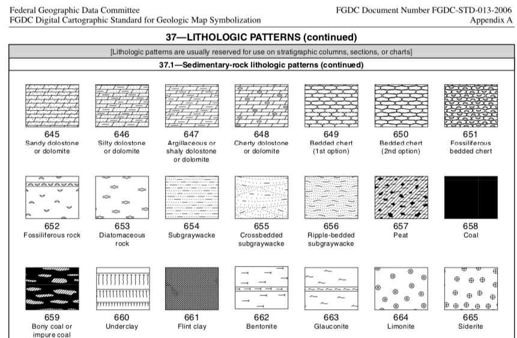

<!-- README.md is generated from README.Rmd. Please edit that file -->

# svgpatternusgs 

<!-- badges: start -->


<!-- badges: end -->

`svgpatternusgs` provides SVG patterns from the [United States
Geological Survey (USGS)](usgs.gov).

The USGS provides a large array of reference styles for geologic
linework and map symbology.

  - [USGS website for Geological Map
    Symbols](https://ngmdb.usgs.gov/fgdc_gds/geolsymstd/download.php)
  - The raw data for this package was sourced from [davenquinn’s github
    version](https://github.com/davenquinn/geologic-patterns)

## An example of the patterns provided

This is a screenshot of the original documentation which comes with
these patterns from the USGS



This list of all codes which have a pattern in this package:

``` r
svgpatternusgs::all_usgs_codes
#>   [1] 101 102 103 104 105 106 114 116 117 118 119 120 121 122 123 124 132
#>  [18] 134 135 136 137 201 202 204 206 207 214 215 216 217 218 219 226 228
#>  [35] 229 230 231 232 233 301 302 303 304 305 306 313 314 315 316 317 318
#>  [52] 319 327 328 330 331 401 402 403 405 406 411 412 416 417 418 419 420
#>  [69] 423 424 427 428 429 430 431 432 433 434 435 436 521 522 523 524 591
#>  [86] 592 593 594 595 601 602 603 605 606 607 608 609 610 611 612 613 614
#> [103] 616 617 618 619 620 621 622 623 624 625 626 627 628 629 630 631 632
#> [120] 633 634 635 636 637 638 639 640 641 642 643 644 645 646 647 648 649
#> [137] 650 651 652 653 654 655 656 657 658 659 660 661 662 663 664 665 666
#> [154] 667 668 669 670 671 672 673 674 675 676 677 678 679 680 681 682 683
#> [171] 684 685 686 701 702 703 704 705 706 707 708 709 710 711 712 713 714
#> [188] 715 716 717 719 720 721 722 723 724 725 726 727 728 729 730 731 732
#> [205] 733
```

## What’s in the box?

  - Functions for accessing the SVG for all the provided USGS codes
  - SVG pattern are supplied as `minisvg::SVGPattern` objects.
  - Functions for encoding/decoding a pattern specification from a hex
    colour.

## To Do

The original SVG sources for this were OK but not perfect. I’ve patched
some issues, but there are still quite a few occasions where gaps and
tears appear in patterns.

These errors don’t appear to be systematic, so I think it will require
some labour-intensive manual corrections to individual patterns.

## Installation

You can install from
[github](https://github.com/coolbutuseless/svgpatternusgs) with:

``` r
# install.packages("devtools")
devtools::install_github("coolbutuseless/lofi")           # Colour encoding
devtools::install_github("coolbutuseless/minisvg")        # SVG support
devtools::install_github("coolbutuseless/svgpatternusgs") # This package
```

## Create and show a pattern

``` r
pattern <- create_usgs_pattern(usgs_code = 605, spacing = 50)
```

``` r
pattern$show()
```


### Multiple patterns

``` r
pattern_list <- svgpatternusgs::all_usgs_codes[41:72] %>%
  purrr::map(create_usgs_pattern, spacing = 200) 

patterns <- minisvg::SVGPatternList_to_svg(pattern_list, width=200, height=100, ncol = 4)

patterns$save("man/figures/usgs-sample.svg")
```


## Encoding/decoding patterns from colours

A key feature of this set of patterns is that they can be encoded in an
RGB colour. Also, every RGB colour (excluding black, white and fully
transparent) can be decoded to a pattern in this library.

This encoding/decoding is carried out by the
[`lofi`](https://github.com/coolbutuseless/lofi) package. Because this
has to squeeze multiple continuous variables in to 24-bits, along with
the actual colour of the pattern, there will be some quantization
associated with a pattern-encoded-as-RGB e.g. angle may only be encoded
in 45degree
increments.

``` r
#~~~~~~~~~~~~~~~~~~~~~~~~~~~~~~~~~~~~~~~~~~~~~~~~~~~~~~~~~~~~~~~~~~~~~~~~~~~~~
# Encode a stripe pattern into a colour. Arguments to set correspond to 
# arguments from the individual pattern creation function 
# e.g. `create_stripe_pattern()`
#~~~~~~~~~~~~~~~~~~~~~~~~~~~~~~~~~~~~~~~~~~~~~~~~~~~~~~~~~~~~~~~~~~~~~~~~~~~~~
hex_colour <- encode_pattern_params_as_hex_colour(
  usgs_code = 701,
  spacing   = 200,
  fill      = '#558899'
)

hex_colour
#> [1] "#ADC520FF"

#~~~~~~~~~~~~~~~~~~~~~~~~~~~~~~~~~~~~~~~~~~~~~~~~~~~~~~~~~~~~~~~~~~~~~~~~~~~~~
# Decode this hex colour back into a pattern object
#~~~~~~~~~~~~~~~~~~~~~~~~~~~~~~~~~~~~~~~~~~~~~~~~~~~~~~~~~~~~~~~~~~~~~~~~~~~~~
pattern <- decode_pattern_from_rgba_vec(lofi::hex_colour_to_rgba_vec(hex_colour))

#~~~~~~~~~~~~~~~~~~~~~~~~~~~~~~~~~~~~~~~~~~~~~~~~~~~~~~~~~~~~~~~~~~~~~~~~~~~~~
# Render the pattern object
#~~~~~~~~~~~~~~~~~~~~~~~~~~~~~~~~~~~~~~~~~~~~~~~~~~~~~~~~~~~~~~~~~~~~~~~~~~~~~
doc <- pattern$as_full_svg(width = 400, height = 100)
```

<pre><details closed><summary> Show SVG text (click to open) </summary>&lt;?xml version="1.0" encoding="UTF-8"?&gt;
&lt;svg viewBox="0 0 400 100" xmlns="http://www.w3.org/2000/svg" xmlns:xlink="http://www.w3.org/1999/xlink"&gt;
  &lt;defs&gt;
    &lt;pattern id="usgs-701-ADC520FF" patternUnits="userSpaceOnUse" patternTransform="rotate(0 0 0)" x="0px" y="0px" width="204" height="204" viewBox="0 -85.875 85.875 85.875"&gt;
      &lt;g&gt;
        &lt;rect x="0" y="-85.875" style="fill:#4992AA; fill-opacity:1; stroke:none;" width="85.875" height="85.875" /&gt;
        &lt;line style="fill:none;stroke:#000000;stroke-width:0.3;" x1="9.375" y1="-77.909" x2="11.625" y2="-75.284" /&gt;
        &lt;line style="fill:none;stroke:#000000;stroke-width:0.3;" x1="9.5" y1="-81.659" x2="12.875" y2="-81.534" /&gt;
        &lt;line style="fill:none;stroke:#000000;stroke-width:0.3;" x1="20.375" y1="-78.471" x2="23.063" y2="-76.426" /&gt;
        &lt;line style="fill:none;stroke:#000000;stroke-width:0.3;" x1="16.875" y1="-79.534" x2="14.75" y2="-76.784" /&gt;
        &lt;line style="fill:none;stroke:#000000;stroke-width:0.3;" x1="18.5" y1="-82.284" x2="15.75" y2="-84.034" /&gt;
        &lt;line style="fill:none;stroke:#000000;stroke-width:0.3;" x1="23.75" y1="-85.034" x2="21.5" y2="-83.534" /&gt;
        &lt;line style="fill:none;stroke:#000000;stroke-width:0.3;" x1="25.375" y1="-81.659" x2="25.5" y2="-78.534" /&gt;
        &lt;line style="fill:none;stroke:#000000;stroke-width:0.3;" x1="28.75" y1="-84.226" x2="31.25" y2="-82.976" /&gt;
        &lt;line style="fill:none;stroke:#000000;stroke-width:0.3;" x1="35.125" y1="-82.592" x2="37.125" y2="-84.967" /&gt;
        &lt;line style="fill:none;stroke:#000000;stroke-width:0.3;" x1="39.875" y1="-81.659" x2="42.625" y2="-79.409" /&gt;
        &lt;line style="fill:none;stroke:#000000;stroke-width:0.3;" x1="35.75" y1="-78.034" x2="36.375" y2="-75.034" /&gt;
        &lt;line style="fill:none;stroke:#000000;stroke-width:0.3;" x1="31.5" y1="-78.034" x2="29" y2="-75.409" /&gt;
        &lt;line style="fill:none;stroke:#000000;stroke-width:0.3;" x1="42.5" y1="-75.034" x2="40.375" y2="-72.409" /&gt;
        &lt;line style="fill:none;stroke:#000000;stroke-width:0.3;" x1="39" y1="-68.659" x2="42.375" y2="-67.534" /&gt;
        &lt;line style="fill:none;stroke:#000000;stroke-width:0.3;" x1="34.701" y1="-70.318" x2="31.398" y2="-72.791" /&gt;
        &lt;line style="fill:none;stroke:#000000;stroke-width:0.3;" x1="31.25" y1="-67.909" x2="28.375" y2="-66.534" /&gt;
        &lt;line style="fill:none;stroke:#000000;stroke-width:0.3;" x1="35.25" y1="-66.784" x2="34.25" y2="-63.409" /&gt;
        &lt;line style="fill:none;stroke:#000000;stroke-width:0.3;" x1="40" y1="-63.659" x2="41.75" y2="-60.909" /&gt;
        &lt;line style="fill:none;stroke:#000000;stroke-width:0.3;" x1="42" y1="-56.284" x2="39.25" y2="-54.659" /&gt;
        &lt;line style="fill:none;stroke:#000000;stroke-width:0.3;" x1="37.5" y1="-59.034" x2="34" y2="-59.534" /&gt;
        &lt;line style="fill:none;stroke:#000000;stroke-width:0.3;" x1="38.875" y1="-50.034" x2="42.5" y2="-49.784" /&gt;
        &lt;line style="fill:none;stroke:#000000;stroke-width:0.3;" x1="37.4" y1="-48.043" x2="38.65" y2="-45.043" /&gt;
        &lt;line style="fill:none;stroke:#000000;stroke-width:0.3;" x1="6.25" y1="-81.275" x2="3.875" y2="-78.775" /&gt;
        &lt;line style="fill:none;stroke:#000000;stroke-width:0.3;" x1="3.75" y1="-76.034" x2="7.75" y2="-74.909" /&gt;
        &lt;line style="fill:none;stroke:#000000;stroke-width:0.3;" x1="2.75" y1="-72.284" x2="3.875" y2="-68.659" /&gt;
        &lt;path style="fill:none;stroke:#000000;stroke-width:0.3;" d="M4.5-65.659" /&gt;
        &lt;line style="fill:none;stroke:#000000;stroke-width:0.3;" x1="4.5" y1="-65.659" x2="1.5" y2="-63.284" /&gt;
        &lt;line style="fill:none;stroke:#000000;stroke-width:0.3;" x1="4.509" y1="-60" x2="4.134" y2="-56.375" /&gt;
        &lt;line style="fill:none;stroke:#000000;stroke-width:0.3;" x1="1.75" y1="-53.159" x2="4.625" y2="-51.159" /&gt;
        &lt;line style="fill:none;stroke:#000000;stroke-width:0.3;" x1="2.125" y1="-47.409" x2="0.5" y2="-44.409" /&gt;
        &lt;line style="fill:none;stroke:#000000;stroke-width:0.3;" x1="0.375" y1="-84.784" x2="3.625" y2="-84.034" /&gt;
        &lt;line style="fill:none;stroke:#000000;stroke-width:0.3;" x1="8.5" y1="-43.784" x2="7.375" y2="-47.284" /&gt;
        &lt;line style="fill:none;stroke:#000000;stroke-width:0.3;" x1="12.083" y1="-43.367" x2="15.208" y2="-45.492" /&gt;
        &lt;line style="fill:none;stroke:#000000;stroke-width:0.3;" x1="8.625" y1="-51.034" x2="12" y2="-51.659" /&gt;
        &lt;line style="fill:none;stroke:#000000;stroke-width:0.3;" x1="6.75" y1="-62.159" x2="10.375" y2="-62.034" /&gt;
        &lt;line style="fill:none;stroke:#000000;stroke-width:0.3;" x1="10.875" y1="-71.534" x2="6.75" y2="-71.284" /&gt;
        &lt;line style="fill:none;stroke:#000000;stroke-width:0.3;" x1="11.375" y1="-68.409" x2="9.375" y2="-65.409" /&gt;
        &lt;line style="fill:none;stroke:#000000;stroke-width:0.3;" x1="14.375" y1="-64.784" x2="16.875" y2="-62.784" /&gt;
        &lt;line style="fill:none;stroke:#000000;stroke-width:0.3;" x1="14.375" y1="-72.409" x2="15.5" y2="-68.659" /&gt;
        &lt;line style="fill:none;stroke:#000000;stroke-width:0.3;" x1="26.099" y1="-50.909" x2="29.863" y2="-49.833" /&gt;
        &lt;line style="fill:none;stroke:#000000;stroke-width:0.3;" x1="18.456" y1="-74.121" x2="21.75" y2="-72.784" /&gt;
        &lt;line style="fill:none;stroke:#000000;stroke-width:0.3;" x1="25.625" y1="-72.784" x2="27.208" y2="-69.513" /&gt;
        &lt;line style="fill:none;stroke:#000000;stroke-width:0.3;" x1="21.5" y1="-68.784" x2="18.875" y2="-66.034" /&gt;
        &lt;line style="fill:none;stroke:#000000;stroke-width:0.3;" x1="22" y1="-63.784" x2="25.375" y2="-64.284" /&gt;
        &lt;line style="fill:none;stroke:#000000;stroke-width:0.3;" x1="28.125" y1="-62.909" x2="31.375" y2="-60.909" /&gt;
        &lt;line style="fill:none;stroke:#000000;stroke-width:0.3;" x1="30" y1="-57.409" x2="27.875" y2="-54.534" /&gt;
        &lt;line style="fill:none;stroke:#000000;stroke-width:0.3;" x1="35" y1="-51.159" x2="33.5" y2="-54.409" /&gt;
        &lt;line style="fill:none;stroke:#000000;stroke-width:0.3;" x1="31.567" y1="-44.117" x2="34.317" y2="-47.242" /&gt;
        &lt;line style="fill:none;stroke:#000000;stroke-width:0.3;" x1="26.375" y1="-44.909" x2="24.625" y2="-47.909" /&gt;
        &lt;line style="fill:none;stroke:#000000;stroke-width:0.3;" x1="20.208" y1="-45.025" x2="21.333" y2="-48.15" /&gt;
        &lt;line style="fill:none;stroke:#000000;stroke-width:0.3;" x1="20" y1="-54.242" x2="23.25" y2="-52.867" /&gt;
        &lt;line style="fill:none;stroke:#000000;stroke-width:0.3;" x1="23.868" y1="-56.068" x2="25.168" y2="-59.585" /&gt;
        &lt;line style="fill:none;stroke:#000000;stroke-width:0.3;" x1="19.875" y1="-60.784" x2="16.75" y2="-58.659" /&gt;
        &lt;line style="fill:none;stroke:#000000;stroke-width:0.3;" x1="15.167" y1="-53.617" x2="17.542" y2="-50.492" /&gt;
        &lt;line style="fill:none;stroke:#000000;stroke-width:0.3;" x1="52.413" y1="-77.909" x2="54.663" y2="-75.284" /&gt;
        &lt;line style="fill:none;stroke:#000000;stroke-width:0.3;" x1="52.538" y1="-81.659" x2="55.913" y2="-81.534" /&gt;
        &lt;line style="fill:none;stroke:#000000;stroke-width:0.3;" x1="63.413" y1="-78.471" x2="66.101" y2="-76.426" /&gt;
        &lt;line style="fill:none;stroke:#000000;stroke-width:0.3;" x1="59.913" y1="-79.534" x2="57.788" y2="-76.784" /&gt;
        &lt;line style="fill:none;stroke:#000000;stroke-width:0.3;" x1="61.538" y1="-82.284" x2="58.788" y2="-84.034" /&gt;
        &lt;line style="fill:none;stroke:#000000;stroke-width:0.3;" x1="66.788" y1="-85.034" x2="64.538" y2="-83.534" /&gt;
        &lt;line style="fill:none;stroke:#000000;stroke-width:0.3;" x1="68.413" y1="-81.659" x2="68.538" y2="-78.534" /&gt;
        &lt;line style="fill:none;stroke:#000000;stroke-width:0.3;" x1="71.788" y1="-84.226" x2="74.288" y2="-82.976" /&gt;
        &lt;line style="fill:none;stroke:#000000;stroke-width:0.3;" x1="78.163" y1="-82.592" x2="80.163" y2="-84.967" /&gt;
        &lt;line style="fill:none;stroke:#000000;stroke-width:0.3;" x1="82.913" y1="-81.659" x2="85.663" y2="-79.409" /&gt;
        &lt;line style="fill:none;stroke:#000000;stroke-width:0.3;" x1="78.788" y1="-78.034" x2="79.413" y2="-75.034" /&gt;
        &lt;line style="fill:none;stroke:#000000;stroke-width:0.3;" x1="74.538" y1="-78.034" x2="72.038" y2="-75.409" /&gt;
        &lt;line style="fill:none;stroke:#000000;stroke-width:0.3;" x1="85.538" y1="-75.034" x2="83.413" y2="-72.409" /&gt;
        &lt;line style="fill:none;stroke:#000000;stroke-width:0.3;" x1="82.038" y1="-68.659" x2="85.413" y2="-67.534" /&gt;
        &lt;line style="fill:none;stroke:#000000;stroke-width:0.3;" x1="78.163" y1="-71.409" x2="74.038" y2="-71.534" /&gt;
        &lt;line style="fill:none;stroke:#000000;stroke-width:0.3;" x1="74.288" y1="-67.909" x2="71.413" y2="-66.534" /&gt;
        &lt;line style="fill:none;stroke:#000000;stroke-width:0.3;" x1="78.288" y1="-66.784" x2="77.288" y2="-63.409" /&gt;
        &lt;line style="fill:none;stroke:#000000;stroke-width:0.3;" x1="83.038" y1="-63.659" x2="84.788" y2="-60.909" /&gt;
        &lt;line style="fill:none;stroke:#000000;stroke-width:0.3;" x1="85.038" y1="-56.284" x2="82.288" y2="-54.659" /&gt;
        &lt;line style="fill:none;stroke:#000000;stroke-width:0.3;" x1="80.538" y1="-59.034" x2="77.038" y2="-59.534" /&gt;
        &lt;line style="fill:none;stroke:#000000;stroke-width:0.3;" x1="81.913" y1="-50.034" x2="85.538" y2="-49.784" /&gt;
        &lt;line style="fill:none;stroke:#000000;stroke-width:0.3;" x1="80.437" y1="-48.043" x2="81.687" y2="-45.043" /&gt;
        &lt;line style="fill:none;stroke:#000000;stroke-width:0.3;" x1="49.288" y1="-82.409" x2="46.913" y2="-79.909" /&gt;
        &lt;line style="fill:none;stroke:#000000;stroke-width:0.3;" x1="46.788" y1="-76.034" x2="50.788" y2="-74.909" /&gt;
        &lt;line style="fill:none;stroke:#000000;stroke-width:0.3;" x1="45.788" y1="-72.284" x2="46.913" y2="-68.659" /&gt;
        &lt;path style="fill:none;stroke:#000000;stroke-width:0.3;" d="M47.538-65.659" /&gt;
        &lt;line style="fill:none;stroke:#000000;stroke-width:0.3;" x1="47.538" y1="-65.659" x2="44.538" y2="-63.284" /&gt;
        &lt;line style="fill:none;stroke:#000000;stroke-width:0.3;" x1="46.98" y1="-58.583" x2="48.669" y2="-55.354" /&gt;
        &lt;line style="fill:none;stroke:#000000;stroke-width:0.3;" x1="44.788" y1="-53.159" x2="47.663" y2="-51.159" /&gt;
        &lt;line style="fill:none;stroke:#000000;stroke-width:0.3;" x1="46.863" y1="-47.409" x2="45.238" y2="-44.409" /&gt;
        &lt;line style="fill:none;stroke:#000000;stroke-width:0.3;" x1="43.413" y1="-84.784" x2="46.663" y2="-84.034" /&gt;
        &lt;line style="fill:none;stroke:#000000;stroke-width:0.3;" x1="52.388" y1="-42.367" x2="51.263" y2="-45.867" /&gt;
        &lt;line style="fill:none;stroke:#000000;stroke-width:0.3;" x1="56.288" y1="-45.659" x2="59.413" y2="-47.784" /&gt;
        &lt;line style="fill:none;stroke:#000000;stroke-width:0.3;" x1="51.663" y1="-51.034" x2="55.038" y2="-51.659" /&gt;
        &lt;line style="fill:none;stroke:#000000;stroke-width:0.3;" x1="54.529" y1="-58.284" x2="53.529" y2="-54.659" /&gt;
        &lt;line style="fill:none;stroke:#000000;stroke-width:0.3;" x1="49.953" y1="-61.285" x2="53.295" y2="-62.694" /&gt;
        &lt;line style="fill:none;stroke:#000000;stroke-width:0.3;" x1="53.913" y1="-71.534" x2="49.788" y2="-71.284" /&gt;
        &lt;line style="fill:none;stroke:#000000;stroke-width:0.3;" x1="54.413" y1="-68.409" x2="52.413" y2="-65.409" /&gt;
        &lt;line style="fill:none;stroke:#000000;stroke-width:0.3;" x1="57.413" y1="-64.784" x2="59.913" y2="-62.784" /&gt;
        &lt;line style="fill:none;stroke:#000000;stroke-width:0.3;" x1="57.413" y1="-72.409" x2="58.538" y2="-68.659" /&gt;
        &lt;line style="fill:none;stroke:#000000;stroke-width:0.3;" x1="61.333" y1="-72.619" x2="64.776" y2="-73.505" /&gt;
        &lt;line style="fill:none;stroke:#000000;stroke-width:0.3;" x1="69.362" y1="-72.542" x2="67.519" y2="-69.411" /&gt;
        &lt;line style="fill:none;stroke:#000000;stroke-width:0.3;" x1="64.538" y1="-68.784" x2="61.913" y2="-66.034" /&gt;
        &lt;line style="fill:none;stroke:#000000;stroke-width:0.3;" x1="65.038" y1="-63.784" x2="68.413" y2="-64.284" /&gt;
        &lt;line style="fill:none;stroke:#000000;stroke-width:0.3;" x1="71.163" y1="-62.909" x2="74.413" y2="-60.909" /&gt;
        &lt;line style="fill:none;stroke:#000000;stroke-width:0.3;" x1="74.225" y1="-57.138" x2="72.1" y2="-54.263" /&gt;
        &lt;line style="fill:none;stroke:#000000;stroke-width:0.3;" x1="78.038" y1="-51.159" x2="76.538" y2="-54.409" /&gt;
        &lt;line style="fill:none;stroke:#000000;stroke-width:0.3;" x1="74.888" y1="-44.4" x2="77.638" y2="-47.525" /&gt;
        &lt;line style="fill:none;stroke:#000000;stroke-width:0.3;" x1="73.413" y1="-50.534" x2="69.413" y2="-50.534" /&gt;
        &lt;line style="fill:none;stroke:#000000;stroke-width:0.3;" x1="69.413" y1="-44.909" x2="67.663" y2="-47.909" /&gt;
        &lt;line style="fill:none;stroke:#000000;stroke-width:0.3;" x1="63.375" y1="-44.659" x2="64.5" y2="-47.784" /&gt;
        &lt;line style="fill:none;stroke:#000000;stroke-width:0.3;" x1="64.375" y1="-53.659" x2="67.625" y2="-52.284" /&gt;
        &lt;line style="fill:none;stroke:#000000;stroke-width:0.3;" x1="8.934" y1="-57.992" x2="12.184" y2="-56.617" /&gt;
        &lt;line style="fill:none;stroke:#000000;stroke-width:0.3;" x1="68.487" y1="-56.208" x2="66.787" y2="-59.551" /&gt;
        &lt;line style="fill:none;stroke:#000000;stroke-width:0.3;" x1="62.913" y1="-60.784" x2="59.788" y2="-58.659" /&gt;
        &lt;line style="fill:none;stroke:#000000;stroke-width:0.3;" x1="58.038" y1="-54.784" x2="60.413" y2="-51.659" /&gt;
        &lt;line style="fill:none;stroke:#000000;stroke-width:0.3;" x1="9.408" y1="-34.904" x2="11.658" y2="-32.279" /&gt;
        &lt;line style="fill:none;stroke:#000000;stroke-width:0.3;" x1="9.533" y1="-38.654" x2="12.908" y2="-38.529" /&gt;
        &lt;line style="fill:none;stroke:#000000;stroke-width:0.3;" x1="20.408" y1="-35.467" x2="23.096" y2="-33.422" /&gt;
        &lt;line style="fill:none;stroke:#000000;stroke-width:0.3;" x1="16.908" y1="-36.529" x2="14.783" y2="-33.779" /&gt;
        &lt;line style="fill:none;stroke:#000000;stroke-width:0.3;" x1="18.533" y1="-40.13" x2="15.783" y2="-41.88" /&gt;
        &lt;line style="fill:none;stroke:#000000;stroke-width:0.3;" x1="23.783" y1="-42.029" x2="21.533" y2="-40.529" /&gt;
        &lt;line style="fill:none;stroke:#000000;stroke-width:0.3;" x1="26.542" y1="-38.654" x2="24.905" y2="-35.99" /&gt;
        &lt;line style="fill:none;stroke:#000000;stroke-width:0.3;" x1="28.783" y1="-41.221" x2="31.283" y2="-39.971" /&gt;
        &lt;line style="fill:none;stroke:#000000;stroke-width:0.3;" x1="35.158" y1="-39.587" x2="37.158" y2="-41.962" /&gt;
        &lt;line style="fill:none;stroke:#000000;stroke-width:0.3;" x1="39.908" y1="-38.654" x2="42.658" y2="-36.404" /&gt;
        &lt;line style="fill:none;stroke:#000000;stroke-width:0.3;" x1="35.783" y1="-35.029" x2="36.408" y2="-32.029" /&gt;
        &lt;line style="fill:none;stroke:#000000;stroke-width:0.3;" x1="31.533" y1="-35.029" x2="29.033" y2="-32.404" /&gt;
        &lt;line style="fill:none;stroke:#000000;stroke-width:0.3;" x1="42.533" y1="-32.029" x2="40.408" y2="-29.404" /&gt;
        &lt;line style="fill:none;stroke:#000000;stroke-width:0.3;" x1="39.033" y1="-25.654" x2="42.408" y2="-24.529" /&gt;
        &lt;line style="fill:none;stroke:#000000;stroke-width:0.3;" x1="35.08" y1="-29.024" x2="31.123" y2="-27.853" /&gt;
        &lt;line style="fill:none;stroke:#000000;stroke-width:0.3;" x1="31.283" y1="-24.904" x2="28.408" y2="-23.529" /&gt;
        &lt;line style="fill:none;stroke:#000000;stroke-width:0.3;" x1="35.283" y1="-23.779" x2="34.283" y2="-20.404" /&gt;
        &lt;line style="fill:none;stroke:#000000;stroke-width:0.3;" x1="40.033" y1="-20.654" x2="41.783" y2="-17.904" /&gt;
        &lt;line style="fill:none;stroke:#000000;stroke-width:0.3;" x1="42.033" y1="-13.279" x2="39.283" y2="-11.654" /&gt;
        &lt;line style="fill:none;stroke:#000000;stroke-width:0.3;" x1="37.533" y1="-16.029" x2="34.033" y2="-16.529" /&gt;
        &lt;line style="fill:none;stroke:#000000;stroke-width:0.3;" x1="38.908" y1="-7.029" x2="42.533" y2="-6.779" /&gt;
        &lt;line style="fill:none;stroke:#000000;stroke-width:0.3;" x1="38.287" y1="-3.517" x2="39.537" y2="-0.517" /&gt;
        &lt;line style="fill:none;stroke:#000000;stroke-width:0.3;" x1="6.283" y1="-39.404" x2="3.908" y2="-36.904" /&gt;
        &lt;line style="fill:none;stroke:#000000;stroke-width:0.3;" x1="3.783" y1="-33.029" x2="7.783" y2="-31.904" /&gt;
        &lt;line style="fill:none;stroke:#000000;stroke-width:0.3;" x1="2.783" y1="-29.279" x2="3.908" y2="-25.654" /&gt;
        &lt;path style="fill:none;stroke:#000000;stroke-width:0.3;" d="M4.533-22.654" /&gt;
        &lt;line style="fill:none;stroke:#000000;stroke-width:0.3;" x1="4.533" y1="-22.654" x2="1.533" y2="-20.279" /&gt;
        &lt;line style="fill:none;stroke:#000000;stroke-width:0.3;" x1="4.542" y1="-16.996" x2="4.167" y2="-13.371" /&gt;
        &lt;line style="fill:none;stroke:#000000;stroke-width:0.3;" x1="1.783" y1="-10.154" x2="4.658" y2="-8.154" /&gt;
        &lt;line style="fill:none;stroke:#000000;stroke-width:0.3;" x1="2.158" y1="-4.404" x2="0.533" y2="-1.404" /&gt;
        &lt;line style="fill:none;stroke:#000000;stroke-width:0.3;" x1="0.408" y1="-41.779" x2="3.658" y2="-41.029" /&gt;
        &lt;line style="fill:none;stroke:#000000;stroke-width:0.3;" x1="8.617" y1="-0.175" x2="7.492" y2="-3.675" /&gt;
        &lt;line style="fill:none;stroke:#000000;stroke-width:0.3;" x1="13.637" y1="-1.967" x2="16.763" y2="-4.092" /&gt;
        &lt;line style="fill:none;stroke:#000000;stroke-width:0.3;" x1="8.658" y1="-8.029" x2="12.033" y2="-8.654" /&gt;
        &lt;line style="fill:none;stroke:#000000;stroke-width:0.3;" x1="12.658" y1="-15.279" x2="10.001" y2="-12.619" /&gt;
        &lt;line style="fill:none;stroke:#000000;stroke-width:0.3;" x1="6.783" y1="-18.021" x2="10.408" y2="-17.896" /&gt;
        &lt;line style="fill:none;stroke:#000000;stroke-width:0.3;" x1="10.908" y1="-28.529" x2="6.783" y2="-28.279" /&gt;
        &lt;line style="fill:none;stroke:#000000;stroke-width:0.3;" x1="11.408" y1="-25.404" x2="9.408" y2="-22.404" /&gt;
        &lt;line style="fill:none;stroke:#000000;stroke-width:0.3;" x1="14.408" y1="-21.779" x2="16.908" y2="-19.779" /&gt;
        &lt;line style="fill:none;stroke:#000000;stroke-width:0.3;" x1="14.408" y1="-29.404" x2="15.533" y2="-25.654" /&gt;
        &lt;line style="fill:none;stroke:#000000;stroke-width:0.3;" x1="18.283" y1="-30.404" x2="21.422" y2="-28.733" /&gt;
        &lt;line style="fill:none;stroke:#000000;stroke-width:0.3;" x1="26.367" y1="-29.544" x2="24.504" y2="-26.424" /&gt;
        &lt;line style="fill:none;stroke:#000000;stroke-width:0.3;" x1="19.846" y1="-26.713" x2="18.908" y2="-23.029" /&gt;
        &lt;line style="fill:none;stroke:#000000;stroke-width:0.3;" x1="22.033" y1="-20.779" x2="25.408" y2="-21.279" /&gt;
        &lt;line style="fill:none;stroke:#000000;stroke-width:0.3;" x1="28.158" y1="-19.904" x2="31.408" y2="-17.904" /&gt;
        &lt;line style="fill:none;stroke:#000000;stroke-width:0.3;" x1="30.033" y1="-13.554" x2="27.908" y2="-10.679" /&gt;
        &lt;line style="fill:none;stroke:#000000;stroke-width:0.3;" x1="35.033" y1="-8.154" x2="33.533" y2="-11.404" /&gt;
        &lt;line style="fill:none;stroke:#000000;stroke-width:0.3;" x1="31.554" y1="-1.342" x2="34.304" y2="-4.467" /&gt;
        &lt;line style="fill:none;stroke:#000000;stroke-width:0.3;" x1="30.408" y1="-6.679" x2="26.408" y2="-6.679" /&gt;
        &lt;line style="fill:none;stroke:#000000;stroke-width:0.3;" x1="26.513" y1="-0.967" x2="24.763" y2="-3.967" /&gt;
        &lt;line style="fill:none;stroke:#000000;stroke-width:0.3;" x1="19.775" y1="-2.296" x2="20.9" y2="-5.421" /&gt;
        &lt;line style="fill:none;stroke:#000000;stroke-width:0.3;" x1="20.388" y1="-11.425" x2="23.638" y2="-10.05" /&gt;
        &lt;line style="fill:none;stroke:#000000;stroke-width:0.3;" x1="24.029" y1="-13.608" x2="25.299" y2="-17.137" /&gt;
        &lt;line style="fill:none;stroke:#000000;stroke-width:0.3;" x1="19.908" y1="-17.779" x2="16.783" y2="-15.654" /&gt;
        &lt;line style="fill:none;stroke:#000000;stroke-width:0.3;" x1="15.033" y1="-11.779" x2="17.408" y2="-8.654" /&gt;
        &lt;line style="fill:none;stroke:#000000;stroke-width:0.3;" x1="52.467" y1="-34.938" x2="54.717" y2="-32.313" /&gt;
        &lt;line style="fill:none;stroke:#000000;stroke-width:0.3;" x1="52.592" y1="-38.688" x2="55.967" y2="-38.563" /&gt;
        &lt;line style="fill:none;stroke:#000000;stroke-width:0.3;" x1="63.467" y1="-35.5" x2="66.155" y2="-33.455" /&gt;
        &lt;line style="fill:none;stroke:#000000;stroke-width:0.3;" x1="59.967" y1="-36.563" x2="57.842" y2="-33.813" /&gt;
        &lt;line style="fill:none;stroke:#000000;stroke-width:0.3;" x1="61.592" y1="-40.447" x2="58.842" y2="-42.197" /&gt;
        &lt;line style="fill:none;stroke:#000000;stroke-width:0.3;" x1="66.842" y1="-42.063" x2="64.592" y2="-40.563" /&gt;
        &lt;line style="fill:none;stroke:#000000;stroke-width:0.3;" x1="70.103" y1="-38.301" x2="68.592" y2="-35.563" /&gt;
        &lt;line style="fill:none;stroke:#000000;stroke-width:0.3;" x1="71.842" y1="-41.255" x2="74.342" y2="-40.005" /&gt;
        &lt;line style="fill:none;stroke:#000000;stroke-width:0.3;" x1="78.217" y1="-39.621" x2="80.217" y2="-41.996" /&gt;
        &lt;line style="fill:none;stroke:#000000;stroke-width:0.3;" x1="82.967" y1="-38.688" x2="85.717" y2="-36.438" /&gt;
        &lt;line style="fill:none;stroke:#000000;stroke-width:0.3;" x1="78.842" y1="-35.063" x2="79.467" y2="-32.063" /&gt;
        &lt;line style="fill:none;stroke:#000000;stroke-width:0.3;" x1="74.592" y1="-35.063" x2="72.092" y2="-32.438" /&gt;
        &lt;line style="fill:none;stroke:#000000;stroke-width:0.3;" x1="85.592" y1="-32.063" x2="83.467" y2="-29.438" /&gt;
        &lt;line style="fill:none;stroke:#000000;stroke-width:0.3;" x1="82.092" y1="-25.688" x2="85.467" y2="-24.563" /&gt;
        &lt;line style="fill:none;stroke:#000000;stroke-width:0.3;" x1="78.217" y1="-28.438" x2="74.092" y2="-28.563" /&gt;
        &lt;line style="fill:none;stroke:#000000;stroke-width:0.3;" x1="74.342" y1="-24.938" x2="71.467" y2="-23.563" /&gt;
        &lt;line style="fill:none;stroke:#000000;stroke-width:0.3;" x1="78.342" y1="-23.813" x2="77.342" y2="-20.438" /&gt;
        &lt;line style="fill:none;stroke:#000000;stroke-width:0.3;" x1="83.092" y1="-20.688" x2="84.842" y2="-17.938" /&gt;
        &lt;line style="fill:none;stroke:#000000;stroke-width:0.3;" x1="85.092" y1="-13.313" x2="82.342" y2="-11.688" /&gt;
        &lt;line style="fill:none;stroke:#000000;stroke-width:0.3;" x1="80.592" y1="-16.063" x2="77.092" y2="-16.563" /&gt;
        &lt;line style="fill:none;stroke:#000000;stroke-width:0.3;" x1="81.967" y1="-7.063" x2="85.592" y2="-6.813" /&gt;
        &lt;line style="fill:none;stroke:#000000;stroke-width:0.3;" x1="81.554" y1="-3.717" x2="82.804" y2="-0.717" /&gt;
        &lt;line style="fill:none;stroke:#000000;stroke-width:0.3;" x1="49.342" y1="-39.438" x2="46.967" y2="-36.938" /&gt;
        &lt;line style="fill:none;stroke:#000000;stroke-width:0.3;" x1="46.842" y1="-33.063" x2="50.842" y2="-31.938" /&gt;
        &lt;line style="fill:none;stroke:#000000;stroke-width:0.3;" x1="45.842" y1="-29.313" x2="46.967" y2="-25.688" /&gt;
        &lt;path style="fill:none;stroke:#000000;stroke-width:0.3;" d="M47.592-22.688" /&gt;
        &lt;line style="fill:none;stroke:#000000;stroke-width:0.3;" x1="47.592" y1="-22.688" x2="44.592" y2="-20.313" /&gt;
        &lt;line style="fill:none;stroke:#000000;stroke-width:0.3;" x1="47.601" y1="-17.029" x2="47.226" y2="-13.404" /&gt;
        &lt;line style="fill:none;stroke:#000000;stroke-width:0.3;" x1="44.842" y1="-10.188" x2="47.717" y2="-8.188" /&gt;
        &lt;line style="fill:none;stroke:#000000;stroke-width:0.3;" x1="45.217" y1="-4.438" x2="43.592" y2="-1.438" /&gt;
        &lt;line style="fill:none;stroke:#000000;stroke-width:0.3;" x1="43.467" y1="-41.813" x2="46.717" y2="-41.063" /&gt;
        &lt;line style="fill:none;stroke:#000000;stroke-width:0.3;" x1="51.717" y1="-0.292" x2="50.592" y2="-3.792" /&gt;
        &lt;line style="fill:none;stroke:#000000;stroke-width:0.3;" x1="56.529" y1="-1.105" x2="59.654" y2="-3.23" /&gt;
        &lt;line style="fill:none;stroke:#000000;stroke-width:0.3;" x1="51.717" y1="-8.063" x2="55.092" y2="-8.688" /&gt;
        &lt;line style="fill:none;stroke:#000000;stroke-width:0.3;" x1="54.867" y1="-15.313" x2="52.121" y2="-12.744" /&gt;
        &lt;line style="fill:none;stroke:#000000;stroke-width:0.3;" x1="49.842" y1="-19.188" x2="53.467" y2="-19.063" /&gt;
        &lt;line style="fill:none;stroke:#000000;stroke-width:0.3;" x1="53.967" y1="-28.563" x2="49.842" y2="-28.313" /&gt;
        &lt;line style="fill:none;stroke:#000000;stroke-width:0.3;" x1="54.467" y1="-25.438" x2="52.467" y2="-22.438" /&gt;
        &lt;line style="fill:none;stroke:#000000;stroke-width:0.3;" x1="57.467" y1="-21.813" x2="59.967" y2="-19.813" /&gt;
        &lt;line style="fill:none;stroke:#000000;stroke-width:0.3;" x1="57.467" y1="-29.438" x2="58.592" y2="-25.688" /&gt;
        &lt;line style="fill:none;stroke:#000000;stroke-width:0.3;" x1="61.342" y1="-30.438" x2="64.842" y2="-29.813" /&gt;
        &lt;line style="fill:none;stroke:#000000;stroke-width:0.3;" x1="68.368" y1="-30.42" x2="69.412" y2="-26.939" /&gt;
        &lt;line style="fill:none;stroke:#000000;stroke-width:0.3;" x1="64.592" y1="-25.813" x2="61.967" y2="-23.063" /&gt;
        &lt;line style="fill:none;stroke:#000000;stroke-width:0.3;" x1="65.092" y1="-20.813" x2="68.467" y2="-21.313" /&gt;
        &lt;line style="fill:none;stroke:#000000;stroke-width:0.3;" x1="71.217" y1="-19.938" x2="74.467" y2="-17.938" /&gt;
        &lt;line style="fill:none;stroke:#000000;stroke-width:0.3;" x1="73.092" y1="-14.438" x2="70.967" y2="-11.563" /&gt;
        &lt;line style="fill:none;stroke:#000000;stroke-width:0.3;" x1="78.092" y1="-8.188" x2="76.592" y2="-11.438" /&gt;
        &lt;line style="fill:none;stroke:#000000;stroke-width:0.3;" x1="74.55" y1="-1.855" x2="77.3" y2="-4.979" /&gt;
        &lt;line style="fill:none;stroke:#000000;stroke-width:0.3;" x1="73.236" y1="-6.656" x2="69.699" y2="-8.523" /&gt;
        &lt;line style="fill:none;stroke:#000000;stroke-width:0.3;" x1="69.55" y1="-0.334" x2="67.8" y2="-3.334" /&gt;
        &lt;line style="fill:none;stroke:#000000;stroke-width:0.3;" x1="63.342" y1="-3.938" x2="64.467" y2="-7.063" /&gt;
        &lt;line style="fill:none;stroke:#000000;stroke-width:0.3;" x1="63.092" y1="-12.688" x2="66.342" y2="-11.313" /&gt;
        &lt;line style="fill:none;stroke:#000000;stroke-width:0.3;" x1="65.893" y1="-14.607" x2="69.24" y2="-16.298" /&gt;
        &lt;line style="fill:none;stroke:#000000;stroke-width:0.3;" x1="62.967" y1="-17.813" x2="59.842" y2="-15.688" /&gt;
        &lt;line style="fill:none;stroke:#000000;stroke-width:0.3;" x1="58.175" y1="-10.604" x2="60.55" y2="-7.479" /&gt;
      &lt;/g&gt;
    &lt;/pattern&gt;
  &lt;/defs&gt;
  &lt;rect style="fill: url(#usgs-701-ADC520FF) #fff;" x="0" y="0" width="100%" height="100%" /&gt;
&lt;/svg&gt;</details></pre>


